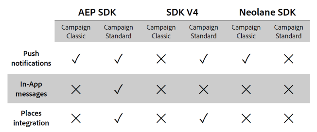

# Experience Platform SDKとの連携に関するFAQ {#aep-faq}

Experience Platform SDK アプリケーションを使用してプッシュ通知やアプリ内メッセージを送信するには、モバイルアプリケーションをAdobe Experience Platform SDKで設定し、Adobe Campaignで設定する必要があります。

以下の節では、この同期に関する一般的な質問を示します。

プッシュ通知またはアプリ内通知について詳しくは、次のFAQを参照してください。

* [プッシュ通知に関するFAQ](../../channels/using/about-push-notifications.md#push-faq)
* [アプリ内 FAQ](../../channels/using/in-app-faq.md)
* [Adobe Experience Platform 同期のタグに関する FAQ](../../administration/using/syncwithlaunch-faq.md)

## 始める前に役立つリソース {#resource-mobile-property}

Adobe Experience PlatformとSDKの連携について詳しくは、次の資料を参照してください。

* ローンチ/モバイル [概要ビデオ ](https://www.adobe.com/experience-platform/launch.html#acpl-mobile-video){target="_blank"}
* Launch/Mobile [ ヒントとテクニックのガイド ](https://www.adobe.com/content/dam/dx/us/en/products/experience-platform/launch-tag-manager/pdfs/adobe-cloud-platform-launch-tips-and-tricks-sheet.pdf)

## Adobe Experience Platform SDKの統合は、Adobe Campaign StandardとAdobe Campaign Classicの両方で使用できますか？ {#aep-validity}

はい、[!DNL Adobe Experience Platform SDK]統合はAdobe Campaign StandardとAdobe Campaign Classicの両方で利用できます。 統合を有効にするには、[!DNL Data Collection UI]経由で対応する&#x200B;**[!UICONTROL Extension]**&#x200B;をインストールする必要があります。

詳しくは、この[ページ](https://developer.adobe.com/client-sdks/documentation/adobe-campaign-standard){target="_blank"}を参照してください。

## Adobe Experience Platform SDKとの連携により、Adobe Campaignでどのような機能が容易になりますか？ {#aep-capabilities}

これらの機能について詳しくは、以下の表を参照してください。

>[!NOTE]
>
>[!DNL Places]統合には、アプリ内メッセージ（プッシュ通知の場合はN/A）のトリガーとしてplaces イベントが含まれ、[!DNL Places]個のデータとローカル通知のサポートを使用してプロファイルを強化します。 詳しくは、この[ ページ ](../../channels/using/preparing-and-sending-an-in-app-message.md)を参照してください。  [!DNL Places]の制限付き統合には、[!DNL Places]個のデータを使用したプロファイルの強化が含まれます。

## Adobe Experience PlatformとSDKの連携は、Adobe Campaign Standardでどのようなユースケースを促進しますか？ {#aep-use-cases}

次のユースケースがサポートされています。

* Campaignで&#x200B;**[!UICONTROL Mobile Profile]**&#x200B;を取得します（**[!UICONTROL Administration]** > **[!UICONTROL Channels]** > **[!UICONTROL Mobile app (AEP SDK)]** > **[!UICONTROL Mobile Application subscribers]** タブのECIDで識別）
* Adobe Campaignで&#x200B;**[!UICONTROL Mobile Profile]**&#x200B;をエンリッチします（appSubscriberRcp テーブルの&#x200B;**[!UICONTROL Custom resource Extension]**&#x200B;が必要）
* プッシュメッセージを送信するためのプッシュトークンの取得（プッシュメッセージの受信にはユーザーのオプトインが必要）
* プッシュ通知とアプリ内メッセージの送信
* プッシュメッセージとアプリ内メッセージを使用したユーザーとのやり取りを追跡し、それについてレポートを提供します

## Campaignでモバイルプロファイルを取得するには、どうすればよいですか？ {#mobile-profile-campaign}

これをおこなうには、以下の手順に従います。

1. [!DNL Launch]で&#x200B;**[!UICONTROL Mobile property]**&#x200B;を設定します。
1. Adobe Campaign Standard拡張機能をインストールします。 Adobe Campaign Standard拡張機能には&#x200B;**[!UICONTROL Mobile Core]**、**[!UICONTROL Profile]**&#x200B;および&#x200B;**[!UICONTROL Lifecycle]**&#x200B;の拡張機能も必要です。これらの拡張機能は、[!DNL Launch]にデフォルトでインストールされています。
   * ユーザーは、ライフサイクルイベントの頻度に影響を与える&#x200B;**[!UICONTROL Mobile Core]**&#x200B;拡張機能でセッションタイムアウトを設定する必要があります。
   * 拡張機能を設定したら、iOS用CocoapodsとAndroid用Gradleを使用して、モバイルアプリに適切な依存関係を追加する必要があります。 [こちら](https://developer.adobe.com/client-sdks/documentation/adobe-campaign-standard)の指示に従ってください。
   * 常に最新バージョンのライブラリを使用します。
   * モバイルアプリで、**[!UICONTROL Campaign]**、**[!UICONTROL UserProfile]**、**[!UICONTROL Identity]**、**[!UICONTROL Lifecycle]**&#x200B;および&#x200B;**[!UICONTROL Signal]**&#x200B;拡張機能を登録します。 [こちら](https://developer.adobe.com/client-sdks/documentation/adobe-campaign-standard/#register-the-campaign-standard-extension-with-mobile-core)の指示に従ってください。
   * 拡張機能を登録したら、ACPCoreを起動します。 Androidの場合は、必ずApplication onCreate （）を設定してください。 Launchのモバイルプロパティのモバイルインストール手順に記載されている正確な手順に従います。
   * 次のSDK APIも必要です。 Androidの[ここ](https://developer.adobe.com/client-sdks/documentation/mobile-core/lifecycle/android)とiOSの説明に従って、ライフサイクル開始APIと一時停止APIを実装します。
1. Adobe Campaign Standardで&#x200B;**[!UICONTROL Mobile Property]**&#x200B;を設定します。 [こちら](../../administration/using/configuring-a-mobile-application.md#channel-specific-config)の手順に従います。

## Campaignでモバイルプロファイルを強化するには、どうすればよいですか？ {#enrich-mobile-profile}

CollectPII ポストバックを設定し（この[page](../../administration/using/configuring-rules-launch.md#pii-postback)を参照）、SDKからCollectPII APIを実装する必要があります（この[page](https://developer.adobe.com/client-sdks/documentation/mobile-core/api-reference)を参照）。

## CollectPII呼び出しは、どのくらいの頻度で実行する必要がありますか？ {#collect-pii}

CollectPII呼び出しの目的は、Campaignのモバイルプロファイルを充実させることです。 顧客のユースケースやビジネスニーズに応じて、プロファイルに追加したい新しい有意義な情報があるときはいつでも実行する必要があります。

## 複数のトリガーイベントに対応してCollectPII呼び出しを実行できますか？ {#collect-pii-calls}

はい。 ビジネスのニーズに応じて、ユーザーがアプリにログインしたり、何らかの製品やライフサイクルイベントを購入したり、ジオフェンスなどに入ったりすることに応じて、CollectPII呼び出しを実行できます。つまり、ユーザーとアプリとのインタラクションで、プロファイルエンリッチメントに使用する情報を生成します。

## すべてのモバイルイベントに応答してCollectPII呼び出しを実行することはできますか？ {#collect-pii-events}

CollectPII呼び出しの頻度と設計は、ビジネスニーズによって決定する必要があり、DBに追加の負荷がかかるため、盲目的に実行しないでください。

### CampaignまたはLaunchでAdobe Experience Platform アプリにアクセスしようとすると、「プロパティを使用できません」というエラーが表示されることがあります。 {#aep-error}

これは既知の問題であり、トークンの有効期限が原因で発生します。 ログアウトしてログインしてみてください。

## Adobe Experience Platform SDK（旧SDK V5）について詳しく知るための有用なリソースの推奨事項は何ですか？{#resource-aep}

以下のリソースをご覧ください。

* Experience Platform SDK [ ドキュメント ](https://developer.adobe.com/client-sdks/documentation/)
* LaunchとExperience Platform SDKの概要[ ドキュメント ](https://developer.adobe.com/client-sdks/documentation/getting-started/create-a-mobile-property/)
* Experience Platform SDKへのアップグレード [ ドキュメント ](https://developer.adobe.com/client-sdks/resources/upgrade-platform-sdks/)
* Github Experience Platform SDK [ ドキュメント ](https://github.com/Adobe-Marketing-Cloud/acp-sdks/)

## プッシュ通知配信の作成中に「配信時に書き込みアクセス権がありません」というエラーが発生します。 {#write-access-error}

次の項目を確認する必要があります。

* モバイルアプリは、プッシュ配信の作成と送信が必要なユーザーの組織単位にマッピングする必要があります。 子組織単位のユーザーは、親組織単位にマッピングされたアプリを使用してプッシュ配信を作成できません。

* プッシュ配信を作成するキャンペーンまたはプログラムは、プッシュ配信を作成および送信する必要があるユーザーの組織単位にマッピングする必要があります。 子組織ユニットのユーザーは、親組織ユニットにマッピングされたキャンペーンまたはプログラムにプッシュ配信を作成できません。
