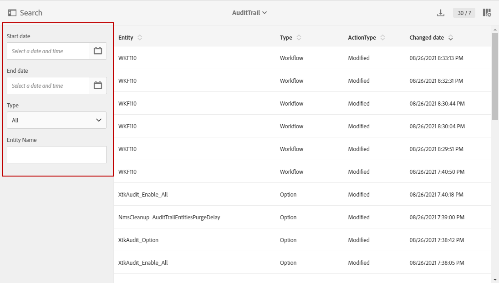

# 監査記録 {#audit}

**[!UICONTROL Audit trail]**&#x200B;は、インスタンス内でおこなわれた変更の履歴全体にアクセスできるようにします。

**[!UICONTROL Audit trail]** は、Adobe Campaign Standardインスタンス内で発生するアクションとイベントの包括的なリストをリアルタイムでキャプチャします。データの履歴にアクセスして次のような質問に答えるセルフサービスの手段が含まれています。最後に更新したワークフロー、カスタムリソースおよびオプション、またはユーザーがインスタンスでおこなった操作に対する影響。

**[!UICONTROL Audit trail]** は、次の3つのコンポーネントで構成されます。

* **カスタムリソースの監査記録**:アクティビティと、カスタムリソースに対する最終変更を確認します。

   **[!UICONTROL Custom resources]**&#x200B;について詳しくは、この[ページ](../../developing/using/key-steps-to-add-a-resource.md)を参照してください。

* **ワークフロー監査記録**:ワークフローに対するアクティビティと最後の変更、さらに次のようなワークフローの状態を確認します。

   * 作成日時
   * 変更済み
   * 削除済み
   * ワークフロー開始
   * ワークフローの一時停止
   * ワークフローの停止
   * ワークフローの再起動
   * ワークフローのクリーンアップ
   * ワークフローシミュレート
   * ワークフローのウェイクアップ
   * ワークフローの即時停止
   * 同じユーザーでワークフローを再起動
   * Workflow Restart Unknownコマンド

   **[!UICONTROL Workflows]**&#x200B;について詳しくは、この[ページ](../../automating/using/get-started-workflows.md)を参照してください。

* **オプションの監査記録**:「 」アクティビティと「オプションに対する最終変更日」をオンにします。

   **[!UICONTROL Options]**&#x200B;について詳しくは、この[ページ](../../administration/using/about-campaign-standard-settings.md)を参照してください。

デフォルトでは、リテンション期間は30日です。

## 監査記録へのアクセス {#audit-access}

インスタンスの監査記録にアクセスするには：

1. Adobe Campaign Standardの詳細設定メニューで、**[!UICONTROL Administration]** / **[!UICONTROL Audit trail]**&#x200B;を選択します。

   

1. **[!UICONTROL Audit trail]**&#x200B;ウィンドウが開き、エンティティのリストが表示されます。 Adobe Campaign Standardは、ワークフロー、オプションおよびカスタムリソースの作成、編集および削除アクションを監査します。

   **[!UICONTROL Search]**&#x200B;メニューから、次の項目でエンティティをフィルターできます。

   * **[!UICONTROL Start date]**
   * **[!UICONTROL End date]**
   * **[!UICONTROL Type]**:エンティティのタイプ（「すべて」、「ワークフロー」、「カスタムリソース」、「オプション」）。
   * **[!UICONTROL Entity name]**:ワークフロー、オプションまたはカスタムリソースのID

   

1. エンティティを1つ選択して、最後の変更の詳細を確認します。

1. 「監査エンティティ」ウィンドウには、選択したエンティティに関する次のような詳細情報が表示されます。

   * **[!UICONTROL Entity]**:ワークフロー、オプションまたはカスタムリソースのID。
   * **[!UICONTROL Action]**:このエンティティに対して最後に実行された操作。
   * **[!UICONTROL Changed by]**:このエンティティを最後に変更した人のユーザー名。
   * **[!UICONTROL Changed date]**:このエンティティに対して最後に実行されたアクションの日付。
   * **[!UICONTROL Content]**:エンティティ内での変更に関する詳細情報を提供するコードブロック。

   この例では、このインスタンスのビジネス管理者が8月26日にワークフローWKF110を開始しています。

   

## 監査記録の有効化/無効化 {#enable-disable-audit}

監査記録は、特定のアクティビティに対して簡単に有効化または無効化できます。

それには、次の手順に従います。

1. Adobe Campaign Standardの詳細設定メニューで、**[!UICONTROL Administration]** / **[!UICONTROL Application settings]** / **[!UICONTROL Options]**&#x200B;を選択します。

   

1. 無効にするエンティティに応じて、次のいずれかのオプションを選択します。

   * **[!UICONTROL XtkAudit_Workflows]** 」オプションを使用して、ワークフローの監査記録を管理します。
   * **[!UICONTROL XtkAudit_Option]** オプションを使用して、オプションの監査記録を管理します。
   * **[!UICONTROL XtkAudit_CusResource]** オプションを使用して、カスタムリソースの監査記録を管理できます。
   * **[!UICONTROL XtkAudit_Enable_All]** 」オプションを使用して、すべてのエンティティの監査記録を管理できます。

      >[!NOTE]
      >
      >**[!UICONTROL XtkAudit_Enable_All]**&#x200B;オプションが0に設定されている場合、他の個々のオプション値に関係なく、**[!UICONTROL Audit trail]**&#x200B;機能は完全に無効になります。
   

1. **[!UICONTROL Options]**&#x200B;ページで、**[!UICONTROL Audit trail]**&#x200B;を無効にする場合は&#x200B;**[!UICONTROL Value (integer)]**&#x200B;を0に、有効にする場合は1に設定します。

   

1. 「**[!UICONTROL Save]**」をクリックします。