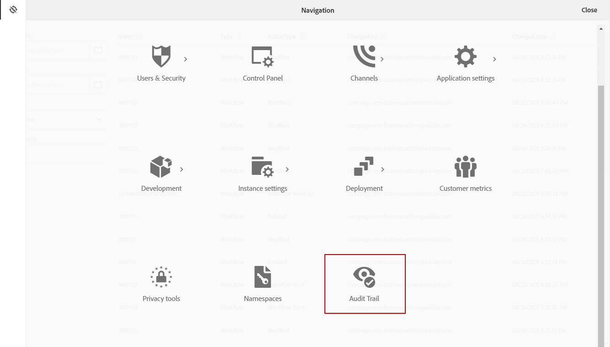
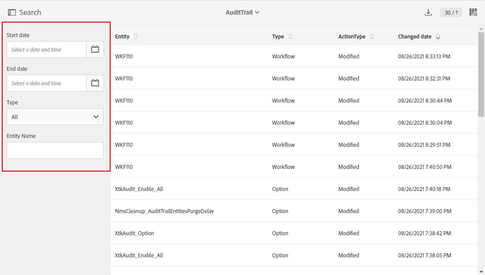
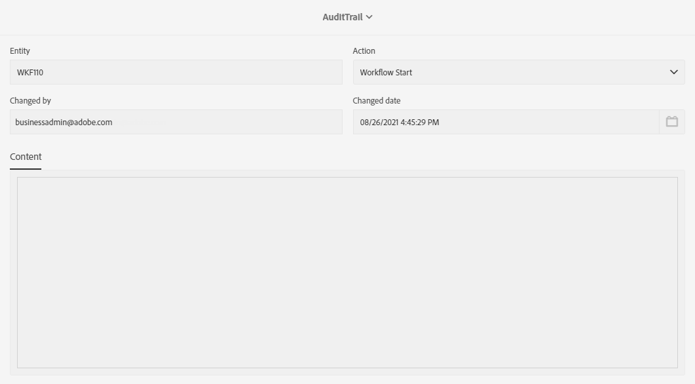
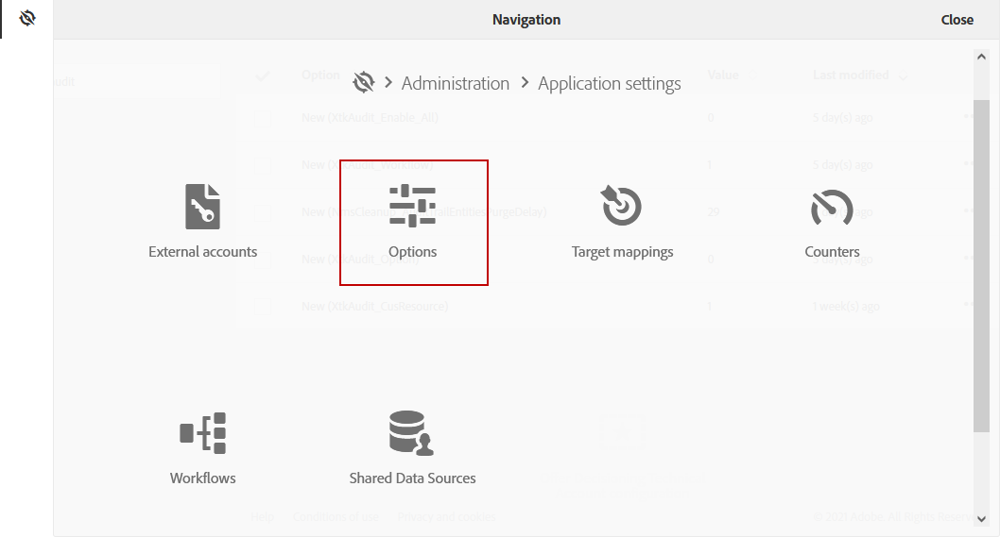
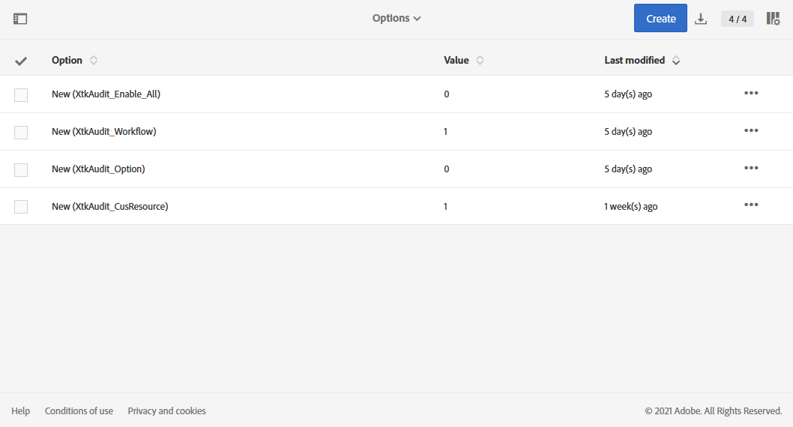
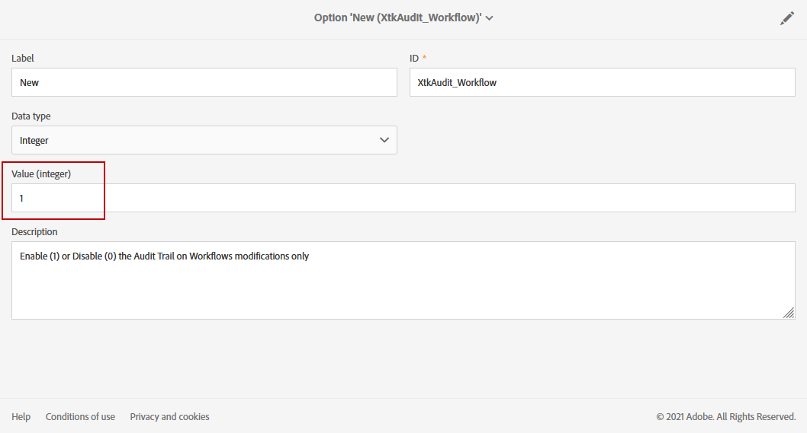

# 監査記録 {#audit}

**[!UICONTROL Audit trail]**&#x200B;では、インスタンス内で行われた変更の完全な履歴にアクセスできます。

**[!UICONTROL Audit trail]**&#x200B;は、Adobe Campaign Standard インスタンス内で発生するアクションとイベントの包括的なリストをリアルタイムでキャプチャします。 また、データの履歴にセルフサービスでアクセスし、「ワークフローの変更」、「カスタムリソースとオプション」、「ワークフローの最終更新者」、「インスタンスでのユーザーの行動」などの質問に答えることもできます。

**[!UICONTROL Audit trail]**&#x200B;は、次の3つのコンポーネントで構成されています。

* **カスタムリソース監査証跡**: アクティビティとカスタムリソースに対する最後の変更を確認してください。

  **[!UICONTROL Custom resources]**&#x200B;について詳しくは、この[ ページ ](../../developing/using/key-steps-to-add-a-resource.md)を参照してください。

* **ワークフロー監査証跡**: ワークフローに対して行われたアクティビティと最後の変更、さらにワークフローの状態を次のように確認します。

   * 作成日時
   * 変更済み
   * 削除済み
   * ワークフロー開始
   * ワークフローの一時停止
   * ワークフロー停止
   * ワークフローの再起動
   * ワークフロークリーンアップ
   * Workflow Simulate
   * ワークフローのウェイクアップ
   * ワークフロー即時停止
   * 同じユーザーでのワークフローの再起動
   * ワークフロー再起動の不明なコマンド

  **[!UICONTROL Workflows]**&#x200B;について詳しくは、この[ ページ ](../../automating/using/get-started-workflows.md)を参照してください。

* **オプション監査記録**: アクティビティと最後に行った変更をオプションに確認します。

  **[!UICONTROL Options]**&#x200B;について詳しくは、この[ ページ ](../../administration/using/about-campaign-standard-settings.md)を参照してください。

デフォルトでは、保持期間は30日です。

## 監査記録へのアクセス {#audit-access}

インスタンスの監査証跡にアクセスするには：

1. Adobe Campaign Standardの詳細設定メニューで、**[!UICONTROL Administration]** > **[!UICONTROL Audit trail]**&#x200B;を選択します。

   

1. **[!UICONTROL Audit trail]** ウィンドウが開き、エンティティのリストが表示されます。 Adobe Campaign Standardは、ワークフロー、オプション、カスタムリソースの作成、編集、削除アクションを監査します。

   **[!UICONTROL Search]** メニューから、次の場所でエンティティをフィルタリングできます。

   * **[!UICONTROL Start date]**
   * **[!UICONTROL End date]**
   * **[!UICONTROL Type]**：すべての、ワークフロー、カスタムリソース、およびオプションの間のエンティティのタイプ。
   * **[!UICONTROL Entity name]**: ワークフロー、オプションまたはカスタムリソースのID

   

1. 最後の変更の詳細を確認するには、いずれかのエンティティを選択します。

1. 「監査エンティティ」ウィンドウには、選択したエンティティに関するより詳細な情報が表示されます。次に例を示します。

   * **[!UICONTROL Entity]**: ワークフロー、オプション、またはカスタムリソースのID。
   * **[!UICONTROL Action]**：このエンティティに対して実行された最後のアクション。
   * **[!UICONTROL Changed by]**：このエンティティを最後に変更したユーザーのユーザー名。
   * **[!UICONTROL Changed date]**：このエンティティに対して実行された最後のアクションの日付。
   * **[!UICONTROL Content]**: エンティティ内で変更された内容に関する詳細な情報を提供するコードブロックです。

   この例では、このインスタンスのビジネス管理者が8月26日にワークフローWKF110を開始したことがわかります。

   

## 監査記録を有効／無効にする {#enable-disable-audit}

>[!NOTE]
>
> 監査証跡を有効または無効にできるのは、機能管理者のみです。 詳しくは、この[ページ](../../administration/using/users-management.md#functional-administrators)を参照してください。

特定のアクティビティに対して、監査証跡を簡単にアクティブ化または非アクティブ化できます。

それには、次の手順に従います。

1. Adobe Campaign Standardの詳細設定メニューで、**[!UICONTROL Administration]** > **[!UICONTROL Application settings]** > **[!UICONTROL Options]**&#x200B;を選択します。

   

1. 無効にするエンティティに応じて、次のいずれかのオプションを選択します。

   * ワークフローの監査証跡を管理する&#x200B;**[!UICONTROL XtkAudit_Workflows]** オプション。
   * オプションの監査証跡を管理する&#x200B;**[!UICONTROL XtkAudit_Option]** オプション。
   * カスタムリソースの監査証跡を管理する&#x200B;**[!UICONTROL XtkAudit_CusResource]** オプション。
   * 各エンティティの監査証跡を管理する&#x200B;**[!UICONTROL XtkAudit_Enable_All]** オプション。

     >[!NOTE]
     >
     >**[!UICONTROL XtkAudit_Enable_All]** オプションが0に設定されている場合、他の個々のオプション値に関係なく、**[!UICONTROL Audit trail]**&#x200B;機能は完全に無効になります。

   

1. **[!UICONTROL Options]** ページで、**[!UICONTROL Audit trail]**&#x200B;を無効にする場合は&#x200B;**[!UICONTROL Value (integer)]**&#x200B;を0に、有効にする場合は1に設定します。

   

1. 「**[!UICONTROL Save]**」をクリックします。
