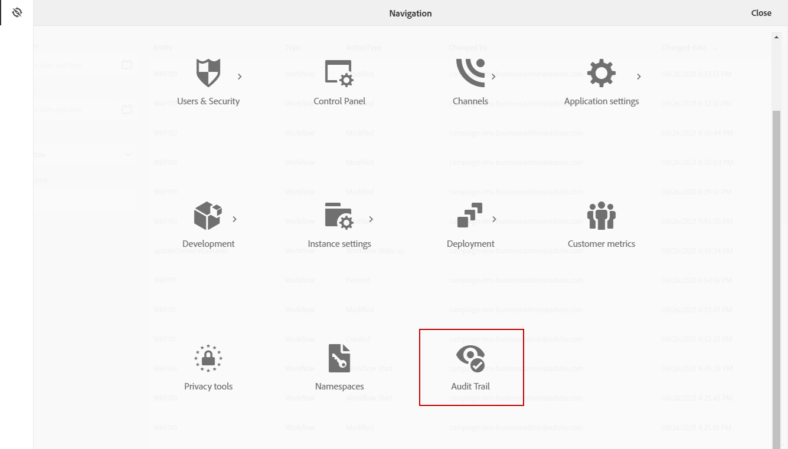

# 監査記録 {#audit}

この **[!UICONTROL Audit trail]** では、インスタンス内でおこなわれた変更の完全な履歴にアクセスできます。

**[!UICONTROL Audit trail]** は、Adobe Campaign Standardインスタンス内で発生するアクションとイベントの包括的なリストをリアルタイムでキャプチャします。 データの履歴にアクセスして次のような質問に回答するためのセルフサービスが含まれています。ワークフロー、カスタムリソースおよびオプション（最後に更新したユーザー、またはインスタンスでユーザーがおこなった操作）への影響

**[!UICONTROL Audit trail]** は、次の 3 つのコンポーネントで構成されます。

* **カスタムリソース監査証跡**:アクティビティを確認し、カスタムリソースに対する最終変更を確認します。

   詳しくは、 **[!UICONTROL Custom resources]**（これを参照） [ページ](../../developing/using/key-steps-to-add-a-resource.md).

* **ワークフロー監査証跡**:ワークフローに対するアクティビティと最終変更、およびワークフローの状態を確認します。例：

   * 作成日時
   * 変更済み
   * 削除済み
   * ワークフロー開始
   * ワークフローの一時停止
   * ワークフローの停止
   * ワークフローの再開
   * ワークフロークリーンアップ
   * ワークフローシミュレート
   * ワークフローのウェイクアップ
   * ワークフローの即時停止
   * 同じユーザーでワークフローを再起動
   * ワークフローの再起動の不明なコマンド

   詳しくは、 **[!UICONTROL Workflows]**（これを参照） [ページ](../../automating/using/get-started-workflows.md).

* **オプション監査証跡**:「 」アクティビティと「最終変更： 」オプションをオンにします。

   詳しくは、 **[!UICONTROL Options]**（これを参照） [ページ](../../administration/using/about-campaign-standard-settings.md).

デフォルトでは、リテンション期間は 30 日です。

## 監査証跡へのアクセス {#audit-access}

インスタンスの監査記録にアクセスするには：

1. Adobe Campaign Standardの詳細設定メニューで、「 」を選択します。 **[!UICONTROL Administration]** > **[!UICONTROL Audit trail]**.

   

1. この **[!UICONTROL Audit trail]** ウィンドウが開き、エンティティのリストが表示されます。 Adobe Campaign Standardは、ワークフロー、オプションおよびカスタムリソースの作成、編集および削除アクションに対する監査を実施します。

   次の **[!UICONTROL Search]** メニューでエンティティをフィルタリングできます。

   * **[!UICONTROL Start date]**
   * **[!UICONTROL End date]**
   * **[!UICONTROL Type]**:エンティティのタイプ（「すべて」、「ワークフロー」、「カスタムリソース」、「オプション」）。
   * **[!UICONTROL Entity name]**:ワークフローの ID、オプションまたはカスタムリソース

   

1. エンティティを 1 つ選択して、最後の変更の詳細を確認します。

1. 「監査エンティティ」ウィンドウには、次のような選択したエンティティに関する詳細情報が表示されます。

   * **[!UICONTROL Entity]**:ワークフロー、オプションまたはカスタムリソースの ID。
   * **[!UICONTROL Action]**:このエンティティに対して最後に実行されたアクション。
   * **[!UICONTROL Changed by]**:このエンティティを最後に変更した人物のユーザー名。
   * **[!UICONTROL Changed date]**:このエンティティに対して最後に実行されたアクションの日付。
   * **[!UICONTROL Content]**:エンティティ内で変更された内容に関する詳細情報を提供するコードブロック。

   この例では、このインスタンスのビジネス管理者が、8 月 26 日に WKF110 ワークフローを開始しています。

   

## 監査証跡の有効化/無効化 {#enable-disable-audit}

>[!NOTE]
>
> 監査証跡の有効/無効を切り替えられるのは、機能管理者のみです。 詳しくは、この[ページ](../../administration/using/users-management.md#functional-administrators)を参照してください。

監査証跡は、特定のアクティビティに対して簡単に有効化または無効化できます。

それには、次の手順に従います。

1. Adobe Campaign Standardの詳細設定メニューで、「 」を選択します。 **[!UICONTROL Administration]** > **[!UICONTROL Application settings]** > **[!UICONTROL Options]**.

   

1. 無効にするエンティティに応じて、次のいずれかのオプションを選択します。

   * **[!UICONTROL XtkAudit_Workflows]** オプションを使用して、ワークフローの監査証跡を管理できます。
   * **[!UICONTROL XtkAudit_Option]** オプションを使用して、オプションの監査証跡を管理できます。
   * **[!UICONTROL XtkAudit_CusResource]** カスタムリソースの監査証跡を管理するオプション。
   * **[!UICONTROL XtkAudit_Enable_All]** すべてのエンティティの監査記録を管理するオプション。

      >[!NOTE]
      >
      >この **[!UICONTROL XtkAudit_Enable_All]** オプションを 0 に設定すると、 **[!UICONTROL Audit trail]** 他の個々のオプション値に関係なく、機能は完全に無効になります。
   

1. お使いの **[!UICONTROL Options]** ページ、 **[!UICONTROL Value (integer)]** を 0 に設定します。 **[!UICONTROL Audit trail]** または 1 に設定して有効にします。

   

1. 「**[!UICONTROL Save]**」をクリックします。
