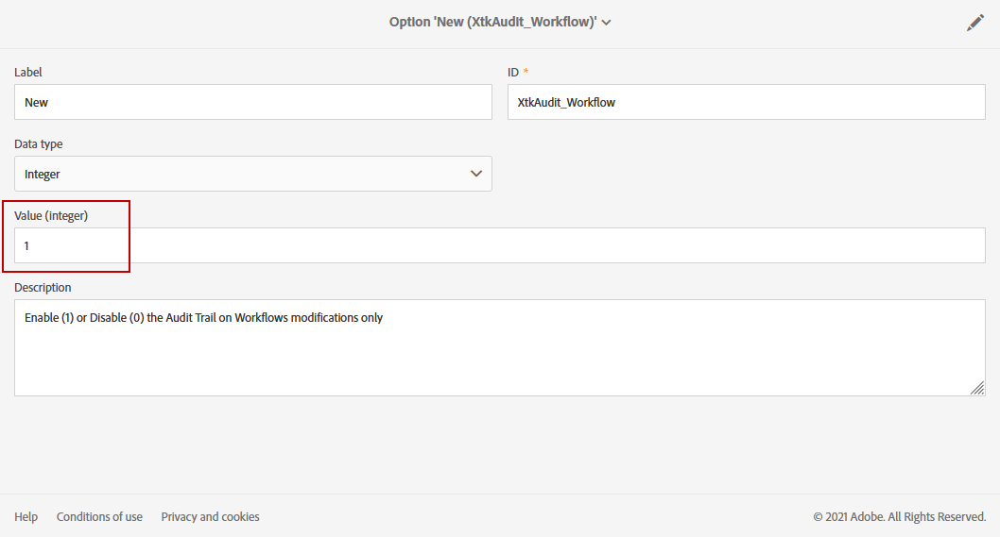

# 監査記録 {#audit}

**[!UICONTROL Audit trail]** を使用すると、インスタンス内で行われた変更の完全な履歴にアクセスできます。

**[!UICONTROL Audit trail]** は、Adobe Campaign Standard インスタンス内で発生するアクションとイベントの包括的なリストをリアルタイムで取得します。 これには、データの履歴を確認することにより、ワークフローで発生した事象、カスタムリソースやオプション、ワークフローを最後に更新したユーザー、インスタンス内でユーザーが行った操作などを知るのに役立つセルフサービス式の方法が含まれています。

**[!UICONTROL Audit trail]** は、次の 3 つのコンポーネントで構成されます。

* **カスタムリソース監査証跡**：アクティビティと、カスタムリソースに最後に加えた変更を確認します。

  **[!UICONTROL Custom resources]** について詳しくは、この [ ページ ](../../developing/using/key-steps-to-add-a-resource.md) を参照してください。

* **ワークフロー監査記録**：アクティビティ、ワークフローに最後に加えられた変更およびワークフローの状態を確認します。例えば、次のようなものがあります。

   * 作成日時
   * 変更済み
   * 削除済み
   * ワークフロー開始
   * ワークフロー一時停止
   * ワークフローの停止
   * ワークフローの再開
   * ワークフロークリーンアップ
   * ワークフローシミュレート
   * ワークフローのウェイクアップ
   * ワークフロー即時停止
   * 同じユーザーでのワークフローの再開
   * ワークフロー再起動不明コマンド

  **[!UICONTROL Workflows]** について詳しくは、この [ ページ ](../../automating/using/get-started-workflows.md) を参照してください。

* **オプション監査記録**：アクティビティと、オプションに対して実行された最終変更を確認します。

  **[!UICONTROL Options]** について詳しくは、この [ ページ ](../../administration/using/about-campaign-standard-settings.md) を参照してください。

デフォルトでは、保持期間は 30 日です。

## 監査記録へのアクセス {#audit-access}

インスタンスの監査記録にアクセスするには：

1. Adobe Campaign Standardの詳細メニューで、**[!UICONTROL Administration]**/**[!UICONTROL Audit trail]** を選択します。

   

1. エンティティのリストを含む **[!UICONTROL Audit trail]** ウィンドウが開きます。 Adobe Campaign Standardは、ワークフロー、オプションおよびカスタムリソースに対する作成、編集および削除アクションを監査します。

   **[!UICONTROL Search]** メニューから、次の項目でエンティティをフィルタリングできます。

   * **[!UICONTROL Start date]**
   * **[!UICONTROL End date]**
   * **[!UICONTROL Type]**：すべて、ワークフロー、カスタムリソースおよびオプションのエンティティのタイプ。
   * **[!UICONTROL Entity name]**：ワークフロー、オプション、カスタムリソースの ID

   

1. 最後の変更の詳細を確認するには、いずれかのエンティティを選択します。

1. 「監査エンティティ」ウィンドウには、選択したエンティティに関する次のような詳細情報が表示されます。

   * **[!UICONTROL Entity]**：ワークフロー、オプション、カスタムリソースの ID。
   * **[!UICONTROL Action]**：このエンティティで最後に実行されたアクション。
   * **[!UICONTROL Changed by]**：このエンティティを最後に変更したユーザー名。
   * **[!UICONTROL Changed date]**：このエンティティに対して最後に実行されたアクションの日付。
   * **[!UICONTROL Content]**：エンティティ内で正確に変更された内容に関する詳細情報を提供するコードブロック。

   この例では、ワークフロー WKF110 が、このインスタンスのビジネス管理者によって 8 月 26 日に開始されたことがわかります。

   

## 監査記録を有効／無効にする {#enable-disable-audit}

>[!NOTE]
>
> 監査記録を有効または無効にできるのは、機能管理者のみです。 詳しくは、この[ページ](../../administration/using/users-management.md#functional-administrators)を参照してください。

監査記録は、特定のアクティビティに対して簡単にアクティブ化または非アクティブ化できます。

それには、次の手順に従います。

1. Adobe Campaign Standardの詳細メニューで、**[!UICONTROL Administration]**/**[!UICONTROL Application settings]**/**[!UICONTROL Options]** を選択します。

   

1. 無効にするエンティティに応じて、次のいずれかのオプションを選択します。

   * ワ **[!UICONTROL XtkAudit_Workflows]** クフローの監査記録を管理するオプション。
   * オ **[!UICONTROL XtkAudit_Option]** ションの監査記録を管理するオプション。
   * カ **[!UICONTROL XtkAudit_CusResource]** タムリソースの監査記録を管理するオプション。
   * **[!UICONTROL XtkAudit_Enable_All]** べてのエンティティの監査記録を管理するオプション。

     >[!NOTE]
     >
     >**[!UICONTROL XtkAudit_Enable_All]** オプションを 0 に設定すると、他の個々のオプションの値に関係なく、**[!UICONTROL Audit trail]** 機能は完全に無効になります。

   

1. **[!UICONTROL Options]** ページで、**[!UICONTROL Audit trail]** を無効にする場合は **[!UICONTROL Value (integer)]** を 0 に、有効にする場合は 1 に設定します。

   

1. 「**[!UICONTROL Save]**」をクリックします。
