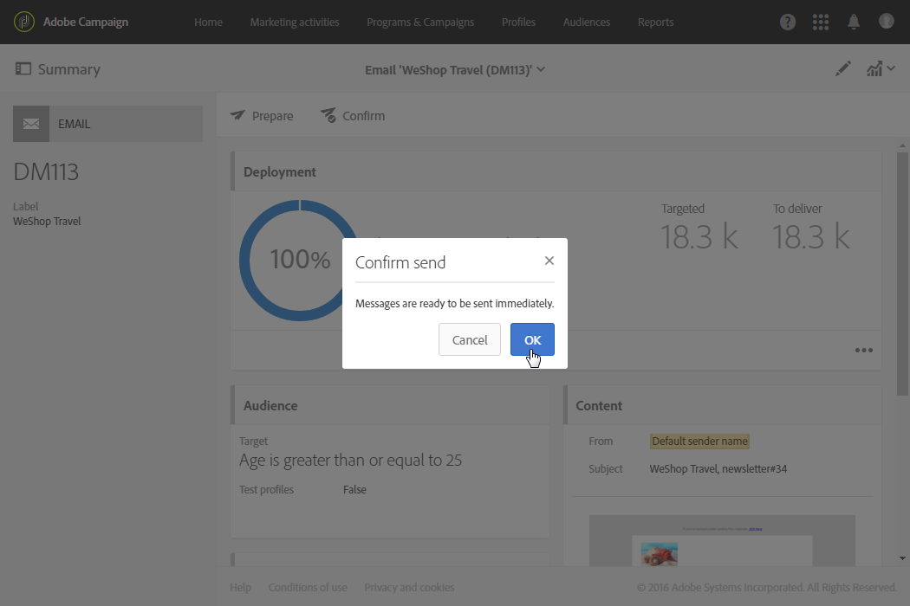

# ブランディング{#branding}

## ブランドアイデンティティについて{#about-brand-identity}

どの会社にも、ブランドの視覚的ガイドラインと技術的ガイドラインがあります。Adobe Campaign を使用すれば、ロゴから E メール送信者、URL、ドメインなどの技術的側面に至るまで、一貫したブランドを顧客に提供するための一連の仕様を定義できます。

技術管理者は、1 つまたは複数のブランドを定義して、ブランドアイデンティティに影響を与えるパラメーターを一元的に入力できます。ブランドのロゴ、ランディングページのアクセス URL のドメイン、メッセージトラッキングの設定などが含まれます。Adobe Campaign では、これらのブランドを作成して、メッセージやランディングページにリンクできます。こうした設定はテンプレートで管理されます。

## ブランドの設定と使用 {#configuring-and-using-brands}

ブランドの設定と使用に関する主な原則は次のとおりです。

1. ブランドを作成して設定します。この操作には特定の権限が必要で、実行者は Adobe Campaign の技術管理者です。キャンペーンで新しいブランドを獲得する手順については、こ [の節で詳しく説明します](#creating-a-brand)。
1. ブランドの配信とランディングページテンプレートを 1 つまたは複数作成します。[テンプレートの作成](../../start/using/marketing-activity-templates.md)の節を参照してください。
1. このテンプレートに基づいてメッセージとランディングページを作成します。[E メールの作成](../../channels/using/creating-an-email.md)と[ランディングページの作成](../../channels/using/designing-a-landing-page.md)の節を参照してください。

>[!IMPORTANT]
>
>ブランドは、エンドユーザーが作成または変更することはできません。これらの操作は、Adobe Campaign の技術管理者が実行する必要があります。ご要望がある場合は、アドビカスタマーケアにお問合せください。
>
>マルチブランディングは、トランザクションメッセージングのコンテキストでは使用できません。詳しくは、[トランザクションメッセージとブランディング](../../channels/using/transactional-messaging-limitations.md#permissions-and-branding)を参照してください。

ブランドは&#x200B;**[!UICONTROL Administration > Instance settings > Brand configuration]**&#x200B;メニューに表示されます。

デフォルトでは、新しく作成されたブランドは、対応する権限を管理者から割り当てられたユーザーにのみ表示されます。

**ブランドは**、次の特性によって定義されます。

* **Identity**：ブランドを定義しパーソナライズします。このセクションには、次のフィールドが含まれています。

   

   * **Label**：インターフェイスに表示されます。
   * **Brand name**
   * **Website URL** と **Website label**
   * **Logo URL**

* **[!UICONTROL Header parameters of sent emails]**：キャンペーンの受信者に表示される内容をパーソナライズします。このセクションには、次のフィールドが含まれています。

   

   * **Sender (email address)**：ブランドの電子メールアドレスです。
   * **Sender (name)**：ブランドの名前です。
   * **Reply to (email address)**：ユーザーからの返信先の E メールアドレスです。
   * ブランド名を含む&#x200B;**Reply to (name)**：ユーザーからの返信先（ブランド）の名前です。
   * **）Error (email address)**：エラーの場合に使用する E メールアドレスです。

   >[!IMPORTANT]
   >
   >E メールのヘッダーパラメーターを更新した後、送信者の名前と E メールアドレスが、テンプレートから作成された E メール内で変更されていない場合は、テンプレートの詳細設定を確認します。

* **Server(s) exposed on the Internet**：トラッキングに使用するサーバーを定義しますが、これはランディングページへのアクセスにも使用します。このセクションには、次のフィールドが含まれています。

   

   * **External URL of the application server**：作成する様々なランディングページのホスティングとアクセスに使用します。
   * **External URL of the tracking server**：配信時のトラッキング URL として使用します。
   * **External URL of the mirror page server**：配信のデフォルトのミラーページとして使用します。

   >[!NOTE]
   >
   >ランディングページのプレビューとミラーページのレンダリングを Campaign ユーザーインターフェイスに表示するには、アプリケーションサーバーとミラーページサーバーの URL をセキュリティで保護する必要があります。この場合、これらの URL の設定時には、http:// ではなく https:// を使用してください。

* **[!UICONTROL Tracking URL configuration (Web Analytics)]**：ブランドの URL トラッキングの設定を定義します。

   Web 分析ツール（例：Adobe Analytics や Google Analytics）などの外部システムでリンクを追跡するための追加パラメーターをここで定義します。

   

## Creating a new brand {#creating-a-brand}

組織の新しいエンティティをキャンペーンに追加したり、別のサブドメインの下に送信する必要がある新しいタイプの電子メールを作成したりできます。 これを実行するには、次の手順に従います。

1. **新しいサブドメインの設定** -Adobeが新しいサブドメインを使用する場合は、最初の手順でサブドメインを設定します。 この作業は、 [キャンペーンCampaign コントロールパネルを通じて行うことも](https://docs.adobe.com/content/help/ja-JP/control-panel/using/subdomains-and-certificates/subdomains-branding.html) 、Adobeのテクニカルコンタクトに連絡することもできます。 Learn more about subdomain configuration [in this article](https://helpx.adobe.com/jp/campaign/kb/domain-name-delegation.html).

1. **チケットの作成** — サブドメインが設定されたら、Adobeは実稼働環境でチケットを設定する必要があります。 このリクエストを行うには、次の情報を含むClientCare [(Client Care)へのチケットを](https://helpx.adobe.com/jp/enterprise/using/support-for-experience-cloud.html) 作成します。

   * 件名：ACS新しいブランドがセットアップされました

   * コンテンツ：新しいドメインが設定されました。キャンペーンプラットフォームで設定します

   * ドメイン：XXX

   * 本番用URL:XXX.キャンペーン.adobe.com

1. **配信テンプレートの作成** — 新しいブランドが利用可能になったら、ベストプラクティスは、この新しいブランドを参照する新しい空白の配信テンプレートを少なくとも1つ作成することです。 詳しくは、[こちら](#linking-a-brand-to-a-template)を参照してください。

1. **配信品質のガイドラインの確認** — 新しいドメインを使用する前に、Adobeの配信品質チームに問い合わせる必要があります。 例えば、ドメイン間でIPを分割する新しいアフィニティを作成する場合や、ランプアップ計画を定義する場合など、ベストプラクティスを定義するのに役立ちます。 配信品質のベストプラクティスにつ [いて詳しくは、この節を参照してください](../../sending/using/about-deliverability.md)。

## E メールへのブランドの割り当て {#assigning-a-brand-to-an-email}

### テンプレートへのブランドのリンク {#linking-a-brand-to-a-template}

ブランドに定義したパラメーターを使用するには、そのブランドが配信テンプレートまたはランディングページテンプレートにリンクされている必要があります。それには、テンプレートを作成または編集する必要があります。

>[!NOTE]
>
>テンプレートの作成について詳しくは、[テンプレートの作成](../../start/using/marketing-activity-templates.md)の節を参照してください。

テンプレートを作成したら、それをブランドにリンクできます。手順は次のとおりです。

1. 「**[!UICONTROL Edit properties]**」ボタンをクリックして、テンプレートのプロパティにアクセスします。

   

1. ドロップダウンリストを使用して、テンプレートにリンクするブランドを選択します。

   >[!NOTE]
   >
   >デフォルトでは、「**[!UICONTROL Default brand (branding)]**」が選択されています。

   

   選択したブランドの設定を表示するには、「**[!UICONTROL Navigate to the detail of the element selected]**」アイコンをクリックします。

   

1. 選択内容を確定し、テンプレートを保存します。

これで、テンプレートがブランドにリンクされました。E メールエディターでは、「**Email address of default sender**」、「**Default sender name**」、「**Logo**」などの要素では、設定済みのブランドデータが使用されます。

### ブランディングのユースケース {#branding-use-case}

この例では、新しい旅行関連ブランドを作成して E メールで使用します。

#### 新しいブランドの設定 {#configure-a-new-brand}

>[!IMPORTANT]
>
>ブランド設定は、特定の権限と技術的な設定が必要なので、アドビでのみ管理されます。

1. ブランドは、Adobe Campaign 管理者が&#x200B;**[!UICONTROL Administration > Instance settings > Brand configuration]**&#x200B;で作成します。この例では、詳細設定メニューから **Vacations in the Tropics** 要素を追加し、ブランドの「**[!UICONTROL ID]**」と「**[!UICONTROL Header parameters of sent emails]**」を設定しています。

   

1. ランディングページを使用できるように、管理者が「**Server(s) exposed on the Internet**」の URL を設定した後、トラッキング URL を設定します。

   この例では、**Web 分析**&#x200B;ツールとして **Google Analytics** が使用されています。管理者は、トラッキング URL を次のように設定します。

   

ブランドが正しく作成および設定されました。これで、マーケティングチームで使用できるようになりました。

#### 新しいブランドの実装 {#implement-a-new-brand}

、新しいブランドを使用する配信テンプレートの作成を配信責任者が担当します。そのための手順は次のとおりです。

1. 詳細設定メニュー&#x200B;**[!UICONTROL Resources > Templates > Delivery templates]**&#x200B;で、組み込みテンプレートを複製して新しい配信テンプレートを設定します。

   

1. このテンプレートを **Vacations in the Tropics** ブランドにリンクするには、テンプレートのプロパティを編集し、ドロップダウンリストからブランドを選択します。

   

1. ブランドアイデンティティを反映するように、E メールテンプレートを設定します。
1. テンプレートが完成したら、保存できます。

   

   これで、配信テンプレートを使用して、オーディエンスに送信する E メールを作成できるようになりました。

#### 配信での新しいブランドの 使用 {#use-the-new-brand-in-a-delivery}

ブランドにリンクされた E メールを作成するには、次の手順に従います。

1. **[!UICONTROL Marketing activities]**&#x200B;メニューから「**[!UICONTROL Create]**」ボタンをクリックします。

   

1. 「**[!UICONTROL Email]**」アクティビティを選択し、新しいブランドにリンクするテンプレートを選択します。

   

1. これで、E 電子メールが設定されました。情報を確認してからテストプロファイルを使用してテストした後、オーディエンスに送信することができます。

   

