# ブランディング{#branding}

## ブランドアイデンティティについて {#about-brand-identity}

どの会社にも、ブランドの視覚的ガイドラインと技術的ガイドラインがあります。 Adobe Campaign を使用すれば、ロゴからメール送信者、URL、ドメインなどの技術的側面に至るまで、一貫したブランドを顧客に提供するための一連の仕様を定義できます。

技術管理者は、1 つまたは複数のブランドを定義して、ブランドアイデンティティに影響を与えるパラメーターを一元的に入力できます。 ブランドのロゴ、ランディングページのアクセス URL のドメイン、メッセージトラッキングの設定などが含まれます。 Adobe Campaign では、これらのブランドを作成して、メッセージやランディングページにリンクできます。 こうした設定はテンプレートで管理されます。

## ブランドの設定と使用 {#configuring-and-using-brands}

ブランドの設定と使用に関する主な原則は次のとおりです。

1. ブランドの作成と設定 – この操作には特定の権限が必要で、Adobe Campaign テクニカル アドミニストレータが実行します。 Campaignで新しいブランドを取得する手順については、この節[で詳しく説明します](#creating-a-brand)。
1. ブランドの配信とランディングページテンプレートを 1 つまたは複数作成します。 [テンプレートの作成](../../start/using/marketing-activity-templates.md)の節を参照してください。
1. このテンプレートに基づいてメッセージとランディングページを作成します。 [メールの作成](../../channels/using/creating-an-email.md)と[ランディングページの作成](../../channels/using/designing-a-landing-page.md)の節を参照してください。

>[!IMPORTANT]
>
>ブランドは、エンドユーザーが作成または変更することはできません。これらの操作は、Adobe Campaign の技術管理者が実行する必要があります。 ご要望がある場合は、アドビカスタマーケアにお問合せください。
>
>マルチブランディングは、トランザクションメッセージングのコンテキストでは使用できません。 詳しくは、[トランザクションメッセージとブランディング](../../channels/using/transactional-messaging-limitations.md#permissions-and-branding)を参照してください。

ブランドは&#x200B;**[!UICONTROL Administration > Instance settings > Brand configuration]**&#x200B;メニューに表示されます。

デフォルトでは、新しく作成されたブランドは、対応する権限を管理者から割り当てられたユーザーにのみ表示されます。

**ブランドは**、次の特性によって定義されます。

* **Identity**：ブランドを定義しパーソナライズします。 このセクションには、次のフィールドが含まれています。

  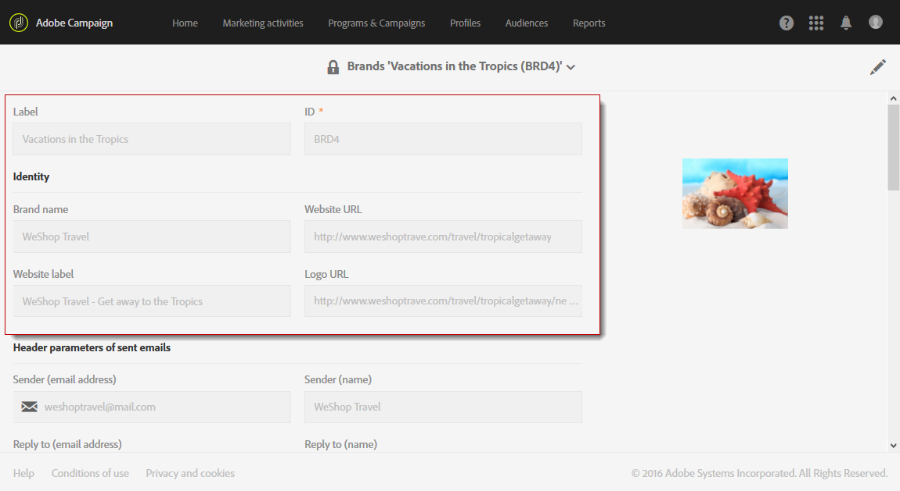

   * **Label**：インターフェイスに表示されます。
   * **Brand name**
   * **Website URL** と **Website label**
   * **Logo URL**

* **[!UICONTROL Header parameters of sent emails]**：キャンペーンの受信者に表示される内容をパーソナライズします。 このセクションには、次のフィールドが含まれています。

  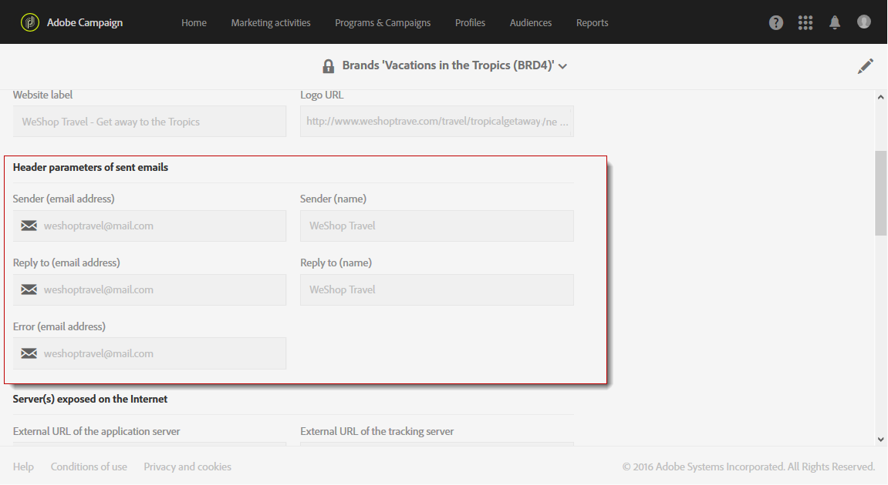

   * **Sender (email address)**：ブランドの電子メールアドレスです。
   * **Sender (name)**：ブランドの名前です。
   * **Reply to (email address)**：ユーザーからの返信先のメールアドレスです。
   * ブランド名を含む&#x200B;**Reply to (name)**：ユーザーからの返信先（ブランド）の名前です。
   * **）Error (email address)**：エラーの場合に使用するメールアドレスです。

  >[!IMPORTANT]
  >
  >メールのヘッダーパラメーターを更新した後、送信者の名前とメールアドレスが、テンプレートから作成されたメール内で変更されていない場合は、テンプレートの詳細設定を確認します。

* **Server(s) exposed on the Internet**：トラッキングに使用するサーバーを定義しますが、これはランディングページへのアクセスにも使用します。 このセクションには、次のフィールドが含まれています。

  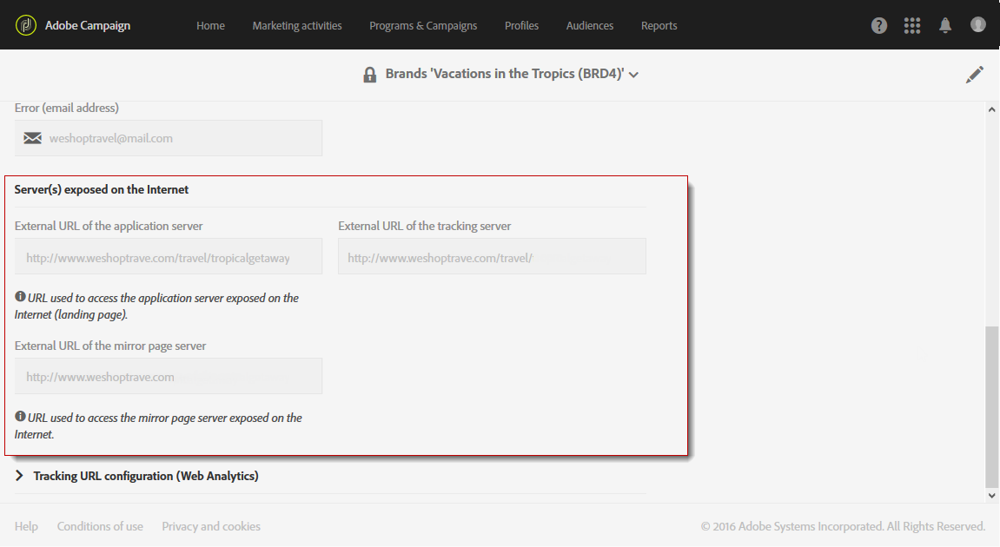

   * **External URL of the application server**：作成する様々なランディングページのホスティングとアクセスに使用します。
   * **External URL of the tracking server**：配信時のトラッキング URL として使用します。
   * **External URL of the mirror page server**：配信のデフォルトのミラーページとして使用します。

  >[!NOTE]
  >
  >ランディングページのプレビューとミラーページのレンダリングを Campaign ユーザーインターフェイスに表示するには、アプリケーションサーバーとミラーページサーバーの URL をセキュリティで保護する必要があります。 この場合、これらの URL の設定時には、http:// ではなく https:// を使用してください。

* **[!UICONTROL Tracking URL configuration (Web Analytics)]**：ブランドの URL トラッキングの設定を定義します。

  Web 分析ツール（例：Adobe Analytics や Google Analytics）などの外部システムでリンクを追跡するための追加パラメーターをここで定義します。

  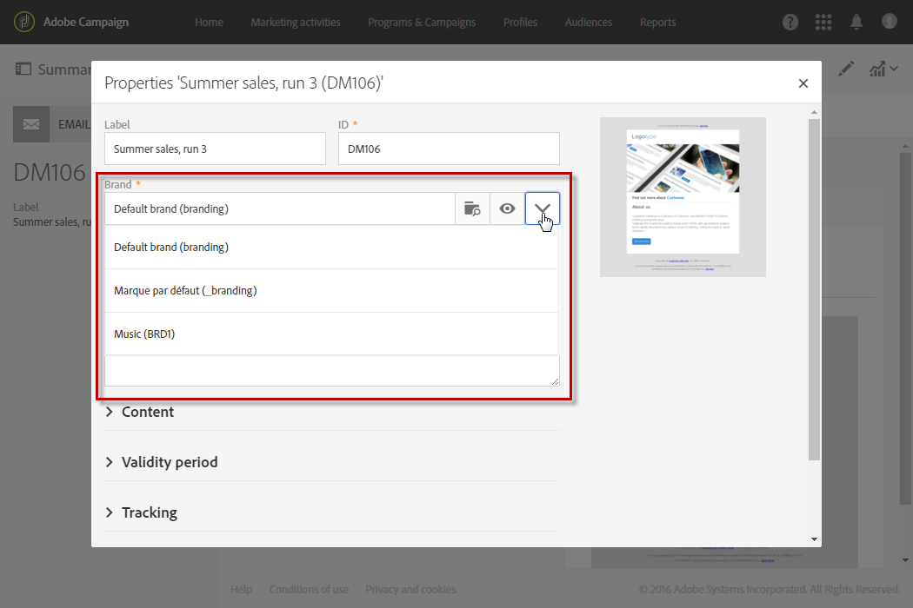

## 新しいブランドの構築 {#creating-a-brand}

Campaign で組織の新しいエンティティを追加することや、別のサブドメインで送信する必要がある新しいタイプのメールを作成できます。 手順は次のとおりです。

1. **新しいサブドメインの設定** - アドビで使用する新しいサブドメインの場合、最初の手順は設定することです。 これは、[Campaign コントロールパネル](https://experienceleague.adobe.com/docs/control-panel/using/subdomains-and-certificates/subdomains-branding.html?lang=ja)を通じて実行することも、アドビの技術担当者に問い合わせることもできます。 サブドメイン設定[の詳細については、この記事](https://experienceleague.adobe.com/docs/deliverability-learn/deliverability-best-practice-guide/additional-resources/campaign/ac-domain-name-setup.html)を参照してください。

   >[!NOTE]
   >
   >コントロールパネルは、すべての管理者ユーザーがアクセスできます。 ユーザーに管理者アクセス権を付与する手順については、[このページ](https://experienceleague.adobe.com/docs/control-panel/using/discover-control-panel/managing-permissions.html?lang=ja#discover-control-panel)で詳しく説明しています。

1. **チケットを作成** - サブドメインを設定すると、Adobeが実稼動環境で設定します。 これをリクエストするには、次の情報を含む[ クライアントケア ](https://helpx.adobe.com/jp/enterprise/using/support-for-experience-cloud.html)へのチケットを作成します。

   * 件名：ACS新しいブランドの設定

   * コンテンツ：新しいドメインが設定されました。Campaign プラットフォームで設定します

   * ドメイン：XXX

   * 実稼動URL: XXX.campaign.adobe.com

1. **配信テンプレートの作成** - 新しいブランドが使用できるようになったら、この新しいブランドを参照する新しい空白の配信テンプレートを 1 つ以上作成することがベストプラクティスです。 [詳細情報](#linking-a-brand-to-a-template)。

1. **配信品質ガイドラインの確認** - 新しいドメインの使用を開始する前に、アドビの配信品質チームと戦略について相談する必要があります。 チームは、ベストプラクティスの定義（例えば、ドメイン間で IP を分割する新しいアフィニティを作成する必要があるかどうか、ランプアッププランを定義する必要があるかどうか）を支援します。 配信品質のベストプラクティス [について詳しくは、この節](../../sending/using/about-deliverability.md)を参照してください。

## ブランドのメールへの割り当て {#assigning-a-brand-to-an-email}

### ブランドをテンプレートにリンクする {#linking-a-brand-to-a-template}

ブランドに定義したパラメーターを使用するには、そのブランドが配信テンプレートまたはランディングページテンプレートにリンクされている必要があります。 それには、テンプレートを作成または編集する必要があります。

>[!NOTE]
>
>テンプレートの作成について詳しくは、[テンプレートの作成](../../start/using/marketing-activity-templates.md)の節を参照してください。

テンプレートを作成したら、それをブランドにリンクできます。 手順は次のとおりです。

1. 「**[!UICONTROL Edit properties]**」ボタンをクリックして、テンプレートのプロパティにアクセスします。

   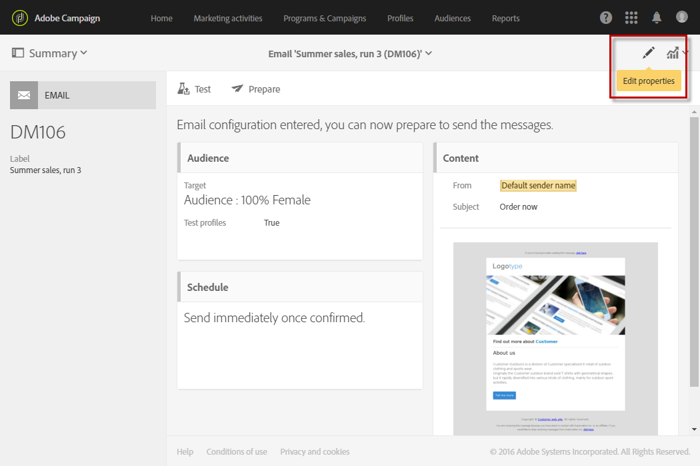

1. ドロップダウンリストを使用して、テンプレートにリンクするブランドを選択します。

   >[!NOTE]
   >
   >デフォルトでは、「**[!UICONTROL Default brand (branding)]**」が選択されています。

   

   選択したブランドの設定を表示するには、「**[!UICONTROL Navigate to the detail of the element selected]**」アイコンをクリックします。

   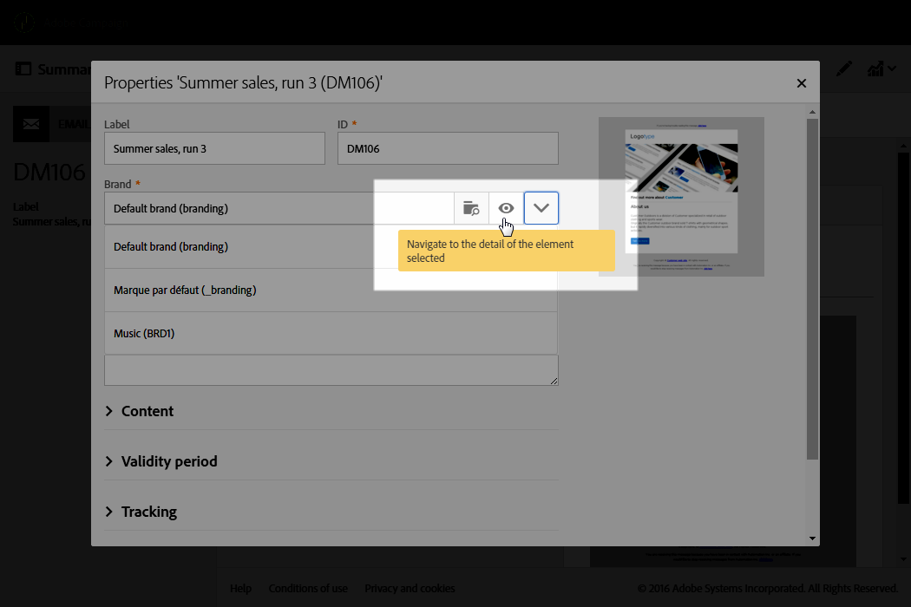

1. 選択内容を確定し、テンプレートを保存します。

これで、テンプレートがブランドにリンクされました。 メールエディターでは、「**Email address of default sender**」、「**Default sender name**」、「**Logo**」などの要素では、設定済みのブランドデータが使用されます。

### ブランディングのユースケース {#branding-use-case}

この例では、新しい旅行関連ブランドを作成してメールで使用します。

#### 手順1：新しいブランドの設定 {#configure-a-new-brand}

>[!IMPORTANT]
>
>ブランド設定は、特定の権限と技術的な設定が必要なので、アドビでのみ管理されます。

1. Adobe Campaign管理者は、最初に&#x200B;**[!UICONTROL Administration > Instance settings > Brand configuration]** メニューからブランドを作成し、Tropics **要素に** Vacationsを追加して、ブランドの&#x200B;**[!UICONTROL ID]**&#x200B;と&#x200B;**[!UICONTROL Header parameters of sent emails]**&#x200B;を設定します。

   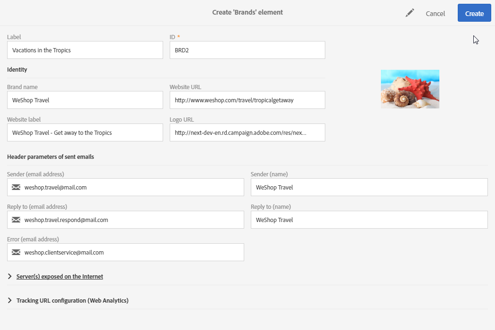

1. ランディングページを使用できるように、管理者が「**Server(s) exposed on the Internet**」の URL を設定した後、トラッキング URL を設定します。

   この例では、**Web 分析**&#x200B;ツールとして **Google Analytics** が使用されています。 管理者は、トラッキング URL を次のように設定します。

   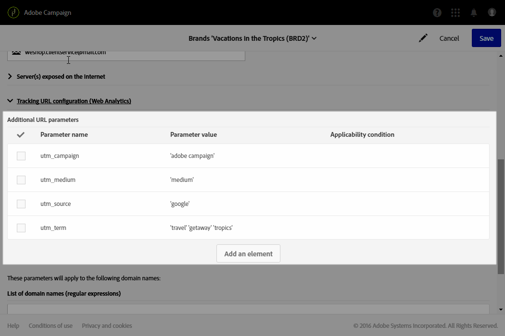

ブランドが正しく作成および設定されました。 これで、マーケティングチームで使用できるようになりました。

#### ステップ 2：新しいブランドの導入 {#implement-a-new-brand}

、新しいブランドを使用する配信テンプレートの作成を配信責任者が担当します。 そのための手順は次のとおりです。

1. 詳細設定メニュー&#x200B;**[!UICONTROL Resources > Templates > Delivery templates]**&#x200B;で、組み込みテンプレートを複製して新しい配信テンプレートを設定します。

   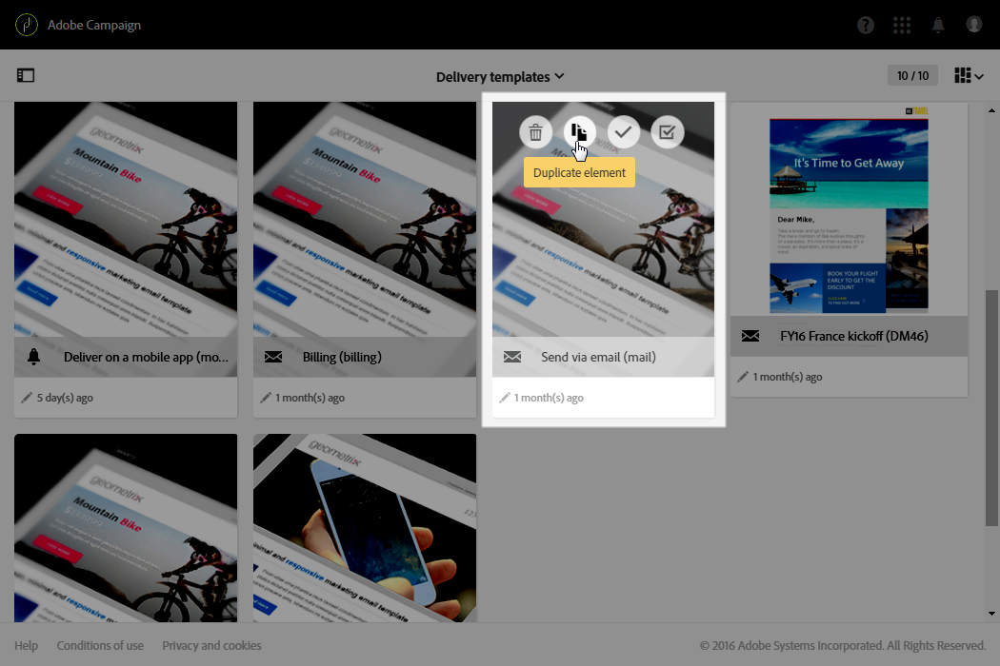

1. このテンプレートを **Vacations in the Tropics** ブランドにリンクするには、テンプレートのプロパティを編集し、ドロップダウンリストからブランドを選択します。

   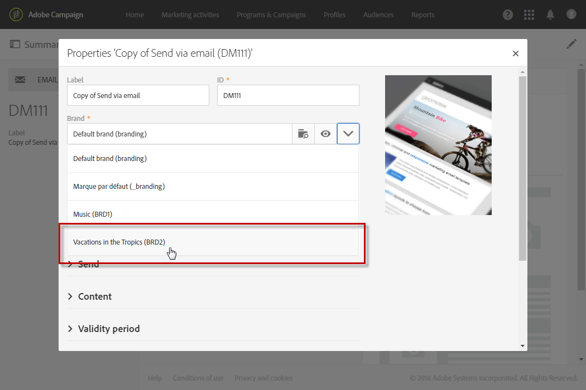

1. ブランドアイデンティティを反映するように、メールテンプレートを設定します。
1. テンプレートが完成したら、保存できます。

   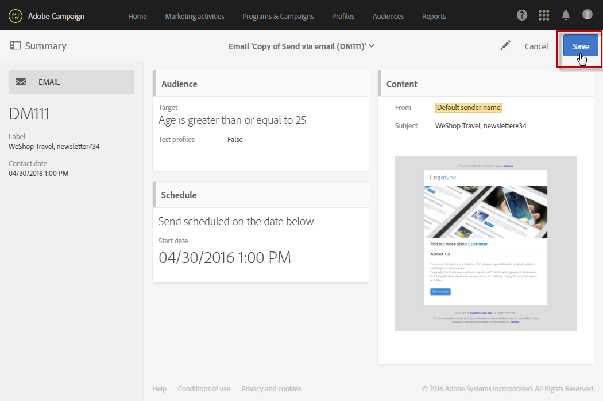

   これで、配信テンプレートを使用して、オーディエンスに送信するメールを作成できるようになりました。

#### 手順3：配信での新しいブランドの使用 {#use-the-new-brand-in-a-delivery}

ブランドにリンクされたメールを作成するには、次の手順に従います。

1. **[!UICONTROL Marketing activities]**&#x200B;メニューから「**[!UICONTROL Create]**」ボタンをクリックします。

   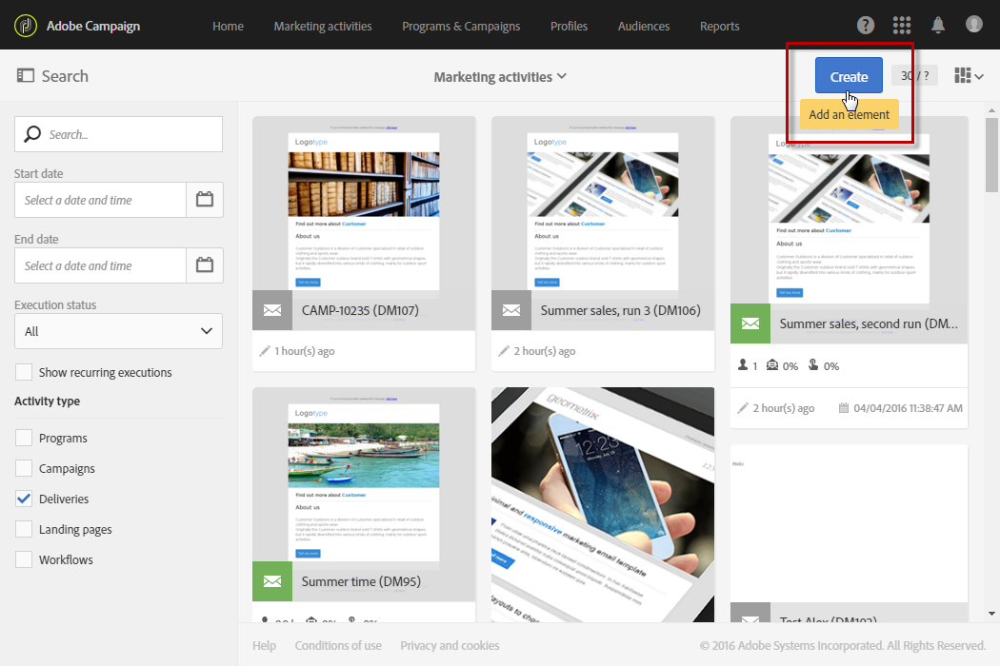

1. 「**[!UICONTROL Email]**」アクティビティを選択し、新しいブランドにリンクするテンプレートを選択します。

   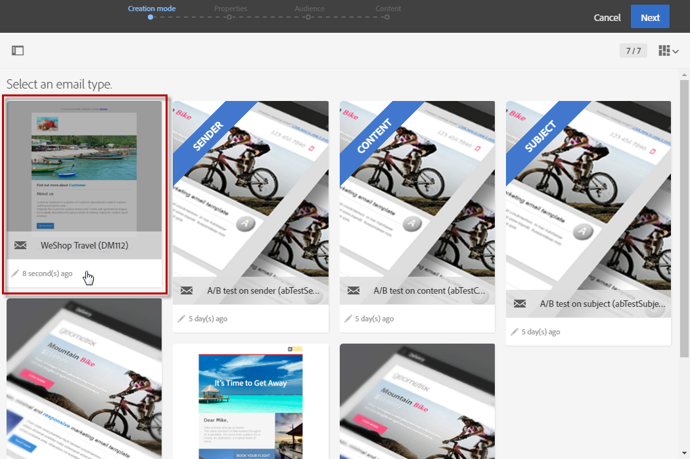

1. これで、E 電子メールが設定されました。 情報を確認してからテストプロファイルを使用してテストした後、オーディエンスに送信することができます。

   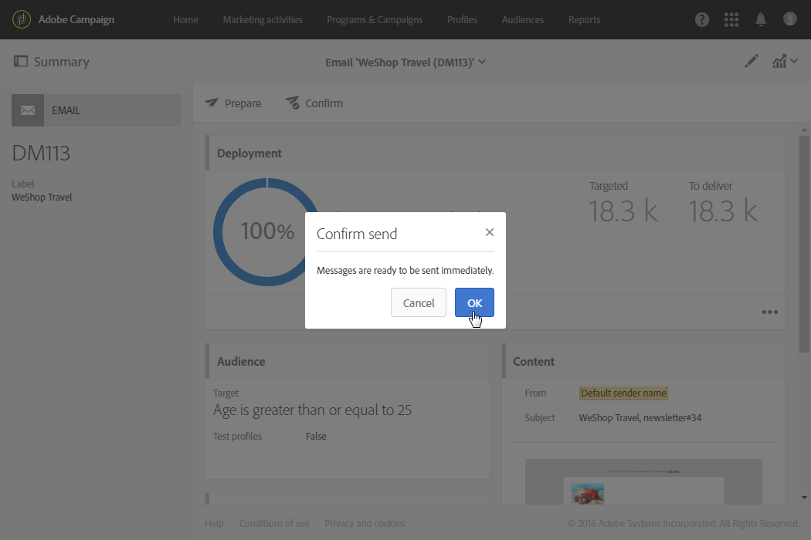
