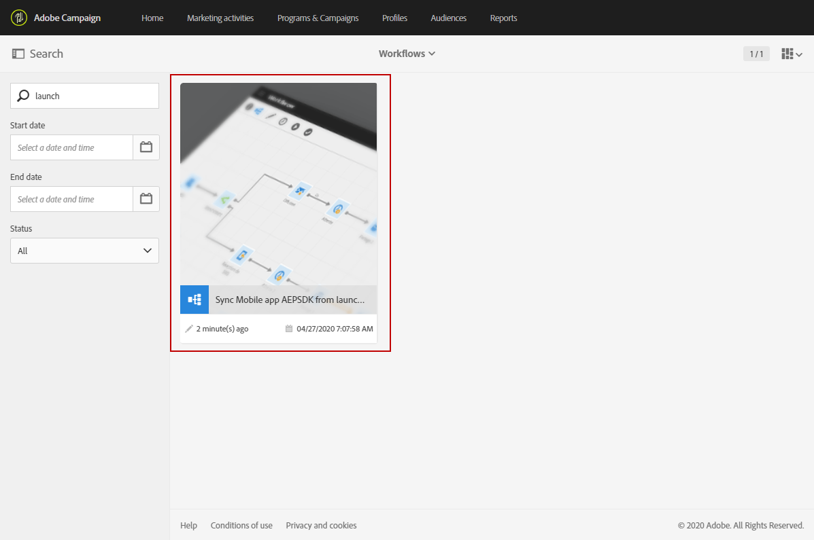
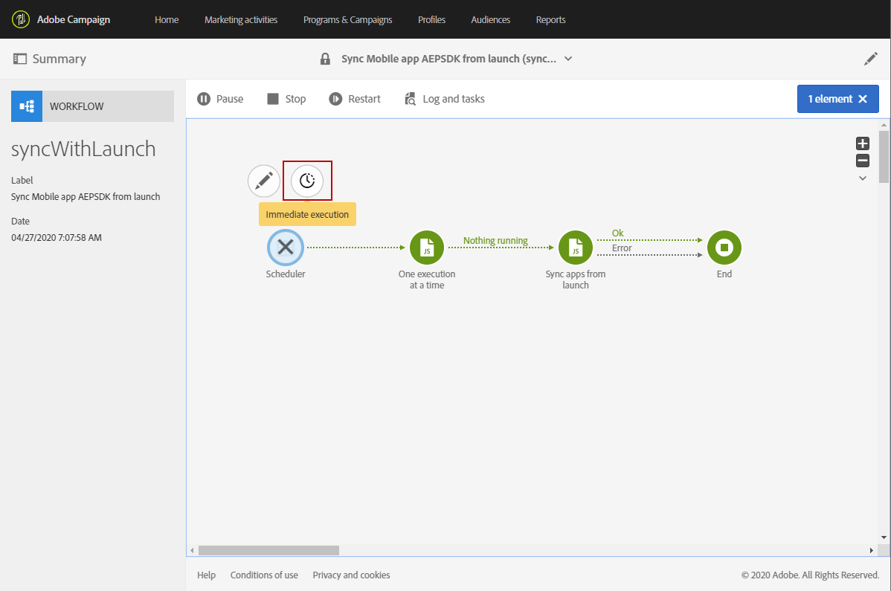
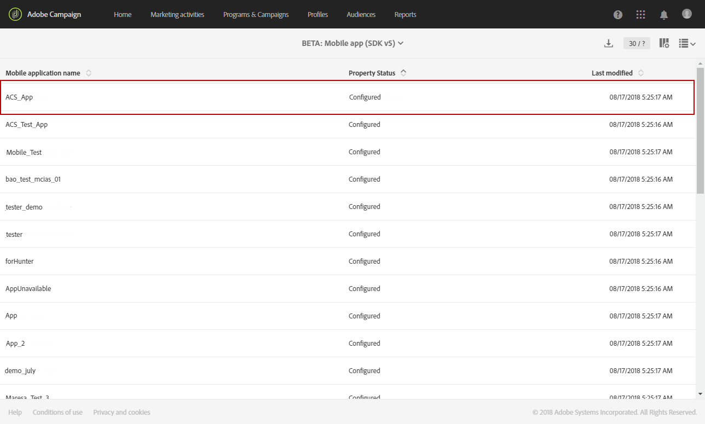
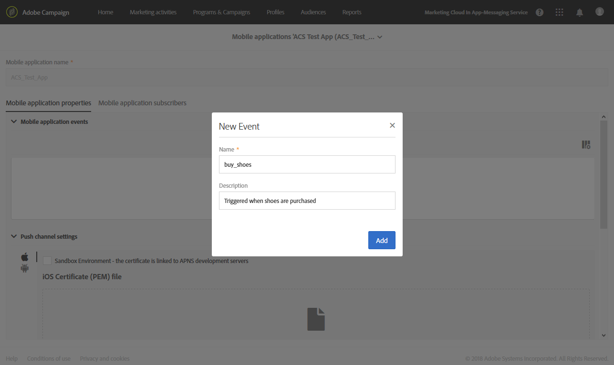
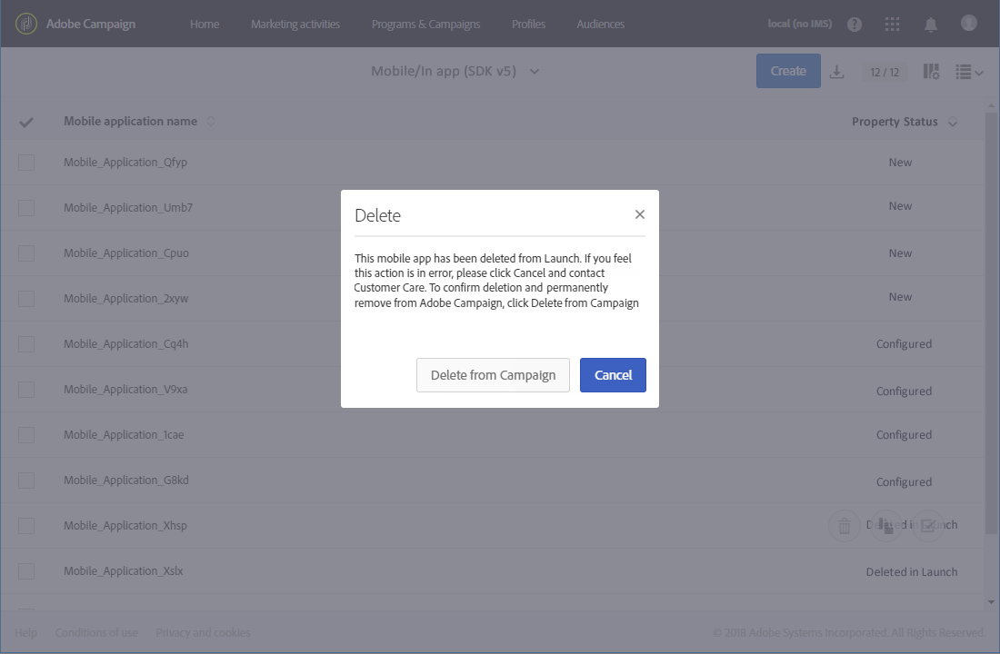

# モバイルアプリケーションの設定{#configuring-a-mobile-application}

## Adobe Experience Platform SDKを使用したモバイルアプリケーションの設定 {#using-adobe-experience-platform-sdk}

>[!IMPORTANT]
>
> Adobe Experience Platform Launchは、Adobe Experience Platformのデータ収集テクノロジースイートとしてリブランドされました。 これにより、製品ドキュメント全体で、いくつかの用語が変更されました。 用語の変更の統合参照については、[次のドキュメント ](https://experienceleague.adobe.com/docs/experience-platform/tags/term-updates.html){target="_blank"}を参照してください。

プッシュ通知とアプリ内実装は、エキスパートユーザーが実行する必要があることに注意してください。 詳しくは、Adobe アカウントの担当者またはプロフェッショナルサービスパートナーにお問い合わせください。

Experience Platform SDK アプリケーションを使用してプッシュ通知やアプリ内メッセージを送信するには、モバイルアプリケーションをData Collection UIで設定し、Adobe Campaignで設定する必要があります。

モバイルアプリケーションを設定すると、収集したPII データを取得して、データベースからプロファイルを作成または更新できます。 詳しくは、この節「[ モバイルアプリケーションデータに基づくプロファイル情報の作成と更新](../../channels/using/updating-profile-with-mobile-app-data.md)」を参照してください。

Adobe Experience Platform SDKを使用してAdobe Campaign Standardでサポートされているさまざまなモバイルユースケースについて詳しくは、この[ ページ ](../../administration/using/supported-mobile-use-cases.md)を参照してください。

設定を完了するには、次の手順を実行します。

1. Adobe Campaignで、次のアクセス権を持っていることを確認します。
   * **[!UICONTROL Push notification]**
   * **[!UICONTROL In-App message]**
   * **[!UICONTROL Adobe Places]**

   そうでない場合は、アカウントチームにお問い合わせください。

1. Adobe Experience PlatformのAdobe Campaign Standardとタグで、ユーザーが必要な権限を持っていることを確認します。

   * Adobe Campaign Standardで、IMS ユーザーが標準ユーザーおよび管理者製品プロファイルの一部であることを確認します。 この手順では、ユーザーはAdobe Campaign Standardにログインし、Experience Platform SDK モバイルアプリページに移動して、データ収集UIで作成したモバイルアプリプロパティを表示できます。

   * データ収集UIで、IMS ユーザーがExperience Platform Launch製品プロファイルの一部であることを確認します。
この手順では、ユーザーはデータ収集UIにログインして、プロパティを作成および表示できます。 データ収集UIの製品プロファイルについて詳しくは、[製品プロファイルの作成](https://experienceleague.adobe.com/docs/experience-platform/tags/admin/manage-permissions.html#gain-admin-rights-for-a-tags-product-profile)を参照してください。 製品プロファイルでは、会社またはプロパティに対して権限が設定されていないことが必要ですが、ユーザーはログインできます。

   拡張機能のインストール、アプリの公開、環境の設定など、追加のタスクを完了するには、製品プロファイルで権限を設定する必要があります。

1. データ収集UIで、**[!UICONTROL Mobile property]**&#x200B;を作成します。 詳しくは、[モバイルプロパティの設定](https://developer.adobe.com/client-sdks/documentation/getting-started/create-a-mobile-property)を参照してください。

1. データ収集UIで「**[!UICONTROL Extensions]**」タブをクリックし、**[!UICONTROL Catalog]**&#x200B;に移動して、**[!UICONTROL Adobe Campaign Standard]**&#x200B;拡張機能を検索します。 詳しくは、[Adobe Campaign Standard](https://developer.adobe.com/client-sdks/documentation/adobe-campaign-standard)を参照してください。

1. Campaign Standardの場所のユースケースをサポートするには、Data Collection UIに&#x200B;**[!UICONTROL Places]**&#x200B;拡張機能をインストールします。 詳しくは、この[ページ](https://developer.adobe.com/client-sdks/solution/places)を参照してください。

1. Adobe Campaign Standardで、データ収集UIで作成したモバイルプロパティを設定します。 Adobe CampaignでのAdobe Experience Platform Launch アプリケーションの設定[を参照してください](../../administration/using/configuring-a-mobile-application.md#set-up-campaign)。

1. チャネル固有の設定をモバイルアプリケーション設定に追加します。
詳しくは、[Adobe Campaign のチャネル固有のアプリケーション設定](../../administration/using/configuring-a-mobile-application.md#channel-specific-config)を参照してください。

1. 必要に応じて、タグプロパティを削除できます。
詳しくは、[ アプリケーションの削除](../../administration/using/configuring-a-mobile-application.md#delete-app)を参照してください。

## Launch テクニカルワークフローからモバイルアプリ AEPSDKを同期 {#aepsdk-workflow}

データ収集UIでモバイルプロパティを作成および設定した後、**[!UICONTROL Sync Mobile app AEPSDK from Launch]**&#x200B;のテクニカルワークフローが、Adobe Campaign Standardで読み込まれたタグモバイルプロパティを同期するようになりました。

デフォルトでは、テクニカルワークフローは15分ごとに開始されます。 必要に応じて、手動で再起動できます。

1. Adobe Campaign Standardの詳細設定メニューで、**[!UICONTROL Administration]** > **[!UICONTROL Application Settings]** > **[!UICONTROL Workflows]**&#x200B;を選択します。
1. **[!UICONTROL Sync Mobile app AEPSDK from Launch (syncWithLaunch)]** ワークフローを開きます。

   

1. 「**[!UICONTROL Scheduler]**」アクティビティをクリックします。

1. 「**[!UICONTROL Immediate execution]**」を選択します。

   

ワークフローが再起動し、Adobe Campaign Standardに読み込まれたタグモバイルプロパティが同期されます。

## Adobe Campaignでのアプリケーションの設定 {#set-up-campaign}

Campaignでタグモバイルプロパティを使用するには、このプロパティをAdobe Campaignでも設定する必要があります。 Adobe Campaignで、IMS ユーザーが標準ユーザーおよび管理者製品プロファイルの一部であることを確認します。

テクニカルワークフローが実行されるのを待ち、タグモバイルプロパティをAdobe Campaignに同期する必要があります。 その後、Adobe Campaignで設定できます。

Launch テクニカルワークフローからのモバイルアプリ AEPSDKの同期について詳しくは、この[ セクション ](../../administration/using/configuring-a-mobile-application.md#aepsdk-workflow)を参照してください。

>[!NOTE]
>
>デフォルトでは、組織単位がALLに設定されている管理者は、モバイルアプリケーションを編集できます。

1. 詳細設定メニューから、**[!UICONTROL Administration]** > **[!UICONTROL Channels]** > **[!UICONTROL Mobile app (AEP SDK)]**&#x200B;を選択します。

   

1. データ収集UIで作成したモバイルアプリケーションを選択します。
**[!UICONTROL Property Status]**&#x200B;は&#x200B;**[!UICONTROL Ready to configure]**&#x200B;である必要があります。

   >[!NOTE]
   >
   >デフォルトでは、Data Collection UIで作成されたモバイルアプリケーションのリストを取得するために、Campaign StandardはNmsServer_URL オプションで定義された値を使用して、一致するプロパティを検索します。
   >
   >場合によっては、モバイルアプリケーションのCampaign エンドポイントが、NmsServer_URLで定義されているものと異なる場合があります。 その場合、`Launch_URL_Campaign` オプションでエンドポイントを定義します。 Campaignは、このオプションの値を使用して、データ収集UIで一致するプロパティを検索します。

   

1. モバイルアプリケーションの組織単位を&#x200B;**[!UICONTROL Access Authorization]** セクションで変更して、このモバイルアプリケーションへのアクセスを特定の組織単位に制限できます。 詳しくは、このページを参照してください。

   ここでは、管理者はドロップダウンからサブ組織ユニットを選択して割り当てることができます。

   

1. Adobe Experience PlatformでCampaignとタグを関連付けるには、**[!UICONTROL Save]**&#x200B;をクリックします。

1. モバイルアプリのステータスが&#x200B;**[!UICONTROL Ready to Configure]**&#x200B;から&#x200B;**[!UICONTROL Configured]**&#x200B;に変更されたことを確認します。

   Campaign拡張機能でキーが正常に設定されたことが示された場合は、Campaignでプロパティが正常に設定されたかどうかも確認できます。

   

1. この設定を有効にするには、変更をデータ収集UIで公開する必要があります。

   詳しくは、[設定の公開](https://developer.adobe.com/client-sdks/documentation/getting-started/create-a-mobile-property/#publish-the-configuration)を参照してください

## Adobe Campaignのチャネル固有のアプリケーション設定 {#channel-specific-config}

これで、モバイルアプリケーションをCampaignでプッシュ通知またはアプリ内配信に使用する準備が整いました。 必要に応じて、アプリ内メッセージをトリガーしたり、プッシュ証明書をアップロードしたりするイベントを作成するために、さらに設定できるようになりました。

1. 詳細設定メニューから、**[!UICONTROL Administration]** > **[!UICONTROL Channels]** > **[!UICONTROL Mobile app (AEP SDK)]**&#x200B;を選択します。

1. データ収集UIで作成および設定したモバイルアプリケーションを選択します。

1. 「**[!UICONTROL Mobile application properties]**」タブで、モバイルアプリケーションでアプリ内メッセージに使用できるイベントの追加を開始できます。

1. イベントを設定するには、**[!UICONTROL Create Element]**&#x200B;をクリックします。

   

1. 名前と説明を入力します。

   

1. 「**[!UICONTROL Add]**」をクリックします。

   アプリ内メッセージの作成時に、「トリガー」タブでイベントを利用できるようになりました。 詳しくは、[ アプリ内メッセージの準備と送信](../../channels/using/preparing-and-sending-an-in-app-message.md)を参照してください。

1. モバイルアプリケーションダッシュボードの&#x200B;**[!UICONTROL Device-specific settings]** セクションで、各デバイスに対してアプリケーションの詳細を指定します。

   +++ IOSの場合

   次のアプリケーションの詳細を入力します。

   * **アプリ ID （iOS バンドル ID）**: バンドル IDの詳細については、[Apple ドキュメント ](https://developer.apple.com/documentation/appstoreconnectapi/bundle_ids){target="_blank"}を参照してください。
   * **iOS証明書（P8） ファイル**: .p8認証キーをドラッグ&amp;ドロップします。 .p8認証ファイルを生成する方法については、[Apple開発者アカウント ](https://developer.apple.com/account/ios/authkey/create){target="_blank"}を参照してください。
   * **キーID**: キーIDについて詳しくは、[Apple ドキュメント ](https://developer.apple.com/help/account/manage-keys/get-a-key-identifier/){target="_blank"}を参照してください。
   * **iOS チーム ID**: iOS チーム IDの詳細については、[Apple ドキュメント ](https://developer.apple.com/help/account/manage-your-team/locate-your-team-id/){target="_blank"}を参照してください。

     
   +++

   +++ Android の場合

   次のアプリケーションの詳細を入力します。

   * **アプリ ID （Android パッケージ名）**: パッケージ名について詳しくは、[Android ドキュメント ](https://support.google.com/admob/answer/9972781?hl=en#:~:text=The%20package%20name%20of%20an,supported%20third%2Dparty%20Android%20stores){target="_blank"}を参照してください。
   * **Android キー（Json） ファイル**:.json秘密鍵ファイルをドラッグ&amp;ドロップします。 .json秘密鍵ファイルを生成する方法については、[Firebase](https://firebase.google.com/docs/admin/setup#initialize_the_sdk_in_non-google_environments){target="_blank"}の開発者ドキュメントを参照してください。

     
   +++

1. 証明書をアップロードすると、アップロードが成功したことを通知するメッセージが表示され、証明書の有効期限が表示されます。

1. 「**[!UICONTROL Mobile application subscribers]**」タブをクリックして、購読者のリストと、これらの購読者に関するその他の情報（通知をオプトアウトしたかどうかに関する情報など）を表示します。

## アプリケーションの削除 {#delete-app}

>[!CAUTION]
>
>アプリケーションの削除を元に戻すことはできません。

アプリケーションを削除するには、[ モバイルプロパティの削除](https://developer.adobe.com/client-sdks/documentation/adobe-campaign-standard/#deleting-mobile-properties-in-the-data-collection-ui)の手順を実行します。

アプリケーションを削除した後、Adobe Campaignで、アプリケーションのプロパティステータスがLaunchの「削除済み」に正しく更新されているかどうかを確認します。

Adobe Campaignでアプリケーションをクリックすると、「Campaignから削除」をクリックして、このアプリケーションをAdobe Campaignから完全に削除できます。

