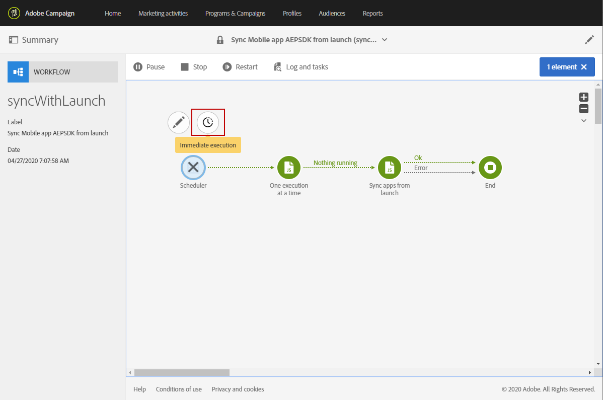

# モバイルアプリケーションの設定{#configuring-a-mobile-application}

## Adobe Experience Platform SDK を使用したモバイルアプリケーションの設定 {#using-adobe-experience-platform-sdk}

>[!IMPORTANT]
>
> Adobe Experience Platform Launchは、Adobe Experience Platformのデータ収集テクノロジーのスイートとしてリブランドされました。 その結果、製品ドキュメント全体でいくつかの用語の変更がロールアウトされました。 詳しくは、 [次の文書](https://experienceleague.adobe.com/docs/experience-platform/tags/term-updates.html) 用語の変更を統合的に参照する場合。

プッシュ通知およびアプリ内実装は、エキスパートユーザーが実行する必要があります。 不明な点は、担当のAdobeアカウントエグゼクティブまたはプロフェッショナルサービスパートナーにお問い合わせください。

Experience PlatformSDK アプリケーションでプッシュ通知とアプリ内メッセージを送信するには、モバイルアプリケーションをデータ収集 UI で設定し、Adobe Campaignで設定する必要があります。

モバイルアプリケーションを設定したら、収集した PII データを取得して、データベースからプロファイルを作成または更新できます。 詳しくは、この節を参照してください。 [モバイルアプリケーションデータに基づくプロファイル情報の作成と更新](../../channels/using/updating-profile-with-mobile-app-data.md).

Adobe Experience Platform SDK を使用してAdobe Campaign Standardでサポートされる様々なモバイル使用例について詳しくは、こちらを参照してください。 [ページ](../../administration/using/supported-mobile-use-cases.md).

設定を完了するには、次の手順を実行します。

1. Adobe Campaignで、次にアクセスできることを確認します。
   * **[!UICONTROL Push notification]**
   * **[!UICONTROL In-App message]**
   * **[!UICONTROL Adobe Places]**

   そうでない場合は、アカウントチームにお問い合わせください。

1. ユーザーがAdobe Campaign Standardで必要な権限を持っていて、Adobe Experience Platformでタグを付けていることを確認します。
   * Adobe Campaign Standardで、IMS ユーザーが Standard User および Administrator 製品プロファイルに含まれていることを確認します。 この手順を使用すると、ユーザーはAdobe Campaign Standardにログインし、Experience PlatformSDK モバイルアプリページに移動して、データ収集 UI で作成したモバイルアプリのプロパティを表示できます。

   * データ収集 UI で、IMS ユーザーが製品プロファイルに含まれていることをExperience Platform Launchします。
この手順では、ユーザーはデータ収集 UI にログインして、プロパティを作成および表示できます。 データ収集 UI の製品プロファイルについて詳しくは、 [製品プロファイルの作成](https://experienceleague.adobe.com/docs/experience-platform/tags/admin/manage-permissions.html#gain-admin-rights-for-a-tags-product-profile). 製品プロファイルには、会社やプロパティに対する権限は設定されていませんが、ユーザーは引き続きログインできます。

   拡張機能のインストール、アプリの公開、環境の設定などの追加のタスクを完了するには、製品プロファイルに権限を設定する必要があります。

1. データ収集 UI で、 **[!UICONTROL Mobile property]**. 詳しくは、[モバイルプロパティの設定](https://developer.adobe.com/client-sdks/documentation/getting-started/create-a-mobile-property)を参照してください。

1. データ収集 UI で、 **[!UICONTROL Extensions]** タブ、移動 **[!UICONTROL Catalog]**&#x200B;を検索し、 **[!UICONTROL Adobe Campaign Standard]** 拡張子。 詳しくは、 [Adobe Campaign Standard](https://developer.adobe.com/client-sdks/documentation/adobe-campaign-standard).

1. 場所の使用例をサポートするには、Campaign Standardで **[!UICONTROL Places]** 拡張機能を使用して、データ収集 UI に追加できます。 この[ページ](https://developer.adobe.com/client-sdks/solution/places)を参照してください。

1. Adobe Campaign Standardで、データ収集 UI で作成したモバイルプロパティを設定します。 参照： [Adobe CampaignでのAdobe Experience Platform Launchアプリケーションの設定](../../administration/using/configuring-a-mobile-application.md#set-up-campaign).

1. モバイルアプリケーションの設定にチャネル固有の設定を追加します。
詳しくは、[Adobe Campaign のチャネル固有のアプリケーション設定](../../administration/using/configuring-a-mobile-application.md#channel-specific-config)を参照してください。

1. 必要に応じて、タグプロパティを削除できます。
詳しくは、 [アプリケーションの削除](../../administration/using/configuring-a-mobile-application.md#delete-app).

## Launch からのモバイルアプリ AEPSDK の同期テクニカルワークフロー {#aepsdk-workflow}

データ収集 UI でモバイルプロパティを作成して設定した後、 **[!UICONTROL Sync Mobile app AEPSDK from Launch]** テクニカルワークフローは、Adobe Campaign Standardで読み込まれたタグモバイルプロパティを同期します。

デフォルトでは、テクニカルワークフローは 15 分ごとに開始されます。 必要に応じて、手動で再起動できます。

1. Adobe Campaign Standardの詳細設定メニューで、「 」を選択します。 **[!UICONTROL Administration]** > **[!UICONTROL Application Settings]** > **[!UICONTROL Workflows]**.
1. を開きます。 **[!UICONTROL Sync Mobile app AEPSDK from Launch (syncWithLaunch)]** ワークフロー。

   

1. をクリックします。 **[!UICONTROL Scheduler]** アクティビティ。

1. 「**[!UICONTROL Immediate execution]**」を選択します。

   

これで、ワークフローが再起動し、Adobe Campaign Standardで読み込まれたタグモバイルプロパティが同期されます。

## Adobe Campaignでのアプリケーションの設定 {#set-up-campaign}

Campaign でタグモバイルプロパティを使用するには、Adobe Campaignでもこのプロパティを設定する必要があります。 Adobe Campaignで、IMS ユーザーが Standard User および Administrator 製品プロファイルに含まれていることを確認します。

テクニカルワークフローが実行され、モバイルタグのプロパティがAdobe Campaignに同期されるまで待つ必要があります。 その後、Adobe Campaignで設定できます。

Launch からのモバイルアプリ AEPSDK の同期テクニカルワークフローについて詳しくは、これを参照してください。 [セクション](../../administration/using/configuring-a-mobile-application.md#aepsdk-workflow).

>[!NOTE]
>
>デフォルトでは、組織単位が「すべて」に設定されている管理者は、モバイルアプリケーションを編集できます。

1. 詳細設定メニューから、「 」を選択します。 **[!UICONTROL Administration]** > **[!UICONTROL Channels]** > **[!UICONTROL Mobile app (AEP SDK)]**.

   

1. データ収集 UI で作成したモバイルアプリを選択します。
Its **[!UICONTROL Property Status]** は、 **[!UICONTROL Ready to configure]**.

   >[!NOTE]
   >
   >デフォルトでは、データ収集 UI で作成されたモバイルアプリケーションのリストを取得するために、Campaign Standardは NmsServer_URL オプションで定義された値を使用して、一致するプロパティを探します。
   >
   >場合によっては、モバイルアプリケーションの Campaign エンドポイントが NmsServer_URL で定義されたエンドポイントと異なることがあります。 その場合は、 `Launch_URL_Campaign` オプション。 Campaign は、このオプションの値を使用して、データ収集 UI で一致するプロパティを探します。

   

1. モバイルアプリケーションの組織単位は、 **[!UICONTROL Access Authorization]** セクションを使用して、このモバイルアプリケーションへのアクセスを特定の組織単位に制限します。 詳しくは、このページを参照してください。

   ここでは、管理者がドロップダウンから選択して、サブ組織単位を割り当てることができます。

   

1. Adobe Experience Platformで Campaign とタグを接続するには、 **[!UICONTROL Save]**.

1. モバイルアプリのステータスが **[!UICONTROL Ready to Configure]** から **[!UICONTROL Configured]**.

   Campaign 拡張機能でキーが正常に設定されたことが示されたら、Campaign でプロパティが正常に設定されたことを確認することもできます。

   

1. この設定を有効にするには、変更をデータ収集 UI で公開する必要があります。

   詳しくは、 [公開設定](https://developer.adobe.com/client-sdks/documentation/getting-started/create-a-mobile-property/#publish-the-configuration)

## Adobe Campaignでのチャネル固有のアプリケーション設定 {#channel-specific-config}

これで、モバイルアプリケーションを Campaign でプッシュ通知やアプリ内配信に使用する準備が整いました。 必要に応じて、アプリ内メッセージをトリガーするイベントを作成したり、プッシュ証明書をアップロードしたりするために、さらに設定できるようになりました。

1. 詳細設定メニューから、「 」を選択します。 **[!UICONTROL Administration]** > **[!UICONTROL Channels]** > **[!UICONTROL Mobile app (AEP SDK)]**.

1. データ収集 UI で作成および設定したモバイルアプリケーションを選択します。

1. 次の日： **[!UICONTROL Mobile application properties]** 「 」タブを使用して、モバイルアプリケーションでアプリ内メッセージに使用できるイベントの追加を開始できます。

1. イベントを設定するには、 **[!UICONTROL Create Element]**.

   

1. 名前と説明を入力します。

   

1. 「**[!UICONTROL Add]**」をクリックします。

   イベントは、アプリ内メッセージの作成時に「トリガー」タブで使用できるようになりました。 詳しくは、 [アプリ内メッセージの準備と送信](../../channels/using/preparing-and-sending-an-in-app-message.md).

1. Adobe Analytics の **[!UICONTROL Device-specific settings]** モバイルアプリケーションダッシュボードの「 」セクションで、各デバイスに対してアプリケーションの詳細を指定します。

   * +++ iOS向け

     次のアプリケーションの詳細を入力します。

      * **アプリ ID (iOS Bundle ID)**：を参照してください。 [Appleドキュメント](https://developer.apple.com/documentation/appstoreconnectapi/bundle_ids) バンドル ID の詳細を参照してください。
      * **iOS証明書 (P8) ファイル**: .p8 認証キーをドラッグ&amp;ドロップします。
      * **キー ID**：を参照してください。 [Appleドキュメント](https://developer.apple.com/help/account/manage-keys/get-a-key-identifier/) を参照してください。
      * **iOS Team ID**：を参照してください。 [Appleドキュメント](https://developer.apple.com/help/account/manage-your-team/locate-your-team-id//) を参照してください。iOS Team ID の詳細については、を参照してください。

        
+++

   * +++ Android の場合

     次のアプリケーションの詳細を入力します。

      * **アプリ ID （Android パッケージ名）**：を参照してください。 [Android ドキュメント](https://support.google.com/admob/answer/9972781?hl=en#:~:text=The%20package%20name%20of%20an,supported%20third%2Dparty%20Android%20stores) を参照してください。
      * **Android キー (Json) ファイル**: .json 秘密鍵ファイルをドラッグ&amp;ドロップします。

        
+++

1. 証明書がアップロードされると、アップロードが成功したことを示すメッセージが表示され、証明書の有効期限が表示されます。

1. 次をクリック： **[!UICONTROL Mobile application subscribers]** 「 」タブを使用して、購読者のリストと、これらの購読者に関するその他の情報（通知をオプトアウトしたかどうかなど）を確認できます。

## アプリケーションの削除 {#delete-app}

>[!CAUTION]
>
>アプリケーションの削除を元に戻すことはできません。

アプリケーションを削除するには、 [モバイルプロパティの削除](https://developer.adobe.com/client-sdks/documentation/adobe-campaign-standard/#deleting-mobile-properties-in-the-data-collection-ui).

アプリケーションを削除した後、Adobe Campaignで、アプリケーションのプロパティのステータスが Launch で正しく「削除済み」に更新されているかどうかを確認します。

Adobe Campaignでアプリをクリックすることで、「 Campaign から削除」をクリックして、Adobe Campaignからこのアプリを完全に削除するよう選択できます。

