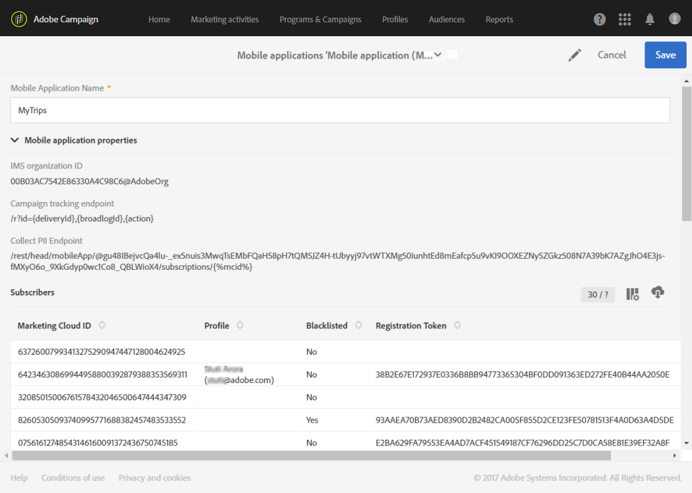

# モバイルアプリケーションの設定{#configuring-a-mobile-application}

使用するチャネルに応じてAdobe Campaign Standardで設定する必要があるモバイルアプリケーションで、プッシュ通知またはアプリ内メッセージが受信されます。

* アプリ内メッセージとプッシュ通知を送信するには、Adobe Experience Platform SDKを利用して、モバイルアプリケーションをAdobe Campaignで設定する必要があります。 詳しくは、 [Adobe Experience Platform SDKの使用を参照してください](#using-adobe-experience-platform-sdk)。

* プッシュ通知のみを送信するには、SDK V4を使用してAdobe CampaignとAdobe Mobile Serviceの統合を設定します。 SDK V4 [の使用を参照してください](#using-sdk-v4)。

Experience Cloud Mobile SDK V4またはExperience Platform SDKを利用してAdobe Campaignでモバイルアプリを設定したら、/メニューで管理者が設定する必要があ [!UICONTROL Administration] り [!UICONTROL Channels] ま [!UICONTROL Mobile app] す。

>[!CAUTION]
>
>プッシュ通知とアプリ内実装は、エキスパートユーザーが実行する必要があります。 支援が必要な場合は、アドビアカウントエグゼクティブまたはプロフェッショナルサービスパートナーにお問い合わせください。

モバイルアプリケーションの設定が完了すると、収集したPIIデータを取得して、データベースからプロファイルを作成または更新できます。 詳しくは、次の節を参照してください。モバイ [ルアプリケーションデータに基づくプロファイル情報の作成と更新](../../channels/using/updating-profile-with-mobile-app-data.md)。

## Adobe Experience Platform SDKの使用 {#using-adobe-experience-platform-sdk}

>[!N注]
>
>Adobe Experience Platform SDKを使用してAdobe Campaign Standardでサポートされる様々なモバイル使用例について詳しくは、このページを参照してく [ださい](https://helpx.adobe.com/campaign/kb/configure-launch-rules-acs-use-cases.html)。

Experience Platform SDKアプリケーションでプッシュ通知とアプリ内メッセージを送信するには、モバイルアプリケーションをAdobe Experience Platform Experience Platform Launchで設定し、Adobe Campaignで設定する必要があります。 Experience Platform SDKを使用してモバイルアプリケーションを設定する手順について詳しくは、このページを参照してく [ださい](https://helpx.adobe.com/campaign/kb/configuring-app-sdkv4.html)。

次の手順に従って設定を開始します。

1. チャネルにアクセスできることを確認し **[!UICONTROL Mobile]** ます。Adobe Campaignのプッシュ通知とアプリ内メッセージを参照してください。 そうでない場合は、アカウントチームにお問い合わせください。

   

1. Mobileタイプのプロパティを作成して、Experience Platform Launchでモバイルアプリケーションを作成します。 詳しくは、 [Experience Platform Launchのドキュメントを参照](https://aep-sdks.gitbook.io/docs/getting-started/create-a-mobile-property#create-a-new-mobile-property) してください。
1. Experience Platform Launchにモバ **[!UICONTROL Adobe Campaign Standard]** イルアプリケーション用の拡張機能をインストールします。

   拡張機能について詳しくは、『 [Experience Platform Launch』ドキュメントを参照してください](https://aep-sdks.gitbook.io/docs/using-mobile-extensions/adobe-campaign-standard) 。

1. Adobe Launchでのアプリケーションのルールの設定については、「Launchでのアプリケ [ーションの設定」を参照してください](https://helpx.adobe.com/campaign/kb/config-app-in-launch.html#Step1Createdataelements)
1. Adobe Campaign StandardでAdobe Launchアプリケーションを設定する方法については、「Adobe CampaignでのAdobe Launch [アプリケーションの設定」を参照してください](https://helpx.adobe.com/campaign/kb/configuring-app-sdk.html#SettingupyourAdobeLaunchapplicationinAdobeCampaign)。
1. モバイルアプリケーションの設定にチャネル固有の設定を追加します。詳しくは、Adobe Campaign [でのチャネル固有のアプリケーション設定を参照してください](https://helpx.adobe.com/campaign/kb/configuring-app-sdk.html#ChannelspecificapplicationconfigurationinAdobeCampaign)。

   

## SDK V4の使用 {#using-sdk-v4}

アプリ内とは異なり、プッシュ通知はSDK V4およびAdobe Experience Platform SDKでサポートされます。 モバイルアプリでプッシュ通知を使用する詳しい手順については、このページを参照してく [ださい](https://helpx.adobe.com/campaign/kb/configuring-app-sdkv4.html)。

プッシュ通知を受信するモバイルアプリケーションは、管理者がAdobe Campaignインターフェイスで設定する必要があります。 Adobe CampaignとAdobe Mobile Servicesの両方を設定すると、モバイルアプリのデータをキャンペーンに使用できます。

プッシュ通知を送信するには、次の操作を行う必要があります。

1. Adobe Campaignでチャネルにアクセスできるこ **[!UICONTROL Mobile app]** とを確認してください。
1. モバイルアプリケーションの設定：

   * [Adobe Campaign](https://helpx.adobe.com/campaign/kb/configuring-app-sdkv4.html#SettingupamobileapplicationinAdobeCampaign).
   * [Adobe Mobile Services](https://helpx.adobe.com/campaign/kb/configuring-app-sdkv4.html#ConfiguringamobileapplicationinAdobeMobileServices)。

1. モバイルアプリケーション固有の設定を実行します。

   * Adobe Mobile Servicesインターフェイスからダウンロードした設定ファイルをモバイルアプリケーションにパッケージ化します。
   * Experience Cloud Mobile SDKをモバイルアプリケーションに統合します。

1. アプリのサブスクリプションから収集するデータを定義します。 Adobe Campaignデータベースにプロファイルを持つモバイルアプリケーションのサブスクリプションは、定義した条件に基づいて調整されます。

   詳しくは、この[ページ](https://helpx.adobe.com/campaign/kb/configuring-app-sdkv4.html#Collectingsubscribersdatafromamobileapplication)を参照してください。

1. デバイスでモバイルアプリケーションを起動し、ログインして、設定が正常に完了していることを確認します。 通知の受信をオプトインしていることを確認します。
1. 次に、Adobe Campaignのアドバンスメニューで//を選 **[!UICONTROL Administration]** 択し **[!UICONTROL Channels]** ます **[!UICONTROL Mobile app]**。
1. リストからモバイルアプリを選択し、そのプロパティを表示します。 購読情報が購読者リストの下に表示されます。

   

1. プロファイルが登録しているモバイルアプリケーションを確認するには、メニ **[!UICONTROL Profiles & Audiences > Profiles]** ューでプロファイルを選択し、右側のボタン **[!UICONTROL Edit profile properties]** をクリックします。 タブにモバイルアプリが表示さ **[!UICONTROL Mobile App Subscriptions]** れます。

   