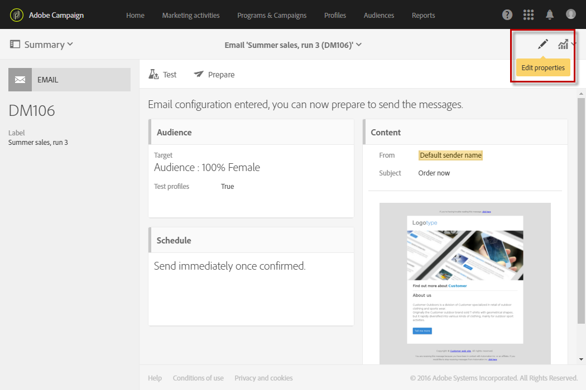

# 電子メールチャネルの設定{#configuring-email-channel}

Campaign [管理者](../../administration/using/users-management.md#functional-administrators)は、メールチャネルを設定できます。これらの詳細設定には、一般的なメールチャネルパラメーター、メールルーティングアカウント、メール処理ルールおよびメールのプロパティが含まれます。このページでは、一般的なメールおよび送信パラメーターのデフォルト値を編集する方法について説明します。

## メールチャネルのパラメーター {#email-channel-parameters}

メール設定画面では、メールチャネルのパラメーターを定義できます。管理者は、**[!UICONTROL Administration]／[!UICONTROL Channels]／[!UICONTROL Email]／[!UICONTROL Configuration]**&#x200B;メニューから、これらの設定にアクセスできます。

* **許可されたマスクフィールド**

  「**[!UICONTROL Header parameters of sent emails]**」セクションには、承認されたメールアドレスが一覧表示されます。このメールアドレスを使用して、受信者にメールを送信したり、非同期バウンス、不在返信など（エラーアドレス）。

  Adobe Campaign は、メッセージの準備段階で、入力されたアドレスが有効であるかどうかを確認します。この動作モードでは、配信品質の問題を引き起こす可能性のあるアドレスを一切使用しないようにします。

   * 送信者アドレスとエラーアドレスの両方は Adobe が設定します。これらのフィールドは空にできません。
   * これらのフィールドは編集できません。住所を更新する場合は、Adobe カスタマーケアチームにお問い合わせください。
   * 別のアドレスを追加する場合は、[Campaign Campaign コントロールパネル](https://experienceleague.adobe.com/docs/control-panel/using/subdomains-and-certificates/setting-up-new-subdomain.html?lang=ja) を使用して新しいサブドメインを設定するか、Adobeカスタマーケアチームにお問い合わせください。 複数のマスクを使用する場合は、コンマで区切ります。
   * **@yourdomain.com** などの星を使用してアドレスを設定することをお勧めします。これにより、サブドメイン名で終わる任意のアドレスを使用できます。

* **配信品質**

  **[!UICONTROL Delivery reports ID]**&#x200B;は、Adobe カスタマーケアチームによって提供されます。これは、技術的な配信品質レポートで使用される配信品質 ID で各インスタンスを識別します。
  <!--The Technical Deliverability report is not accessible through the UI in ACS. It will be replaced with 250ok in the future (project starting).-->

* **配信パラメーター**

  Adobe Campaignが開始日にメッセージを送信します。

  一時的なエラーまたはソフトバウンスが原因で配信内のメッセージが拒否されると、Campaign は毎日このメッセージの送信を再試行します。 **[!UICONTROL Message delivery duration]** フィールドを使用して、再試行中に発生する可能性のある期間を指定します。

  >[!IMPORTANT]
  >
  >**Campaign のこのパラメーターは、3.5 日以下に設定した場合にのみ使用されるようになりました。** 3.5 日を超える値を定義した場合、その値は考慮されません。

  「**[!UICONTROL Online resources validity duration]**」フィールドは、アップロードされたリソース（主にミラーページと画像）に関して使用されます。ディスクスペースを節約するために、このページ上のリソースが有効な期間は限られています。

* **再試行**

  一時的に配信できなかったメッセージは、自動再試行の対象となります。詳しくは、[一時的な配信エラーの後の再試行](../../sending/using/understanding-delivery-failures.md#retries-after-a-delivery-temporary-failure)を参照してください。

  >[!IMPORTANT]
  >
  >実行される再試行の最大数と再試行間の最小遅延は、現在、特定のドメインで IP が過去と現在の両方でどの程度機能しているかに基づいています。 Campaign の **[!UICONTROL Retry period]** 設定と **[!UICONTROL Number of retries]** 設定は無視されます。

  <!--This section indicates how many retries should be performed the day after the send is started (**Number of retries**) and the minimum delay between retries (**Retry period**). By default, five retries are scheduled for the first day with a minimum interval of one hour, spread out over the 24 hours of the day. One retry per day is programmed after that and until the delivery deadline, which is defined in the **[!UICONTROL Delivery parameters]** section.-->

* **メール強制隔離のパラメーター**

  「**[!UICONTROL Time between two significant errors]**」フィールドに値を入力して、ソフトバウンスのエラーが発生した場合にエラーカウンターを増やすまでのアプリケーションの待機時間を定義します。デフォルト値は「**1d**」（1 日）です。

  **[!UICONTROL Maximum number of errors before quarantine]**&#x200B;値に達すると、メールアドレスが隔離されます。デフォルト値は **&quot;5&quot;** です。アドレスは 5 回目のエラーで強制隔離されます。 これは、連絡先が後続の配信から自動的に除外されることを意味します。
  <!--Actually the way ACS works is that the address is already on the quarantine list on the first bounce, but with a different status meaning that the error count has started.-->

  強制隔離について詳しくは、[強制隔離管理の理解](../../sending/using/understanding-quarantine-management.md)を参照してください。

## メールルーティングアカウント {#email-routing-accounts}

デフォルトでは、**[!UICONTROL Integrated email routing]**&#x200B;外部アカウントが提供されます。アプリケーションからメールを送信するための技術的なパラメーターが含まれます。

アカウントタイプは常に&#x200B;**[!UICONTROL Routing]**&#x200B;に、チャネルは&#x200B;**[!UICONTROL Email]**&#x200B;に、配信モードは&#x200B;**[!UICONTROL Bulk delivery]**&#x200B;に設定されている必要があります。

**関連トピック**：

[外部アカウント](../../administration/using/external-accounts.md)

## メール処理ルール {#email-processing-rules}

管理者は、**[!UICONTROL Administration > Channels > Email]**&#x200B;メニューから&#x200B;**[!UICONTROL Email processing rules]**&#x200B;にアクセスできます。

>[!IMPORTANT]
>
>メールドメインと MX ルールが自動的に管理されるようになり <!--by the Adobe Campaign Enhanced MTA (Message Transfer Agent)--> 変更できなくなりました。

* **DKIM （DomainKeys Identified Mail）** 電子メール認証の署名は、すべてのドメインを使用するすべてのメッセージに対して行われます。 **送信者 ID**、**DomainKeys** または **S/MIME** は使用しません。
* MX ルールは、独自のメールレピュテーション履歴およびメールを送信しているドメインから送信されるリアルタイムのフィードバックに基づいて、ドメイン別にスループットを自動的にカスタマイズします。

<!--Note that the email domains and the MX rules are now managed by the Adobe Campaign Enhanced MTA:
* **DKIM (DomainKeys Identified Mail)** email authentication signing is done by the Enhanced MTA for all messages with all domains. It does not sign with **Sender ID**, **DomainKeys**, or **S/MIME** unless otherwise specified at the Enhanced MTA level.
* The Enhanced MTA uses its own MX rules that allow it to customize your throughput by domain based on your own historical email reputation, and on the real-time feedback coming from the domains where you are sending emails.-->

### バウンスメール {#bounce-mails}

非同期バウンスは、引き続き、**[!UICONTROL Bounce mails]**&#x200B;ルールを通じて Campaign inMail プロセスで選定されます。

これらのルールには、リモートサーバーが返すことができ、エラー（**ハード**、**ソフト**&#x200B;または&#x200B;**無視**）を検証できる文字列のリストが含まれます。

>[!IMPORTANT]
>
>同期配信の失敗エラーメッセージが、Adobe Campaign Enhanced MTA によって検証されるようになりました。この検証は、バウンスのタイプと検証を判断し、その情報を Campaign に返します。

バウンスメールの選定について詳しくは、[この節](../../sending/using/understanding-delivery-failures.md#bounce-mail-qualification)を参照してください。

<!--Because they are now managed by the Enhanced MTA, the bounce qualifications in the Campaign **[!UICONTROL Message qualification]** table are no longer used. For more on bounce mail qualification, see this [section](../../sending/using/understanding-delivery-failures.md#bounce-mail-qualification).

### Management of email domains {#managing-email-domains}

The email domains are now managed by the Adobe Campaign Enhanced MTA. The Adobe Campaign **[!UICONTROL Domain management]** rules are no longer used.

**DKIM (DomainKeys Identified Mail)** email authentication signing is done by the Enhanced MTA for all messages with all domains. It does not sign with **Sender ID**, **DomainKeys**, or **S/MIME** unless otherwise specified at the Enhanced MTA level.

### MX management {#mx-management}

The MX rules are now managed by the Adobe Campaign Enhanced MTA. The Adobe Campaign **[!UICONTROL MX management]** delivery throughput rules are no longer used.

The Enhanced MTA uses its own MX rules that allow it to customize your throughput by domain based on your own historical email reputation, and on the real-time feedback coming from the domains where you are sending emails.-->

## メールプロパティのリスト {#list-of-email-properties}

このセクションでは、メールまたはメールテンプレートのプロパティ画面で使用できるパラメーターのリストについて詳しく説明します。

>[!NOTE]
>
>一部のパラメーターは、テンプレートでのみ使用できます。アクセスできるパラメーターは、[権限によって異なります](../../administration/using/users-management.md)。

メールまたはメールテンプレートのプロパティを編集するには、「**[!UICONTROL Edit properties]**」ボタンを使用します。

### 一般パラメーター {#general-parameters}

メールパラメーター画面の上部で、「**[!UICONTROL Label]**」および「**[!UICONTROL ID]**」フィールドを使用してメールを識別します。この情報はインターフェイスに表示されますが、メッセージ受信者には表示されません。

>[!IMPORTANT]
>
>ID は一意である必要があります。

「**[!UICONTROL Brand]**」フィールドを使用して、配信にリンクされているブランドを選択します。 ブランドの使用と設定について詳しくは、[ブランディング](../../administration/using/branding.md)の節を参照してください。

「**[!UICONTROL Campaign]**」フィールドに、メールに関連付けるキャンペーンを入力します。

対応するフィールドの「**[!UICONTROL Description]**」に説明を追加し、リストのメールサムネイルに表示される画像を編集することもできます。

### 送信パラメーター {#sending-parameters}

「**[!UICONTROL Send]**」セクションは、メールテンプレートに対してのみ使用できます。次のパラメーターが含まれます。

#### 再試行パラメーター {#retries-parameters}

一時的に配信できなかったメッセージは、自動再試行の対象となります。詳しくは、[一時的な配信エラーの後の再試行](../../sending/using/understanding-delivery-failures.md#retries-after-a-delivery-temporary-failure)を参照してください。

>[!IMPORTANT]
>
>再試行間の最小遅延と再試行の最大実行回数は、特定のドメインで IP が過去と現在の両方でどの程度機能しているかに基づいて計算されるようになりました。 Campaign の **[!UICONTROL Retry period]** 設定と **[!UICONTROL Max. number of retries]** 設定は無視されます。

Campaign で設定した&#x200B;**配信期間設定**（[有効期間パラメーター](#validity-period-parameters)の節で定義）**は引き続き使用されますが、最大 3.5 日までです**。この時点で、再試行キュー内のメッセージがキューから削除され、バウンスとして返されます。配信エラーについて詳しくは、[この節](../../sending/using/understanding-delivery-failures.md#about-delivery-failures)を参照してください。

#### E メールフォーマットのパラメーター {#email-format-parameters}

送信するメールの形式を設定できます。次の 3 つのオプションを使用できます。

* **Use recipient preferences**（デフォルトモード）：メッセージの形式は、受信者のプロファイルに格納されたデータに従って定義され、デフォルトでは「**メールフォーマット**」フィールド（@emailFormat）に保存されます。受信者が特定の形式でメッセージを受信することを希望していれば、メッセージはその形式で送信されます。このフィールドに何も入力されていない場合は、マルチパート／オルタナティブメッセージが送信されます（以下を参照）。
* **Let recipient mail client choose the most appropriate format (multipart-alternative)**：メッセージには、テキストと HTML の両方の形式が含まれます。受信時に表示されるメッセージ形式は、受信者のメールソフトウェアの設定に応じて切り替わります（マルチパート／オルタナティブ）。

  >[!IMPORTANT]
  >
  >このオプションを指定すると、両方のバージョンのメッセージが含められます。したがって、メッセージサイズが大きくなり、配信のスループットに影響します。

* **Send all messages in text format**：メッセージはテキスト形式で送信されます。HTML 形式は送信されませんが、受信者がメッセージのリンクをクリックした場合にのみ表示されるミラーページに使用されます。

#### SMTP テストモード {#smtp-test-mode}

「**[!UICONTROL Enable SMTP test mode]**」オプションを使用して、実際にメッセージを送信せずに SMTP 接続を介してメールが送信されることをテストします。 配信は SMTP サーバーへの接続まで処理されますが、送信はされません。配信の受信者ごとに、Campaign は SMTP プロバイダーサーバーに接続し、「SMTP RCPT TO」コマンドを実行して、「SMTP DATA」コマンドの前に接続を閉じます。

このオプションは、メールおよびメールテンプレートで使用できます。

メールテンプレートに対して「SMTP test mode」オプションを有効にした場合、このテンプレートから作成されるすべてのメールメッセージでこのオプションが有効になります。

>[!IMPORTANT]
>
>メールに対してこのオプションを有効にした場合、オフになるまでメッセージは送信されません。
>メールまたはメールテンプレートダッシュボードに警告が表示されます。

SMTP の設定について詳しくは、[メール SMTP パラメーターのリスト](#list-of-email-smtp-parameters)の節を参照してください。

### 有効期間のパラメーター {#validity-period-parameters}

「**[!UICONTROL Validity period]**」セクションでは、次のパラメーターについて説明します。

* **[!UICONTROL Explicitly set validity dates]**：このチェックボックスがオフの場合は、「**[!UICONTROL Delivery duration]**」および「**[!UICONTROL Resource validity limit]**」フィールドに期間を入力する必要があります。

  特定の日時を定義する場合は、このチェックボックスをオンにします。

  

* **[!UICONTROL Delivery duration]**／**[!UICONTROL Validity limit for sending messages]**：Adobe Campaign は、開始日に開始するメッセージを送信します。このフィールドを使用して、メッセージを送信できる期間を指定します。

  >[!IMPORTANT]
  >
  >**最大 3.5 日までの値を定義する必要があります。** 3.5 日を超える値を設定した場合、その値は考慮されません。
  >
  >「**[!UICONTROL Delivery duration]**」パラメーターはトランザクションメッセージには適用されません。トランザクションメッセージについて詳しくは、[この節](../../channels/using/getting-started-with-transactional-msg.md)を参照してください。

* **[!UICONTROL Resource validity duration]**／**[!UICONTROL Validity limit date for resources]**：このフィールドは、アップロードされたリソース（主にミラーページと画像）に関して使用されます。ディスクスペースを節約するために、このページ上のリソースが有効な期間は限られています。
* **[!UICONTROL Mirror page management]**：ミラーページは、Web ブラウザーからオンラインアクセス可能な HTML ページです。コンテンツはメールの内容と変わりません。デフォルトでは、メールコンテンツ内にリンクが挿入されているとミラーページが生成されます。このフィールドを使用して、このページの生成方法を変更します。

   * **[!UICONTROL Generate the mirror page if a mirror link appears in the email content]**（デフォルトモード）：リンクがメールコンテンツに挿入された場合、ミラーページが生成されます。
   * **Force the generation of the mirror page**：メッセージ内にミラーページへのリンクが挿入されていなくても、ミラーページを生成します。
   * **Do not generate the mirror page**：メッセージ内にリンクが挿入されていても、ミラーページを生成しません。
   * **Generate a mirror page accessible using only the message ID**：配信ログウィンドウで、パーソナライズ機能情報を含むミラーページのコンテンツにアクセスできるようにします。

  >[!IMPORTANT]
  >
  >ミラーページは、メールに対してHTMLコンテンツが定義されている場合にのみ生成されます。
  >

### トラッキングパラメーター {#tracking-parameters}

「**[!UICONTROL Tracking]**」セクションでは、次のパラメーターについて説明します。

* **[!UICONTROL Activate tracking]**：メッセージ URL のトラッキングを有効/無効にする場合に使用します。 各メッセージ URL の追跡を管理するには、E メールデザイナーのアクションバーにある「**[!UICONTROL Links]**」アイコンを使用します。[追跡する URL について](../../designing/using/links.md#about-tracked-urls)を参照してください。
* **[!UICONTROL Tracking validity limit]**：トラッキングが URL でアクティブ化される期間を定義する場合に使用します。
* **[!UICONTROL Substitution URL for expired URLs]**：フォールバック web ページへの URL を入力するには、このオプションを使用します。トラッキングの有効期限が切れると表示されます。
* **[!UICONTROL Use tracking pixel at the top of email]**：トラッキングピクセルを下部ではなくメールの上部で移動するには、このオプションを使用します。 デフォルトでは、このピクセルはメールの下部に配置されます。 大きなメッセージを送信する場合は、開封トラッキングを改善するために、下部ではなくメールの上部でこのピクセルを移動することを検討します。そうしないと、一部のメールプロバイダーによってトラッキングピクセルがカットされる可能性があります。

### 詳細設定パラメーター {#advanced-parameters}

「**[!UICONTROL Advanced parameters]**」セクションには複数のパラメーターが含まれています。

最初のフィールドには、メールメッセージヘッダーを詳細に記述するために必要な情報を入力できます。ここでは、返信先のアドレスとテキスト、および送信者のアドレス（「送信者」フィールドに入力）を管理できます。この情報はパーソナライズ可能です。

変更するフィールドの右側にあるボタンをクリックし、パーソナライゼーションフィールド、コンテンツブロックまたは動的テキストを追加します。

パーソナライゼーションコンテンツの挿入と使用について詳しくは、[メールコンテンツのパーソナライズ](../../designing/using/personalization.md)を参照してください。

#### ターゲットコンテキスト {#target-context}

ターゲティングコンテキストを使用して、（オーディエンス定義画面の）電子メールのターゲティングと（HTMLコンテンツエディターでのパーソナライゼーションフィールドの定義）パーソナライゼーションに使用する一連のテーブルを定義します。

#### ルーティング {#routing}

このフィールドは、使用されるルーティングモードを示します。これは外部アカウントを参照します。例えば、特定のブランディング設定を含む外部アカウントを使用する場合に使用できます。

>[!NOTE]
>
>外部アカウントには、**Administration**／**Application settings**／**External accounts**&#x200B;メニューからアクセスできます。

#### 準備 {#preparation}

メッセージの準備について詳しくは、[メッセージの承認](../../sending/using/preparing-the-send.md)の節を参照してください。

* **[!UICONTROL Typology]**：送信の前に、コンテンツと設定を検証するためのメッセージを準備する必要があります。準備段階中に適用される検証ルールは、**タイポロジ**&#x200B;内に定義されています。例えば、メールの場合、件名、URL、画像などを確認する必要があります。このフィールドに適用するタイポロジを選択します。

  >[!NOTE]
  >
  >タイポロジ（、**[!UICONTROL Administration]**／**[!UICONTROL Channels]**／**[!UICONTROL Typologies]**&#x200B;メニューでアクセス可能）は[このセクション](../../sending/using/about-typology-rules.md)に表示されます。

* **[!UICONTROL Compute the label during delivery preparation]**：パーソナライゼーションフィールド、コンテンツブロック、動的テキストを使用して、メッセージ準備フェーズでのメールのラベル値を計算する場合は、このオプションを使用します。

  ワークフローの外部シグナルアクティビティに宣言されたイベント変数を使用して、配信ラベルをパーソナライズすることもできます。詳しくは、[この節](../../automating/using/calling-a-workflow-with-external-parameters.md)を参照してください。

* **[!UICONTROL Save SQL queries in the log]**：準備段階で SQL クエリログをジャーナルに追加する場合は、このオプションを使用します。

#### 配達確認設定 {#proof-settings}

このセクションでは、配達確認メッセージの件名行で使用するデフォルトのプレフィックスを設定できます。 配達確認について詳しくは、[この節](../../sending/using/sending-proofs.md)を参照してください。

### E メールの SMTP パラメーターのリスト {#list-of-email-smtp-parameters}

「**[!UICONTROL SMTP]**」セクションでは、次のパラメーターについて説明します。

* **[!UICONTROL Character encoding]**：メッセージのエンコーディングを強制する場合は、「**[!UICONTROL Force encoding]**」ボックスをチェックし、使用するエンコーディングを選択します。
* **[!UICONTROL Bounce mails]**：デフォルトでは、バウンスメールはプラットフォームのエラーインボックス（**[!UICONTROL Administration]**／**[!UICONTROL Channels]**／**[!UICONTROL Email]** ／**[!UICONTROL Configuration]**&#x200B;画面で定義）に受信されます。メールの特定のエラーアドレスを定義するには、「**[!UICONTROL Error address]**」フィールドにアドレスを入力します。
* **[!UICONTROL Additional SMTP headers]**：このオプションを使用すると、追加の SMTP ヘッダーをメッセージに追加できます。「**[!UICONTROL Headers]**」フィールドで入力するスクリプトは、**名前:値**&#x200B;の形式で 1 行ごとに 1 つのヘッダーを参照する必要があります。値は必要に応じて自動的にエンコードされます。

  >[!IMPORTANT]
  >
  >スクリプトを追加すると、挿入する SMTP ヘッダーを追加できます。これは高度な知識を持つユーザー向けに用意されています。スクリプトの構文は、このコンテンツタイプの要件を満たしている必要があります（不要なスペースや空行を含まないなど）。

  2024年6月1日（PT）以降、Google と Yahoo! は、**ワンクリックリスト – 購読解除** に準拠するよう送信者に求められます。 Campaign では、この機能が標準で配信テンプレートでサポートされています。

  テンプレート以外のすべてのメール配信に **ワンクリックリスト – 購読解除** を適用するには、**[!UICONTROL Copy headers from delivery templates]** テクニカルワークフローを実行する必要があります。 [詳細情報](technical-workflows.md)

  >[!CAUTION]
  >
  >メールテンプレートの **[!UICONTROL Additional SMTP headers]** でヘッダー値を変更すると、Googleおよび Yahoo！からの **ワンクリックリスト – 登録解除** 要件への準拠が損なわれる可能性があります。

### アクセス認証パラメーターのリスト {#list-of-access-authorization-parameters}

「**[!UICONTROL Access authorization]**」セクションでは、次のパラメーターについて説明します。

* **[!UICONTROL Organizational unit]** フィールドは、このメールへのアクセスを特定のユーザーに制限するために使用されます。 指定したユニットまたは親ユニットに関連付けられたユーザーは、このメールに対する読み取りと書き込みをおこなえるようになります。子ユニットに関連付けられたユーザーは、このメールに対する読み取りのみおこなえるようになります。

  >[!NOTE]
  >
  >組織単位は、**Administration**／**Users &amp; Security** メニューで設定できます。

* 「**[!UICONTROL Created by]**」、「**[!UICONTROL Created]**」、「**[!UICONTROL Modified by]**」、「**[!UICONTROL Last modified]**」の各フィールドは自動的に入力されます。

## 従来の設定 {#legacy-settings}

最新バージョンの Campaign を実行 **ていない** 場合は、以下で説明するパラメーターと UI の節が引き続き適用されます。

### 再試行 {#legacy-retries}

メールプロパティの [&#x200B; 設定メニュー &#x200B;](#email-channel-parameters) と [&#x200B; 送信パラメーター &#x200B;](#retries-parameters) の **[!UICONTROL Retries]** の設定は、送信が開始された翌日（**[!UICONTROL Number of retries]**/**[!UICONTROL Max. number of retries]**）に実行する必要がある再試行の数と、再試行間の最小遅延（**[!UICONTROL Retry period]**）を示します。

再試行の回数は、グローバルに変更することも（Adobeの技術管理者にお問い合わせください）、配信または配信テンプレートごとに変更することもできます。

デフォルトでは、1 日目に最低 1 時間の間隔で 24 時間に 5 回の再試行がスケジュールされます。 その後は、配信メニューの「**[!UICONTROL Delivery parameters]**」セクションまたは配信レベルの「**[!UICONTROL Validity period]**」セクションでグローバルに定義される **[!UICONTROL Configuration]** 信期限まで、1 日 1 回の再試行がスケジュールされます（以下の [&#x200B; 配信期間 &#x200B;](#legacy-delivery-duration) の節を参照）。

### 配信期間 {#legacy-delivery-duration}

[&#x200B; 設定メニュー &#x200B;](#email-channel-parameters) の **[!UICONTROL Message delivery duration]** パラメーターを使用して、一時的なエラーまたはソフトバウンスが発生した配信内のメッセージを再試行する時間枠を指定します。

「[&#x200B; 有効期間パラメーター &#x200B;](#validity-period-parameters)」セクションの **[!UICONTROL Delivery duration]** または **[!UICONTROL Validity limit for sending messages]** パラメーターを使用して、メッセージを送信できる期間を指定します。

### メール処理ルール {#legacy-email-processing-rules}

**[!UICONTROL MX management]**、**[!UICONTROL Bounce mails]** および **[!UICONTROL Domain management]** ルールは、管理者が **[!UICONTROL Administration > Channels > Email > Email processing rules]** メニューからアクセスして変更できます。 [詳細情報](#email-processing-rules)

### バウンスメールの選定 {#legacy-bounce-mail-qualification}

様々なバウンス、関連するエラータイプおよび理由のリストを表示するには、左上の **0&rbrace;Adobe&rbrace; ロゴをクリックし、「**&#x200B;[!UICONTROL Administration > Channels > Quarantines > Message qualification]&#x200B;**」を選択します。**

バウンスには、次の選定ステータスを含めることができます。

* **[!UICONTROL To qualify]**：バウンスメールを選定する必要があります。 プラットフォームの配信品質が正しく機能するように、配信品質チームが選定を行う必要があります。 選定されていないバウンスメールは、メール処理ルールのリストのエンリッチメントには使用されません。
* **[!UICONTROL Keep]**: バウンスメールは選定されました。**配信品質の更新** ワークフローは、このバウンスメールを既存のメール処理ルールとの比較およびリストのエンリッチメントに使用します。
* **[!UICONTROL Ignore]**：バウンスメールは選定されましたが、「配信品質の更新 **ワークフローでは使用され** せん。 そのため、クライアントインスタンスには送信されません。

>[!NOTE]
>
>ISP を利用できなくなった場合、Campaign を通じて送信されたメールは、誤ってバウンスとしてマークされます。 これを修正するには、バウンスの認定条件を更新する必要があります。 [詳細情報](../../administration/using/update-bounce-qualification.md)。

<!--Bounces are qualified through the **[!UICONTROL Bounce mails]** processing rule. For more on accessing this rule, refer to this [section](#legacy-bounce-mail-qualification).-->

### 配信済み指標のレポート {#legacy-delivered-status-report}

各メッセージの **[!UICONTROL Summary]** 表示では、ソフトバウンスとハードバウンスがレポートされ返されるので、配信の有効期間を通じて **[!UICONTROL Delivered]** のパーセンテージが徐々に上がります。

ソフトバウンスメッセージは、配信後の最初の日に **[!UICONTROL Failed]** として表示されます。 これらのメッセージは、配信の有効期間が終了するまで、毎日再試行されます。
