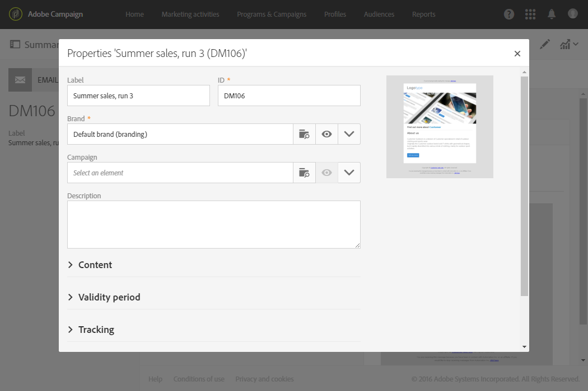

# 電子メールチャネルの設定{#configuring-email-channel}

キャンペーン管理者 [は](../../administration/using/users-management.md#functional-administrators)、電子メールチャネル設定を行えます。 これらの詳細設定には、一般的な電子メールチャネルパラメーター、電子メールルーティングアカウント、電子メール処理ルールおよび電子メールプロパティが含まれます。 このページでは、一般的な電子メールのデフォルト値を編集し、パラメーターを送信する方法について説明します。

一部の電子メール設定は、拡張MTAAdobe Campaignで管理されます。 したがって、
* キャンペーンユーザーインターフェイスの一部の設定が適用されなくなりました。
   * 設定メ **[!UICONTROL Retries]** ニューと電子メ [ールプロパ](#email-channel-parameters) ティの [Sending](#retries-parameters) パラメーターの設定。
   * 電子メ **[!UICONTROL MX management]** ール処 **[!UICONTROL Domain management]** 理ルールメニ [ューのルールとルール](#email-processing-rules)。

* 拡張MTAでは、他のパラメーターが部分的に管理され、一部の設定は引き続きキャンペーン内で行えます。 影響を受ける設定は次のとおりです。
   * メニュ **[!UICONTROL Message delivery duration]** ー内のパラメー **[!UICONTROL Configuration]** ター。 詳しくは、[この節](#email-channel-parameters)を参照してください。
   * セクシ **[!UICONTROL Delivery duration]** ョンの **[!UICONTROL Validity limit for sending messages]** またはパラメー **[!UICONTROL Validity period]** ター。 詳しくは、[この節](#validity-period-parameters)を参照してください。
   * のル **[!UICONTROL Bounce mails]** ールです **[!UICONTROL Email processing rules]**。 詳しくは、[この節](#email-processing-rules)を参照してください。

## 電子メールチャネルパラメータ {#email-channel-parameters}

電子メール設定画面では、電子メールパラメーターのチャネルを定義できます。 管理者は、 > > >メニューからこれらの設 **[!UICONTROL Administration]定にア[!UICONTROL Channels]クセスで[!UICONTROL Email]きます[!UICONTROL Configuration]**。

* **送信された電子メールのヘッダーパラメーター**

   このセクションでは、送信者のアドレスとエ **[!UICONTROL masks]** ラーのアドレスに対して認証された情報を指定できます。 複数のマスクを使用する場合は、コンマで区切る必要があります。 これらのフィールドにデータが入力されると、Adobe Campaignは、入力されたアドレスがメッセージの準備段階で有効であるかどうかを確認します。 このオペレーティングモードを使用すると、配信品質の問題を引き起こす可能性のあるアドレスが使用されなくなります。 送信者アドレスとエラーアドレスの両方がアドビによって設定されます。 更新するには、アドビカスタマーケアチームに問い合わせる必要があります。

* **配信品質**

   このIDは、アドビカスタマーケアチームによって提供されます。 配信品質レポートが正しく機能するためには必須です。

* **配信パラメーター**

   Adobe Campaignは、メッセージの開始日から開始を送信します。 このフ **[!UICONTROL Message delivery duration]** ィールドでは、メッセージを送信できる期間を指定できます。

   >[!IMPORTANT]
   >
   >**このキャンペーンーのパラメーターは、3.5日以下に設定した場合にのみ使用されるようになりました。** 3.5日を超える値を定義した場合、この値はAdobe Campaign拡張MTAで管理されるようになったので、考慮されません。

   The **[!UICONTROL Online resources validity duration]** field is used for uploaded resources, mainly for the mirror page and images. ディスクスペースを節約するために、このページ上のリソースが有効な期間は限られています。

* **再試行**

   一時的に配信できなかったメッセージは、自動再試行の対象となります。For more on this, see [Retries after a delivery temporary failure](../../sending/using/understanding-delivery-failures.md#retries-after-a-delivery-temporary-failure).

   >[!NOTE]
   >
   >実行する再試行の最大数と再試行間の最小遅延は、IPが特定のドメインでどの程度履歴的に、現在どの程度のパフォーマンスを発揮しているかに基づいて、Adobe Campaign拡張MTAで管理されるようになりました。 **再試行** 設定は無視されます。

   <!--This section indicates how many retries should be performed the day after the send is started (**Number of retries**) and the minimum delay between retries (**Retry period**). By default, five retries are scheduled for the first day with a minimum interval of one hour, spread out over the 24 hours of the day. One retry per day is programmed after that and until the delivery deadline, which is defined in the **[!UICONTROL Delivery parameters]** section.-->

* **E メール強制隔離のパラメーター**

   このフィー **[!UICONTROL Time between two significant errors]** ルドに、エラーが発生した場合にエラーカウンターを増やすまでのアプリケーションの待機時間を定義する値を入力します。 デフォルト値 **は「1d」で**、1日分です。

   値に達する **[!UICONTROL Maximum number of errors before quarantine]** と、電子メールアドレスが隔離されます。 デフォルト値 **は「5」です**。アドレスは5番目のエラーで隔離されます。 これは、連絡先が後続の配信から自動的に除外される。

   強制隔離について詳しくは、「 [強制隔離管理について](../../sending/using/understanding-quarantine-management.md)」を参照。

## 電子メールルーティングアカウント {#email-routing-accounts}

この **[!UICONTROL Integrated email routing]** 外部アカウントはデフォルトで提供されます。 アプリケーションが電子メールを送信するための技術的なパラメーターが含まれます。

アカウントタイプは常ににに、 **[!UICONTROL Routing]**&#x200B;チャネルはに、配信モード **[!UICONTROL Email]** はに設定する必要がありま **[!UICONTROL Bulk delivery]**&#x200B;す。

**関連トピック**:

[外部アカウント](../../administration/using/external-accounts.md)

## 電子メール処理ルール {#email-processing-rules}

管理者 **[!UICONTROL Email processing rules]** は、メニューからアクセスで **[!UICONTROL Administration > Channels > Email]** きます。

電子メールドメインとMXルールは、拡張MTAAdobe Campaignで管理されます。
* **DKIM(DomainKeys Identified Mail)電子メール認証の署名は** 、すべてのドメインを持つすべてのメッセージに対して拡張MTAによって行われます。 拡張MTAレベルで特に指定され **ていない限り、** Sender ID **、** DomainKeys **、** S/MIMEを使用して署名することはできません。
* 拡張MTAは独自のMXルールを使用し、独自の履歴電子メールの評判や、電子メールを送信するドメインからのリアルタイムのフィードバックに基づいて、ドメイン別にスループットをカスタマイズできます。

### バウンスメール {#bounce-mails}

非同期バウンスは、引き続きルールを通じてinMailキャンペーンによって認証さ **[!UICONTROL Bounce mails]** れます。

This rule contains the list of character strings which can be returned by remote servers and which let you qualify the error (**Hard**, **Soft** or **Ignored**).

>[!NOTE]
>
>同期配信障害のエラーメッセージの場合、Adobe Campaign拡張MTAはバウンスのタイプと条件を決定し、その情報をキャンペーンに返します。

バウンスメールの資格について詳しくは、この節を参照して [ください](../../sending/using/understanding-delivery-failures.md#bounce-mail-qualification)。

<!--Because they are now managed by the Enhanced MTA, the bounce qualifications in the Campaign **[!UICONTROL Message qualification]** table are no longer used. For more on bounce mail qualification, see this [section](../../sending/using/understanding-delivery-failures.md#bounce-mail-qualification).

### Management of email domains {#managing-email-domains}

The email domains are now managed by the Adobe Campaign Enhanced MTA. The Adobe Campaign **[!UICONTROL Domain management]** rules are no longer used.

**DKIM (DomainKeys Identified Mail)** email authentication signing is done by the Enhanced MTA for all messages with all domains. It does not sign with **Sender ID**, **DomainKeys**, or **S/MIME** unless otherwise specified at the Enhanced MTA level.

### MX management {#mx-management}

The MX rules are now managed by the Adobe Campaign Enhanced MTA. The Adobe Campaign **[!UICONTROL MX management]** delivery throughput rules are no longer used.

The Enhanced MTA uses its own MX rules that allow it to customize your throughput by domain based on your own historical email reputation, and on the real-time feedback coming from the domains where you are sending emails.-->

## 電子メールプロパティのリスト {#list-of-email-properties}

この節では、電子メールまたは電子メールリストのプロパティ画面で使用できるパラメーターのテンプレートについて説明します。

>[!NOTE]
>
>一部のパラメーターはテンプレートでのみ使用できます。 アクセスできるパラメー [ターは、権限によって異なります](../../administration/using/users-management.md)。

電子メールまたは電子メールテンプレートのプロパティを編集するには、ボタンを使用 **[!UICONTROL Edit properties]** します。

### 一般パラメーター {#general-parameters}

電子メールパラメータ画面の上部で、およびフィールドを使用して電子メールを **[!UICONTROL Label]** 識別 **[!UICONTROL ID]** します。 この情報はインターフェイスに表示されますが、メッセージ受信者には表示されません。

>[!IMPORTANT]
>
>IDは一意である必要があります。

このフ **[!UICONTROL Brand]** ィールドを使用すると、ブランドを選択できます。配信。 ブランドの使用と設定について詳しくは、「ブランド」の節を参照して [ください](../../administration/using/branding.md) 。

このフィ **[!UICONTROL Campaign]** ールドには、電子メールにリンクされたキャンペーンを入力できます。

対応するフィールドに画像を追 **[!UICONTROL Description]** 加し、画像内の電子メールサムネールに表示される画像を編集することもできます。リスト

### 送信パラメーター {#sending-parameters}

このセクシ **[!UICONTROL Send]** ョンは、電子メールテンプレートでのみ使用できます。 次のパラメーターが含まれます。

#### 再試行パラメータ {#retries-parameters}

一時的に配信できなかったメッセージは、自動再試行の対象となります。For more on this, see [Retries after a delivery temporary failure](../../sending/using/understanding-delivery-failures.md#retries-after-a-delivery-temporary-failure).

>[!NOTE]
>
>再試行間の最小遅延時間と実行される再試行の最大数は、IPが特定のドメインでどの程度履歴的に、現在どの程度のパフォーマンスを発揮しているかに基づいて、Adobe Campaign拡張MTAで管理されるようになりました。 キャンペーン **再試行** の設定は無視されます。

<!--This section indicates how many retries should be performed the day after the send is started ( **[!UICONTROL Max. number of retries]** ) and the minimum delay between retries ( **[!UICONTROL Retry period]** ).

By default, five retries are scheduled for the first day with a minimum interval of one hour, spread out over the 24 hours of the day. One retry per day is programmed after that and until the delivery deadline, which is defined in the [Validity period parameters](#validity-period-parameters) section.

The number of retries can be changed globally (contact your Adobe technical administrator) or for each delivery or delivery template.-->

キャンペーン **で設定した配信期間** ( [Validity periods](#validity-period-parameters) ( **Validity perameters)セクションで定義)は、引き続き適用されますが、3.5日までです**。 この時点で、再試行キュー内のメッセージがキューから削除され、バウンスとして返されます。 配信障害の詳細については、この節を参照し [てくださ](../../sending/using/understanding-delivery-failures.md#about-delivery-failures)い。

#### E メールフォーマットパラメータ {#email-format-parameters}

送信する電子メールの形式を設定できます。 次の3つのオプションを使用できます。

* **受信者の環境設定** （デフォルトモード）を使用します。メッセージの形式は、受信者プロファイルに格納されたデータに従って定義され、デフォルトでは **E メールフォーマット** (@emailFormat)フィールドに格納されます。 受信者が特定の形式でメッセージを受信することを希望していれば、メッセージはその形式で送信されます。フィールドが未入力の場合は、マルチパート/オルタナティブメッセージが送信されます（以下を参照）。
* **受信者メールクライアントが最も適切な形式を選択できるようにします(マルチパート/オルタナティブ)**。メッセージには、両方の形式が含まれます。テキストとHTML。 受信時に表示される形式は、受信者のメールソフトウェア(マルチパート/オルタナティブ)の設定によって異なります。

   >[!IMPORTANT]
   >
   >このオプションには、両方のバージョンのメッセージが含まれます。 したがって、メッセージサイズが大きいので、配信のスループットに影響を与えます。

* **すべてのメッセージをテキスト形式で送信**:メッセージはテキスト形式で送信されます。 HTML形式は送信されませんが、受信者がメッセージ内のリンクをクリックした場合にのみミラーページに使用されます。

#### SMTPテストモード {#smtp-test-mode}

このオプ **[!UICONTROL Enable SMTP test mode]** ションを使用すると、実際にメッセージを送信することなく、SMTP接続を介した電子メールの送信をテストできます。
SMTPサーバーとの接続が確立されるまでメッセージは処理されますが、送信されません。

このオプションは、電子メールおよび電子メールテンプレートで使用できます。

電子メールテンプレートに対してSMTPテストモードオプションを有効にした場合、このテンプレートから作成されたすべての電子メールメッセージでこのオプションが有効になります。

>[!IMPORTANT]
>
>電子メールに対してこのオプションを有効にすると、オフになるまでメッセージは送信されません。
>警告が電子メールまたは電子メールテンプレートダッシュボードに表示されます。

SMTPの設定について詳しくは、「電子メールSMTPパラメータの [リスト」の節を参照してください](#list-of-email-smtp-parameters) 。

### 有効期間パラメーター {#validity-period-parameters}

この節では、 **[!UICONTROL Validity period]** 次のパラメーターについて説明します。

* **[!UICONTROL Explicitly set validity dates]**:このチェックボックスをオフにした場合は、とのフィールドに期間を入力する必要 **[!UICONTROL Delivery duration]** があ **[!UICONTROL Resource validity limit]** ります。

   特定の日時を定義する場合は、このチェックボックスをオンにします。

   

* **[!UICONTROL Delivery duration]** / **[!UICONTROL Validity limit for sending messages]**:Adobe Campaignは、メッセージの開始日から開始を送信します。 このフィールドでは、メッセージを送信できる期間を指定できます。

   >[!IMPORTANT]
   >
   >このパラメーターは、拡張MTAAdobe Campaignで管理されます。 **3.5日までの値を定義する必要があります。** 3.5 日を超える値を定義した場合、その値は考慮されません。

* **[!UICONTROL Resource validity duration]** / **[!UICONTROL Validity limit date for resources]**:このフィールドは、主にリソースと画像のアップロード済みリソースに使用されるミラーページです。 ディスクスペースを節約するために、このページ上のリソースが有効な期間は限られています。
* **[!UICONTROL Mirror page management]**:ミラーページは、Webブラウザーを介してオンラインでアクセスできるHTMLページです。 内容は電子メールの内容と同じです。 デフォルトでは、ミラーページは、リンクがメールコンテンツに挿入された場合に生成されます。 このフィールドでは、このページの生成方法を変更できます。

   >[!IMPORTANT]
   >
   >電子メールを作成するには、HTMLコンテンツが定義されている必要があります。ミラーページを作成するには、

   * **[!UICONTROL Generate the mirror page if a mirror link appears in the email content]** （デフォルトモード）:ミラーページは、リンクがメールコンテンツに挿入された場合に生成されます。
   * **生成を強制するミラーページ**:メッセージにミラーページへのリンクが挿入されていない場合でも、ミラーページが作成されます。
   * **生成しないミラーページ**:リンクがメッセージ内にある場合でも、ミラーページは生成されません。
   * **次のメッセージIDのみを使用してミラーページをアクセス可能にします**。このオプションを使用すると、パーソナライゼーション情報を使用して、ミラーページのコンテンツに配信ログウィンドウでアクセスできます。

>[!NOTE]
>
>このパラメ **[!UICONTROL Delivery duration]** ーターは、トランザクションメッセージには適用されません。 For more on transactional messaging, see [this section](../../channels/using/about-transactional-messaging.md).

### トラッキングパラメーター {#tracking-parameters}

この節では、 **[!UICONTROL Tracking]** 次のパラメーターについて説明します。

* **[!UICONTROL Activate tracking]**:メッセージのURL追跡をアクティブ化/非アクティブ化できます。 各メッセージURLの追跡を管理するには、「電子メールデザイ **[!UICONTROL Links]** ナー」アクションバーのアイコンを使用します。 追跡するURL [についてを参照してくださ](../../designing/using/links.md#about-tracked-urls)い。
* **[!UICONTROL Tracking validity limit]**:URLで追跡を有効にする期間を定義できます。
* **[!UICONTROL Substitution URL for expired URLs]**:追跡の有効期限が切れた後に表示されるWebページのURLを入力できます。

### 詳細設定パラメーター {#advanced-parameters}

セクションに **[!UICONTROL Advanced parameters]** は複数のパラメーターが含まれています。

最初のフィールドでは、電子メールメッセージのヘッダーを入念に入力するために必要な情報を入力できます。 ここでは、返信先の住所とテキスト、および送信者の住所（「送信者」フィールドに入力）を管理できます。 この情報はパーソナライズ可能です。

変更するフィールドの右側のボタンをクリックし、パーソナライゼーションフィールド、コンテンツブロックまたは動的テキストを追加します。

パーソナライゼーションコンテンツの挿入と使用について詳しくは、電子メールコン [テンツのパーソナライズドキュメン](../../designing/using/personalization.md) トを参照してください。

#### ターゲット文脈 {#target-context}

ターゲット設定コンテキストを使用すると、電子メールのターゲット設定(オーディエンス定義画面)およびパーソナライゼーション(HTMLコンテンツエディターでのパーソナライゼーションフィールドの定義)に使用される一連のテーブルを定義できます。

#### ルーティング {#routing}

このフィールドは、使用されるルーティングモードを示します。 これは外部アカウントを参照 例えば、特定のブランド設定を含む外部アカウントを使用する場合に使用できます。

>[!NOTE]
>
>外部アカウントには、管理/アプリケ **ーション設定** / **外部アカウントメニューからア** クセスできます **** 。

#### 準備 {#preparation}

メッセージの準備の詳細については、「メッセ [ージの承認](../../sending/using/preparing-the-send.md) 」を参照してください。

* **[!UICONTROL Typology]**:送信の前に、コンテンツと設定を検証するためのメッセージを準備する必要があります。 The verification rules applied during the preparation phase are defined in a **typology**. 例えば、電子メールの場合、件名、URL、画像などのチェックが必要です。 このフィールドに適用するタイポロジを選択します。

   >[!NOTE]
   >
   >この節では、>/メニューからア **[!UICONTROL Administration]** クセス **[!UICONTROL Channels]** で **[!UICONTROL Typologies]** きるタイポロジを示 [します](../../sending/using/about-typology-rules.md)。

* **[!UICONTROL Compute the label during delivery preparation]**:メッセージ、コンテンツブロック、ダイナミックテキストを使用して、メッセージの準備段階での電子メールのパーソナライゼーションフィールド値を計算できます。

   また、ワークフローの外部シグナル配信に宣言されたイベント変数を使用して、ワークフローラベルをパーソナライズすることもできます。 詳しくは、[この節](../../automating/using/calling-a-workflow-with-external-parameters.md)を参照してください。

* **[!UICONTROL Save SQL queries in the log]**:このオプションを使用すると、準備段階でSQLクエリログをジャーナルに追加できます。

#### 配達確認設定 {#proof-settings}

このセクションでは、件名行で使用するデフォルトのプレフィックスを配達確認に設定できます。 For more in this, refer to [this section](../../sending/using/sending-proofs.md).

### 電子メールSMTPパラメータのリスト {#list-of-email-smtp-parameters}

この節では、 **[!UICONTROL SMTP]** 次のパラメーターについて説明します。

* **[!UICONTROL Character encoding]**:メッセージ **[!UICONTROL Force encoding]** のエンコーディングを強制する場合は、チェックボックスをオンにし、使用するエンコーディングを選択します。
* **[!UICONTROL Bounce mails]**:デフォルトでは、バウンスメールはプラットフォームのエラーインボックス(> > **[!UICONTROL Administration]** >画面で **[!UICONTROL Channels]** 定義 **[!UICONTROL Email]** )で受信さ **[!UICONTROL Configuration]** れます。 電子メールの特定のエラーアドレスを定義するには、フィールドにアドレスを入力 **[!UICONTROL Error address]** します。
* **[!UICONTROL Additional SMTP headers]**:このオプションを使用すると、追加のSMTPヘッダーをメッセージに追加できます。 The script entered in the **[!UICONTROL Headers]** field must reference one header per line, in the form of **name:value**. 値は必要に応じて自動的にエンコードされます。

   >[!IMPORTANT]
   >
   >スクリプトを追加すると、挿入する SMTP ヘッダーを追加できます。これは高度な知識を持つユーザー向けに用意されています。スクリプトの構文は、このコンテンツタイプの要件を満たしている必要があります（不要なスペースや空行を含まないなど）。

### アクセス許可リストのパラメータ {#list-of-access-authorization-parameters}

この節では、 **[!UICONTROL Access authorization]** 次のパラメーターについて説明します。

* このフィ **[!UICONTROL Organizational unit]** ールドを使用すると、この電子メールへのアクセスを特定のユーザーに制限できます。 指定したユニットまたは親ユニットに関連付けられたユーザーは、この電子メールの読み取りと書き込みのアクセス権を持ちます。 子ユニットに関連付けられたユーザーは、この電子メールに対する読み取りアクセス権のみを持ちます。

   >[!NOTE]
   >
   >組織単位は、管理/ユーザーとセキュリ **ティ** ( **Administration** )メニューで設定できます。

* 、、およ **[!UICONTROL Created by]**&#x200B;びのフ **[!UICONTROL Created]**&#x200B;ィー **[!UICONTROL Modified by]** ルドは自 **[!UICONTROL Last modified]** 動的に入力されます。
