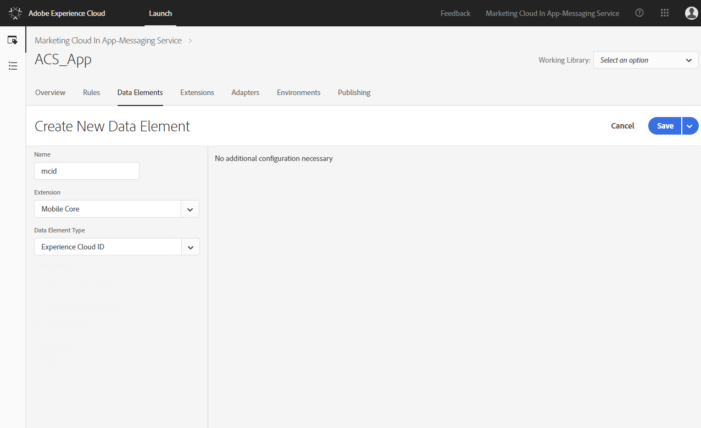
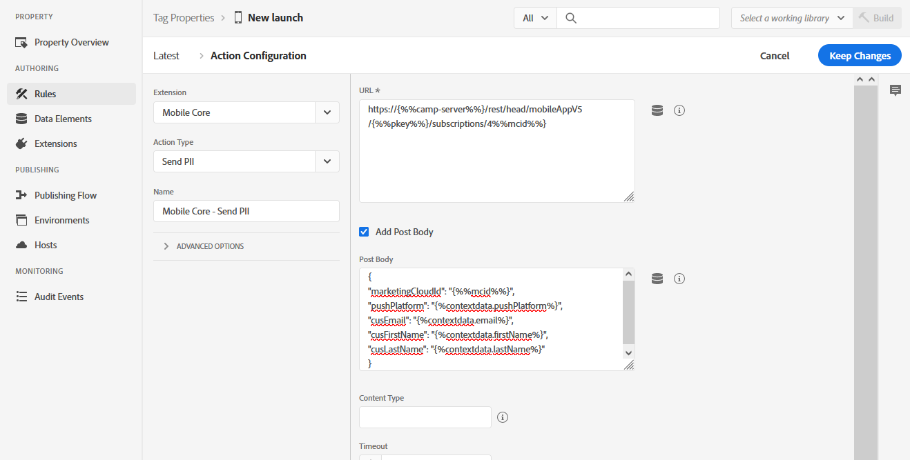
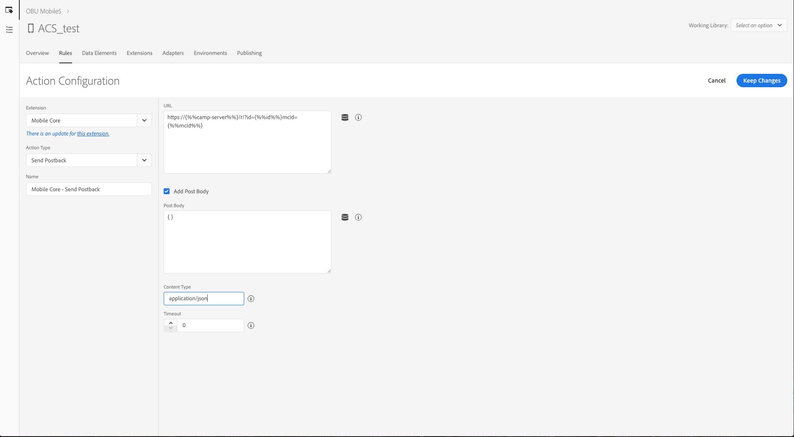
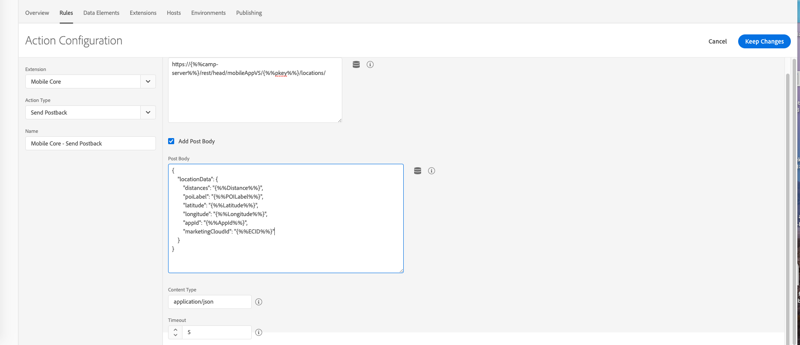

# Adobe Campaign Standard のユースケースをサポートするタグルールの設定 {#configuring-rules-launch}

データ収集UIで、データ要素とルールを作成して、モバイルアプリケーションから[!DNL Adobe Campaign Standard]にPIIやその他のデータを送信します。

データ収集UIのすべての設定変更を有効にするには、これらの変更を公開する必要があります。 詳しくは、[公開](https://developer.adobe.com/client-sdks/documentation/getting-started/create-a-mobile-property/#publish-the-configuration)を参照してください。

データ収集UIでルールを作成するには、次の手順に従います。

1. [データ要素の作成](../../administration/using/configuring-rules-launch.md#create-data-elements)
2. [&#x200B; サポートするユースケースのルール &#x200B;](../../administration/using/configuring-rules-launch.md#create-data-elements)を作成しています：
   * [PII ポストバック](../../administration/using/configuring-rules-launch.md#pii-postback)
   * [アプリ内トラッキングのポストバック](../../administration/using/configuring-rules-launch.md#inapp-tracking-postback)
   * [プッシュ通知の追跡ポストバック](../../administration/using/configuring-rules-launch.md#push-tracking-postback)
   * [場所のポストバック](../../administration/using/configuring-rules-launch.md#location-postback)

## データ要素の作成 {#create-data-elements}

データ収集UIで作成することをお勧めするデータ要素は次のとおりです。
必要に応じて、データ要素を追加できます。

* **[!UICONTROL Experience Cloud ID]**
* **[!UICONTROL Pkey]**
* **[!UICONTROL Campaign server]**

これらのデータ要素を作成するには：

1. データ収集UIで、モバイルアプリケーションダッシュボードから「**[!UICONTROL Data Elements]**」タブをクリックします。

1. **[!UICONTROL Experience Cloud ID]** データ要素を作成するには、**[!UICONTROL Create New Data Element]**&#x200B;をクリックします。

1. 例えば、**[!UICONTROL Name]** フィールドに&#x200B;**mcid**&#x200B;と入力します。

1. **[!UICONTROL Extension]** ドロップダウンから、**[!UICONTROL Mobile Core]**&#x200B;を選択します。 次に、**[!UICONTROL Data element]** タイプ ドロップダウンの&#x200B;**[!UICONTROL Experience Cloud ID]**。

   

1. キーデータ要素を作成するには、**[!UICONTROL Add data element]**&#x200B;をクリックします。

1. 例えば、**[!UICONTROL Name]** フィールドに&#x200B;**pkey**&#x200B;と入力します。

1. **[!UICONTROL Extension]** ドロップダウンから、**[!UICONTROL Adobe Campaign Standard]**&#x200B;を選択します。 次に、**[!UICONTROL Data element]** タイプ ドロップダウンの&#x200B;**[!UICONTROL pkey]**。

1. Campaign サーバーデータ要素を作成するには、**[!UICONTROL Add data element]**&#x200B;をクリックします。

1. **[!UICONTROL Name]** フィールドに名前（例：**camp-server**）を入力します。

1. **[!UICONTROL Extension]** ドロップダウンから、**[!UICONTROL Adobe Campaign Standard]**&#x200B;を選択します。 次に、**[!UICONTROL Data element]** タイプ ドロップダウンの&#x200B;**[!UICONTROL Campaign Server]**&#x200B;です。

## ルールの作成 {#creating-rules}

次のルールを作成する必要があります。

* [PII ポストバック](../../administration/using/configuring-rules-launch.md#pii-postback)
* [アプリ内トラッキングのポストバック](../../administration/using/configuring-rules-launch.md#inapp-tracking-postback)
* [プッシュ通知の追跡ポストバック](../../administration/using/configuring-rules-launch.md#push-tracking-postback)
* [場所のポストバック](../../administration/using/configuring-rules-launch.md#location-postback)

### PII ポストバック {#pii-postback}

>[!NOTE]
>
>モバイルアプリからAdobe CampaignにPII情報を送信するには、SDK APIを実装する必要があります。 詳しくは、[CollectPII](https://developer.adobe.com/client-sdks/documentation/mobile-core/api-reference/#collectpii)にアクセスしてください。

PII データを[!DNL Adobe Campaign Standard]に送信するには、データ収集UIでルールを作成します。

1. データ収集UIで、モバイルアプリケーションダッシュボードから「**[!UICONTROL Rules]**」タブをクリックし、「**[!UICONTROL Create New Rule]**」をクリックします。

1. 名前を入力します。例：**Mobile Core - Collect PII**。

1. **[!UICONTROL Events]** セクションで、**[!UICONTROL Add]**&#x200B;をクリックします。

1. **[!UICONTROL Extension]** ドロップダウンから、**[!UICONTROL Mobile Core]**&#x200B;を選択します。 次に、**[!UICONTROL Event type]** ドロップダウンの&#x200B;**[!UICONTROL Collect PII]**。

1. 「**[!UICONTROL Keep changes]**」をクリックします。

1. **[!UICONTROL Actions]** セクションで、**[!UICONTROL Add]**&#x200B;をクリックします。

1. **[!UICONTROL Extension]** ドロップダウンから、**[!UICONTROL Mobile Core]**&#x200B;を選択します。 次に、**[!UICONTROL Action type]** ドロップダウンの&#x200B;**[!UICONTROL Send PII]**。

1. **[!UICONTROL URL]**&#x200B;に、次のURLを入力します。

   ```
   https://{%%camp-server%%}/rest/head/mobileAppV5/{%%pkey%%}/subscriptions/{%%mcid%%}
   ```

1. 「**[!UICONTROL Add Post Body]**」チェックボックスをオンにします。

1. **[!UICONTROL Post Body]**&#x200B;で、次のように入力します。

   ```
   {
   "marketingCloudId":
   "{%%mcid%%}",
   "pushPlatform":
   "",
   "cusEmail":
   "",
   "cusFirstName":
   "",
   "cusLastName":
   "" }
   ```

   marketingCloudIdを使用すると、アプリのサブスクライバーとデータベース内の受信者を紐付けることができます。そのため、必要になります。 ビジネスニーズに応じて、他のキーと値のペアを指定できます。 上記の例では、Email、First Name、Last Nameがアプリから渡されています。

   キー（cusEmail、cusFirstName、cusLastNameなど）は、Adobe Campaign Standard インスタンスのカスタムリソースで定義されているフィールド IDと一致する必要があります。 値の変数（email、firstName、LastNameなど）は、アプリコードからAMS collectPII APIを呼び出す際にモバイルアプリから送信されるJSON データ内のキーと一致する必要があります。

   また、イベントトリガーに応じて、PII ポストバックを収集または別のポストバックでライフサイクルデータを渡すこともできます。 ライフサイクルデータ JSONの例を次に示します。

   ```
   {
   "marketingCloudId":"{%%mcid%%}",
   "pushPlatform":"",
   "cusDayslastlaunch": "{%%DaysSinceLastUse%%}", 
   "cusDaysfirstlaunch": "{%%DaysSinceFirstUse%%}", 
   "cusLaunches": "{%%Launches%%}"
   }
   ```

   データ収集UIで定義されるデータ要素は、例えば`%%mcid%%`のように2つのパーセンテージで囲み、アプリのコンテキスト変数は%contextdata.email%のように1つのパーセンテージで囲む必要があります。

1. **[!UICONTROL Content Type]**&#x200B;に「**application/json**」と入力します。

1. **[!UICONTROL Timeout]**&#x200B;で、「0」を選択します。

   

これで、ユーザーデータがCampaignに送信されるように設定されました。

### アプリ内トラッキングのポストバック {#inapp-tracking-postback}

>[!NOTE]
>
>Android ACPCore v1.4.0以降またはiOS ACPCore v2.3.0以降を使用している場合、トラッキングポストバックの設定は必要ありません。

ユーザーがモバイルアプリケーションでアプリ内メッセージをどのように操作しているかをレポートするためにトラッキングデータを[!DNL Adobe Campaign Standard]に送信するには、データ収集UIに次のルールを作成します。

1. データ収集UIで、モバイルアプリケーションダッシュボードから「**[!UICONTROL Rules]**」タブを選択し、「**[!UICONTROL Add Rule]**」をクリックします。

1. 名前を入力します。例：**Adobe Campaign - アプリ内クリックトラッキング**。

1. **[!UICONTROL Events]** セクションで、**[!UICONTROL Add]**&#x200B;をクリックします。

1. **[!UICONTROL Extension]** ドロップダウンから、**[!UICONTROL Adobe Campaign Standard]**&#x200B;を選択します。 次に、**[!UICONTROL Event type]** ドロップダウンの&#x200B;**[!UICONTROL In-App click tracking]**。

1. 「**[!UICONTROL Keep changes]**」をクリックします。

1. **[!UICONTROL Actions]** セクションで、**[!UICONTROL Add]**&#x200B;をクリックします。

1. **[!UICONTROL Extension]** ドロップダウンから、**[!UICONTROL Mobile Core]**&#x200B;を選択します。 次に、**[!UICONTROL Event type]** ドロップダウンの&#x200B;**[!UICONTROL Send postback]**。

1. **[!UICONTROL URL]**&#x200B;に次のURLを入力します。

   ```
   https://{%%camp-server%%}/r/?id=&mcid={%%mcid%%}
   ```

1. 「**[!UICONTROL Add post body]**」チェックボックスをオンにします。

1. **[!UICONTROL Post Body]**&#x200B;に「**{}**」と入力します。

1. **[!UICONTROL Content Type]**&#x200B;に「**application/json**」と入力します。

1. **[!UICONTROL Timeout]**&#x200B;で、「0」を選択します。

   

### プッシュ通知の追跡ポストバック {#push-tracking-postback}

>[!NOTE]
>
>Android ACPCore v1.4.0以降またはiOS ACPCore v2.3.0以降を使用している場合、トラッキングポストバックの設定は必要ありません。

プッシュ通知の配信とモバイルアプリケーションとのユーザーのインタラクションを追跡するのに役立つトラッキングデータを[!DNL Adobe Campaign Standard]に送信するには、データ収集UIでルールを作成する必要があります。

プッシュトラッキングについて詳しくは、[&#x200B; プッシュトラッキング &#x200B;](../../administration/using/push-tracking.md)を参照してください。

アプリのアクションを追跡するには、trackAction APIを使用します。 詳しくは、[&#x200B; アプリのアクションを追跡](https://app.gitbook.com/@aep-sdks/s/docs/using-mobile-extensions/mobile-core/mobile-core-api-reference#track-app-actions)を参照してください。

1. データ収集UIで、モバイルアプリケーションダッシュボードから「**[!UICONTROL Rules]**」タブをクリックし、「**[!UICONTROL Add Rule]**」をクリックします。

1. 名前を入力します。例：**Adobe Campaign - プッシュクリックトラッキング**。

1. **[!UICONTROL Events]** セクションで、**[!UICONTROL Add]**&#x200B;をクリックします。

1. **[!UICONTROL Extension]** ドロップダウンから、**[!UICONTROL Mobile Core]**&#x200B;を選択します。 次に、**[!UICONTROL Event type]** ドロップダウンの&#x200B;**[!UICONTROL Track Action]**。

1. **[!UICONTROL Action]** ドロップダウンから、**[!UICONTROL Action]**&#x200B;を選択し、**[!UICONTROL equals]**&#x200B;を選択して、**トラッキング**&#x200B;と入力します。

1. 「**[!UICONTROL Keep changes]**」をクリックします。 次に、**[!UICONTROL Actions]** セクションで、**[!UICONTROL Add]**&#x200B;をクリックします。

1. **[!UICONTROL Extension]** ドロップダウンから、**[!UICONTROL Mobile Core]**&#x200B;を選択します。 次に、**[!UICONTROL Action type]** ドロップダウンの&#x200B;**[!UICONTROL Send postback]**。

1. **[!UICONTROL URL]**&#x200B;に、次のURLを入力します。

   ```
   https://{%%camp-server%%}/r/?id=,,&mcId={%%mcid%%}
   ```

1. 「**[!UICONTROL Add post body]**」チェックボックスをオンにします。

1. 投稿本文を追加します（例：{ }）。

1. **[!UICONTROL Content Type]**&#x200B;に「**application/json**」と入力します。

1. **[!UICONTROL Timeout]**&#x200B;で、「0」を選択します。

### 場所のポストバック {#location-postback}

1. データ収集UIで、モバイルアプリケーションダッシュボードから「**[!UICONTROL Rules]**」タブをクリックし、「**[!UICONTROL Add Rule]**」をクリックします。

1. 名前を入力します。例：**場所ポストバック**。

1. **[!UICONTROL Events]** セクションで、**[!UICONTROL Add]**&#x200B;をクリックします。

1. イベントを作成します。例えば、「POI」または「POIを終了」と入力します。 **[!UICONTROL Extension]** ドロップダウンから、**場所 – Beta**&#x200B;を選択します。 次に、**[!UICONTROL Event type]** ドロップダウンで&#x200B;**POI**&#x200B;または&#x200B;**POI**&#x200B;を終了します。

1. 例えば、**Places - Beta - Enter POI**&#x200B;または&#x200B;**Exit POI**&#x200B;という名前を入力します。

1. **[!UICONTROL Actions]** セクションで、**[!UICONTROL Add]**&#x200B;をクリックします。

1. **[!UICONTROL Extension]** ドロップダウンから、**[!UICONTROL Mobile Core]**&#x200B;を選択します。 次に、**[!UICONTROL Action type]** ドロップダウンから&#x200B;**[!UICONTROL Send postback]**。

1. 名前を入力します（例：**Mobile Core - Send Location Postback**）。

1. **[!UICONTROL URL]**&#x200B;に、次のURLを入力します。

   ```
   https://{%%camp-server%%}/rest/head/mobileAppV5/{%%pkey%%}/locations/
   ```

1. 「**[!UICONTROL Add post body]**」チェックボックスを選択し、投稿本文を追加します。例：

   ```
   {
   "locationData": {
       "distances": "{%%Distance%%}",
       "poiLabel": "{%%POILabel%%}",
       "latitude": "{%%Latitude%%}",
       "longitude": "{%%Longitude%%}",
       "appId": "{%%AppId%%}",
       "marketingCloudId": "{%%ECID%%}"
   }
   }
   ```

   >[!NOTE]
   >
   >上記の例では、右側のデータ要素は、[&#x200B; データ要素の作成](../../administration/using/configuring-rules-launch.md#create-data-elements)の手順を利用して、データ収集UIで設定する必要があります。 左側のデータ要素は[!DNL Adobe Campaign Standard]でサポートされており、設定は必要ありません。 追加のデータが必要な場合は、[!DNL Adobe Campaign Standard]でカスタムリソース拡張機能を実行する必要があります。

1. **[!UICONTROL Content Type]**&#x200B;に「**application/json**」と入力します。

1. **[!UICONTROL Timeout]**&#x200B;で、「5」を選択します。

   
