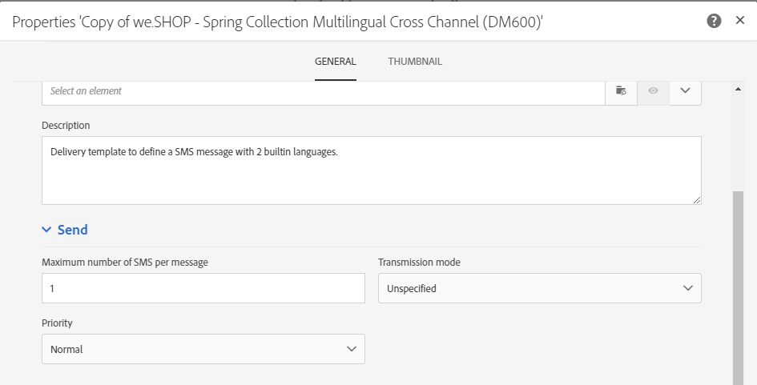

# SMS チャネルの設定{#configuring-sms-channel}

SMS メッセージを送信するには、管理者が **[!UICONTROL Administration]**／**[!UICONTROL Channels]**／**[!UICONTROL SMS]**／**[!UICONTROL SMS accounts]** メニューで 1 つまたは複数の外部アカウントを設定する必要があります。

外部アカウントの作成と変更の手順について詳しくは、[外部アカウント](../../administration/using/external-accounts.md)の節を参照してください。SMS メッセージを送信する外部アカウントに固有のパラメーターは、次のとおりです。

## SMS ルーティングの定義 {#defining-an-sms-routing}

**[!UICONTROL SMS routing via SMPP]** 外部アカウントはデフォルトで提供されていますが、他のアカウントを追加すると便利です。

SMPP プロトコルを使用する場合、新しい外部アカウントを作成することもできます。SMS のプロトコルと設定について詳しくは、この[テクニカルノート](https://experienceleague.adobe.com/docs/campaign-classic/using/sending-messages/sending-messages-on-mobiles/sms-protocol.html)を参照してください。

1. **[!UICONTROL Administration > Application settings > External accounts]** で新しい外部アカウントを作成します。
1. アカウントタイプを **[!UICONTROL Routing]** として定義し、チャネルを　**[!UICONTROL Mobile (SMS)]** として定義します。配信モードは **[!UICONTROL Bulk delivery]** として定義します。

   

1. 接続設定を定義します。

   SMS メッセージの送信に固有の接続設定を入力するには、SMS サービスプロバイダーに問い合わせて、各外部アカウントフィールドの入力方法を確認してください。

   

   「**[!UICONTROL Enable TLS over SMPP]**」オプションを使用すると、SMPP トラフィックを暗号化できます。

   「**[!UICONTROL Enable verbose SMPP traces in the log file]**」を使用すると、すべての SMPP トラフィックをログファイルにダンプできます。コネクタのトラブルシューティングやプロバイダー側が確認できるトラフィックとの比較をおこなうには、このオプションを有効にする必要があります。

1. また、選択したプロバイダーに応じて「**[!UICONTROL SMS-C implementation name]**」フィールドに入力する値については、アドビにお問い合わせください。
1. SMPP チャネル設定を定義します。詳しくは、[SMS のエンコードと形式](#sms-encoding-and-formats)の節を参照してください。

   すべての受信 SMS を inSMS テーブルに格納する場合は、「**[!UICONTROL Store incoming MO in the database]**」を有効にします。受信 SMS の取得方法について詳しくは、この[節](../../channels/using/managing-incoming-sms.md#storing-incoming-sms)を参照してください。

   「**[!UICONTROL Enable Real-time KPI updates during SR processing]**」オプションを使用すると、配信を送信した後に、リアルタイムで **[!UICONTROL Delivered]** KPI または **[!UICONTROL Bounces + Errors]** KPI を更新できます。これらの KPI は **[!UICONTROL Deployment]** ウィンドウに表示され、プロバイダーから受け取った SR（ステータスレポート）から直接再計算されます。

   

1. **[!UICONTROL Throughput and timeouts]** パラメーターを定義します。

   アウトバウンドメッセージ（「MT：Mobile Terminated」）の最大スループットを 1 秒あたりの MT で指定できます。該当するフィールドに「0」と入力した場合、スループットは無制限となります。

   期間に対応するすべてのフィールドの値は、秒単位で入力する必要があります。

1. 特定のエンコーディングマッピングを定義する必要がある場合は、SMS-C 固有のパラメーターを定義します。 詳しくは、[SMSC の詳細](#smsc-specifics)の節を参照してください。

   SMPP プロトコルを適用せずに、SMS プロバイダー（SMS-C）のサーバーに **[!UICONTROL +]** プレフィックスを転送する場合は、「**[!UICONTROL Send full phone number (send characters other than digits)]**」オプションを有効にします。

   ただし、特定のプロバイダーで「**[!UICONTROL +]**」がプレフィックスとして必要な場合は、プロバイダーにお問い合わせください。必要に応じて、このオプションを有効にするようプロバイダーから指示があります。

1. 必要に応じて、返信の内容に基づいてアクションをトリガーする自動返信を定義します。詳しくは、[この節](../../channels/using/managing-incoming-sms.md#managing-stop-sms)を参照してください。
1. SMS ルーティング外部アカウントの設定を保存します。

これで、Adobe Campaign で新しいルーティングを使用して SMS メッセージを送信できるようになりました。

## SMS のエンコードと形式 {#sms-encoding-and-formats}

### SMS のエンコード、長さ、および変換 {#sms-encoding--length-and-transliteration}

デフォルトでは、SMS の文字数は GSM（Global System for Mobile Communications）標準に準じています。

GSM エンコードを使用する SMS メッセージは 160 文字以内に制限されています。複数の部分に分けて送信されるメッセージの場合は、SMS 1 件につき 153 文字以内です。

>[!NOTE]
>
>2 文字としてカウントされる文字もあります（中括弧、角括弧、ユーロ記号など）。使用可能な GSM 文字のリストは、[文字の一覧 - GSM 標準](#table-of-characters---gsm-standard)の節に記載されています。

必要に応じて、文字の表記変換をチェックボックスで指定できます。

表記変換では、SMS の特定の文字が GSM 標準に準じていない場合に、別の文字に置き換えられます。

* 表記変換が&#x200B;**許可されている**&#x200B;場合、標準に準じていない文字はメッセージの送信時に GSM 文字に置き換えられます。例えば、「ë」は「e」に置き換えられます。そのため、メッセージは若干改変されますが、文字制限は同じです。
* 表記変換が&#x200B;**許可されていない**&#x200B;場合、標準に準じていない文字があるメッセージはバイナリフォーマット（Unicode）で送信されます。そのため、すべての文字がそのまま送信されます。ただし、Unicode を使用する SMS メッセージは 70 文字以内に制限されています。複数の部分に分けて送信されるメッセージの場合は、SMS 1 件につき 67 文字以内です。文字数が上限を超えると、メッセージは複数に分かれて送信されますが、追加料金が発生する場合があります。

>[!IMPORTANT]
>
>パーソナライゼーションフィールドを SMS メッセージのコンテンツに入れると、GSM エンコードに対応していない文字が含まれる場合があります。コンテンツの例は、[SMS メッセージのパーソナライズ](../../channels/using/personalizing-sms-messages.md)の節に記載されています。

デフォルトでは、文字の表記変換は無効です。SMS メッセージのすべての文字をそのまま送信する場合（例えば、固有名詞が改変されないようにする場合）、このオプションは無効にしておくことをお勧めします。

ただし、SMS メッセージに Unicode メッセージ用の文字が多数含まれる場合、このオプションを有効にしてメッセージ送信のコストを抑えることもできます。

### 文字の一覧 - GSM 標準 {#table-of-characters---gsm-standard}

この節では、GSM 標準に準じている文字を紹介します。メッセージ本文に、ここで紹介されていない文字が含まれている場合、メッセージ全体がバイナリフォーマット（Unicode）に変換され、文字数が 70 文字以内に制限されます。詳しくは、[SMS のエンコード、長さ、および変換](#sms-encoding--length-and-transliteration)の節を参照してください。

**基本的な文字**

<table> 
 <tbody> 
  <tr> 
   <td> @  </td> 
   <td>    </td> 
   <td> SP  </td> 
   <td> 0  </td> 
   <td> ¡  </td> 
   <td> P  </td> 
   <td> ¿  </td> 
   <td> P  </td> 
  </tr> 
  <tr> 
   <td> £  </td> 
   <td> _  </td> 
   <td> !  </td> 
   <td> 1  </td> 
   <td> A  </td> 
   <td> Q  </td> 
   <td> a  </td> 
   <td> q  </td> 
  </tr> 
  <tr> 
   <td> $  </td> 
   <td>    </td> 
   <td> "  </td> 
   <td> 2  </td> 
   <td> B  </td> 
   <td> R  </td> 
   <td> b  </td> 
   <td> r  </td> 
  </tr> 
  <tr> 
   <td> ¥  </td> 
   <td>    </td> 
   <td> #  </td> 
   <td> 3  </td> 
   <td> C  </td> 
   <td> S  </td> 
   <td> c  </td> 
   <td> s  </td> 
  </tr> 
  <tr> 
   <td> è  </td> 
   <td>    </td> 
   <td> ¤  </td> 
   <td> 4  </td> 
   <td> D  </td> 
   <td> T  </td> 
   <td> d  </td> 
   <td> t  </td> 
  </tr> 
  <tr> 
   <td> é  </td> 
   <td>    </td> 
   <td> %  </td> 
   <td> 5  </td> 
   <td> E  </td> 
   <td> U  </td> 
   <td> e  </td> 
   <td> u  </td> 
  </tr> 
  <tr> 
   <td> ù  </td> 
   <td>    </td> 
   <td> &amp;  </td> 
   <td> 6  </td> 
   <td> F  </td> 
   <td> V  </td> 
   <td> f  </td> 
   <td> v  </td> 
  </tr> 
  <tr> 
   <td> ì  </td> 
   <td>    </td> 
   <td> '  </td> 
   <td> 7  </td> 
   <td> G  </td> 
   <td> W  </td> 
   <td> g  </td> 
   <td> w  </td> 
  </tr> 
  <tr> 
   <td> ò  </td> 
   <td>    </td> 
   <td> (  </td> 
   <td> 8  </td> 
   <td> H  </td> 
   <td> X  </td> 
   <td> h  </td> 
   <td> x  </td> 
  </tr> 
  <tr> 
   <td> Ç  </td> 
   <td>    </td> 
   <td> )  </td> 
   <td> 9 </td> 
   <td> I  </td> 
   <td> Y  </td> 
   <td> i  </td> 
   <td> y  </td> 
  </tr> 
  <tr> 
   <td> LF  </td> 
   <td>    </td> 
   <td> *  </td> 
   <td> :  </td> 
   <td> J  </td> 
   <td> Z  </td> 
   <td> j  </td> 
   <td> z  </td> 
  </tr> 
  <tr> 
   <td> Ø  </td> 
   <td> ESC  </td> 
   <td> +  </td> 
   <td> ;  </td> 
   <td> K  </td> 
   <td> Ä  </td> 
   <td> k  </td> 
   <td> ä  </td> 
  </tr> 
  <tr> 
   <td> ø  </td> 
   <td> Æ  </td> 
   <td> ,  </td> 
   <td> &lt;  </td> 
   <td> L  </td> 
   <td> Ö  </td> 
   <td> l  </td> 
   <td> ö  </td> 
  </tr> 
  <tr> 
   <td> CR  </td> 
   <td> æ  </td> 
   <td> -  </td> 
   <td> = </td> 
   <td> M  を参照してください。 </td> 
   <td> Ñ  </td> 
   <td> m  </td> 
   <td> ñ  </td> 
  </tr> 
  <tr> 
   <td> Å  </td> 
   <td> ß  </td> 
   <td> .  </td> 
   <td> &gt;  </td> 
   <td> N  </td> 
   <td> Ü  </td> 
   <td> n  </td> 
   <td> ü  </td> 
  </tr> 
  <tr> 
   <td> å  </td> 
   <td> É  </td> 
   <td> /  </td> 
   <td> ?  </td> 
   <td> O  </td> 
   <td> §  </td> 
   <td> o  </td> 
   <td> à  </td> 
  </tr> 
 </tbody> 
</table>

SP：スペース

ESC：エスケープ

LF：ラインフィード

CR：キャリッジリターン

**高度な文字（2 回カウント）**

^ { } [ ~ ] | €

### SMSC 固有の設定 {#smsc-specifics}

>[!NOTE]
>
>これらのオプションを使用すると、コネクタが（SMPP 3.4 仕様に厳密に従っていない）非標準の SMSC または特定のエンコーディング要件に対応できます。この設定は、上級ユーザーのみがおこなう必要があります。

Adobe Campaign では、SMS メッセージの送信時に 1 つまたは複数のテキストエンコードを使用できます。エンコードごとに独自の文字セットがあり、SMS メッセージに入力できる文字数もそれぞれ異なります。

「**[!UICONTROL DATA_CODING]**」フィールドを使用すると、エンコードが使用されている SMS-C と Adobe Campaign が通信できるようになります。

>[!NOTE]
>
>**data_coding** の値と実際に使用されているエンコードの間のマッピングは標準化されています。しかし、一部の SMS-C には独自のマッピングがあり、その場合、**Adobe Campaign** 管理者がこのマッピングを宣言する必要があります。詳しくは、プロバイダーにお問い合わせください。

**[!UICONTROL Define a specific mapping of encodings]** 機能を使用すると、必要に応じて、**data_codings** を宣言してエンコードを強制適用できます。この場合、表のエンコードの 1 つを指定します。

**設定**

* **[!UICONTROL Define a specific mapping of encodings]** 機能が有効になっていない場合、コネクタは次の一般的な動作を実行します。

   * **data_coding = 0** を設定して、GSM エンコードの使用を試行します。
   * GSM エンコードが失敗した場合は、**data_coding = 8** を設定して、**UCS2** エンコードの使用を試行します。

   

* **[!UICONTROL Define a specific mapping of encodings]** 機能が有効になっている場合、使用するエンコードとリンクされた「**[!UICONTROL data_coding]**」フィールドの値を定義できます。Adobe Campaign は、リスト内の最初のエンコードを使用しようとしますが、次の場合は、最初のエンコードが使用できないと判断します。

   宣言の順序は重要です。**コスト**&#x200B;が少ない順にリストを設定し、SMS メッセージになるべく多くの文字を使用できるようにすることをお勧めします。

   使用するエンコードのみを宣言してください。SMS-C から提供されているエンコードの中に、使用目的に該当しないものがあれば、それはリストで宣言しないでください。

   

### MO に送信された自動返信 {#automatic-reply-sent-to-the-mo}

プロファイルが Campaign 経由で送信された SMS メッセージに返信する場合、自動的に返信されるメッセージや、実行するアクションを設定できます。

詳しくは、[この節](../../channels/using/managing-incoming-sms.md)を参照してください。

## SMS プロパティの設定 {#configuring-sms-properties}

このセクションでは、SMS 配信または SMS テンプレートのプロパティ画面で表示される、SMS に固有のパラメーターのリストについて説明します。

SMS メッセージを送信するための特定のパラメーターは、「**[!UICONTROL Send]**」セクションおよび「**[!UICONTROL Advanced parameters]**」セクションで再グループ化されます。

次の **[!UICONTROL Advanced parameters]** セクション：

* この **[!UICONTROL Short code]** 配信に特定のショートコードを追加できます。 この特定のショートコードをオプトアウトした受信者は、メッセージの準備中に自動的に除外されます。 ショートコードの設定方法について詳しくは、 [この節](../../channels/using/managing-incoming-sms.md).

   >[!NOTE]
   >
   >この **[!UICONTROL Short code]** フィールドが空の場合、 **[!UICONTROL Short code]** 外部アカウントのフィールドセットが使用されます。

次の **[!UICONTROL Send]** SMS テンプレートのセクション：

* 「**[!UICONTROL Maximum number of SMS per message]**」オプションを使用すると、メッセージの送信に使用する SMS メッセージの数を定義できます。この数を超えると、メッセージは送信されません。

   >[!IMPORTANT]
   >
   >SMS メッセージのコンテンツにパーソナライゼーションフィールドや条件付きテキストを挿入した場合は、メッセージの長さと送信する SMS メッセージの数が受信者によって異なる場合があります。詳しくは、[SMS メッセージのパーソナライズ](../../channels/using/personalizing-sms-messages.md)の節を参照してください。

   

* 「**[!UICONTROL Transmission mode]**」フィールドでは、SMS メッセージの配信方法を指定できます。

   * **[!UICONTROL Saved on SIM card]**：メッセージは受信者の携帯電話の SIM カードに保存されます。
   * **[!UICONTROL Saved on mobile]**：メッセージは携帯電話の内部メモリに保存されます。
   * **[!UICONTROL Flash]**：メッセージは、受信者の携帯電話に通知として表示され、保存されずに表示されなくなります。
