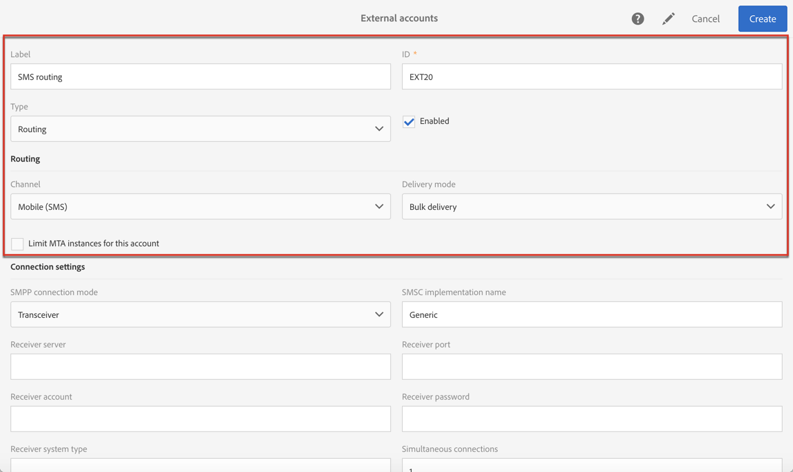
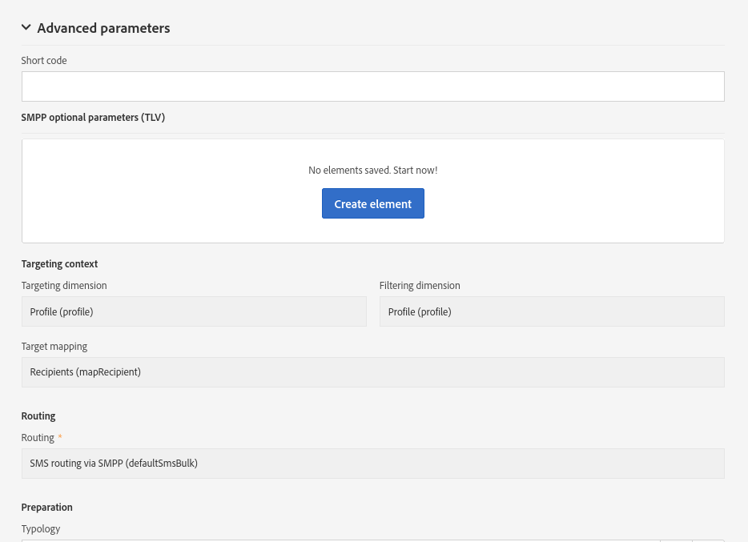
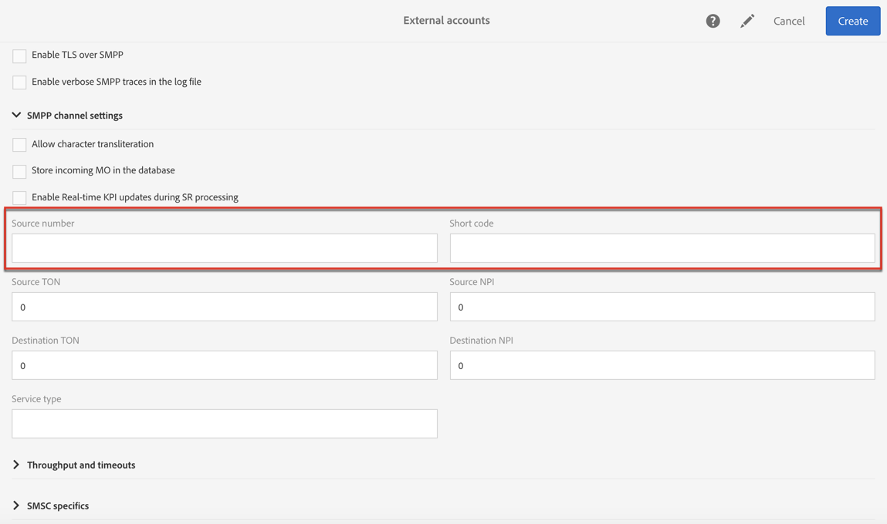

# Configuring SMS channel{#configuring-sms-channel}

To send SMS messages, one or several external accounts must be configured by an administrator under the **[!UICONTROL Administration]** &gt; **[!UICONTROL Channels]** &gt; **[!UICONTROL SMS]** &gt; **[!UICONTROL SMS accounts]** menu.

The steps for creating and modifying an external account are detailed in the [External accounts](../../administration/using/external-accounts.md) section. SMSメッセージを送信する外部アカウントに固有のパラメーターを以下に示します。

## Defining an SMS Routing {#defining-an-sms-routing}

The external account **[!UICONTROL SMS routing via SMPP]** is provided by default, but it can be useful to add other accounts.

SMPPプロトコルを使用する場合は、新しい外部アカウントを作成することもできます。For more information on SMS protocol and settings, refer to this [technical note](https://helpx.adobe.com/campaign/kb/sms-connector-protocol-and-settings.html).

1. Create a new external account from **[!UICONTROL Administration > Application settings > External accounts]**.
1. Define the account type as **[!UICONTROL Routing]**, the channel as **[!UICONTROL Mobile (SMS)]** and the delivery mode as **[!UICONTROL Bulk delivery]**.

   Once these routing parameters have been defined, the SMS connector ( **[!UICONTROL Generic SMPP]** ) is selected automatically. このコネクターを使用すると、Adobe CampaignはSMPPプロトコルを使用して短いメッセージサービスセンター（SMS- C）に接続して、ターゲットプロファイルにSMSメッセージを直接送信できます。

   

1. 接続設定を定義します。

   SMSメッセージの送信に固有の接続設定を入力するには、様々な外部アカウントフィールドの完了方法について説明するSMSサービスプロバイダーにお問い合わせください。

   

   **[!UICONTROL Enable TLS over SMPP]** このオプションを使用すると、SMPPトラフィックを暗号化できます。

   **[!UICONTROL Enable verbose SMPP traces in the log file]** を使用すると、すべてのSMPPトラフィックをログファイルにダンプできます。このオプションを有効にするには、コネクタのトラブルシューティングおよびプロバイダーが表示するトラフィックとの比較を有効にする必要があります。

1. Contact Adobe who will give you the value to enter into the **[!UICONTROL SMS-C implementation name]** field, depending on the provider chosen.
1. SMPPチャネル設定を定義します。You can learn more in the [SMS encoding and formats](../../administration/using/configuring-sms-channel.md#sms-encoding-and-formats) section.

   Enable the **[!UICONTROL Store incoming MO in the database]** if you want all incoming SMS to be stored in the inSMS table. For more information on how to retrieve your incoming SMS, refer to this [section](../../channels/using/managing-incoming-sms.md#storing-incoming-sms).

   **[!UICONTROL Enable Real-time KPI updates during SR processing]** このオプションを使用すると **[!UICONTROL Delivered]** 、配信を送信した後、 **[!UICONTROL Bounces + Errors]** リアルタイムでKPIを更新できます。These KPIs can be found in the **[!UICONTROL Deployment]** window and are directly recalculated from the SR (Status Report) received from the provider.

   

1. **[!UICONTROL Throughput and timeouts]** パラメーターを定義します。

   MT毎秒のアウトバウンドメッセージ（"MT"、「モバイル終了」）の最大スループットを指定できます。対応するフィールドに"0"と入力すると、スループットは無制限になります。

   長さに対応するすべてのフィールドの値は、秒単位で完了する必要があります。

1. 特定のエンコーディングマッピングを定義する必要がある場合には、SMS- C固有のパラメーターを定義します。For more information, refer to the [SMSC specifics](../../administration/using/configuring-sms-channel.md#smsc-specifics) section.

   Enable the **[!UICONTROL Send full phone number (send characters other than digits)]** option if you don't want to respect the SMPP protocol and transfer the **[!UICONTROL +]** prefix to the server of the SMS provider (SMS-C).

   However, given that certain providers require the use of the **[!UICONTROL +]** prefix, it is advised that you check with your provider and they will suggest that you enable this option if necessary.

1. 必要に応じて、返信のコンテンツに基づいてアクションをトリガーするための自動返信を定義します。For more on this, refer to [this section](../../channels/using/managing-incoming-sms.md#managing-stop-sms).
1. SMSルーティング外部アカウントの設定を保存します。

新しいルーティングを使用して、Adobe CampaignとSMSメッセージを送信できるようになりました。

## SMS encoding and formats {#sms-encoding-and-formats}

### SMS encoding, length and transliteration {#sms-encoding--length-and-transliteration}

デフォルトでは、SMSの文字数はGSM（Global System for Mobile Communications）規格を満たしています。

GSMエンコーディングを使用するSMSメッセージは、複数の部分で送信されるメッセージの場合、160文字またはSMSあたり153文字に制限されます。

>[!NOTE]
>
>特定の文字は、2つ（括弧、角括弧、ユーロ記号など）として数えられます。The list of available GSM characters is presented in the [Table of characters - GSM Standard](../../administration/using/configuring-sms-channel.md#table-of-characters---gsm-standard) section.

必要に応じて、対応するボックスをチェックして文字のトランスレートを許可できます。

トランスデーターは、GSM標準によってその文字が考慮されていない場合に、SMSの1文字を別の文字に置き換えることで構成されます。

* If transliteration is **authorized**, each character that is not taken into account is replaced by a GSM character when the message is sent. 例えば、"a"という文字は"e"に置き換えられます。したがって、メッセージはわずかに変更されますが、文字制限は変わりません。
* When transliteration is **not authorized**, each message that contains characters that are not taken into account is sent in binary format (Unicode): all of the characters are therefore sent as they are. ただし、Unicodeを使用するSMSメッセージは、70文字（複数の部分で送信されるメッセージの場合は67文字）に制限されます。最大文字数を超えると、いくつかのメッセージが送信され、追加費用が発生する可能性があります。

>[!CAUTION]
>
>SMSメッセージのコンテンツにパーソナライゼーションフィールドを挿入すると、GSMエンコーディングによって考慮されない文字が表示されることがあります。A content example is offered in the [Personalizing SMS messages](../../channels/using/personalizing-sms-messages.md) section.

デフォルトでは、文字のトランスレートは無効になっています。SMSメッセージ内のすべての文字を保持したい場合は、正しい名前を変更しないでください。例えば、このオプションを有効にしないことをお勧めします。

ただし、SMSメッセージにUnicodeメッセージを生成する多数の文字が含まれている場合は、このオプションを有効にしてメッセージ送信のコストを制限できます。

### Table of characters - GSM Standard {#table-of-characters---gsm-standard}

ここでは、GSM標準によって考慮される文字について説明します。メッセージ本文に挿入されているすべての文字は、メッセージ全体をバイナリ形式（Unicode）に変換し、そのため70文字に制限します。For more on this, refer to the [SMS encoding, length and transliteration](../../administration/using/configuring-sms-channel.md#sms-encoding--length-and-transliteration) section.

**基本文字**

<table> 
 <tbody> 
  <tr> 
   <td> @  </td> 
   <td>    </td> 
   <td> SP  </td> 
   <td> 0  </td> 
   <td> ¡  </td> 
   <td> P  </td> 
   <td> ¿  </td> 
   <td> P  </td> 
  </tr> 
  <tr> 
   <td> £  </td> 
   <td> _  </td> 
   <td> !  </td> 
   <td> 1  </td> 
   <td> A  </td> 
   <td> Q  </td> 
   <td> a  </td> 
   <td> q  </td> 
  </tr> 
  <tr> 
   <td> $  </td> 
   <td>    </td> 
   <td> "  </td> 
   <td> 2  </td> 
   <td> B  </td> 
   <td> R  </td> 
   <td> b  </td> 
   <td> r  </td> 
  </tr> 
  <tr> 
   <td> ¥  </td> 
   <td>    </td> 
   <td> #  </td> 
   <td> 3  </td> 
   <td> C  </td> 
   <td> S  </td> 
   <td> c  </td> 
   <td> s  </td> 
  </tr> 
  <tr> 
   <td> è  </td> 
   <td>    </td> 
   <td> ¤  </td> 
   <td> 4  </td> 
   <td> D  </td> 
   <td> T  </td> 
   <td> d  </td> 
   <td> t  </td> 
  </tr> 
  <tr> 
   <td> é  </td> 
   <td>    </td> 
   <td> %  </td> 
   <td> 5  </td> 
   <td> E  </td> 
   <td> U  </td> 
   <td> e  </td> 
   <td> u  </td> 
  </tr> 
  <tr> 
   <td> ù  </td> 
   <td>    </td> 
   <td> &amp;  </td> 
   <td> 6  </td> 
   <td> F  </td> 
   <td> V  </td> 
   <td> f  </td> 
   <td> v  </td> 
  </tr> 
  <tr> 
   <td> ì  </td> 
   <td>    </td> 
   <td> '  </td> 
   <td> 7  </td> 
   <td> G  </td> 
   <td> W  </td> 
   <td> g  </td> 
   <td> w  </td> 
  </tr> 
  <tr> 
   <td> ò  </td> 
   <td>    </td> 
   <td> (  </td> 
   <td> 8  </td> 
   <td> H  </td> 
   <td> X  </td> 
   <td> h  </td> 
   <td> x  </td> 
  </tr> 
  <tr> 
   <td> Ç  </td> 
   <td>    </td> 
   <td> )  </td> 
   <td> 9 </td> 
   <td> I  </td> 
   <td> Y  </td> 
   <td> i  </td> 
   <td> y  </td> 
  </tr> 
  <tr> 
   <td> LF  </td> 
   <td>    </td> 
   <td> *  </td> 
   <td> :  </td> 
   <td> J  </td> 
   <td> Z  </td> 
   <td> j  </td> 
   <td> z  </td> 
  </tr> 
  <tr> 
   <td> Ø  </td> 
   <td> ESC  </td> 
   <td> +  </td> 
   <td> ;  </td> 
   <td> K  </td> 
   <td> Ä  </td> 
   <td> k  </td> 
   <td> ä  </td> 
  </tr> 
  <tr> 
   <td> ø  </td> 
   <td> Æ  </td> 
   <td> ,  </td> 
   <td> &lt;  </td> 
   <td> L  </td> 
   <td> Ö  </td> 
   <td> l  </td> 
   <td> ö  </td> 
  </tr> 
  <tr> 
   <td> CR  </td> 
   <td> æ  </td> 
   <td> -  </td> 
   <td> = </td> 
   <td> M  </td> 
   <td> Ñ  </td> 
   <td> m  </td> 
   <td> ñ  </td> 
  </tr> 
  <tr> 
   <td> Å  </td> 
   <td> ß  </td> 
   <td> .  </td> 
   <td> &gt;  </td> 
   <td> N  </td> 
   <td> Ü  </td> 
   <td> n  </td> 
   <td> ü  </td> 
  </tr> 
  <tr> 
   <td> å  </td> 
   <td> É  </td> 
   <td> /  </td> 
   <td> ?  </td> 
   <td> O  </td> 
   <td> §  </td> 
   <td> o  </td> 
   <td> à  </td> 
  </tr> 
 </tbody> 
</table>

SP:Space

ESC:エスケープ

LF:行フィード

CR:キャリッジリターン

**アドバンス文字（2回カウント）**

^ { } [ ~ ] | €

### SMSC specifics {#smsc-specifics}

>[!NOTE]
>
>これらのオプションを使用すると、コネクタを非標準のSMSC（つまり、厳密にはSMPP3.4仕様に準拠していない）と連携させ、特定のエンコード要件を満たすように調整できます。また、上級ユーザーのみが設定することができます。

SMSメッセージを送信する場合、Adobe Campaignでは1つまたは複数のテキストエンコーディングを使用できます。各エンコーディングには独自の文字セットがあり、SMSメッセージに収まる文字数を決定します。

**[!UICONTROL DATA_CODING]** このフィールドにより、Adobe Campaignは、使用するSMS- Cとの通信を実現します。

>[!NOTE]
>
>**data_ coding** 値と実際に使用されるエンコーディングのマッピングは標準化されています。Nevertheless, certain SMS-C have their own specific mapping: in this case, your **Adobe Campaign** administrator needs to declare this mapping. 詳しくは、プロバイダにご相談ください。

**[!UICONTROL Define a specific mapping of encodings]** この機能により **、data_ codings** を宣言し、必要に応じてエンコードを強制できます。を使用するには、テーブルで単一のエンコーディングを指定します。

**設定**

* **[!UICONTROL Define a specific mapping of encodings]** 機能がチェックされていない場合、コネクタは汎用の動作を実行します。

   * It will try to use GSM encoding to which it assigns the value **data_coding = 0**.
   * If GSM encoding fails, it will use **UCS2** encoding to which it assigns the value **data_coding = 8**.
   

* **[!UICONTROL Define a specific mapping of encodings]** 機能をチェックする際に、使用するエンコーディングとリンク **[!UICONTROL data_coding]** されたフィールドの値を定義できます。Adobe Campaignでは、最初のエンコーディングが不可能であれば、リスト内の最初のエンコーディングを使用しようとします。

   The order of declaration is important: it is recommended that you put the list in ascending order **of cost** in order to favor the encodings allowing you to fit as many characters as possible in each SMS message.

   使用するエンコーディングのみを宣言します。SMS- Cによって提供されるエンコーディングの一部が使用目的に対応していない場合は、リスト内でそれらを宣言しないでください。

   

### Automatic reply sent to the MO {#automatic-reply-sent-to-the-mo}

キャンペーンを介して送信されたSMSメッセージにプロファイルを返信すると、実行するアクションと実行するアクションを設定できます。

For more information, refer to [this section](../../channels/using/managing-incoming-sms.md).

## Configuring SMS properties {#configuring-sms-properties}

ここでは、SMS配信またはSMSテンプレートのプロパティ画面にあるSMSに固有のパラメーターのリストについて説明します。

The specific parameters for sending SMS messages are regrouped in the **[!UICONTROL Send]** and in the **[!UICONTROL Advanced parameters]** sections.

* **[!UICONTROL From]** このオプションを使用すると、文字列を使用してSMSメッセージ送信者の名前をパーソナライズできます。これは、受信者の携帯電話にあるSMSメッセージの送信者名として表示される名前です。

   このフィールドが空の場合、使用される外部アカウントで提供されるソース番号になります。ソース番号が指定されていない場合は、使用される短いコードになります。The external account specific to SMS delivery is presented in the [External SMS account](../../administration/using/configuring-sms-channel.md#defining-an-sms-routing) section.

   

   >[!CAUTION]
   >
   >送信者アドレスの変更については、国の法律を確認してください。また、SMSサービスプロバイダーに問い合わせて、この機能を提供するかどうかを確認する必要もあります。

* **[!UICONTROL Maximum number of SMS per message]** このオプションを使用すると、メッセージの送信に使用するSMSメッセージの数を定義できます。この数を超えると、メッセージは送信されません。

   >[!CAUTION]
   >
   >パーソナライゼーションフィールドまたは条件テキストをSMSメッセージのコンテンツに挿入する場合、メッセージの長さはメッセージの長さとして、送信するSMSメッセージの数は、受信者によって異なる場合があります。For more on this, refer to the [Personalizing SMS messages](../../channels/using/personalizing-sms-messages.md) section.

* **[!UICONTROL Transmission mode]** このフィールドでは、SMSメッセージの配信方法を決定できます。

   * **[!UICONTROL Saved on SIM card]**:メッセージは受信者の電話のSIMカードに保存されます。
   * **[!UICONTROL Saved on mobile]**:メッセージは、電話の内部メモリに保存されます。
   * **[!UICONTROL Flash]**:メッセージは受信者の携帯電話に通知として表示され、保存せずに非表示になります。

