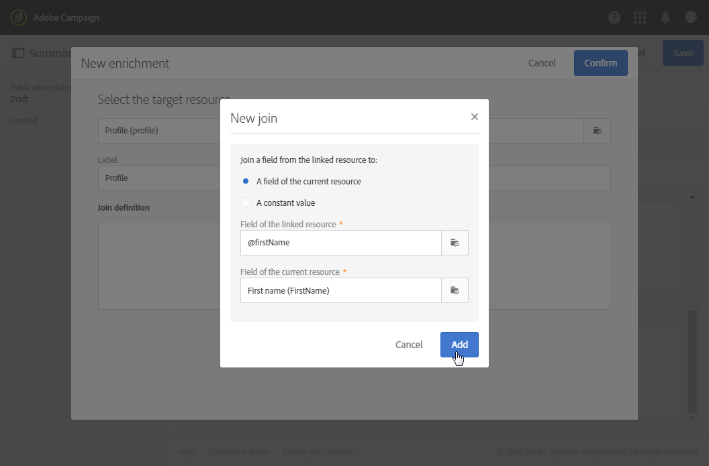
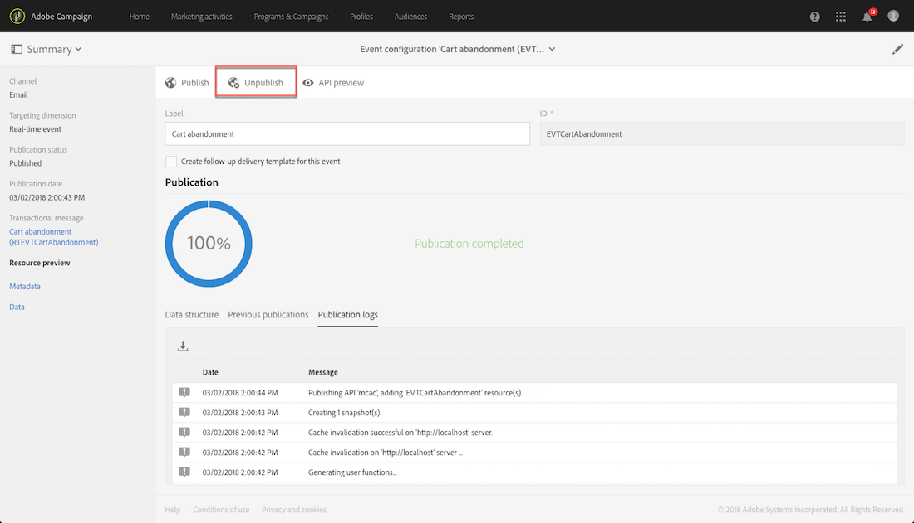

# トランザクションメッセージの設定{#configuring-transactional-messaging}

トランザクションメッセージにAdobe Campaignを送信するには、まずイベントデータの構造を説明する必要があります。

イベントの設定は、 [管理者が次の手順に従って行う必要があります](../../administration/using/users-management.md#functional-administrators) 。

>[!NOTE]
>
>設定は、送信するトランザクションメッセージの種類に応じて異なる場合があります。 詳しくは、 [トランザクションイベント固有の設定を参照してください](#transactional-event-specific-configurations)。

イベントが公開されたら、次の操作を行います。

* Webサイト開発者が使用するAPIがデプロイされ、トランザクションイベントを送信できるようになりました。 詳しくは、Webサイトでのイベントのトリガーの [統合を参照してください](#integrating-the-triggering-of-the-event-in-a-website)。

* 対応するトランザクションメッセージが自動的に作成されます。 See [Getting started with transactional messaging](../../channels/using/getting-started-with-transactional-msg.md).

## イベントの作成 {#creating-an-event}

開始するには、必要に応じてイベントを作成します。

>[!IMPORTANT]
>
>イベント設定を作成するための適切な権限を持つのは、その **[!UICONTROL Administration]** 役割を持ち、 **[!UICONTROL All]** 組織単位に属しているユーザーだけです  。

1. 左上隅の **[!UICONTROL Adobe Campaign]** ロゴをクリックし、**[!UICONTROL Marketing plans]**／**[!UICONTROL Transactional messages]**／**[!UICONTROL Event configuration]** を選択します。
1. 「**[!UICONTROL Create]**」ボタンをクリックします。
1. イベント **[!UICONTROL Label]** にとと **[!UICONTROL ID]** を渡します。 この **[!UICONTROL ID]** フィールドは必須で、プレフィックス「EVT」で始まる必要があります。 このプレフィックスを使用しない場合は、をクリックすると自動的に追加され **[!UICONTROL Create]**&#x200B;ます。

   

   >[!IMPORTANT]
   >
   >IDは、EVTプレフィックスを含めて64文字以下にする必要があります。

1. トランザクションメッセージの送信に使用するチャネルを選択します。 **[!UICONTROL Email]**&#x200B;または、 **[!UICONTROL Mobile (SMS)]** （プッシュ通知） **[!UICONTROL Mobile application]** を選択します。

   >[!NOTE]
   >
   >各イベント設定で使用できるチャネルは 1 つだけです。イベントを作成した後は、チャネルを変更できません。

1. 目的のイベント設定に対応するターゲティングディメンションを選択し、をクリックし **[!UICONTROL Create]**&#x200B;ます。

   イベント自体に含まれるイベントベースのトランザクションメッセージターゲットデータに対し、Adobe Campaignデータベースに含まれるプロファイルベースのトランザクションメッセージターゲットデータに対して、 詳しくは、 [トランザクションイベント固有の設定を参照してください](#transactional-event-specific-configurations)。

>[!NOTE]
>
>作成されたリアルタイムイベントの数は、プラットフォームに影響を与える可能性があります。 最適なパフォーマンスを確保するために、不要になったリアルタイムイベントを削除してください。 See [Deleting an event](#deleting-an-event).

## イベント属性の定義 {#defining-the-event-attributes}

この節では、イベントコンテンツに統合され、トランザクションメッセージをパーソナライズするために使用できる属性を定義します。 **[!UICONTROL Fields]**

フィールドの追加と変更の手順は、 [カスタムリソースの場合と同じです](../../developing/using/configuring-the-resource-s-data-structure.md#adding-fields-to-a-resource)。

>[!NOTE]
>
>多言語トランザクションメッセージを作成する場合は、 **[!UICONTROL AC_language]** IDを使用して追加のイベント属性を定義します。 これは、イベントトランザクションメッセージにのみ適用されます。 イベントの公開後、多言語トランザクションメッセージのコンテンツを編集する手順は、多言語標準の電子メールの手順と同じです。 See [Creating a multilingual email](../../channels/using/creating-a-multilingual-email.md).

## データコレクションの定義 {#defining-data-collections}

イベントコンテンツに、要素の集まりを追加できます。各要素には、複数の属性が含まれます。

このコレクションは、トランザクション用の電子メールで使用して、 [商品リストをメッセージの内容に追加できます](../../channels/using/event-transactional-messages.md#using-product-listings-in-a-transactional-message) 。例えば、商品のリスト（価格、参照番号、数量など）が含まれます。 をリストの各製品に対して設定します。

1. In the **[!UICONTROL Collections]** section, click the **[!UICONTROL Create element]** button.

   

1. コレ追加クションのラベルとID。
1. トランザクションメッセージに表示するす追加べてのフィールドで、リストの各製品を表示します。

   この例では、次のフィールドを追加しました。

   

1. 「 **[!UICONTROL Enrichment]** 」タブを使用すると、コレクションの各アイテムをリッチできます。 これにより、対応する製品リストの要素を、Adobe Campaignデータベースや作成した他のリソースの情報と共にパーソナライズできます。

>[!NOTE]
>
>コレクションの要素を [富化する手順は、「イベントの](#enriching-the-transactional-message-content) 富化」の項で説明されている手順と同じです。 イベントを強化しても、コレクションを強化することはできません。セクション内のコレクション自体にエンリッチメントを追加する必要があり **[!UICONTROL Collections]** ます。

イベントとメッセージが公開されると、このコレクションをトランザクションメッセージで使用できるようになります。

この例のAPIプレビューを次に示します。

**関連トピック：**

* [イベントのプレビューと公開](#previewing-and-publishing-the-event)
* [トランザクションメッセージでの製品リストの使用](../../channels/using/event-transactional-messages.md#using-product-listings-in-a-transactional-message)

## イベントの強化 {#enriching-the-transactional-message-content}

トランザクションメッセージのコンテンツをAdobe Campaignデータベースの情報と共に拡張して、メッセージをパーソナライズすることができます。 例えば、各受信者の姓またはCRM IDから、住所や生年月日などのデータや、プロファイルテーブルに追加された他のカスタムフィールドなどのデータを回復し、送信する情報をパーソナライズできます。

拡張された情報を使用して、トランザクションメッセージのコンテンツを拡張することができ **[!UICONTROL Profile and services Ext API]**&#x200B;ます。 詳しくは、APIの [拡張を参照してください。拡張機能の公開](../../developing/using/step-2--publish-the-extension.md)

この情報は、新しいリソースにも保存できます。 この場合、リソースは、 **[!UICONTROL Profile]** またはリソースに直接、または別のテーブルを介してリ **[!UICONTROL Service]** ソースにリンクされている必要があります。 例えば、以下の設定では、リソースがリソースにリンクされている場合、トランザクションメッセージの内容をカテゴリやIDなどの **[!UICONTROL Product]** リソースからの情報で拡張でき **[!UICONTROL Product]****[!UICONTROL Profile]** ます。

リソースの作成と公開について詳しくは、 [このページを参照してください](../../developing/using/key-steps-to-add-a-resource.md)。

1. In the **[!UICONTROL Enrichment]** section, click the **[!UICONTROL Create element]** button.

   

1. メッセージをリンクするリソースを選択します。 In this case, choose the **[!UICONTROL Profile]** resource.

   

1. ボタンを使用して、選択したリソースのフィールドを、以前にイベントに追加したフィールドの1つにリンクします(イベント属性の **[!UICONTROL Create element]** 定義を参照 )。

   

1. この例では、との **[!UICONTROL Last name]** フィールドを、 **[!UICONTROL First name]****[!UICONTROL Profile]** リソース内の対応するフィールドと調整します。

   

   リソースを使用してトランザクションメッセージのコンテンツを拡張することもで **[!UICONTROL Service]** きます。 For more on services, see this [section](../../audiences/using/creating-a-service.md).

1. プロファイルベースのイベントを作成または編集する場合は、「」 **[!UICONTROL Targeting enrichment]** セクションで、配信の実行中にメッセージターゲットとして使用するエンリッチメントを選択します。

   

   >[!NOTE]
   >
   >プロファイルベースのイベントでは、 **[!UICONTROL Profile]** リソースに基づくターゲット設定エンリッチメントの選択が必須です。

イベントとメッセージが公開されると、このリンクを使用してトランザクションメッセージのコンテンツを拡充できます。

**関連トピック：**

* [イベントのプレビューと公開](#previewing-and-publishing-the-event)。
* [トランザクションメッセージの個人化](../../channels/using/event-transactional-messages.md#personalizing-a-transactional-message)。

## Previewing and publishing the event {#previewing-and-publishing-the-event}

イベントを使用する前に、プレビューして公開する必要があります。

1. ボタンをクリック **[!UICONTROL API preview]** すると、Webサイト開発者が公開前に使用するREST APIのシミュレーションが表示されます。 イベントが公開されると、このボタンをクリックして実稼働中のAPIのプレビューも表示できます。 詳しくは、Webサイトでのイベントのトリガーの [統合を参照してください](#integrating-the-triggering-of-the-event-in-a-website)。

   

   >[!NOTE]
   >
   >REST APIは、選択したチャネルと選択したターゲティングディメンションに応じて異なります。 様々な設定について詳しくは、 [トランザクションイベント固有の設定を参照してください](#transactional-event-specific-configurations)。

1. クリック **[!UICONTROL Publish]** して開始文書を作成します。

   

   Webサイト開発者が使用するAPIがデプロイされ、トランザクションイベントを送信できるようになりました。

1. 対応するタブで、パブリケーションログを表示できます。

   

   >[!IMPORTANT]
   >
   >イベントを変更するたびに、を再度クリックして、Webサイト開発者が使用する更新済みのREST APIを生成する必要があります。 **[!UICONTROL Publish]**

   イベントが公開されると、新しいイベントにリンクされたトランザクションメッセージが自動的に作成されます。

1. このトランザクションメッセージには、左側の領域にあるリンクから直接アクセスできます。

   

イベントがトランザクションメッセージの送信をトリガーするには、作成したばかりのメッセージを変更して発行する必要があります。 [イベントトランザクションメッセージ](../../channels/using/event-transactional-messages.md)を参照してください。

また、このトリガーイベントをWebサイトに統合する必要があります。 詳しくは、Webサイトでのイベントのトリガーの [統合を参照してください](#integrating-the-triggering-of-the-event-in-a-website)。

Adobe Campaign開始がこのイベント設定に関連するイベントを受け取ると、「」の **[!UICONTROL Latest transactional events]** セクションの **[!UICONTROL History]** リンクを使用して、サードパーティのサービスから送信され、Adobe Campaignによって処理された最新のイベントにアクセスできます。

イベント（JSON形式）は、最新のものから最も古いものへと順に表示されます。 このリストを使用すると、イベントの内容やステータスなどのデータを調べ、制御およびデバッグの目的で確認できます。

### イベントの非公開 {#unpublishing-an-event}

この **[!UICONTROL Unpublish]** ボタンをクリックすると、イベントの公開をキャンセルできます。これにより、以前に作成したイベントに対応するリソースがREST APIから削除されます。 これで、Web サイトを通じてイベントがトリガーされた場合でも、対応するメッセージは送信されなくなり、データベースには保存されません。

>[!NOTE]
>
>対応するトランザクションメッセージを既に公開している場合は、トランザクションメッセージの公開もキャンセルされます。 See [Unpublishing a transactional message](../../channels/using/event-transactional-messages.md#unpublishing-a-transactional-message).

ボタンをクリックして、新しいREST APIを生成します。 **[!UICONTROL Publish]**

### トランザクションメッセージの公開プロセス {#transactional-messaging-pub-process}

次の図は、トランザクションメッセージの公開プロセスを示しています。

トランザクションメッセージの公開、一時停止、非公開について詳しくは、 [この節を参照してください](../../channels/using/event-transactional-messages.md#publishing-a-transactional-message)。

### イベントの削除 {#deleting-an-event}

イベントが未公開になった場合、またはイベントがまだ公開されていない場合は、イベント設定リストから削除できます。 手順は次のとおりです。

1. 左上隅の **[!UICONTROL Adobe Campaign]** ロゴをクリックし、**[!UICONTROL Marketing plans]**／**[!UICONTROL Transactional messages]**／**[!UICONTROL Event configuration]** を選択します。
1. 選択したイベント設定にマウスを移動し、 **[!UICONTROL Delete element]** ボタンを選択します。

   

   >[!NOTE]
   >
   >Make sure the event configuration has the **[!UICONTROL Draft]** status, otherwise you will not be able to delete it. The **[!UICONTROL Draft]** status applies to an event that has not been published yet or that has been [unpublished](#unpublishing-an-event).

1. 「**[!UICONTROL Confirm]**」ボタンをクリックします。

   

>[!IMPORTANT]
>
>公開済みで既に使用されているイベント設定を削除すると、対応するトランザクションメッセージとその送信およびトラッキングログも削除されます。

## トランザクションイベントの検索 {#searching-transactional-events}

作成済みのトランザクションイベントにアクセスして検索するには、次の手順に従います。

1. 左上隅の **[!UICONTROL Adobe Campaign]** ロゴをクリックし、**[!UICONTROL Marketing plans]**／**[!UICONTROL Transactional messages]**／**[!UICONTROL Event configuration]** を選択します。
1. 「**[!UICONTROL Show search]**」ボタンをクリックします。

   

1. をフィルターでき **[!UICONTROL Publication status]**&#x200B;ます。 これにより、例えば、公開済みのイベントのみを表示できます。
1. また、を使用してイベントをフィルタリングすることもでき **[!UICONTROL Last event received]**&#x200B;ます。 例えば、10と入力した場合、最後に受け取ったイベントが10日以上前にイベントされた設定のみが表示されます。 これにより、特定の期間非アクティブだったイベントを表示できます。

   

   >[!NOTE]
   >
   >デフォルト値は0です。 すべてのイベントが表示されます。

## Webサイトでのイベントのトリガーの統合 {#integrating-the-triggering-of-the-event-in-a-website}

イベントを作成したら、このイベントのトリガーをWebサイトに組み込む必要があります。

「 [トランザクションメッセージングの動作原則](../../channels/using/getting-started-with-transactional-msg.md#transactional-messaging-operating-principle) 」の節で説明した例では、「買い物かごに製品を購入する前に、顧客の1人がWebサイトを離れたときに常に「買い物かごの放棄」イベントをトリガーする必要があります。 これを行うには、WebサイトのWeb開発者がAdobe Campaign StandardREST APIを使用する必要があります。

詳しくは、 [REST APIドキュメントを参照してください](../../api/using/managing-transactional-messages.md)。

## トランザクションイベント固有の設定 {#transactional-event-specific-configurations}

トランザクションイベントの設定は、送信するトランザクションメッセージ(イベントまたはプロファイル)の種類と、使用するチャネルによって異なります。

以下の節では、目的のトランザクションメッセージに応じて具体的な設定を行う必要がある場合について説明します。 イベントを設定する一般的な手順について詳しくは、「イベントの [作成](#creating-an-event)」を参照してください。

### Event-based transactional messages {#event-based-transactional-messages}

イベントベースのトランザクションメッセージを送信するには、まず、イベント自体に含まれるデータをターゲットにしたイベントを作成および設定する必要があります。
詳しくは、トランザクションメッセージングの [利用を参照してください](https://helpx.adobe.com/jp/campaign/kb/simplify-campaign-management.html#Managedatatofuelengagingexperiences)。

1. イベント設定を作成する場合は、 **[!UICONTROL Real-time event]** ターゲティングディメンションを選択します(イベント [の作成を参照](#creating-an-event))。
1. イベントに追加対するフィールド。トランザクションメッセージをパーソナライズできるようにするために使用します(イベント属性の [定義を参照](#defining-the-event-attributes))。
1. トランザクションメッセージデータベースの追加情報を使用する場合は、Adobe Campaignコンテンツを拡張します(トランザクションメッセージコンテンツの [強化を参照](#enriching-the-transactional-message-content))。

   >[!NOTE]
   >
   >イベントベースのトランザクションメッセージでは、受信者とメッセージコンテンツのパーソナライゼーションを定義するために、送信イベント内のデータのみを使用することが想定されています。ただし、Adobe Campaign データベースの情報を使用して、トランザクションメッセージの内容をエンリッチメントすることができます。

1. イベントをプレビューして公開します(イベントの [プレビューと公開を参照](#previewing-and-publishing-the-event))。

   イベントをプレビューする場合、REST APIには、選択したチャネルに従って電子メールアドレスまたは携帯電話を指定する属性が含まれます。

   イベントが公開されると、新しいイベントにリンクされたトランザクションメッセージが自動的に作成されます。 イベントがトランザクションメッセージの送信をトリガーするには、作成したばかりのメッセージを変更して公開する必要があります。「 [イベントのトランザクションメッセージ](../../channels/using/event-transactional-messages.md)」を参照してください。

1. イベントをWebサイトに統合します(Webサイトでのイベントのトリガーの [統合を参照](#integrating-the-triggering-of-the-event-in-a-website))。

### Profile-based transactional messages {#profile-based-transactional-messages}

プロファイルベースのトランザクションメッセージを送信するには、まず、Adobe Campaignデータベースに含まれるイベントターゲットデータを作成し、設定する必要があります。

1. イベント設定を作成する場合は、 **[!UICONTROL Profile event]** ターゲティングディメンションを選択します(イベント [の作成を参照](#creating-an-event))。
1. イベントに追加対するフィールド。トランザクションメッセージをパーソナライズできるようにするために使用します(イベント属性の [定義を参照](#defining-the-event-attributes))。 エンリッチメントを作成するには、少なくとも1つのフィールドを追加する必要があります。 Adobe Campaignデータベースのパーソナライゼーションフィールドを使用できるように、 **姓** 、 **姓などの他のフィールドを作成する必要はありません** 。
1. エンリッチメントを作成して、イベントをリソースにリンクします(トランザクションメッセージコンテンツの **[!UICONTROL Profile]** 強化を参照 )。 エンリッチメントの作成は、 **[!UICONTROL Profile]** ターゲティングディメンションを使用する場合に必須です。
1. イベントをプレビューして公開します(イベントの [プレビューと公開を参照](#previewing-and-publishing-the-event))。

   イベントをプレビューする場合、REST APIには、電子メールアドレスまたは携帯電話を指定する属性が含まれていません。この属性は、リ **[!UICONTROL Profile]** ソースから取得されます。

   イベントが公開されると、新しいイベントにリンクされたトランザクションメッセージが自動的に作成されます。 イベントがトランザクションメッセージの送信をトリガーするには、作成したばかりのメッセージを変更して発行する必要があります。詳しくは、「プロファイルトランザクションメッセージの [送信](../../channels/using/profile-transactional-messages.md#sending-a-profile-transactional-message)」を参照してください。

1. イベントをWebサイトに統合します(Webサイトでのイベントのトリガーの [統合を参照](#integrating-the-triggering-of-the-event-in-a-website))。

### イベントベースのトランザクションプッシュ通知 {#event-based-transactional-push-notifications}

トランザクションプッシュ通知を送信できるようにするには、それに応じてAdobe Campaignを設定する必要があります。 プ [ッシュ設定を参照してください](https://docs.adobe.com/content/help/ja-JP/campaign-standard/using/administrating/configuring-channels/configuring-a-mobile-application.translate.html)。

匿名トランザクションプッシュ通知を、モバイルアプリケーションからの通知の受信をオプトインしているすべてのイベントに送信するには、まず、ユーザー自体に含まれるデータをターゲットにしたイベントを作成し、設定する必要があります。 対応する手順を以下に示します。

イベントには、次の3つの要素を含める必要があります。

* **登録トークン**。1つのモバイルアプリケーションと1つのデバイスのユーザーIDです。 Adobe Campaignデータベースのプロファイルに対応していない場合があります。
* モ **バイルアプリケーション名** (すべてのデバイス（AndroidおよびiOS）。 これは、Adobe Campaignで設定されたモバイルアプリケーションのIDで、ユーザーのデバイスでのプッシュ通知の受信に使用されます。 詳しくは、この[ページ](https://docs.adobe.com/content/help/ja-JP/campaign-standard/using/administrating/configuring-channels/configuring-a-mobile-application.translate.html)を参照してください。
* プッ **シュプラットフォーム** （Androidの場合は「gcm」、iOSの場合は「apns」）。

1. イベント設定を作成する場合は、 **[!UICONTROL Mobile application]** チャネルと **[!UICONTROL Real-time event]** ターゲティングディメンションを選択します(イベント [の作成を参照](#creating-an-event))。
1. イベントに追加対するフィールド。トランザクションメッセージをパーソナライズできるようにするために使用します(イベント属性の [定義を参照](#defining-the-event-attributes))。
1. トランザクションメッセージデータベースの追加情報を使用する場合は、Adobe Campaignコンテンツを拡張します(トランザクションメッセージコンテンツの [強化を参照](#enriching-the-transactional-message-content))。

   >[!NOTE]
   >
   >イベントベースのトランザクションメッセージでは、受信者とメッセージコンテンツのパーソナライゼーションを定義するために、送信イベント内のデータのみを使用することが想定されています。ただし、Adobe Campaign データベースの情報を使用して、トランザクションメッセージの内容をエンリッチメントすることができます。

1. イベントをプレビューして公開します(イベントの [プレビューと公開を参照](#previewing-and-publishing-the-event))。

   イベントをプレビューする場合、REST APIには、配信のターゲットに使用される「registrationToken」、「application」および「pushPlatform」属性が含まれます。

   

   イベントが発行されると、新しいイベントにリンクされたトランザクションプッシュ通知が自動的に作成されます。 作成されたメッセージを変更して公開する方法については、イベントを対象としたトランザクションプッシュ通知の [送信を参照してください](../../channels/using/transactional-push-notifications.md#transactional-push-notifications-targeting-an-event)。

1. イベントをWebサイトに統合します(Webサイトでのイベントのトリガーの [統合を参照](#integrating-the-triggering-of-the-event-in-a-website))。

### プロファイルベースのトランザクションプッシュ通知 {#profile-based-transactional-push-notifications}

モバイルアプリケーションをサブスクライブしているAdobe Campaignプロファイルにトランザクションプッシュ通知を送信するには、まずAdobe Campaignデータベースをターゲットにしたイベントを作成し、設定する必要があります。

1. イベント設定を作成する場合は、 **[!UICONTROL Mobile application]** チャネルと **[!UICONTROL Profile]** ターゲティングディメンションを選択します(イベント [の作成を参照](#creating-an-event))。

   デフォルトでは、トランザクションプッシュ通知は、受信者がサブスクライブしているすべてのモバイルアプリケーションに送信されます。 特定のモバイルアプリケーションにプッシュ通知を送信するには、リストでそのアプリケーションを選択します。 その他のモバイルアプリはメッセージの対象になりますが、送信から除外されます。

   

1. イベントに追加対するフィールドに値を入力します。トランザクションメッセージをパーソナライズする場合は、「イベント属性の [定義](#defining-the-event-attributes)」を参照してください。

   >[!NOTE]
   >
   >エンリッチメントを作成するには、少なくとも1つのフィールドを追加する必要があります。 Adobe Campaignデータベースのパーソナライゼーションフィールドを使用できるように、 **姓** 、 **姓などの他のフィールドを作成する必要はありません** 。

1. エンリッチメントを作成して、イベントをリソースにリンクします(トランザクションメッセージコンテンツの **[!UICONTROL Profile]** 強化を参照 )。 エンリッチメントの作成は、 **[!UICONTROL Profile]** ターゲティングディメンションを使用する場合に必須です。
1. イベントをプレビューして公開します(イベントの [プレビューと公開を参照](#previewing-and-publishing-the-event))。

   イベントをプレビューする場合、REST APIには、登録トークン、アプリケーション名、プッシュプラットフォームを指定する属性は含まれません。これらの属性は、 **[!UICONTROL Profile]** リソースから取得されます。

   イベントが発行されると、新しいイベントにリンクされたトランザクションプッシュ通知が自動的に作成されます。 作成されたメッセージを変更して公開する方法については、プロファイルを対象としたトランザクションプッシュ通知の [送信を参照してください](../../channels/using/transactional-push-notifications.md#transactional-push-notifications-targeting-a-profile)。

1. イベントをWebサイトに統合します(Webサイトでのイベントのトリガーの [統合を参照](#integrating-the-triggering-of-the-event-in-a-website))。

### フォローアップメッセージを送信するイベントの設定 {#configuring-an-event-to-send-a-follow-up-message}

フォローアップメッセージは、定義済みのマーケティング配信テンプレートで、特定のトランザクションメッセージの受信者にメッセージを送信するためにワークフローで使用できます。 For more on this, see [Follow-up messages](../../channels/using/follow-up-messages.md).

1. イベントトランザクションメッセージの送信に作成したのと同じイベント設定を使用します。 See [Event-based transactional messages](#event-based-transactional-messages).
1. イベントを設定する場合は、イベントを公開する前に **[!UICONTROL Create follow-up delivery template for this event]** ボックスをオンにします。

   

1. イベントをプレビューして公開します(イベントの [プレビューと公開を参照](#previewing-and-publishing-the-event))。

   イベントが公開されると、新しいイベントにリンクされたトランザクションメッセージとフォローアップ配信テンプレートが自動的に作成されます。 フォローアップメッセージの使用方法について詳しくは、「フォローアップメッセージの [送信](../../channels/using/follow-up-messages.md#sending-a-follow-up-message)」を参照してください。

## 使用例：トランザクションメッセージを送信するイベントの設定 {#use-case--configuring-an-event-to-send-a-transactional-message}

この例では、Webサイトでの購入のたびに次の前提条件を満たした確認メッセージを送信するようにイベントを設定します。

CRM IDを使用して顧客を識別するには、まず、この新しいフィールドを使用して **[!UICONTROL Profile]** リソースが拡張されていることを確認します。

同様に、購入に対応するカスタムリソースが作成および発行され、リソースにリンクされている必要があり **[!UICONTROL Profile]** ます。 この方法を使用すると、このリソースから情報を取得して、メッセージの内容を拡張できます。

リソースの作成と公開について詳しくは、 [このページを参照してください](../../developing/using/key-steps-to-add-a-resource.md)。

1. チャネルと **[!UICONTROL Email]** ターゲティングディメンションを使用して新しいイベントを作成します( **[!UICONTROL Profile]** イベントの [作成を参照](#creating-an-event))。
1. トランザクションメッセージをパーソナライズするために使用できる属性を定義します。 この例では、「CRM ID」フィールドと「イベントID」フィールドを追加します(製品属性の [定義を参照](#defining-the-event-attributes))。

   

1. クライアントの以前の購入に関する情報でメッセージの内容を拡張するには、 **[!UICONTROL Purchase]** トランザクションメッセージをターゲットにしたエンリッチメントを作成します(「リソースの内容の [強化](#enriching-the-transactional-message-content)」を参照)。

   

1. 以前にメッセージに追加した「製品識別子」フィールドと、対応するリソースのフィールドとの結合条件を作成し **[!UICONTROL Purchase]** ます。

   

1. イベントをプレビューして公開します(イベントの [プレビューと公開を参照](#previewing-and-publishing-the-event))。
1. イベントをWebサイトに統合します(Webサイトでのイベントのトリガーの [統合を参照](#integrating-the-triggering-of-the-event-in-a-website))。

