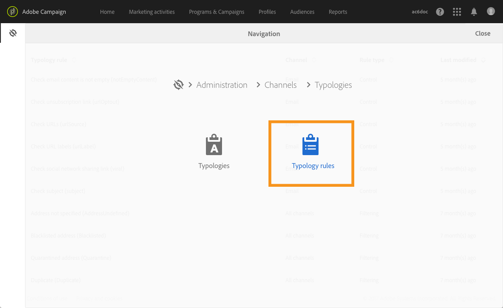
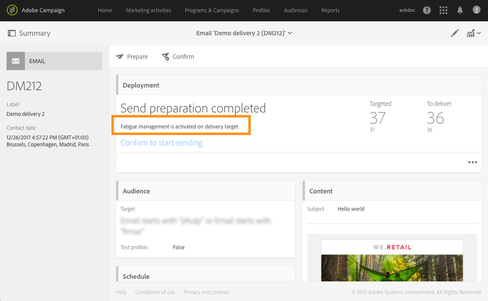
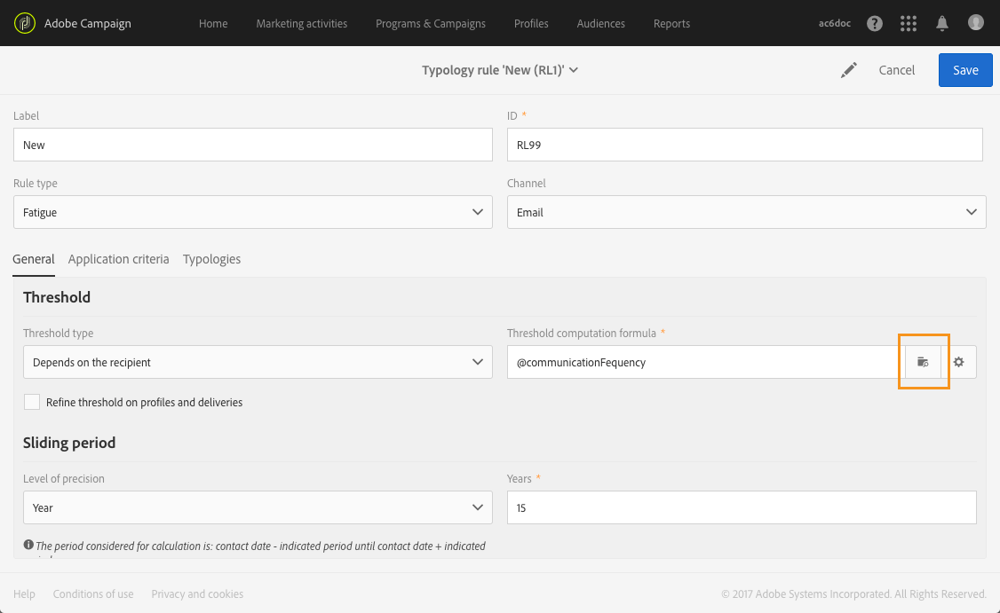
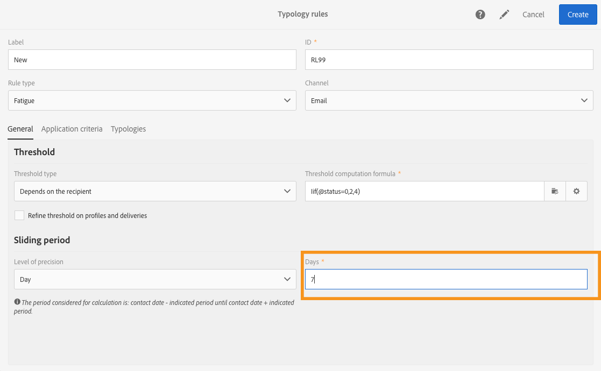

# 疲労ルール{#fatigue-rules}

## 疲労規則について {#about-fatigue-rules}

疲労ルールを使用すると、マーケティング担当者はグローバルなクロスチャネルビジネスルールを設定して、キャンペーンからのプロシークプロファイルを自動的に除外することができます。

疲労ルールを実装するには、プロファイルごとのメッセージの最大数を定義し、ルールを適用する期間を選択します。配信準備中は、既に送信されているメッセージの数に応じて、配信からプロファイルが除外されます。

>[!NOTE]
>
>疲労ルールを適用するには、配信の連絡先日付を定義する必要があります。メッセージをすぐに送信するように選択した場合、疲労ルールは適用されません。

関連トピック:

* [準備](../../administration/using/configuring-email-channel.md#preparation)
* [誤字の管理](../../administration/using/about-typology-rules.md#managing-typologies)
* [タイポロジルール](../../administration/using/about-typology-rules.md#typology-rules)
* [連絡先の疲労を防ぐために通信頻度を最適化する](https://helpx.adobe.com/campaign/kb/simplify-campaign-management.html#Engageyourcustomersateverystep)

## 疲労ルールの作成 {#creating-a-fatigue-rule}

**[!UICONTROL Fatigue]** タイポロジルールを作成および設定するには、次の手順を適用します。

1. Adobe Campaignロゴをクリックし、インターフェイスの左上隅に **[!UICONTROL Administration]** ある/ **[!UICONTROL Channels]** &gt; **[!UICONTROL Typologies]** &gt;を選択 **[!UICONTROL Typology rules]**&#x200B;します。

   

1. タイポロジルールのリストから、をクリック **[!UICONTROL Create]**&#x200B;します。

   

1. **[!UICONTROL Rule type]** フィールドで、を選択 **[!UICONTROL Fatigue]**&#x200B;します。

   

1. **[!UICONTROL Channel]** フィールドで、ルールが適用するチャネルを選択します。1つのチャネル（電子メール、SMS、ダイレクトメール、モバイルアプリケーション）を選択するか、または選択 **[!UICONTROL All channels]**&#x200B;します。チャネル [の選択を参照](../../administration/using/fatigue-rules.md#choosing-the-channel)してください。

   

1. **[!UICONTROL General]** タブで、プロファイルごとのメッセージの最大数を計算する方法を定義します。定数しきい値または変数を選択できます。プロファイルおよび配信のしきい値を調整することもできます。これについて詳しくは、しきい値 [の定義](../../administration/using/fatigue-rules.md#defining-the-threshold)を参照してください。

   

1. タイポロジルール **[!UICONTROL Sliding period]** を適用する場所を選択します。詳しくは、スライド期間 [の設定](../../administration/using/fatigue-rules.md#setting-the-sliding-period)を参照してください。

   

   この例では（以前のスクリーンショットを参照）、スライド期間15日間の最大4つのメッセージを送信するように選択しています。

1. **[!UICONTROL Application criteria]** タブでは、このルールをすべての配信に適用したり、送信するメッセージに従ってルールの適用性を制限したりできます。ルールは、アプリケーション条件が満たされた場合にのみ実行されます。例えば、特定の単語から始まるラベルまたは特定のレターを含むIDでのみルールを適用できます。詳しくは、フィルタリングルールの適用性 [の制限](../../administration/using/filtering-rules.md#restricting-the-applicability-of-a-filtering-rule)を参照してください。

   

1. **[!UICONTROL Typologies]** タブを選択し、配信に使用するタイポロジルールにリンクします。詳しく [は、タイポロジ](../../administration/using/about-typology-rules.md#managing-typologies) および [タイポロジルールの管理](../../administration/using/about-typology-rules.md#typology-rules)を参照してください。

   

   >[!NOTE]
   >
   >タイポロジは、このテンプレートを使用して作成されたすべての配信に自動的に適用されるように、配信テンプレートで定義できます。

配信の準備中、配信済みの配信の数に応じて、配信からプロファイルが除外されます。配信ログで疲労ルールの実行結果を表示できます。詳しくは、疲労結果 [の表示](../../administration/using/fatigue-rules.md#viewing-the-fatigue-results)を参照してください。

>[!CAUTION]
>
>疲労ルールが機能するには、配信の連絡先日付を定義する必要があります。メッセージをすぐに送信するように選択した場合、疲労ルールは適用されません。

## チャネルの選択 {#choosing-the-channel}

様々なチャネルで疲労ルールを使用できます。チャネルは、タイポロジルール設定の **[!UICONTROL Channel]** フィールドに定義されています。1つのチャネルを選択するか、または選択 **[!UICONTROL All channels]**&#x200B;します。

**使用可能なチャネル**

以下のチャネルを使用できます。

* 電子メール
* モバイル（SMS）
* ダイレクトメール
* モバイルアプリケーション:このチャネルを使用すると、プロファイルまたはアプリの購読者にプッシュ通知を送信できます。プロファイルに通知を送信する場合、それらはマルチチャネルの疲労ルールと互換性があります。

   >[!CAUTION]
   >
   >疲労ルールは、アプリの購読者に送信されるプッシュ通知と互換性がありません。アプリの購読者にメッセージを送信している場合、疲労ルールは適用されません。

* すべてのチャネル:このオプションを使用すると、ルールをすべてのチャネルに適用できます。例えば、チャネルごとに最大3つのメッセージを毎月送信するように指定できます。1週間に2通の電子メールをプロファイルに送信し、プッシュ通知を送信しようとすると、同じプロファイルが除外されます。

**配信タイプ**

疲労ルールは、すべての配信タイプと互換性があります。1件のショット配信、定期配信、ワークフロー配信およびトランザクションメッセージ。

**トランザクションメッセージ** は、リマーケティングメッセージなど、マーケティングメッセージ（RTV）とマーケティングメッセージ（ターゲットプロファイル）をターゲット化するために使用できます。疲労ルールはマーケティングメッセージにのみ互換性があります（ターゲットプロファイル）。イベントトランザクションメッセージにはプロファイル情報は含まれません。したがって、プロファイルを使用した拡張の場合でも、疲労ルールと互換性がありません。トランザクションメッセージでマーケティングメッセージをサポートすると、マーケティング **トランザクションメッセージ**&#x200B;を含むすべてのチャネルに疲労ルールを適用できます。

## しきい値の定義 {#defining-the-threshold}

各疲労ルールは、特定の期間に1つのプロファイルに送信できるメッセージの最大数を表すしきい値を定義します。このしきい値に到達すると、考慮された期間の終わりまで、配信を増やすことができません。このプロセスにより、メッセージがセットしきい値を超えた場合に、それを防ぐために、自動的に配信からプロファイルを除外することができます。

しきい値には、定数または変数を指定できます。つまり、特定の期間において、しきい値はプロファイル間で異なるか、同じプロファイルに対しても異なることがあります。

**修正しきい値の使用**

しきい値は、関連期間中にプロファイルに送信できるメッセージの最大数を表します。

デフォルトでは、しきい値は一定であり、ルールによって許可されるメッセージの最大数を示す必要があります。

**変数のしきい値の使用**

変数のしきい値を定義するには、フィールド内の **[!UICONTROL Depends on the recipient]** 値を選択 **[!UICONTROL Threshold type]** します。

次に2つのオプションがあります。

* プロファイルフィールドを選択します。しきい値は、選択したフィールドに従って各プロファイルによって異なります。例えば、「通信頻度」フィールドのプロファイルリソースを拡張している場合は **[!UICONTROL Threshold computation formula]** 、フィールドの右側のボタンをクリックして、フィールドを選択します。各プロファイルについて、しきい値が「通信頻度」フィールドの値になります。

   

* 数式を定義します。 **[!UICONTROL Threshold computation formula]** フィールドの右側の2番目のボタンをクリックして、高度なしきい値計算数式を定義します。例えば、プロファイルが属しているセグメントに応じて、認証されたメッセージの数をインデックス化できます。つまり、"Web"セグメントに属するプロファイルは、他のプロファイルよりも多くのメッセージを受け取ることがあります。**[!UICONTROL Iif (@origin='Web', 5, 3)]** タイプ数式では、Webセグメントのプロファイルに5つのメッセージを配信し、他のセグメントに対して3つのメッセージを配信します。

   

**プロファイルと配信におけるしきい値の調整**

デフォルトでは、すべてのメッセージがしきい値の計算に考慮されます。配信の準備時にカウントするプロファイルと配信をフィルターする **[!UICONTROL Refine Threshold on profiles and deliveries]** には、チェックボックスをオンにします。

次の例では、男性プロファイルのみがカウントされ、 **ニュースレター** から始まるラベルの付いた配信のみがカウントされます。

配信時のしきい値の調整は、ルール全体（ **[!UICONTROL Application criteria]** タブ）の適用性を制限するのとは異なります。

* **[!UICONTROL Application criteria]**:を選択します。例えば、アプリケーション条件が「ニュースレターで始まる」の場合、ルールはこの条件を適用する配信にのみ適用されます。配信のラベルが「プロモーション」で始まる場合、ルールはまったく実行されません。
* **[!UICONTROL Refine threshold on profiles and deliveries > Deliveries to count]**:このタイポロジルールを使用して配信するすべての配信は、ルールを実行しますが、過去の配信とスケジュールされた配信をカウントします。例えば、制限が「ニュースレターで始まる」の場合、配信ラベルが「プロモーション」で始まる場合でも、ルールは実行されます。選択したスライド期間に対して、ラベルが「ニュースレター」で始まる配信の数が表示されます。

## スライディング期間の設定 {#setting-the-sliding-period}

疲労ルールは、周期的な周期で定義されます。期間は、2週間、7日間、5時間など **[!UICONTROL Sliding period]** のセクションで設定されます。

ルールが実行されると、過去の配信とスケジュール済み配信の両方が考慮されます。これにより、所定のスライド期間でのしきい値を超えないようにすることが保証されます。

例えば、48時間の期間を定義した場合、連絡先日から48時間 **前に48時間の** 予定日 ****&#x200B;が表示されます。したがって、将来の配信と以前の配信の統合を有効にするために、選択した期間が2倍になります。

配信を2週間に制限するには、「スライディング期間»セクションで?«日»または?«1 ************&#x200B;配信日の7日前に送信され、ルールが適用された配信日から最長7日経過した配信は、計算で考慮されます。

## 疲労の結果の表示 {#viewing-the-fatigue-results}

配信の準備中、配信済みの配信の数に応じて、配信からプロファイルが除外されます。疲労ルールの実行結果を表示するには、 **[!UICONTROL Deployment]** ブロックの右下隅にあるボタンをクリックします。

3つのタブを使用して、適用したルールの名前を含む疲労実行結果の詳細を表示できます。

* 配信ログ:

   

* 除外ログ:

   

* 除外の原因:

   

## 疲労ルールサマリレポートの表示 {#viewing-the-fatigue-rule-summary-report}

Adobe Campaignでは、疲労ルールに関する専用レポートを使用して、キャンペーンにどのように適用されるかを把握できます。これにより、キャンペーンが相互に影響を与え、適切な調整を行うことができます。

レポートは **[!UICONTROL Fatigue rules summary]** 、ボタンから **[!UICONTROL Reports]** アクセスし、各プログラム、キャンペーン、メッセージの右上隅に表示されます。

画面の左側にある[配信日]のレポートデータをフィルタできます。デフォルトでは、選択した期間が現在の日付より15日前に開始され、15日後に終了します。特定の疲労ルールでもフィルタリングできます。

円グラフには、選択した期間に関する次の情報が表示されます。

* **[!UICONTROL Total targeted]**:メッセージの準備前の合計ターゲット
* **[!UICONTROL Excluded]**:疲労ルールアプリケーションによる除外の合計数
* **[!UICONTROL Other exclusions]**:他のタイポロジルールによる除外の総数
* **[!UICONTROL To deliver]**:メッセージの準備後に配信するメッセージの合計数（ **[!UICONTROL To deliver]** = **[!UICONTROL Total targeted]** - **[!UICONTROL Excluded]** - **[!UICONTROL Other exclusions]** ）

グラフの右側には、疲労ルールによる除外の数が表示されます。

下の表には、選択した期間内のすべての配信が表示されます。配信ごとに、適用される疲労ルールと、対応する除外を確認できます。連絡先日付を持たない配信もテーブルに表示されます。

* **[!UICONTROL 0]** は、疲労ルールが適用されたが、除外がなかったことを意味します。
* **[!UICONTROL -N]** は、N除外が発生したことを意味します。
* 空のフィールドは、疲労ルールが適用されなかったことを意味します。

>[!NOTE]
>
>表示されるデータは、レポートにアクセスするプログラム、メッセージ、キャンペーンのコンテキストには依存しません。このレポートには、すべての組織単位のすべての疲労ルールと配信が表示されます。これにより、キャンペーンが他のユーザーによってどのように影響を受けるかを把握するために、すべての配信のグローバルビューを取得できます。

## 例 {#examples}

疲労管理の導入には多くの可能性があります。次に、実行できる操作の例を示します。

* すべてのチャネルに適用される **一定のしきい値** を使用して、疲労ルール **を作成**&#x200B;します。

   例えば、スライディング期間7日間の一定のしきい値を持つマルチチャネルルールを作成します。

   先週、プレミアムプロファイルにプロモーション用の電子メールとトランザクションリマーケティングの電子メールが届きました。また、次の週に送信されるSMSもスケジュールされています。今日は、すべてのプロファイルのプッシュ通知を送信することを決定します。2週間の期間にわたるメッセージの最大数に達したので、プレミアムプロファイルは今日のプッシュから除外されます。

   

* プロファイルフィールドに基づいて **可変のしきい値** を使用して、疲労ルール **を作成**&#x200B;します。

   「通信制限」フィールドのプロファイルリソースを拡張して、プロファイルごとに異なるしきい値を定義しています。疲労ルールで、このフィールドに基づいて変数のしきい値を定義し、2日間のスライディング期間を選択します。次の2つのプロファイルの例を見てみましょう。Johnの通信制限は1で、Davidはしきい値2です。どちらの場合も、昨日ニュースレター電子メールを受信しています。今すぐ電子メールを送信します。ターゲットから除外されたので、Davidのみが受信します。

   

* **しきい値計算数式を使用して、疲労ルールを作成**&#x200B;します。

   プロファイルの年齢に応じてしきい値を変更したい。プロファイルが40未満の場合、上限4と古いプロファイルの制限を2に制限します。このしきい値を拡張フィールドと共に各プロファイルに定義する代わりに、疲労ルールに直接数式を作成して、プロファイルの年齢に従ってしきい値を計算できます。この例では、数式があり **[!UICONTROL Iif (@age<40, 4, 2)]**&#x200B;ます。

   

   >[!NOTE]
   >
   >この節では、しきい値計算数式を使用した疲労ルールの例を示します。

* プロファイルと配信のしきい値を **調整する** 疲労ルールを作成します。

   「スコア」フィールドのプロファイルリソースが拡張され、「タイプ」フィールドの配信リソースも拡張されました。3の定数しきい値を定義したいが、「アラート」または「ブラックフライデー」というタイプのすべての配信と、10を超えるスコアのあるすべてのプロファイルから除外したい場合。ルールが実行されると、過去およびスケジュール済み配信の間に、過去の配信とスケジュールされた配信の間で、スコアが10未満のプロファイルに送信されるすべての配信が、「アラート」または「ブラックフライデー」に送信されます。

   

しきい値計算数式を使用して、疲労ルールの例を以下に示します。

この使用事例では、毎週2つ以上のメッセージをプレミアムプロファイルに配信し、週ごとに2メッセージを標準プロファイルに配信するためのタイポロジルールを作成します。

顧客と見込み客を特定するために、プロファイルリソースを拡張しました。この **[!UICONTROL Status]** フィールドには、プレミアムプロファイルの場合は0、標準プロファイルには1が含まれていました。

ルールを作成するには、次の手順を適用します。

1. **新しい疲労** タイプのタイポロジルールを作成します。
1. **[!UICONTROL Threshold]** このセクションでは、各プロファイルに応じてしきい値を計算する数式を作成します。フィールドの **[!UICONTROL Depends on the recipient]** 値を選択 **[!UICONTROL Threshold type]** し、 **[!UICONTROL Threshold computation formula]** フィールドの右側にある2番目のボタンをクリックします。

   

1. **[!UICONTROL List of functions]** セクションで、ノードの **Iif** 関数をダブルクリック **[!UICONTROL Others]** します。

   

1. 次に、セクションでプロファイル **のステータス** を選択 **[!UICONTROL Available fields]** します。

   

1. 必要な値を入力して、次の数式を作成します。 **Iif（@ status=0,2,4）**

   

   この数式では、ステータスが0の場合は2、他のすべてのステータスについては4を割り当てることができます。

1. をクリック **[!UICONTROL Confirm]** して、数式を承認します。
1. ルールを適用する **[!UICONTROL Sliding period]** 対象を示します。この場合7日のうちに、考慮した配信を2週間の期間に制限します。

   

1. これで、配信に適用するために作成したルールを、タイポロジにリンクします。これを行うには、タブを **[!UICONTROL Typologies]** 選択し、配信に使用するタイポロジをクリック **[!UICONTROL Create element]** して選択します。

   

1. 作成するルールを保存します。

ルールは、タイポロジに基づいてすべての配信に適用されます。
