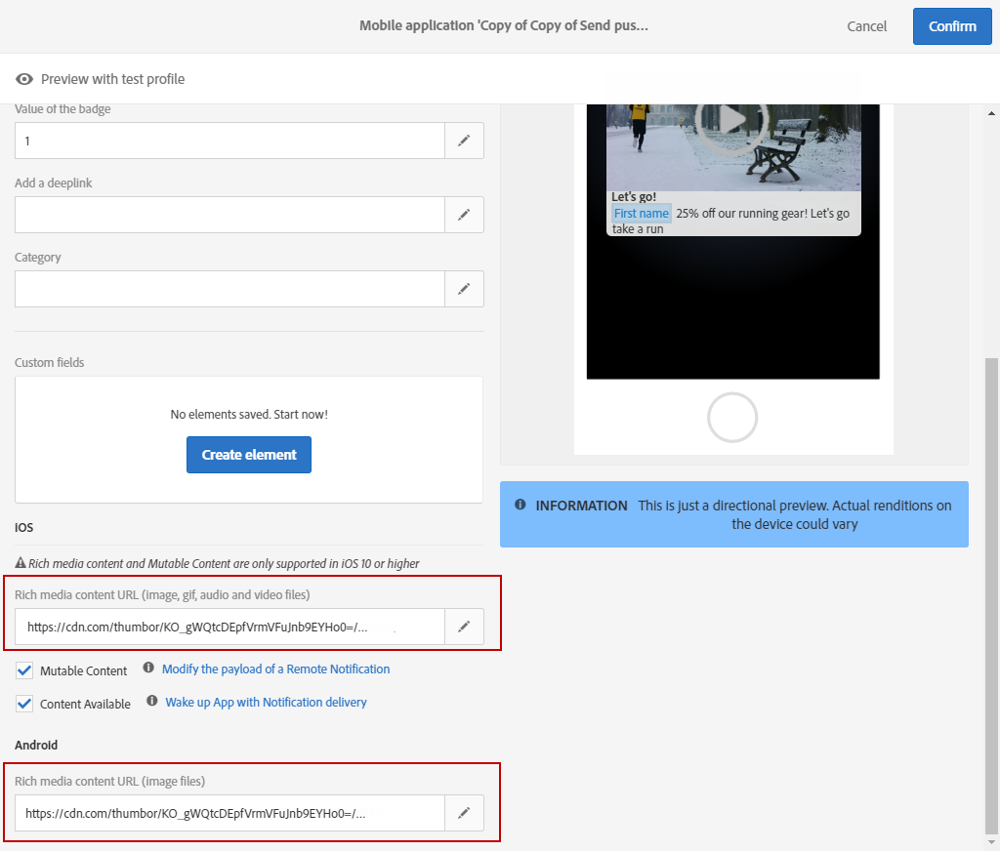
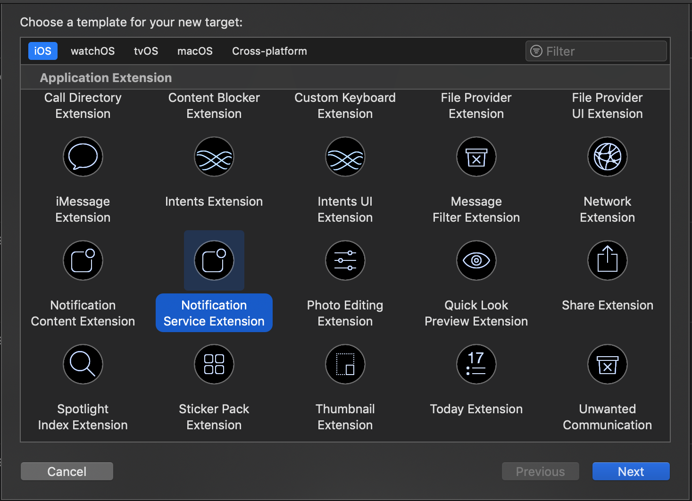

# 画像とビデオの追加（iOS） {#image-push}

>[!NOTE]
>
>このドキュメントは、iOS デバイスにのみ適用されます。

このドキュメントでは、Adobe Campaign Standard iOS プッシュ通知から画像を表示する方法について説明します。

## 手順1：プッシュ通知の設定 {#set-up-push}

プッシュ通知は、Experience Platform SDKでサポートされています。

プッシュ通知を受信するモバイルアプリケーションは、Adobe Campaign インターフェイスで管理者が設定する必要があります。

Adobe CampaignとAdobe Mobile Servicesの両方を設定すると、モバイルアプリケーションのデータをキャンペーンに使用できるようになります。 詳しくは、この[ページ](../../administration/using/configuring-a-mobile-application.md)を参照してください。

Experience Cloud SDK アプリケーションでプッシュ通知を送信するには、モバイルアプリをデータ収集UIで設定し、Adobe Campaignで設定する必要があります。 詳しくは、この[ページ](../../administration/using/configuring-a-mobile-application.md#channel-specific-config)を参照してください。

## 手順2:Adobe Campaignでプッシュ通知をカスタマイズする {#customize-push}

Adobe Campaign では、プッシュ通知のデザイン中に一連の詳細設定オプションにアクセスして、プッシュ通知を微調整することができます。

1. プッシュ通知の作成。 詳しくは、この[ページ](../../channels/using/preparing-and-sending-a-push-notification.md)を参照してください。

1. プッシュ通知コンテンツ ページから、**[!UICONTROL Advanced options]** セクションにアクセスします。

1. ファイルのURLを&#x200B;**[!UICONTROL Rich media content URL]** フィールドに入力します。
iOS 10 以降では、画像、gif、オーディオおよびビデオのファイルを挿入できます。

   

1. プッシュ通知をプレビューして保存します。

## 手順3：モバイルアプリケーションコードの適応 {#mobile-app-code}

Adobe Campaignでプッシュ通知をカスタマイズした後、モバイルアプリケーションを設定して、画像をデバイスに表示する必要があります。

>[!NOTE]
>
>アプリケーションがObjective-Cの場合は、次の[&#x200B; ドキュメント &#x200B;](https://experienceleague.adobe.com/docs/mobile-services/ios/messaging-ios/push-messaging/c-set-up-rich-push-notif-ios.html)を参照してください。

アプリが[!DNL Swift]にある場合は、次の手順に従います。

1. [!DNL Xcode] プロジェクトを開きます。

1. [!DNL Xcode] プロジェクトで、**[!UICONTROL File]** > **[!UICONTROL New]** > **[!UICONTROL Target]**&#x200B;を選択します。

1. 「**[!UICONTROL Notification Service Extension]**」を選択します。

   

1. **NotificationService.swift** ファイルクラスが作成されていることを確認します。

1. このクラスを編集し、デフォルトコンテンツを次の内容に置き換えます。
これにより、アプリケーションは受信パラメーターを画像URLで処理し、それを解析し、ローカルにコピーして、プッシュ通知から表示できます。

   ```
   import UserNotifications
   
   class NotificationService: UNNotificationServiceExtension {
   
   var contentHandler: ((UNNotificationContent) -> Void)?
   var bestAttemptContent: UNMutableNotificationContent?
   
   override func didReceive(_ request: UNNotificationRequest, withContentHandler contentHandler: @escaping (UNNotificationContent) -> Void) {
       self.contentHandler = contentHandler
       bestAttemptContent = (request.content.mutableCopy() as? UNMutableNotificationContent)
   
       if let bestAttemptContent = bestAttemptContent {
           var urlString:String? = nil
           if let urlImageString = request.content.userInfo["media-attachment-url"] as? String {
               urlString = urlImageString
           }
   
           if urlString != nil, let fileUrl = URL(string: urlString!) {
               print("fileUrl: \(fileUrl)")
   
               // Download the attachment
               URLSession.shared.downloadTask(with: fileUrl) { (location, response, error) in
                   if let location = location {
                       // Move temporary file to remove .tmp extension
                       if (error == nil) {
                           let tmpDirectory = NSTemporaryDirectory()
                           let tmpFile = "file://".appending(tmpDirectory).appending(fileUrl.lastPathComponent)
                           let tmpUrl = URL(string: tmpFile)!
                           try! FileManager.default.moveItem(at: location, to: tmpUrl)
   
                           // Add the attachment to the notification content
                           if let attachment = try? UNNotificationAttachment(identifier: fileUrl.lastPathComponent, url: tmpUrl) {
                               bestAttemptContent.attachments = [attachment]
                               }
                       }
                       if(error != nil) {
                           print("Failed to download attachment: \(error.debugDescription)")
                       }
                   }
                   // Serve the notification content
                   contentHandler(bestAttemptContent)
               }.resume()
           }
       }
   }
   
   override func serviceExtensionTimeWillExpire() {
       // Called just before the extension will be terminated by the system.
       // Use this as an opportunity to deliver your "best attempt" at modified content, otherwise the original push payload will be used.
       if let contentHandler = contentHandler, let bestAttemptContent = bestAttemptContent {
           contentHandler(bestAttemptContent)
       }
   }
   
   }
   ```

通知の送信中に、モバイルは次のペイロードを受け取る必要があります。

画像URLは、キーmedia-attachment-urlでマッピングされます。 これは、画像をダウンロードして表示するために、アプリケーションコードの観点から処理する必要があるキーと値のペアです。

```
userInfo: [AnyHashable("media-attachment-url"): https://pbs.twimg.com/profile_images/876737835314950144/zPTs9b7o.jpg, AnyHashable("_dId"): 1de3ef93, AnyHashable("_mId"): h280a5, AnyHashable("aps"): {
 
    alert =     {
 
        body = "Message Body here";
 
        title = "This a push from Campaign";
 
    };
 
    badge = 1;
 
    "mutable-content" = 1;
 
}]
```

## 手順4：プッシュの送信をテストする {#test-send-push}

これで、上記の手順2で作成したアプリケーションと配信の構築をテストできます。 プッシュ通知の準備と送信について詳しくは、この[&#x200B; ページ &#x200B;](../../channels/using/preparing-and-sending-a-push-notification.md)を参照してください。


