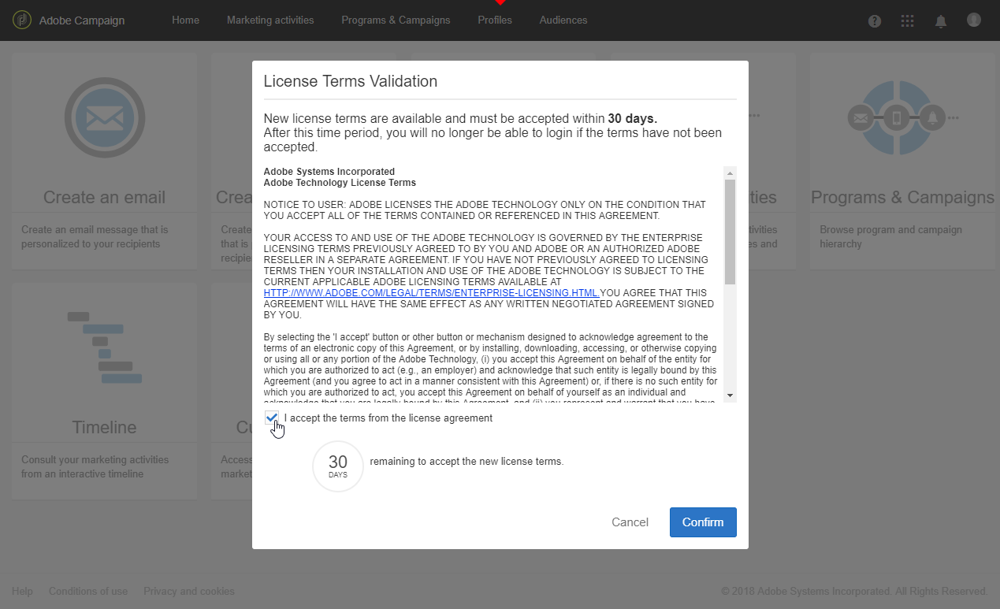

# ライセンス{#licenses}

このウ **[!UICONTROL Licenses]** ィンドウでは、インスタンスにインストールされたライセンスと、ビルド番号、リリースバージョン、契約条件に同意したかどうか、そのユーザーに関する異なる情報を表示できます。

新しいビルドまたは新しい機能を使用すると、ライセンス条項が変更される場合があり、インスタンスの機能管理者が同意する必要があります。

次のウィンドウは、ログイン後の標準ユーザーに対して表示され、ユーザー側での操作は不要です。 引き続き、ボタンをクリックしてAdobe Campaignを操作で **[!UICONTROL OK]** きます。

管理者は、ビルドのインストール後30日以内に、新しい契約条件を確認し、確認する必要があります。確認するには、をク **[!UICONTROL I accept the terms from the license agreement]** リックしま **[!UICONTROL Confirm]**&#x200B;す。

契約が承認されない場合は、この30日を経過した後、このインスタンスを使用できるユーザーはいなくなります。 標準ユーザーはAdobe Campaignの機能にアクセスできず、機能管理者が契約条件に同意するまで、次のメッセージのみが表示されます。

