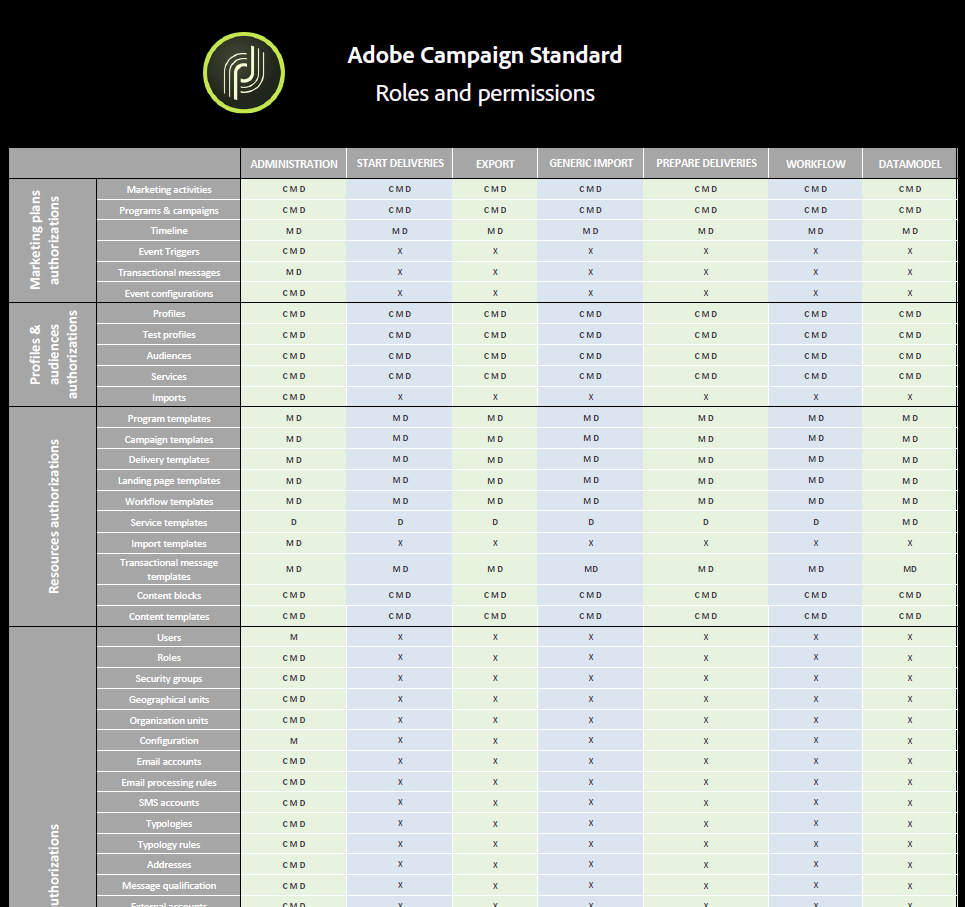

# 役割のリスト{#list-of-roles}

Adobe Campaign には、ユーザーやユーザーグループに割り当てる単一権限を定義するための一連の役割がデフォルトで用意されています。

組織単位と役割を組み合わせることにより、ユーザーには該当するインターフェイスのみ表示され、様々な機能に対するユーザーのアクセスを定義できます。

役割は&#x200B;**[!UICONTROL Administration > Users & Security > Roles]**&#x200B;メニューから管理できます。

デフォルトの権限は次のとおりです。

* **[!UICONTROL Administration]**：一般的な管理権限

  >[!NOTE]
  >
  >Experience Cloud トリガーを使用している場合は、Experience Cloud トリガー メニューにアクセスするには&#x200B;**[!UICONTROL Administration]**&#x200B;権限が必要です。 Experience Cloud トリガーについて詳しくは、この[&#x200B; ページ &#x200B;](../../integrating/using/about-adobe-experience-cloud-triggers.md)を参照してください。

* **[!UICONTROL Datamodel]**：パブリケーションの実行とカスタムリソースの作成をおこなう権限
* **[!UICONTROL Generic import]**：データに対する一般的なインポートを実行する権限。 これを機能させるには、**[!UICONTROL Generic import]**&#x200B;の役割を&#x200B;**[!UICONTROL Workflow]**&#x200B;の役割にリンクする必要があります。
* **[!UICONTROL Prepare deliveries]**：配信の作成、変更、準備、削除をおこなう権限。 この役割を持つユーザーは、配信の準備はできますが、送信はできません。
* **[!UICONTROL Start deliveries]**：配信の作成、変更、準備、送信、削除をおこなう権限。
* **[!UICONTROL Workflow]**：ワークフローの実行（開始、停止、一時停止など）を管理する権限。 この役割を持つユーザーは、ワークフロー内でも配信を送信できません。

詳しくは、[役割と権限の対応表](/help/administration/using/assets/acs_rights.pdf)を参照してください。この表には、選択した権限に応じて、インターフェイスで使用できる機能の詳細が示されています。

**関連トピック：**

* [アクセス管理について](../../administration/using/about-access-management.md)
* [グループとユーザーの管理](../../administration/using/managing-groups-and-users.md)
