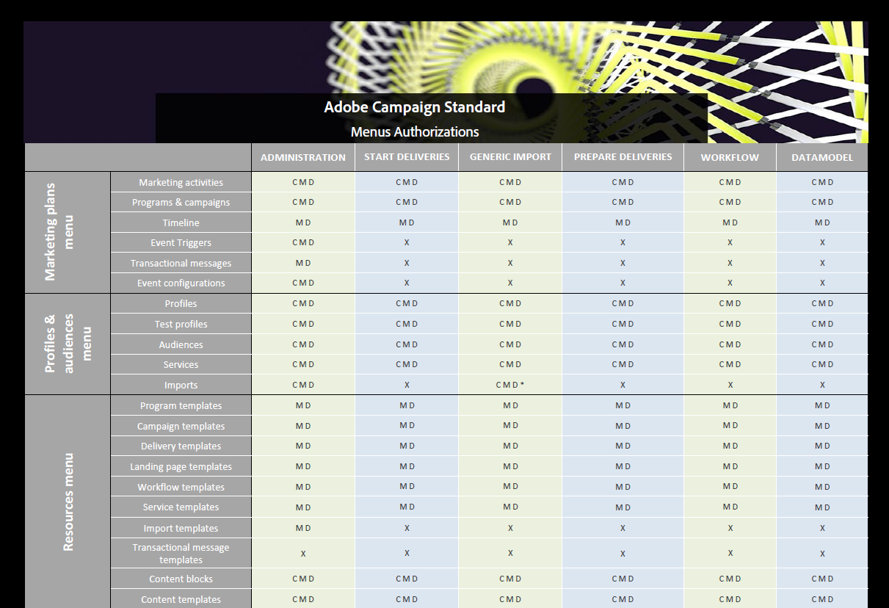

# 役割のリスト{#list-of-roles}

デフォルトでは、Adobe Campaignオファーは一連のロールを使用して、ユーザーおよびユーザーグループに割り当てられる一元認証を定義できます。

組織単位と組み合わせて、ロールを使用すると、ユーザーはインターフェイスのフィルタされた表示を利用でき、様々な機能へのアクセスを定義できます。

この詳細については、「 [ロールと権限」の表を参照してください](/help/administration/using/assets/acs_rights.pdf)。この表には、選択した承認に応じて、インターフェイスで使用できる機能の詳細が示されています。

ロールは、メニューから管理でき **[!UICONTROL Administration > Users & Security > Roles]** ます。

デフォルトの権限は次のとおりです。

* **[!UICONTROL Administration]**: 汎用管理権限。
* **[!UICONTROL Datamodel]**: パブリケーションの実行とカスタムリソースの作成を行う権限。
* **[!UICONTROL Generic import]**: データに対する一般的なインポートを実行する権限。 これを機能させるには、ロールをロールにリンク **[!UICONTROL Generic import]** する必要があり **[!UICONTROL Workflow]** ます。
* **[!UICONTROL Prepare deliveries]**: 配信の作成、変更、準備および削除を行う権限。 このロールを持つユーザーは、配信を準備できますが、送信することはできません。
* **[!UICONTROL Start deliveries]**: 配信の作成、変更、準備、送信、削除を行う権限。
* **[!UICONTROL Workflow]**: ワークフローの実行を管理する権利(開始、停止、一時停止など) このロールを持つユーザーは、ワークフロー内でも配信を送信できません。

**関連トピック：**

* [アクセス管理について](../../administration/using/about-access-management.md)
* [グループとユーザーの管理](../../administration/using/managing-groups-and-users.md)
