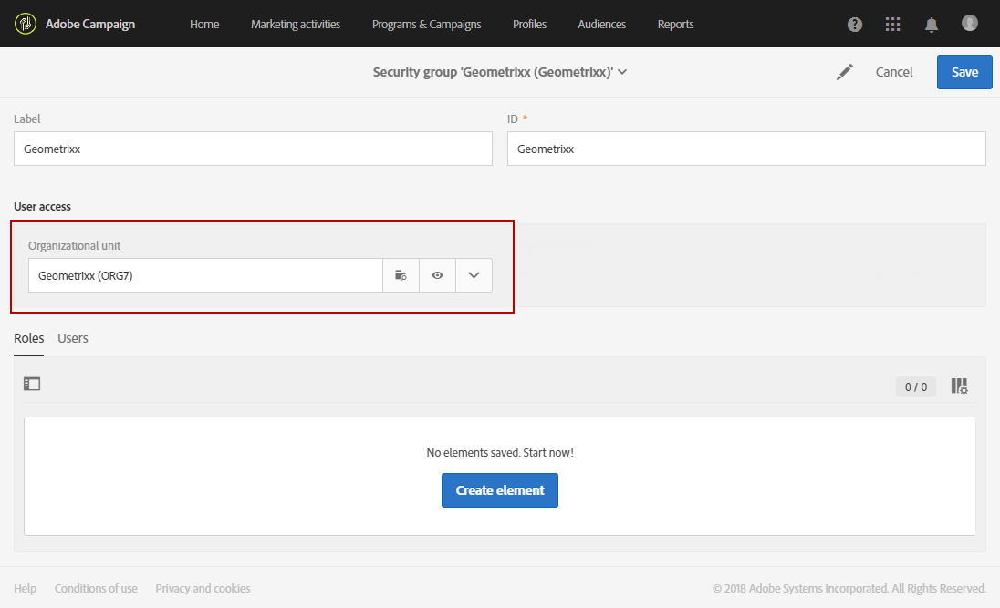

# Managing groups and users{#managing-groups-and-users}

## About security groups {#about-security-groups}

セキュリティグループとは、組織内の同じロールと権限を共有するユーザーのセットです。

ユーザーは常にセキュリティグループにリンクされている必要があります。これにより、特定の役割や組織単位を割り当てることができます。

For more information on roles, the tables in the following page present the different operations available according to a user's role(s): [Adobe Campaign Standard authorizations](https://docs.campaign.adobe.com/doc/standard/en/Technotes/AdobeCampaign-ACSRights.pdf).

デフォルトのセキュリティグループは次のとおりです。

* **[!UICONTROL Administrators]**
* **[!UICONTROL Delivery supervisors]**
* **[!UICONTROL Message Center agents]**
* **[!UICONTROL Standard Users]**
* **[!UICONTROL Workflow supervisors]**

ユーザーがセキュリティグループにリンクされていない場合、そのユーザーはAdobe Campaignにアクセスできません。

To restrict a user's access, do not add the user to the Campaign Standard users group as this is linked to **[!UICONTROL All]** organizational unit.

## Creating a security group and assigning users {#creating-a-security-group-and-assigning-users}

>[!CAUTION]
>
>管理コンソールでは、セキュリティグループはプロファイルと呼ばれます。

不要なグループがユーザーを管理するのに十分でない場合、独自のセキュリティグループを作成できます。管理者は、Adobe Campaign管理メニューと管理コンソールの両方にアクセスできる管理者が管理できます。For more information on the Admin console, refer to this [documentation](https://helpx.adobe.com/enterprise/managing/user-guide.html).

ここでは、まず標準ユーザーと管理者の2つのグループをユーザーに割り当てます。これらのセキュリティグループは、Adobe Campaignの一部の機能を制限します。Standardユーザーは、Adobe Campaignに基本的なアクセス権を持っていますが、管理者は管理者のメニューにアクセスできます。

管理コンソール上のセキュリティグループに対する変更は、ユーザーがAdobe Campaignにログインし次第同期されます。

次に、GeometrixxとGeometrixx衣服のセットを作成して、米国標準ユーザーおよび管理者の組織単位によってアクセスを制限するようにします。

最初に、ユーザーに追加のセキュリティグループのいずれかを割り当てる必要があります。

1. In the Admin console, select your instance then the **Users** tab.

   

1. **[!UICONTROL Add user]** ボタンをクリックして、ユーザーの電子メールアドレスを入力します。
1. **[!UICONTROL Assign Products]** タブで、ドロップダウンリストからあらかじめ用意されているセキュリティグループを **[!UICONTROL Administrators]** 選択します。これにより、ユーザーは管理メニューにアクセスし、次のセキュリティグループを作成できます。

   

1. Click **[!UICONTROL Save]** and follow the same procedures to assign the **[!UICONTROL Standard Users]** out-of-the-box security group to your new user.

   

Once your two users are attached to the **[!UICONTROL Administrators]** and **[!UICONTROL Standard users]** out-of-the-box security groups which assign roles to our users, the Administrator user can now create the two security groups **Geometrixx** and **Geometrixx Clothes** that will assign organizational units to our users in addition to the out-of-the-box security groups.

1. In the Admin console, select your instance then the **Products** tab.
1. **「新規プロファイル** 」ボタンをクリックして **、Geometrixx** セキュリティグループを作成します。

   

1. Type the **[!UICONTROL Profile name]** by following this exact syntax: **[!UICONTROL Campaign Standard- instance name - ID of the security group]** and click **[!UICONTROL Done]**.

   選択したIDは、Adobe Campaignでセキュリティグループを作成する際に使用されます。

   >[!NOTE]
   >
   >If the above syntax doesn't seem to work with an older instance, it needs to be replaced by **[!UICONTROL Campaign - instance name - ID of the security group]**.

   

1. Then, follow the same procedures to create the **Geometrixx Clothes** security group.
1. Assign your security group to your user by selecting the **[!UICONTROL Users]** tab.

   

1. Click your previously created user then the  icon in the **[!UICONTROL Products]** category.

   Select **[!UICONTROL Edit products assigned directly]** to start assigning new security group to your user.

   

1. **[!UICONTROL Assign Products]** タブで、インスタンスを選択して、ドロップダウンリストから以前に作成したセキュリティグループのGeometrixxを管理者ユーザーに割り当てます。

   **[!UICONTROL Save]**&#x200B;をクリックします。

   

   ユーザーが複数のグループにいる場合:

   * 異なるグループの役割が累積されます。ここでは、ユーザーは2つのグループに属しています。他のユーザーが他の数量に対して役割を果たすこと。
   * It is the unit that is the highest in the hierarchy that will be used (see example in the [Organizational units](../../administration/using/organizational-units.md) section).
   * 数量が同じレベルの場合に、階層内の分岐が並行している場合、ユーザーは接続できなくなります。

1. 同じ手順に従って、Geometrixx CoverセキュリティグループをStandardユーザーに割り当てます。

   

新しく作成されたセキュリティグループが管理コンソールで作成されるようになりました。完全に同期するには、Adobe Campaignで作成する必要もあります。

管理者ユーザーは、組織単位の割り当てに使用するセキュリティグループのセットを作成する必要があります。GeometrixxとGeometrixxの衣服To learn how to create organizational units, see [Creating and managing units](../../administration/using/organizational-units.md#creating-and-managing-units) .

1. Click the **[!UICONTROL Adobe Campaign]** logo, in the top left corner, then select **[!UICONTROL Administration > Users & Security > Security groups]**.
1. Create your new security group and specify its **[!UICONTROL Label]** and **[!UICONTROL ID]**.

   IDは管理コンソールで選択したものと同じである必要があります。

1. **[!UICONTROL User access]** フィールドで、組織単位を割り当てます。Here, the Geometrixx security group is assigned the **[!UICONTROL All]** organizational unit.

   

1. セキュリティグループにロールをアサインすることもできます。In our case, this step is not needed since the out-of-the-box security groups **[!UICONTROL Administrators]** and **[!UICONTROL Standard users]** are used to assign roles.
1. 同じ手順に従って、Geometrixx Coverの最後のセキュリティを作成し、Geometrixx Coverの組織単位を割り当てます。

   

ユーザーがセキュリティグループに割り当てられ、Adobe Campaignに接続できるようになりました。

>[!CAUTION]
>
>管理コンソールのセキュリティグループからユーザーが削除されると、それらはAdobe Campaignセキュリティグループの一部となり、Adobe Campaignにログインできなくなります。この場合、管理コンソールでユーザーの電子メールアドレスを削除して、ユーザーが機密情報を受け取らないようにします。

