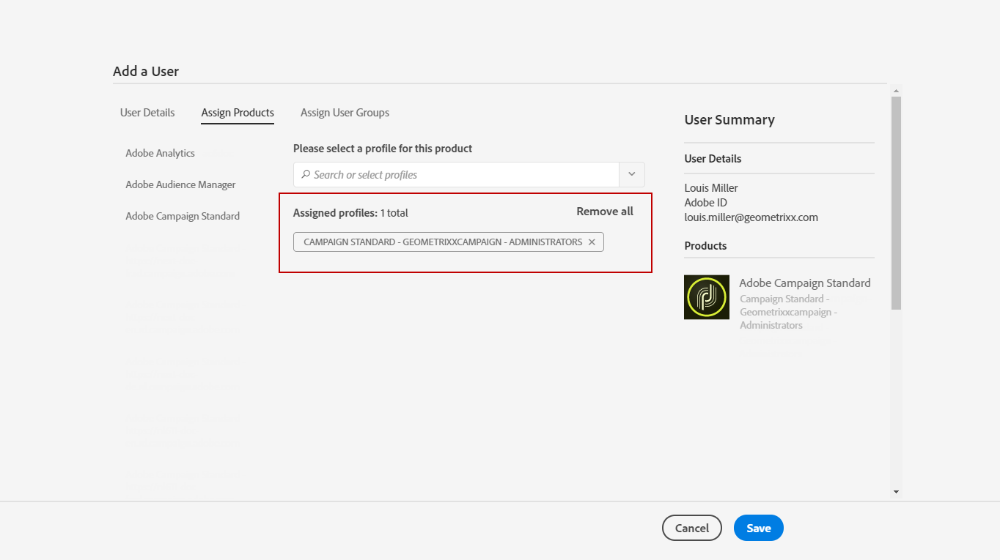

# グループとユーザーの管理{#managing-groups-and-users}

## セキュリティグループについて {#about-security-groups}

セキュリティグループとは、組織内で同じ役割および権限を共有するユーザーのセットです。

ユーザーは、常にセキュリティグループにリンクされている必要があります。これにより、ユーザーに特定の役割や組織単位を割り当てることができます。

役割の詳細については、次のページの表に、ユーザーの役割に応じて使用可能な操作を示します。[Adobe Campaign Standard認証](https://experienceleague.adobe.com/docs/campaign-standard/assets/acs_rights.pdf?lang=en)。

デフォルトのセキュリティグループは次のとおりです。

* **[!UICONTROL Administrators]**
* **[!UICONTROL Delivery supervisors]**
* **[!UICONTROL Standard Users]**
* **[!UICONTROL Workflow supervisors]**

>[!IMPORTANT]
>
>**[!UICONTROL Access to the deliverability parameters (Deliverability)]**&#x200B;および&#x200B;**[!UICONTROL Message Center agents (mcExec)]**&#x200B;セキュリティグループは、Adobe内部のみで、どのユーザーにも割り当てることはできません。

Adobe Campaignにアクセスするには、各ユーザーをセキュリティグループに割り当てる必要があります。

Campaign Standard ユーザーグループは **[!UICONTROL All]** 組織単位にリンクされているので、ユーザーのアクセスを制限するにはユーザーを追加しないでください。

>[!NOTE]
>
>デフォルトでは、**[!UICONTROL All (all)]** 組織単位は **[!UICONTROL Administrators]** セキュリティグループに割り当てられます。これは読み取り専用で、変更できません。

## セキュリティグループの作成とユーザーの割り当て {#creating-a-security-group-and-assigning-users}

>[!IMPORTANT]
>
>Admin Console では、セキュリティグループはプロファイルと呼ばれます。

標準グループでユーザーを適切に管理できない場合は、独自のセキュリティグループを作成できます。独自のセキュリティグループは、Adobe Campaign 管理メニューと Admin Console の両方にアクセスできる管理者が管理できます。Admin Console について詳しくは、この[ドキュメント](https://helpx.adobe.com/jp/enterprise/managing/user-guide.html)を参照してください。

ここでは、最初に 2 つの標準グループ（Standard Users と Administrators）をユーザーに割り当てる必要があります。これらのセキュリティグループは、Adobe Campaign 機能の一部を制限します。Standard Users には基本的な Adobe Campaign アクセス権がある一方、Administrators は管理メニューなどにアクセスできます。

Admin Console でセキュリティグループに対しておこなった変更は、ユーザーが Adobe Campaign にログインするとすぐに同期されます。

次に、Geometrixx と Geometrixx Clothes セキュリティグループを作成し、Standard Users と Administrators の組織単位に応じて一部のアクセスが制限されるようにします。

最初に、標準セキュリティグループの 1 つをユーザーに割り当てる必要があります。

1. Admin Console で、インスタンスを選択し、「**Users**」タブをクリックします。

   

1. 「**[!UICONTROL Add user]**」ボタンをクリックして、ユーザーの E メールアドレスを入力します。
1. 「**[!UICONTROL Assign Products]**」タブで、インスタンスを選択し、ドロップダウンリストから標準の **[!UICONTROL Administrators]** セキュリティグループを選択します。これにより、ユーザーは管理メニューにアクセスし、次のセキュリティグループを作成できます。

   

1. 「**[!UICONTROL Save]**」をクリックし、同じ手順に従って標準の **[!UICONTROL Standard Users]** セキュリティグループを新しいユーザーに割り当てます。

   

ユーザーに役割を割り当てるために標準の **[!UICONTROL Administrators]** セキュリティグループと **[!UICONTROL Standard users]** セキュリティグループに 2 人のユーザーを割り当てると、Administrators ユーザーは **Geometrixx** と **Geometrixx Clothes** の 2 つのセキュリティグループを作成して、標準セキュリティグループに加えて組織単位をユーザーに割り当てることができます。

1. Admin Console で、インスタンスを選択し、「**Products**」タブをクリックします。
1. 「**New Profile**」ボタンをクリックして、**Geometrixx** セキュリティグループを作成します。

   

1. 構文「**[!UICONTROL Campaign Standard- instance name - ID of the security group]**」に従って **[!UICONTROL Profile name]** を入力し、「**[!UICONTROL Done]**」をクリックします。

   選択した ID は、Adobe Campaign でセキュリティグループを作成する際に使用されます。

   >[!NOTE]
   >
   >上記の構文が古いインスタンスで動作しない場合は、**[!UICONTROL Campaign - instance name - ID of the security group]** で置き換えてください。

   

1. 次に、同じ手順に従って **Geometrixx Clothes** セキュリティグループを作成します。
1. 「**[!UICONTROL Users]**」タブを選択して、セキュリティグループをユーザーに割り当てます。

   

1. 以前に作成したユーザーをクリックし、**[!UICONTROL Products]** カテゴリ内の  アイコンをクリックします。

   「**[!UICONTROL Edit products assigned directly]**」を選択して、新しいセキュリティグループを割り当て始めます。

   

1. 「**[!UICONTROL Assign Products]**」タブでインスタンスを選択し、ドロップダウンリストから以前に作成したセキュリティグループ Geometrixx を選択して、Administrators ユーザーに割り当てます。

   「**[!UICONTROL Save]**」をクリックします。

   

   ユーザーが複数のグループに属する場合：

   * 異なるグループの役割は累積されます。ここでは、ユーザーは 2 つの異なるグループに属しています。1 つは役割ベースで、もう 1 つは単位ベースです。
   * 単位は使用される階層の中で最高のものです（[組織単位](../../administration/using/organizational-units.md)の節の例を参照）。
   * 単位のレベルが同じで、階層内の並列分岐にある場合、ユーザーは接続できなくなります。

1. 同じ手順に従って、Geometrixx Clothes セキュリティグループを Standard Users ユーザーに割り当てます。

   

新しく作成されたセキュリティグループが Admin Console に作成されます。セキュリティグループを完全に同期するには、Adobe Campaign でもセキュリティグループを作成する必要があります。

Administrators ユーザーは、組織単位の割り当てに使用する Geometrixx および Geometrixx Clothes セキュリティグループのセットを作成する必要があります。組織単位の作成方法については、[単位の作成と管理](../../administration/using/organizational-units.md#creating-and-managing-units)を参照してください。

1. 左上隅の&#x200B;**Adobe**&#x200B;ロゴをクリックし、**[!UICONTROL Administration > Users & Security > Security groups]**&#x200B;を選択します。
1. 新しいセキュリティグループを作成し、**[!UICONTROL Label]** と **[!UICONTROL ID]** を指定します。

   この ID は、Admin Console で選択した ID と同じである必要があります。

1. 「**[!UICONTROL User access]**」フィールドで、組織単位を割り当てます。ここでは、Geometrixx セキュリティグループに **[!UICONTROL All]** 組織単位が割り当てられます。

   >[!NOTE]
   >
   >標準のセキュリティグループをユーザーに割り当てる場合は、組織単位をリセットする必要があります。

   

1. 役割をセキュリティグループに割り当てることもできます。その場合、標準の **[!UICONTROL Administrators]** セキュリティグループと **[!UICONTROL Standard users]** セキュリティグループが役割の割り当てに使用されるので、この手順は不要です。
1. 同じ手順で、最後のセキュリティ Geometrixx Clothes を作成し、Geometrixx Clothes の組織単位を割り当てます。

   

これで、ユーザーはセキュリティグループに割り当てられ、Adobe Campaign に接続できるようになります。

>[!IMPORTANT]
>
>Admin Consoleでセキュリティグループから削除されたユーザーは、Adobe Campaignセキュリティグループに残り、Adobe Campaignにログインできなくなります。 この場合、ユーザーが機密情報を受け取らないように、Admin Console でユーザーの E メールアドレスを削除します。
