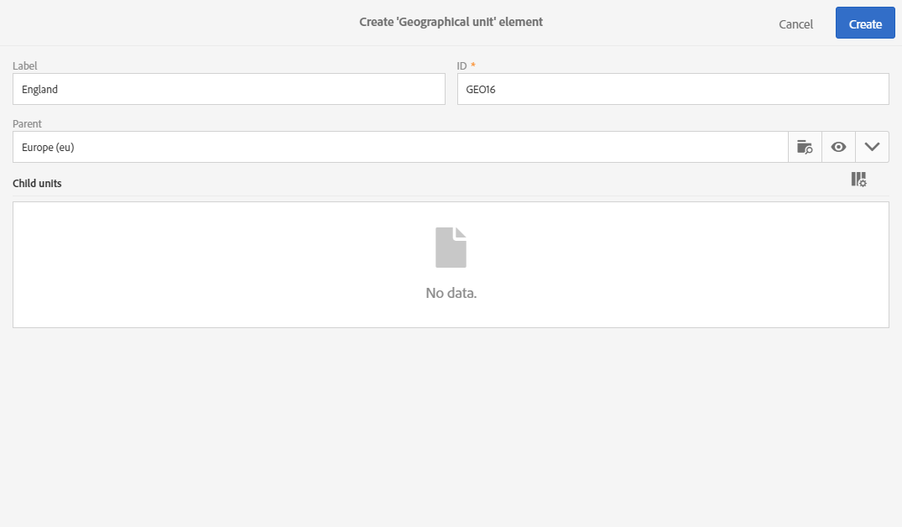
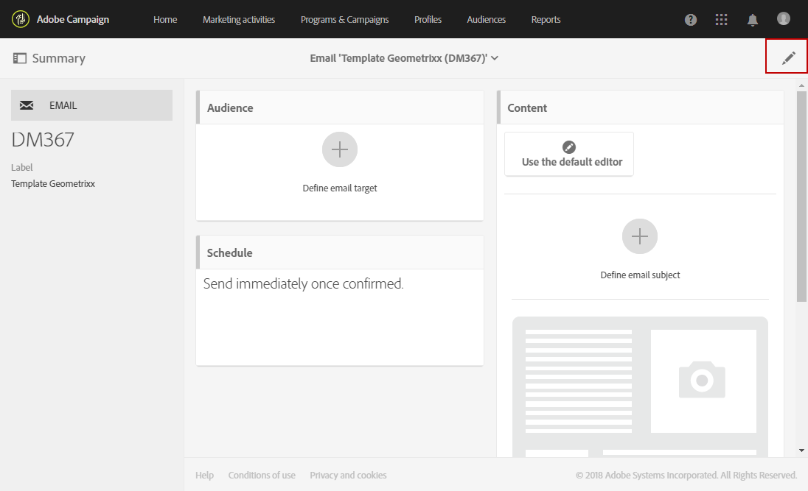
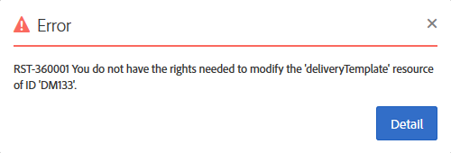

# 組織単位{#organizational-units}

## 単位について {#about-units}

プラットフォームの各オブジェクトおよびユーザは、組織単位にリンクされる。 このユニットは、フィルタされた表示をユーザに与えるために階層構造を定義することを可能にします。 ユーザーのユニットは、異なるプラットフォームオブジェクトに対するアクセスレベルを定義します。

>[!IMPORTANT]
>
>ユーザーがどのユニットにもリンクされていない場合、そのユーザーはAdobe Campaignに接続できません。 特定のユーザーまたはユーザーのグループに対するアクセスを制限する場合は、**[!UICONTROL All]**&#x200B;ユニットにリンクしないでください。 プロファイルをインポートする前に、**アクセス許可管理フィールド**&#x200B;を追加することをお勧めします。 詳しくは、[この節](../../administration/using/organizational-units.md#partitioning-profiles)を参照してください。
>
>デフォルトでは、**[!UICONTROL All (all)]** 組織単位は **[!UICONTROL Administrators]** セキュリティグループに割り当てられます。これは読み取り専用で、変更できません。

ユーザは、親単位のすべてのオブジェクトに対して読み取り専用アクセス権を持ちます。 彼は、自分のユニットと子ユニットのすべてのオブジェクトに対して読み取りと書き込みのアクセス権を持っている。 ユーザーは、並列ブランチ内のオブジェクトにアクセスできません。

デフォルトでは、**[!UICONTROL All]**&#x200B;ユニットのみが使用可能です。

ユーザーに組織単位が割り当てられると、このユニットは常にユーザーが作成したオブジェクトに適用されます。

>[!NOTE]
>
>1人のユーザーが複数のグループに属し、異なるユニットにリンクされている場合、特定のルールが適用されます。 詳しくは、[グループとユーザーの管理](../../administration/using/managing-groups-and-users.md)の節を参照してください。

## ユニットの作成と管理{#creating-and-managing-units}

組織単位では、ユーザーがリンクされている組織に応じてインスタンスをフィルターできます。 このユニットは、インスタンス内の地域、国、またはブランドを表すことができます。

ここでは、2人のユーザーに対して異なる役割を持つセキュリティグループを以前に作成しました。1人のユーザーに「管理者」と「Geometrixx」のセキュリティグループが割り当てられ、もう1人のユーザーは「標準ユーザー」と「Geometrixx服」のセキュリティグループに属します。詳しくは、[「セキュリティグループの作成とユーザー](../../administration/using/managing-groups-and-users.md#creating-a-security-group-and-assigning-users)の割り当て」を参照してください。

次に、Geometrixx衣類とGeometrixxセキュリティグループの組織単位を作成する必要があります。

1. Adobeキャンペーンの詳細設定メニューで、**[!UICONTROL Administration]** > **[!UICONTROL Users & security]** > **[!UICONTROL Organizational units]**&#x200B;を選択します。
1. 組織単位の構成を開始するには、**[!UICONTROL Create]**&#x200B;をクリックします。

   

1. デフォルトの&#x200B;**[!UICONTROL Label]**&#x200B;と&#x200B;**[!UICONTROL ID]**&#x200B;をGeometrixxに変更します。
1. 次に、このユニットを親ユニットにリンクします。 ここで、**[!UICONTROL All]**&#x200B;を選択します。

   

1. 最後に、**[!UICONTROL Create]**&#x200B;をクリックして、新しい組織単位をセキュリティグループに割り当てているときに開始が発生します。
1. 同じ手順で、Geometrixx衣類ユニットも同じです。ただし、親ユニットは、以前に作成したユニット、Geometrixxである必要があります。

   

異なるセキュリティグループに異なるユニットを割り当てた場合の影響を確認するために、管理者とGeometrixxグループに割り当てたユーザーは2つの電子メールテンプレートを作成し、標準ユーザーとGeometrixx服に割り当てたユーザーがアクセスできるかどうかを確認します。

1. 詳細設定メニューで、**[!UICONTROL Resources]**/**[!UICONTROL Templates]**/**[!UICONTROL Delivery Templates]**&#x200B;を選択します。
1. 既存のテンプレートを重複し、必要に応じてパーソナライズします。 詳しくは、[テンプレートについて](../../start/using/marketing-activity-templates.md)の節を参照してください。
1. テンプレートを作成したら、**[!UICONTROL Edit properties]**&#x200B;アイコンを選択して、テンプレートに単位を割り当てます。

   

1. **[!UICONTROL Access authorization]**&#x200B;ドロップダウンメニューで、組織単位を選択します。

   ここでは、以前に作成した組織単位Geometrixxを使用して1つのテンプレートを作成します。

   

1. 同じ手順に従って、以前に作成したGeometrixx衣料品の組織単位に割り当てられた2番目のテンプレートを作成します。

Standard UserグループとData Clousesグループに割り当てられたユーザーは、両方のテンプレートを表示できます。 組織単位の階層構造により、Geometrixx服ユニットにリンクされたテンプレートに対する読み取りと書き込みのアクセス権と、Geometrixxユニットにリンクされたテンプレートに対する読み取り専用のアクセス権のみを持ちます。

Geometrixx衣類ユニットはGeometrixxの子ユニットなので、ユーザーがGeometrixxテンプレートを変更しようとすると次のメッセージが表示されます。

組織単位は、プロファイルなどの異なる機能にアクセスを制限できます。 例えば、Geometrixx衣料品のユーザーが&#x200B;**[!UICONTROL Profiles]**&#x200B;タブにアクセスすると、Geometrixx衣料品の組織単位でプロファイルに完全にアクセスして変更できます。

Geometrixxの組織単位を持つプロファイルは読み取り専用になりますが、1つのプロファイルを変更しようとすると次のエラーが表示されます。**[!UICONTROL You do not have the rights needed to modify the 'profile' resource of ID]**.

## プロファイルの分割{#partitioning-profiles}

>[!IMPORTANT]
>
>組織単位を持たないプロファイルはプロファイルがアクセスできないので、ユーザーをインポートする前に、このオプションを追加することをお勧めします。
>
>顧客データベースを既にインポート済みの場合は、既にインポート済みのプロファイルに組織単位の値を設定するために、更新が必要です。

組織で、各ブランドから連絡を受けるプロファイルを分離する必要がある場合は、組織単位でプロファイルを分割できます。

デフォルトでは、組織単位(OU)フィールドはプロファイルで使用できないので、追加する必要があります。

1. 詳細設定メニューのAdobe Campaignロゴから、**管理/開発/カスタムリソース**&#x200B;を選択します。
1. **プロファイル**&#x200B;を選択するか、新しいカスタムリソースを作成してプロファイルを拡張します。 プロファイルを拡張する方法の詳細については、[ページ](../../developing/using/extending-the-profile-resource-with-a-new-field.md#step-1--extend-the-profile-resource)を参照してください。
1. **追加access authorization management fields**&#x200B;ボックスをチェックして、**プロファイル**&#x200B;拡張子に組織単位を追加します。

   

1. 「**[!UICONTROL Save]**」をクリックします。
1. カスタムリソースを再公開して構造を更新します。 発行プロセスの詳細については、[構造の更新](../../developing/using/updating-the-database-structure.md)の節を参照してください。

組織単位フィールドが&#x200B;**[!UICONTROL Access authorization]**&#x200B;セクションのプロファイルに追加されます。

**関連トピック**：

* [単位について](../../administration/using/organizational-units.md#about-units)
* [アクセス管理について](../../administration/using/about-access-management.md)

