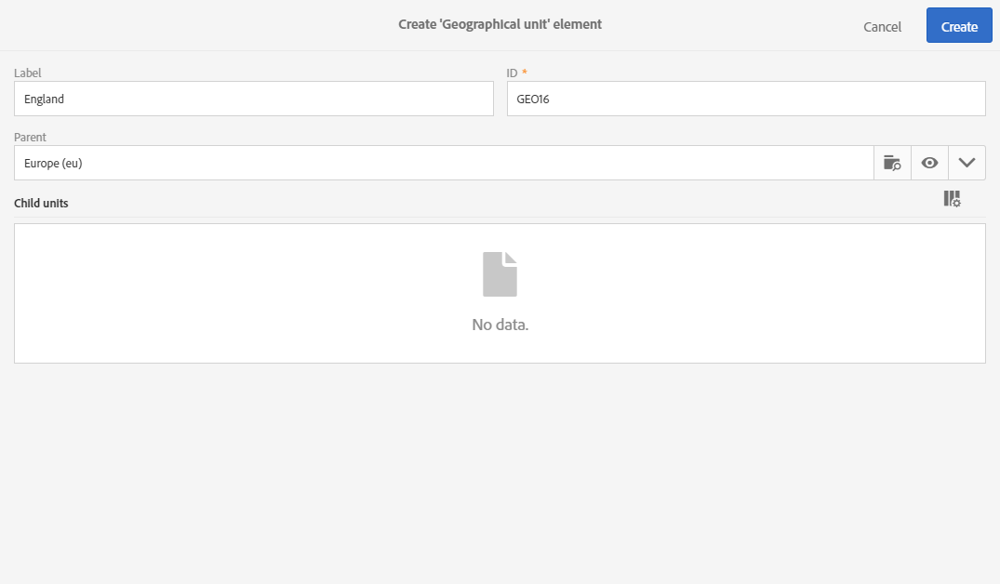
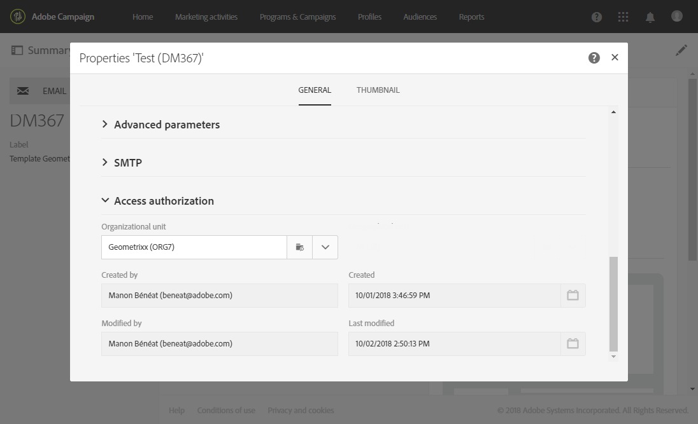

# 組織単位{#organizational-units}

## 単位について {#about-units}

プラットフォームの各オブジェクトとユーザーは、組織単位にリンクされています。 このユニットでは、階層構造を定義して、ユーザーにフィルタされたビューを提供できます。 ユーザーのユニットは、異なるプラットフォームオブジェクトに対するアクセスレベルを定義します。

>[!IMPORTANT]
>
>ユーザーが任意のユニットにリンクされていない場合、そのユーザーはAdobe Campaignに接続できません。 特定のユーザーまたはユーザーグループのアクセスを制限する場合は、そのユーザーを&#x200B;**[!UICONTROL All]** ユニットにリンクしないでください。 プロファイルを読み込む前に、オプション **承認管理フィールドにアクセス**&#x200B;を追加することをお勧めします。 詳しくは、[この節](../../administration/using/organizational-units.md#partitioning-profiles)を参照してください。
>
>デフォルトでは、**[!UICONTROL All (all)]** 組織単位は **[!UICONTROL Administrators]** セキュリティグループに割り当てられます。 これは読み取り専用で、変更できません。

ユーザーは、親ユニット内のすべてのオブジェクトに読み取り専用でアクセスできます。 そのようなユーザーは、ユニットと子ユニットのすべてのオブジェクトに対する読み取り/書き込みアクセス権を持っています。 ユーザーは、並列分岐のオブジェクトにアクセスできません。

デフォルトでは、**[!UICONTROL All]**&#x200B;単位のみが使用できます。

ユーザーに組織単位が割り当てられている場合、この単位は常にユーザーが作成したオブジェクトに適用されます。

>[!NOTE]
>
>ユーザーが異なるユニットにリンクされた複数のグループに属している場合、特定のルールが適用されます。 詳しくは、「[ グループとユーザーの管理](../../administration/using/managing-groups-and-users.md)」の節を参照してください。

## ユニットの作成と管理 {#creating-and-managing-units}

組織単位を使用すると、ユーザーがリンクされている組織に応じてインスタンスをフィルタリングできます。 このユニットは、インスタンス内の地域、国、さらにはブランドを表すことができます。

ここでは、2つのユーザーに異なる役割を持つセキュリティグループを以前に作成しました。1人のユーザーにセキュリティグループ管理者とGeometrixxが割り当てられ、もう1人のユーザーにセキュリティグループ標準ユーザーとGeometrixx服が割り当てられています。完全な例については、[ セキュリティグループの作成とユーザーの割り当て](../../administration/using/managing-groups-and-users.md#creating-a-security-group-and-assigning-users)を参照してください。

次に、Geometrixxの衣類とGeometrixxのセキュリティグループの組織部門を作る必要がある。

1. Adobe Campaignの詳細メニューから、**[!UICONTROL Administration]** > **[!UICONTROL Users & security]** > **[!UICONTROL Organizational units]**&#x200B;を選択します。
1. 組織単位の設定を開始するには、**[!UICONTROL Create]**&#x200B;をクリックします。

   

1. デフォルトの&#x200B;**[!UICONTROL Label]**&#x200B;と&#x200B;**[!UICONTROL ID]**&#x200B;をGeometrixxに変更します。
1. 次に、このユニットを親ユニットにリンクします。 ここでは、**[!UICONTROL All]**&#x200B;を選択しました。

   

1. 最後に、**[!UICONTROL Create]**&#x200B;をクリックして、新しい組織単位のセキュリティ グループへの割り当てを開始します。
1. Geometrixx Clothes ユニットの親ユニットが以前に作成したユニットであるGeometrixxである必要がある場合を除き、同じ手順に従います。

   

異なるセキュリティグループに別のユニットを割り当てたときの影響を確認するには、Administrator グループとGeometrixx グループに割り当てられたユーザーが、Standard UserとGeometrixx Clothesに割り当てられた他のユーザーがアクセスできる内容とアクセスできない内容を確認するために、2つのメールテンプレートを作成します。

1. 詳細設定メニューから、**[!UICONTROL Resources]** > **[!UICONTROL Templates]** > **[!UICONTROL Delivery Templates]**&#x200B;を選択します。
1. 既存のテンプレートを複製し、必要に応じてパーソナライズできます。 詳しくは、[テンプレートについて](../../start/using/marketing-activity-templates.md)の節を参照してください。
1. テンプレートが作成されたら、**[!UICONTROL Edit properties]** アイコンを選択して、テンプレートに単位を割り当てます。

   

1. **[!UICONTROL Access authorization]** ドロップダウンメニューで、組織単位を選択します。

   ここでは、以前に作成した組織単位であるGeometrixxで1つのテンプレートを作成します。

   

1. 同じ手順に従って、以前に作成したGeometrixx Clothesの組織単位に割り当てられた2番目のテンプレートを作成します。

**標準ユーザー**&#x200B;と&#x200B;**Geometrixx Clothes** グループに割り当てられたユーザーは、両方のテンプレートを表示できます。 組織単位の階層構造により、Geometrixx Clothes単位にリンクされたテンプレートへの読み取りおよび書き込みアクセス権と、Geometrixx単位にリンクされたテンプレートへの読み取り専用アクセス権のみが付与されます。

Geometrixx Clothes ユニットはGeometrixxの子ユニットであるため、ユーザーがGeometrixx テンプレートを変更しようとすると、次のメッセージが表示されます。

組織部門は、プロファイルなどのさまざまな機能へのアクセスを制限できます。 例えば、Geometrixx Clothesのユーザーが「**[!UICONTROL Profiles]**」タブにアクセスした場合、Geometrixx Clothesの組織単位でプロファイルに完全にアクセスして変更することができます。

Geometrixx組織単位のプロファイルは読み取り専用ですが、ユーザーが1つのプロファイルを変更しようとすると、次のエラーが表示されます：**[!UICONTROL You do not have the rights needed to modify the 'profile' resource of ID]**。

## プロファイルの分割 {#partitioning-profiles}

>[!IMPORTANT]
>
>組織単位を持たないプロファイルにはユーザーがアクセスできないため、プロファイルを読み込む前にこのオプションを追加することをお勧めします。
>
>顧客データベースを既にインポートしている場合、既にインポートしたプロファイルに組織単位値を設定するには、更新が必要です。

複数の企業がそれぞれ接触したプロファイルを分離する必要がある場合は、組織単位ごとにプロファイルを分割できます。

デフォルトでは、組織単位フィールドはプロファイルで使用できないので、追加する必要があります。

1. 詳細設定メニューから、Adobe Campaign ロゴを使用して、**管理/開発/カスタムリソース**&#x200B;を選択します。
1. **プロファイル**&#x200B;を選択するか、新しいカスタムリソースを作成してプロファイルを拡張します。 プロファイルの拡張方法について詳しくは、この[ ページ ](../../developing/using/extending-the-profile-resource-with-a-new-field.md#step-1--extend-the-profile-resource)を参照してください。
1. 「**アクセス承認管理フィールドを追加**」ボックスをオンにして、**プロファイル**&#x200B;拡張機能に組織単位を追加します。

   

1. 「**[!UICONTROL Save]**」をクリックします。
1. カスタムリソースを再公開して、構造を更新します。 公開プロセスについて詳しくは、[構造の更新](../../developing/using/updating-the-database-structure.md) セクションを参照してください。

組織単位フィールドが&#x200B;**[!UICONTROL Access authorization]** セクションのプロファイルに追加されます。

**関連トピック**：

* [単位について](../../administration/using/organizational-units.md#about-units)
* [アクセス管理について](../../administration/using/about-access-management.md)
