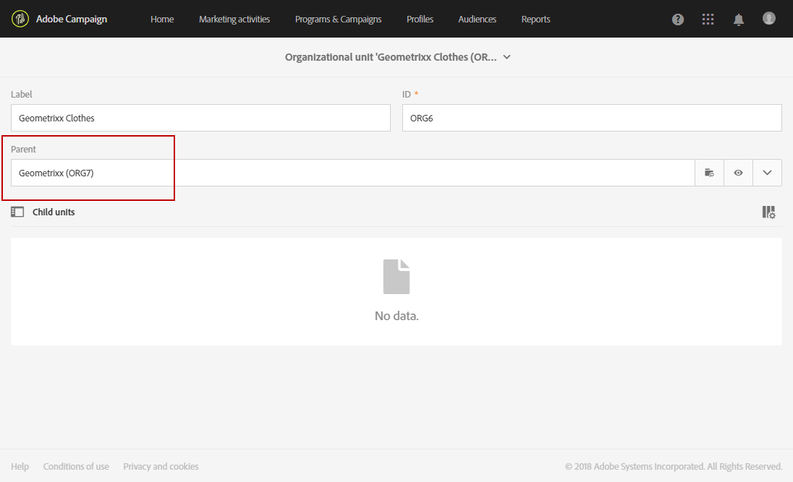

# 組織単位{#organizational-units}

## 単位について {#about-units}

プラットフォームの各オブジェクトおよびユーザーは、組織単位にリンクされています。 このユニットを使用すると、階層構造を定義して、ユーザーにフィルターされたビューを提供できます。 ユーザーのユニットは、異なるプラットフォームオブジェクトに対するアクセスレベルを定義します。

>[!IMPORTANT]
>
>ユーザーがどのユニットにもリンクされていない場合、そのユーザーはAdobe Campaignに接続できません。 特定のユーザーまたはユーザーのグループに対するアクセスを制限する場合は、そのユーザーまたはユーザーのグループを **[!UICONTROL All]** ユニットにリンクしないでください。 プロファイルを読み込む前に、オプション **認証管理フィールドへのアクセス** を追加することをお勧めします。 詳しくは、[この節](../../administration/using/organizational-units.md#partitioning-profiles)を参照してください。
>
>デフォルトでは、**[!UICONTROL All (all)]** 組織単位は **[!UICONTROL Administrators]** セキュリティグループに割り当てられます。これは読み取り専用で、変更できません。

ユーザーは、親単位のすべてのオブジェクトに対して読み取り専用アクセス権を持ちます。 このようなユーザーは、自分のユニットおよび子ユニットのすべてのオブジェクトに対する読み取りおよび書き込みアクセス権を持ちます。 ユーザーは、並列ブランチ内のオブジェクトにアクセスできません。

デフォルトでは、**[!UICONTROL All]** の単位のみ使用できます。

ユーザーに組織単位が割り当てられると、この単位はユーザーが作成したオブジェクトに常に適用されます。

>[!NOTE]
>
>ユーザーが異なるユニットにリンクされた複数のグループに属する場合、特定のルールが適用されます。 詳しくは、[&#x200B; グループとユーザーの管理 &#x200B;](../../administration/using/managing-groups-and-users.md) の節を参照してください。

## ユニットの作成と管理 {#creating-and-managing-units}

組織単位を使用すると、ユーザーがリンクされている組織に応じてインスタンスをフィルタリングできます。 この単位は、インスタンス内の地域、国、またはブランドを表すことができます。

ここでは、以前に 2 人のユーザーに対して異なるロールを持つセキュリティグループを作成しました。一方のユーザーはセキュリティグループ Administrators とGeometrixxに割り当てられ、もう一方のユーザーはセキュリティグループ Standard user とGeometrixx服に属します。詳細は [&#x200B; セキュリティグループの作成とユーザーの割り当て &#x200B;](../../administration/using/managing-groups-and-users.md#creating-a-security-group-and-assigning-users) を参照してください。

次に、Geometrixx衣料およびGeometrixxセキュリティグループの組織単位を作成する必要があります。

1. Adobeキャンペーンの詳細メニューで、**[!UICONTROL Administration]**/**[!UICONTROL Users & security]**/**[!UICONTROL Organizational units]** を選択します。
1. 「**[!UICONTROL Create]**」をクリックして、組織単位の設定を開始します。

   

1. デフォルトの **[!UICONTROL Label]** と **[!UICONTROL ID]** をGeometrixxに変更します。
1. 次に、このユニットを親ユニットにリンクします。 ここでは、**[!UICONTROL All]** を選択しました。

   

1. 最後に、[**[!UICONTROL Create]**] をクリックして、新しい組織単位のセキュリティ グループへの割り当てを開始します。
1. Geometrixx服ユニットに対しても同じ手順に従いますが、親ユニットは以前に作成したユニット、Geometrixxである必要があります。

   

異なるユニットを異なるセキュリティ・グループに割り当てた場合の影響を確認するには、Administrator とGeometrixx・グループに割り当てられたユーザーが 2 つのメール・テンプレートを作成して、Standard User とGeometrixx服に割り当てられた他のユーザーがアクセスできる内容とアクセスできない内容を確認します。

1. 詳細メニューから、**[!UICONTROL Resources]**/**[!UICONTROL Templates]**/**[!UICONTROL Delivery Templates]** を選択します。
1. 既存のテンプレートを複製し、必要に応じてパーソナライズします。 詳しくは、[テンプレートについて](../../start/using/marketing-activity-templates.md)の節を参照してください。
1. テンプレートを作成したら、「**[!UICONTROL Edit properties]**」アイコンを選択して、テンプレートに単位を割り当てます。

   

1. **[!UICONTROL Access authorization]** ドロップダウンメニューで、組織単位を選択します。

   ここでは、以前に作成した組織単位Geometrixxを使用して 1 つのテンプレートを作成します。

   

1. 同じ手順に従って、以前に作成したGeometrixx服の組織単位に割り当てられた 2 番目のテンプレートを作成します。

**標準ユーザー** と **Geometrixx服** のグループに割り当てられたユーザーは、両方のテンプレートを表示できます。 組織単位の階層構造により、Geometrixx服単位にリンクされたテンプレートへの読み取りおよび書き込みアクセス権があり、Geometrixx服単位にリンクされたテンプレートへの読み取り専用アクセス権のみが付与されます。

Geometrixxの服飾ユニットはGeometrixxの子ユニットなので、Geometrixxテンプレートを変更しようとすると、次のメッセージが表示されます。

組織単位は、プロファイルなどの様々な機能へのアクセスを制限できます。 例えば、Geometrixx服ユーザーが「**[!UICONTROL Profiles]**」タブにアクセスすると、Geometrixx服の組織単位を使用してプロファイルに完全にアクセスして変更できます。

Geometrixx組織単位（OU）を持つプロファイルは読み取り専用ですが、ユーザーが 1 つのプロファイルを変更しようとすると、次のエラーが表示されます：**[!UICONTROL You do not have the rights needed to modify the 'profile' resource of ID]**。

## 分割プロファイル {#partitioning-profiles}

>[!IMPORTANT]
>
>組織単位を持たないプロファイルはユーザーがアクセスできないので、プロファイルをインポートする前に、このオプションを追加することをお勧めします。
>
>顧客データベースを既にインポートしている場合、既にインポートされているプロファイルに組織単位の値を設定するには、更新が必要です。

組織が異なるブランドのそれぞれから連絡を受けたプロファイルを分離する必要がある場合は、組織単位でプロファイルを分割できます。

デフォルトでは、組織単位フィールドはプロファイルで使用できないので、追加する必要があります。

1. Adobe Campaign ロゴを使用して、詳細メニューで、**管理/開発/カスタムリソース** を選択します。
1. **プロファイル** を選択するか、新しいカスタムリソースを作成してプロファイルを拡張します。 プロファイルの拡張方法について詳しくは、この [&#x200B; ページ &#x200B;](../../developing/using/extending-the-profile-resource-with-a-new-field.md#step-1--extend-the-profile-resource) を参照してください。
1. **アクセス認証管理フィールドを追加** ボックスをオンにして、**Profile** 拡張機能に組織単位を追加します。

   

1. 「**[!UICONTROL Save]**」をクリックします。
1. カスタムリソースを再公開して、構造を更新します。 公開プロセスについて詳しくは、[&#x200B; 構造の更新 &#x200B;](../../developing/using/updating-the-database-structure.md) を参照してください。

組織単位フィールドは、「**[!UICONTROL Access authorization]**」セクションのプロファイルに追加されます。

**関連トピック**：

* [単位について](../../administration/using/organizational-units.md#about-units)
* [アクセス管理について](../../administration/using/about-access-management.md)
