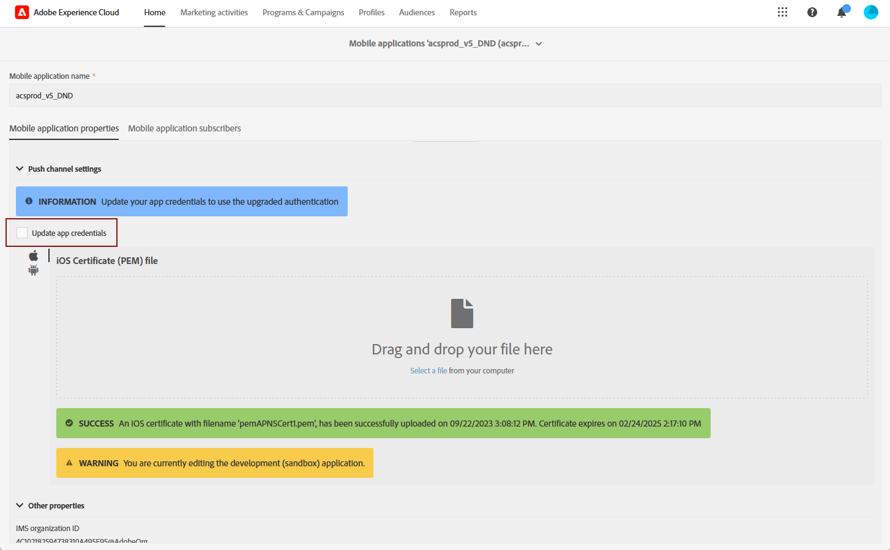

# プッシュ通知チャネルの変更 {#push-upgrade}

Campaign を使用して、Android およびiOSデバイスでプッシュ通知を送信できます。 これを実行するには、Campaign を特定の購読サービスに依存させます。2024 年に Android Firebase Cloud Messaging（FCM）サービスに対するいくつかの重要な変更をリリースします。このリリースは、Adobe Campaign の実装に影響を与える場合があります。この変更をサポートするには、Android プッシュメッセージの購読サービス設定を更新する必要がある場合があります。

さらに、アドビでは、証明書ベースの接続ではなく、より安全で拡張性の高いトークンベースの APN への接続に移行することを強くお勧めします。

中断のないサービスを確保するには、Adobe Campaignに登録されているモバイルアプリケーションをアップグレードして、FCM(Android) と APNs(iOS) の最新の認証メカニズムを組み込む必要があります。

[Adobe Campaign Standardでモバイルアプリケーション証明書を設定する方法の詳細](configuring-a-mobile-application.md#channel-specific-config)

## Google Android Firebase Cloud Messaging（FCM）サービス {#fcm-push-upgrade}

### 変更点 {#fcm-changes}

Google のサービス向上への継続的な取り組みの一環として、レガシー FCM API は **2024年6月20日（PT）**&#x200B;に廃止されます。Firebase Cloud Messaging HTTP プロトコルについて詳しくは、[Google Firebase ドキュメント](https://firebase.google.com/docs/cloud-messaging/http-server-ref){target="_blank"}を参照してください。

開始中 [24.1 リリース](../../rn/using/release-notes.md), Adobe Campaign Standardは、Android プッシュ通知メッセージを送信する HTTP v1 API をサポートしています。

### 影響の有無 {#fcm-impact}

既にAdobe Campaign Standardを使用してプッシュ通知を送信している場合は、実装を更新する必要があります。

サービスの分散を避けるには、最新の API への移行が必須です。

<!--To check if you are impacted, you can filter your **Services and Subscriptions** as per the filter below

* If any of your active push notification service uses the **HTTP (legacy)** API, your setup will be directly impacted by this change. You must review your current configurations and move to the newer APIs as described below.

* If your setup exclusively uses the **HTTP v1** API for Android push notifications, then you are already in compliance and no further action will be required on your part.-->

### 更新方法 {#fcm-transition-procedure}

#### 前提条件 {#fcm-transition-prerequisites}

* のサポート **HTTP v1 API** モードが 24.1 リリースで追加されました。 環境が古いバージョンで実行されている場合、この変更の前提条件は、環境を [最新Campaign Standardリリース](../../rn/using/release-notes.md).

* モバイルアプリケーションを HTTP v1 に移行するには、Android Firebase Admin SDK サービスのアカウント JSON ファイルが必要です。このファイルを取得する方法について詳しくは、[Google Firebase ドキュメント](https://firebase.google.com/docs/admin/setup#initialize-sdk){target="_blank"}を参照してください。

* このレガシーバージョンの SDK をまだ使用している場合は、Adobe Experience Platform SDK で実装を更新する必要があります。 で Experience Platform SDK にAdobeする方法を説明します。 [この記事](sdkv4-migration.md).

* 次の項目を確認します。 **モバイルアプリ設定** 以下の手順を実行する前に、Adobe Experience Platform Data Collection Mobile の権限を設定してください。 [詳細情報](https://experienceleague.adobe.com/docs/experience-platform/collection/permissions.html?lang=en#adobe-experience-platform-data-collection-permissions){target="_blank"}.

#### トランジション手順 {#fcm-transition-steps}

環境を HTTP v1 に移行するには、次の手順に従います。

1. 参照先 **[!UICONTROL Administration]** > **[!UICONTROL Channels]** > **[!UICONTROL Mobile app (AEP SDK)]**.

   

1. 証明書の更新を必要とする特定のモバイルアプリケーションを選択します。

1. 次を確認します。 **[!UICONTROL Update app credentials]** チェックボックス。

   

1. Android プロジェクトの `build.gradle` ファイル。 例： `com.android.test.testApp`. ステージング環境と実稼動環境では異なる ID を必ず使用してください。

1. Android 秘密鍵 JSON キーファイルをアップロードします。

   

1. 「**保存**」ボタンをクリックします。

>[!NOTE]
>
>これらの変更が適用されると、Android デバイスへのすべての新しいプッシュ通知配信で HTTP v1 API が使用されます。 再試行中、処理中、使用中の既存のプッシュ配信では、HTTP（レガシー）API を引き続き使用します。

## Apple iOS プッシュ通知サービス（APNs） {#apns-push-upgrade}

### 変更点 {#ios-changes}

Apple の推奨に従って、ステートレス認証トークンを使用して Apple プッシュ通知サービス（APNs）との通信を保護する必要があります。

トークンベースの認証では、APNs と通信するためのステートレスな方法を提供します。ステートレス通信は、APNs が証明書やプロバイダーサーバーに関連するその他の情報を検索する必要がないので、証明書ベースの通信より高速です。トークンベースの認証を使用することには他にも次のようなメリットがあります。

* 複数のプロバイダーサーバーから同じトークンを使用できます。

* 1 つのトークンを使用して、会社のすべてのアプリに関する通知を配布できます。

APNs へのトークンベースの接続について詳しくは、[Apple 開発者向けドキュメント](https://developer.apple.com/documentation/usernotifications/establishing-a-token-based-connection-to-apns){target="_blank"}を参照してください。

Adobe Campaign Standardは、トークンベースの接続と証明書ベースの接続の両方をサポートしています。 実装が証明書ベースの接続に依存している場合、アドビではトークンベースの接続に更新することを強くお勧めします。

### 影響の有無 {#ios-impact}

現在の実装が APNs への接続に証明書ベースのリクエストに依存している場合、影響を受けます。トークンベースの接続へのトランジションをお勧めします。

<!--To check if you are impacted, you can filter your **Services and Subscriptions** as per the filter below:

* If any of your active push notification service uses the **Certificate-based authentication** mode (.p12), your current implementations should be reviewed and moved to a **Token-based authentication** mode (.p8) as described below.

* If your setup exclusively uses the **Token-based authentication** mode for iOS push notifications, then your implementation is already up-to-date and no further action will be required on your part.-->

### 更新方法 {#ios-transition-procedure}

#### 前提条件 {#ios-transition-prerequisites}

* のサポート **トークンベースの認証** モードが [24.1 リリース](../../rn/using/release-notes.md). 環境が古いバージョンで実行されている場合、この変更の前提条件は、環境を [最新Campaign Standardリリース](../../rn/using/release-notes.md).

* サーバーが使用するトークンを生成するには、APNs 認証トークン署名キーが必要です。[Apple 開発者向けドキュメント](https://developer.apple.com/documentation/usernotifications/establishing-a-token-based-connection-to-apns){target="_blank"}で説明するように、Apple 開発者アカウントからこのキーをリクエストします。

#### トランジション手順 {#ios-transition-steps}

iOS モバイルアプリケーションをトークンベースの認証モードに移行するには、次の手順に従います。

1. 参照先 **[!UICONTROL Administration]** > **[!UICONTROL Channels]** > **[!UICONTROL Mobile app (AEP SDK)]**.

   

1. 証明書の更新を必要とする特定のモバイルアプリケーションを選択します。

1. 次を確認します。 **[!UICONTROL Update app credentials]** チェックボックス。

   

1. 次を提供： **アプリ ID** (iOSバンドル ID)。 Xcode で、iOSバンドル ID（アプリ ID）をアプリのプライマリターゲットで検索できます。

1. 次をアップロード： **iOS p8 証明書ファイル**.

1. APNs 接続設定を入力します **[!UICONTROL Key Id]** および **[!UICONTROL iOS Team Id]**.

   

1. 「**[!UICONTROL Save]**」をクリックします。

これで、iOS アプリケーションがトークンベースの認証モードに移行しました。

## よくある質問{#push-upgrade-faq}

+++ステージング&amp;実稼働インスタンスに同じ appID を保持できますか？

iOSモバイルアプリケーションの場合、ステージング環境と実稼動環境の両方で、同じアプリ ID(iOSアプリバンドル ID) を使用できます。 ただし、Android では、アプリ ID は環境ごとに一意である必要があります。 したがって、ステージング環境で作成したアプリ ID に「stage」を追加することをお勧めします

+++

+++Android アプリのみを移行できますか？

いいえ。Android アプリとiOSアプリの両方を、上記の手順に従って移行する必要があります。

+++

+++移行後に実行する必要がある検証の種類

すべてのプッシュ関連の使用例に対して機能検証を実行することをお勧めします。

+++

+++モバイルアプリの保存中に「認証されていません」というエラーが発生した場合は、どうすればよいですか？

これは、Adobe Experience Platform Data Collection に関連する権限の問題のようです。 これを解決するには、この記事の前提条件の節で説明されているように、Adobe Admin Consoleに「モバイル」および「モバイルアプリ設定」権限を追加する必要があります。

+++

+++変更がモバイルアプリコードに必要ですか？

いいえ。必要なのは、Firebase とアプリ開発者アカウントの設定関連の変更のみです。 顧客モバイルアプリの変更は必要ありません。

+++

+++毎年iOS証明書を更新する必要がありますか？

いいえ、この移行後は、毎年iOS証明書を更新する必要はありません。

+++

+++この移行が行われていない場合はどうなりますか？

Googleからの通知に従って、2024 年 6 月 20 日以降、Android のプッシュメッセージは失敗します。 [詳細情報](https://firebase.google.com/docs/cloud-messaging/migrate-v1){target="_blank"}。

+++

+++FCMv1 の移行を完了した後、お客様は FCM に戻すことができますか？

はい、2024 年 6 月 20 日までに FCM に移行できます。 この日以降、移行オプションは使用できなくなります。

+++

+++HTTP v1 API の移行は、SDK V4 モバイルアプリでサポートされていますか？

いいえ。まずモバイルアプリを V5 SDK に移行し、次に上記の移行を進める必要があります。 Googleからの通知に従って、2024 年 6 月からプッシュサービスが失敗し始めるので、優先しておこなう必要があります。

+++

+++ステージインスタンスでの変更は、実稼動インスタンスに影響を与えますか？

いいえ。ステージングモバイルアプリでの変更が実稼動インスタンスに及ぼす影響はありません。

+++