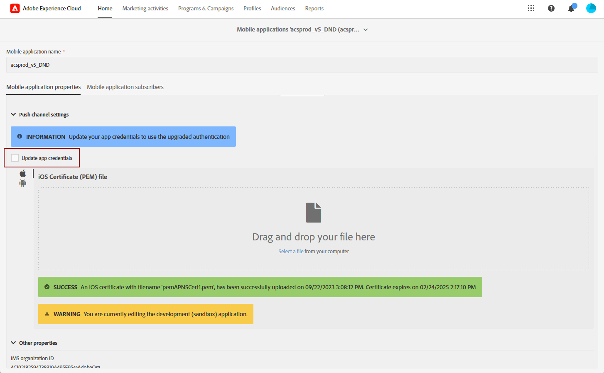
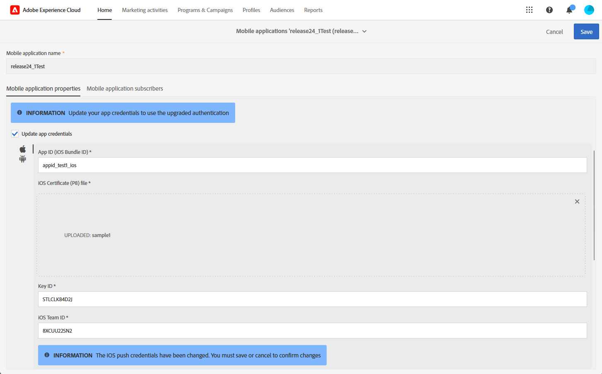

# プッシュ通知チャネルの変更 {#push-upgrade}

Campaignを使用して、AndroidおよびiOS デバイスでプッシュ通知を送信できます。 これを実行するには、Campaign を特定の購読サービスに依存させます。2024 年に Android Firebase Cloud Messaging（FCM）サービスに対するいくつかの重要な変更をリリースします。このリリースは、Adobe Campaign の実装に影響を与える場合があります。この変更をサポートするには、Android プッシュメッセージの購読サービス設定を更新する必要がある場合があります。

さらに、アドビでは、証明書ベースの接続ではなく、より安全で拡張性の高いトークンベースの APN への接続に移行することを強くお勧めします。

中断のないサービスを保証するには、Adobe Campaignに登録されているモバイルアプリケーションをアップグレードして、FCM （Android）およびAPN （iOS）の最新の認証メカニズムを組み込む必要があります。

[Adobe Campaign Standardでモバイルアプリケーション証明書を設定する方法について詳しく説明します](configuring-a-mobile-application.md#channel-specific-config)

## Google Android Firebase Cloud Messaging（FCM）サービス {#fcm-push-upgrade}

### 変更点 {#fcm-changes}

Google のサービス向上への継続的な取り組みの一環として、レガシー FCM API は **2024年6月20日（PT）**&#x200B;に廃止されます。Firebase Cloud Messaging HTTP プロトコルの詳細については、[Google Firebase ドキュメント &#x200B;](https://firebase.google.com/docs/cloud-messaging/http-server-ref){target="_blank"}を参照してください。

[24.1 リリース &#x200B;](../../rn/using/release-notes.md)以降、Adobe Campaign Standardでは、Android プッシュ通知メッセージを送信するHTTP v1 APIをサポートしています。

### 影響の有無 {#fcm-impact}

すでにAdobe Campaign Standardを使用してプッシュ通知を送信している場合は、実装を更新する必要があります。

サービスの混乱を避けるには、最新のAPIへの移行が必須です。

<!--
To check if you are impacted, you can filter your **Services and Subscriptions** as per the filter below

* If any of your active push notification service uses the **HTTP (legacy)** API, your setup will be directly impacted by this change. You must review your current configurations and move to the newer APIs as described below.

* If your setup exclusively uses the **HTTP v1** API for Android push notifications, then you are already in compliance and no further action will be required on your part.
-->

### 更新方法 {#fcm-transition-procedure}

#### 前提条件 {#fcm-transition-prerequisites}

* 24.1 リリースで、**HTTP v1 API** モードのサポートが追加されました。 環境が古いバージョンで実行されている場合、この変更の前提条件は、環境を[最新のCampaign Standard リリース &#x200B;](../../rn/using/release-notes.md)にアップグレードすることです。

* モバイルアプリケーションを HTTP v1 に移行するには、Android Firebase Admin SDK サービスのアカウント JSON ファイルが必要です。このファイルの取得方法については、[Google Firebase ドキュメント &#x200B;](https://firebase.google.com/docs/admin/setup#initialize-sdk){target="_blank"}を参照してください。

* このレガシーバージョンのSDKをまだ使用している場合は、Adobe Experience Platform SDKを使用して実装を更新する必要があります。 [この記事](sdkv4-migration.md)では、Adobe Experience Platform SDKへの移行方法について説明します。

* 次の手順を実行する前に、Adobe Experience Platform Data Collection Mobileで&#x200B;**Mobile App Configuration**&#x200B;権限があることを確認してください。 [詳細情報](https://experienceleague.adobe.com/docs/experience-platform/collection/permissions.html?lang=ja#adobe-experience-platform-data-collection-permissions){target="_blank"}。

#### トランジション手順 {#fcm-transition-steps}

環境を HTTP v1 に移行するには、次の手順に従います。

1. **[!UICONTROL Administration]** > **[!UICONTROL Channels]** > **[!UICONTROL Mobile app (AEP SDK)]**&#x200B;を参照します。

   

1. 証明書の更新が必要な特定のモバイルアプリケーションを選択します。

1. 「**[!UICONTROL Update app credentials]**」チェックボックスをオンにします。

   

1. Android プロジェクトの`build.gradle` ファイルからアプリ ID （Android パッケージ名）を指定します。 例：`com.android.test.testApp`。 ステージング環境と実稼動環境に対して異なるIDを使用するようにしてください。

1. Android秘密鍵JSON キーファイルをアップロードします。

   

1. 「**保存**」ボタンをクリックします。

>[!NOTE]
>
>これらの変更が適用されると、Android デバイスへのすべての新しいプッシュ通知の配信でHTTP v1 APIが使用されます。 再試行中、処理中、使用中の既存のプッシュ配信では、HTTP（レガシー）API を引き続き使用します。

## Apple iOS プッシュ通知サービス（APNs） {#apns-push-upgrade}

### 変更点 {#ios-changes}

Apple の推奨に従って、ステートレス認証トークンを使用して Apple プッシュ通知サービス（APNs）との通信を保護する必要があります。

トークンベースの認証では、APNs と通信するためのステートレスな方法を提供します。ステートレス通信は、APNs が証明書やプロバイダーサーバーに関連するその他の情報を検索する必要がないので、証明書ベースの通信より高速です。トークンベースの認証を使用することには他にも次のようなメリットがあります。

* 複数のプロバイダーサーバーから同じトークンを使用できます。

* 1 つのトークンを使用して、会社のすべてのアプリに関する通知を配布できます。

APNへのトークンベースの接続について詳しくは、[Apple開発者ドキュメント &#x200B;](https://developer.apple.com/documentation/usernotifications/establishing-a-token-based-connection-to-apns){target="_blank"}を参照してください。

Adobe Campaign Standardは、トークンベースの接続と証明書ベースの接続の両方をサポートしています。 実装が証明書ベースの接続に依存している場合、アドビではトークンベースの接続に更新することを強くお勧めします。

### 影響の有無 {#ios-impact}

現在の実装が APNs への接続に証明書ベースのリクエストに依存している場合、影響を受けます。トークンベースの接続へのトランジションをお勧めします。

<!--
To check if you are impacted, you can filter your **Services and Subscriptions** as per the filter below:

* If any of your active push notification service uses the **Certificate-based authentication** mode (.p12), your current implementations should be reviewed and moved to a **Token-based authentication** mode (.p8) as described below.

* If your setup exclusively uses the **Token-based authentication** mode for iOS push notifications, then your implementation is already up-to-date and no further action will be required on your part.
-->

### 更新方法 {#ios-transition-procedure}

#### 前提条件 {#ios-transition-prerequisites}

* **トークンベースの認証** モードのサポートは、[24.1 リリース &#x200B;](../../rn/using/release-notes.md)で追加されました。 環境が古いバージョンで実行されている場合、この変更の前提条件は、環境を[最新のCampaign Standard リリース &#x200B;](../../rn/using/release-notes.md)にアップグレードすることです。

* サーバーが使用するトークンを生成するには、APNs 認証トークン署名キーが必要です。このキーは、[Apple開発者ドキュメント &#x200B;](https://developer.apple.com/documentation/usernotifications/establishing-a-token-based-connection-to-apns){target="_blank"}で説明されているように、Apple開発者アカウントにリクエストされます。

#### トランジション手順 {#ios-transition-steps}

iOS モバイルアプリケーションをトークンベースの認証モードに移行するには、次の手順に従います。

1. **[!UICONTROL Administration]** > **[!UICONTROL Channels]** > **[!UICONTROL Mobile app (AEP SDK)]**&#x200B;を参照します。

   

1. 証明書の更新が必要な特定のモバイルアプリケーションを選択します。

1. 「**[!UICONTROL Update app credentials]**」チェックボックスをオンにします。

   

1. **アプリ ID** （iOS バンドル ID）を指定します。 IOS バンドル ID （アプリ ID）は、Xcodeのアプリのプライマリターゲットで見つけることができます。

1. **iOS p8証明書ファイル**&#x200B;をアップロードします。

1. APNs接続設定&#x200B;**[!UICONTROL Key Id]**&#x200B;と&#x200B;**[!UICONTROL iOS Team Id]**&#x200B;を入力します。

   

1. 「**[!UICONTROL Save]**」をクリックします。

これで、iOS アプリケーションがトークンベースの認証モードに移行しました。

## よくある質問{#push-upgrade-faq}

+++ステージと実稼動インスタンスで同じappIDを維持できますか？

IOS モバイルアプリケーションの場合は、ステージング環境と実稼動環境の両方で、iOS アプリバンドル IDと同じApp IDを使用できます。 ただし、Androidでは、App IDは各環境に対して一意である必要があります。 したがって、ステージング環境で作成されたアプリ IDに「stage」を追加することをお勧めします

+++

+++Android アプリのみを移行できますか？

いいえ。上記の手順に従って、AndroidとiOSの両方を移行する必要があります。

+++

+++移行後に実行する必要がある検証の種類は何ですか？

プッシュに関連するすべてのユースケースの機能検証を実施することをお勧めします。

+++

+++モバイルアプリの保存中に「未承認」エラーが発生した場合はどうすればよいですか？

これは、Adobe Experience Platform Data Collectionに関連する権限の問題のようです。 この問題を解決するには、この記事の「前提条件」セクションに記載されているように、Adobe Admin Consoleに「モバイル」および「モバイルアプリ設定」権限を追加する必要があります。

+++

+++モバイルアプリのコードの変更は必要ですか？

いいえ。Firebaseとアプリ開発者アカウントの設定関連の変更のみが必要です。 顧客モバイルアプリの変更は必要ありません。

+++

+++IOS証明書を毎年更新する必要がありますか？

いいえ。この移行後、iOS証明書を毎年更新する必要はありません。

+++

+++移行が完了しなかった場合はどうなりますか？

Googleからの通知に従って、Android プッシュメッセージは2024年6月20日以降に失敗し始めます。 [詳細情報](https://firebase.google.com/docs/cloud-messaging/migrate-v1){target="_blank"}。

+++

+++FCMv1の移行を完了した後、お客様はFCMに戻れますか？

はい。お客様は2024年6月20日（PT）までFCMに移行できます。 この日付以降、移行オプションは使用できなくなります。

+++

+++SDK V4 モバイルアプリでHTTP v1 API移行はサポートされていますか？

いいえ。お客様は、まずモバイルアプリをV5 SDKに移行してから、上記の移行を進める必要があります。 Googleからの通知に従って、プッシュサービスが2024年6月から失敗し始めるため、優先的に実行する必要があります。

+++

+++ステージインスタンスの変更は、実稼動インスタンスに影響を与えますか？

いいえ、ステージモバイルアプリの変更が実稼動インスタンスに与える影響はありません。

+++
