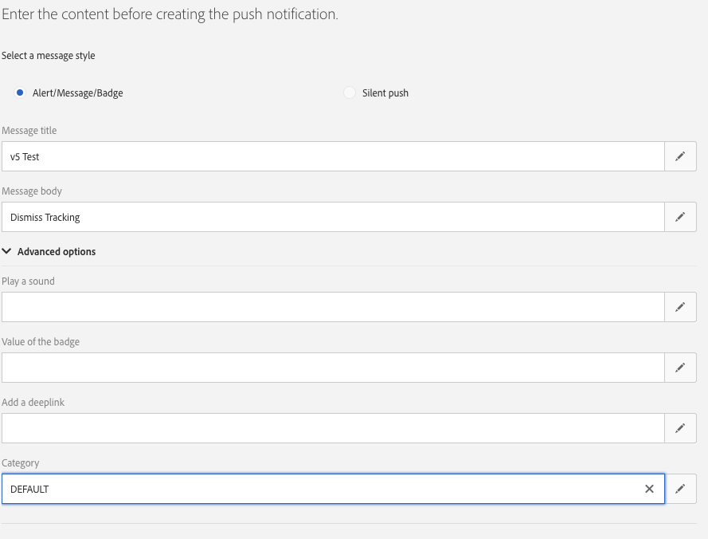

# プッシュトラッキングの実装 {#push-tracking}

## プッシュトラッキングについて {#about-push-tracking}

プッシュ通知が完全に開発されていることを確認するには、すべてのプッシュ通知でトラッキングが有効になっているわけではないので、トラッキング部分が正しく実装されていることを確認する必要があります。 これを有効にするには、開発者がトラッキングが有効になっている配信を特定する必要があります。Adobe Campaign Standardは、2つの値&#x200B;**on**&#x200B;または&#x200B;**off**&#x200B;を持つ`_acsDeliveryTracking`というフラグを送信します。 アプリ開発者は、変数が&#x200B;**on**&#x200B;に設定されている配信に対してのみトラッキングリクエストを送信する必要があります。

>[!IMPORTANT]
>
>この変数は、21.1 リリースより前に設定された配信や、カスタムテンプレートを使用した配信では使用できません。

プッシュトラッキングは、次の3つのタイプに分かれています。

* **プッシュインプレッション** - プッシュ通知がデバイスに正常に配信された場合、ユーザーの操作なしで通知センターに格納されます。

* **プッシュクリック** - プッシュ通知がデバイスに配信され、ユーザーがデバイスをクリックした場合。  ユーザーは通知を表示するか（次にプッシュオープントラッキングに移動します）、通知を却下します。

* **プッシュオープン** - プッシュ通知がデバイスに配信され、ユーザーが通知をクリックしてアプリが開いた場合。 プッシュクリックと似ていますが、プッシュ開封は、通知が解除された場合はトリガーされません。

Campaign Standardのトラッキングを実装するには、モバイルアプリにAdobe Experience Platform SDKを含める必要があります。 これらのSDKは、[Adobe Experience Platform SDK ドキュメント ](https://github.com/Adobe-Marketing-Cloud/acp-sdks)で入手できます。

トラッキング情報を送信するには、3つの変数を送信する必要があります。 2つは、Campaign Standardから受信したデータの一部であり、**インプレッション**、**クリック**、**オープン**&#x200B;のいずれであるかを示すアクション変数です。

| 変数 | 値 |
|:-:|:-:|
| broadlogId | データからの_mId |
| deliveryId | データからの_dId |
| アクション | 開く場合は「1」、クリックの場合は「2」、インプレッションの場合は「7」 |

## Androidの導入 {#implementation-android}

### プッシュインプレッション追跡の導入方法 {#push-impression-tracking-android}

インプレッションのトラッキングの場合、`collectMessageInfo()`または`trackAction()`関数を呼び出す際に、アクションの値「7」を送信する必要があります。

21.1 リリースより前に作成された配信またはカスタムテンプレートを使用した配信については、この[ セクション ](../../administration/using/push-tracking.md#about-push-tracking)を参照してください。

```
@Override
public void onMessageReceived(RemoteMessage remoteMessage) {
....{Handle push messages}....
  if (data.size() > 0) {
    String deliveryId = data.get("_dId");
    String messageId = data.get("_mId");
    String acsDeliveryTracking = data.get("_acsDeliveryTracking");
 
    /*
    This is to handle deliveries created before 21.1 release or deliveries with custom template
    where acsDeliveryTracking is not available.
    */
    if( acsDeliveryTracking == null ) {
        acsDeliveryTracking = "on";
    }
 
    HashMap<String, String> contextData = new HashMap<>();
    if( deliveryId != null && messageId != null && acsDeliveryTracking.equals("on")) {
      contextData.put("deliveryId", deliveryId);
      contextData.put("broadlogId", messageId);
      contextData.put("action", "7");

    //If you are using ACPCore v1.4.0 or later, use the next line.
      
      MobileCore.collectMessageInfo(contextData);
      
    //Else comment out the above line and uncomment the line below
        
    //MobileCore.trackAction("tracking", contextData) ;
    }
  }
}
```

### クリックトラッキングの導入方法 {#push-click-tracking-android}

クリック トラッキングの場合、`collectMessageInfo()`または`trackAction()`関数を呼び出す際に、アクションの値「2」を送信する必要があります。
クリックを追跡するには、次の2つのシナリオを処理する必要があります。

* ユーザーは通知を見たがクリアします。
* ユーザーは通知を見てクリックすると、その通知が開いたトラッキングに変わります。

これを処理するには、2つのインテントを使用する必要があります。1つは通知をクリックするためのインテントで、もう1つは通知を却下するためのインテントです。

21.1 リリースより前に作成された配信またはカスタムテンプレートを使用した配信については、この[ セクション ](../../administration/using/push-tracking.md#about-push-tracking)を参照してください。

**[!UICONTROL MyFirebaseMessagingService.java]**

```
private void sendNotification(Map<String, String> data) {
    Intent openIntent = new Intent(this, CollectPIIActivity.class);
    Intent dismissIntent = new Intent(this, NotificationDismissedReceiver.class);
    openIntent.addFlags(Intent.FLAG_ACTIVITY_CLEAR_TOP);
  
    //put the data map into the intent to track clickthroughs
    Bundle pushData = new Bundle();
    Set<String> keySet = data.keySet();
    for (String key : keySet) {
        pushData.putString(key, data.get(key));
    }
    openIntent.putExtras(pushData);
    dissmissIntent.putExtras(pushData);
  
  
    PendingIntent pendingIntent = PendingIntent.getActivity(this, 0, openIntent,
        PendingIntent.FLAG_UPDATE_CURRENT);
    PendingIntent onDismissPendingIntent = PendingIntent.getBroadcast(this.getApplicationContext(), 0, dismissIntent, 0);
  
    //<BUILD NOTIFICATION using notification builder>
    //Add both Intents to the notification
    notificationBuilder.setContentIntent(pendingIntent);
    notificationBuilder.setDeleteIntent(onDismissPendingIntent);
}
```

**[!UICONTROL BroadcastReceiver]**&#x200B;を機能させるには、**[!UICONTROL AndroidManifest.xml]**&#x200B;に登録する必要があります

```
<manifest>
    <application>
        <receiver android:name=".NotificationDismissedReceiver">
        </receiver>
    </application>
</manifest>
```

NotificationDismessedReceiver.java

```
public class NotificationDismissedReceiver extends BroadcastReceiver {
    private static final String TAG = NotificationDismissedReceiver.class.getSimpleName();
    @Override
    public void onReceive(Context context, Intent intent) {
        Bundle data = intent.getExtras();
        String deliveryId = data.getString("_dId");
        String messageId = data.getString("_mId");
        String acsDeliveryTracking = data.get("_acsDeliveryTracking");
         
        /*
        This is to handle deliveries created before 21.1 release or deliveries with custom template
        where acsDeliveryTracking is not available.
        */
        if( acsDeliveryTracking == null ) {
            acsDeliveryTracking = "on";
        }
 
        HashMap<String, Object> contextData = new HashMap<>();
 
        //We only send the click tracking since the user dismissed the notification
        if (deliveryId != null && messageId != null && acsDeliveryTracking.equals("on")) {
            contextData.put("deliveryId", deliveryId);
            contextData.put("broadlogId", messageId);
            contextData.put("action", "2");
            
        //If you are using ACPCore v1.4.0 or later, use the next line.
        
            MobileCore.collectMessageInfo(contextData);
            
        //Else comment out the above line and uncomment the line below
        
            //MobileCore.trackAction("tracking", contextData);
        }
    }
}
```

### オープントラッキングの導入方法 {#push-open-tracking-android}

ユーザーがアプリを開くには通知をクリックする必要があるため、「1」と「2」を送信する必要があります。 アプリがプッシュ通知を通じて起動/開かれていない場合、トラッキングイベントは発生しません。

開封率を追跡するには、インテントを作成する必要があります。 インテントオブジェクトを使用すると、特定のアクションが実行されたときにAndroid OSがメソッドを呼び出すことができます。 この場合、通知をクリックしてアプリを開きます。

このコードは、クリックインプレッション追跡の実装に基づいています。 **[!UICONTROL Intent]**&#x200B;が設定されたら、トラッキング情報をAdobe Campaign Standardに送り返す必要があります。 この場合、**[!UICONTROL Open Intent]**&#x200B;を設定してアプリの特定のビューを開く必要があります。これにより、**[!UICONTROL Intent Object]**&#x200B;の通知データを使用してonResume メソッドが呼び出されます。

21.1 リリースより前に作成された配信またはカスタムテンプレートを使用した配信については、この[ セクション ](../../administration/using/push-tracking.md#about-push-tracking)を参照してください。

```
@Override
protected void onResume() {
    super.onResume();
    handleTracking();
}
 
 
private void handleTracking() {
    //Check to see if this view was opened based on a notification
    Intent intent = getIntent();
    Bundle data = intent.getExtras();
 
    if (data != null) {
        //This was opened based on the notification, you need to get the tracking that was passed on.
        String deliveryId = data.getString("_dId");
        String messageId = data.getString("_mId");
        String acsDeliveryTracking = data.get("_acsDeliveryTracking");
        /*
        This is to handle deliveries created before 21.1 release or deliveries with custom template
        where acsDeliveryTracking is not available.
        */
        if( acsDeliveryTracking == null) {
            acsDeliveryTracking = "on";
        }
 
        HashMap<String, String> contextData = new HashMap<>();
 
        if (deliveryId != null && messageId != null && acsDeliveryTracking.equals("on")) {
            contextData.put("deliveryId", deliveryId);
            contextData.put("broadlogId", messageId);
            contextData.put("action", "2");
            
            //Send Click Tracking since the user did click on the notification
              
                //If you are using ACPCore v1.4.0 or later, use the next line.

                MobileCore.collectMessageInfo(contextData);
                  
                //Else comment out the above line and uncomment the line below
        
                //MobileCore.trackAction("tracking", contextData);
 
                //Send Open Tracking since the user opened the app
            
                contextData.put("action", "1");
                
                //If you are using ACPCore v1.4.0 or later, use the next line.

                MobileCore.collectMessageInfo(contextData);
                //Else comment out the above line and uncomment the line below
        
                //MobileCore.trackAction("tracking", contextData);
        }
    }
}
```

## IOSの導入 {#implementation-iOS}

### プッシュインプレッション追跡の導入方法 {#push-impression-tracking-iOS}

インプレッションのトラッキングの場合、`collectMessageInfo()`または`trackAction()`関数を呼び出す際に、アクションの値「7」を送信する必要があります。

IOS通知の仕組みを理解するには、アプリの3つの状態を詳細に把握する必要があります。

* **描画中**: アプリが現在アクティブで、現在スクリーン上（描画中）にある場合。
* **背景**：がアプリが画面にないが、プロセスが閉じられていない場合。 ホームボタンをダブルクリックすると、通常、バックグラウンドにあるすべてのアプリが表示されます。
* **オフ/クローズ**: プロセスが強制終了されたアプリ。

アプリがバックグラウンドで動作している間も&#x200B;**[!UICONTROL Impression]**&#x200B;のトラッキングを引き続き実行するには、**[!UICONTROL Content-Available]**&#x200B;を送信して、トラッキングを実行する必要があることをアプリに知らせる必要があります。

>[!CAUTION]
>
> アプリが閉じられた場合、アプリが再起動されるまで、Appleはアプリを呼び出しません。 つまり、iOSで通知がいつ受信されたかはわかりません。</br> このため、iOS インプレッション トラッキングは正確ではない可能性があり、信頼性が低いと見なされるべきではありません。

21.1 リリースより前に作成された配信またはカスタムテンプレートを使用した配信については、この[ セクション ](../../administration/using/push-tracking.md#about-push-tracking)を参照してください。

次のコードは、バックグラウンド アプリをターゲットにしています。

```
// In didReceiveRemoteNotification event handler in AppDelegate.m
 
//In order to handle push notification when only in background with content-available: 1
func application(_ application: UIApplication, didReceiveRemoteNotification userInfo: [AnyHashable : Any], fetchCompletionHandler completionHandler: @escaping (UIBackgroundFetchResult) -> Void) {
 
        //Check if the app is not in the foreground right now
        if(UIApplication.shared.applicationState != .active) {
            let deliveryId = userInfo["_dId"] as? String
            let broadlogId = userInfo["_mId"] as? String
            let acsDeliveryTracking = userInfo["_acsDeliveryTracking"] as? String
            /*
            This is to handle deliveries created before 21.1 release or deliveries with custom template where acsDeliveryTracking is not available.
            */
            if( acsDeliveryTracking == nil ) {
                acsDeliveryTracking = "on";
            }
            if (deliveryId != nil && broadlogId != nil && acsDeliveryTracking?.caseInsensitiveCompare("on") == ComparisonResult.orderedSame) {

            //If you are using ACPCore v2.3.0 or later, use the next line.

                ACPCore.collectMessageInfo(["deliveryId": deliveryId!, "broadlogId": broadlogId!, "action":"7"])
                
            //Else comment out the above line and uncomment the line below
        
                //ACPCore.trackAction("tracking", data: ["deliveryId": deliveryId!, "broadlogId": broadlogId!, "action":"7"])
            }
        }
        completionHandler(UIBackgroundFetchResult.noData)
    }
```

次のコードは、フォアグラウンドアプリをターゲットにします。

```
// This will get called when the app is in the foreground
 
func userNotificationCenter(_ center: UNUserNotificationCenter, willPresent notification: UNNotification, withCompletionHandler completionHandler: @escaping (UNNotificationPresentationOptions) -> Void) {
 
 
        let userInfo = notification.request.content.userInfo
        let deliveryId = userInfo["_dId"] as? String
        let broadlogId = userInfo["_mId"] as? String
        let acsDeliveryTracking = userInfo["_acsDeliveryTracking"] as? String
        /*
        This is to handle deliveries created before 21.1 release or deliveries with custom template where acsDeliveryTracking is not available.
        */
        if( acsDeliveryTracking == nil ) {
            acsDeliveryTracking = "on";
        }
        if (deliveryId != nil && broadlogId != nil && acsDeliveryTracking?.caseInsensitiveCompare("on") == ComparisonResult.orderedSame) {

            //If you are using ACPCore v2.3.0 or later, use the next line.

                ACPCore.collectMessageInfo(["deliveryId": deliveryId!, "broadlogId": broadlogId!, "action":"7"])
                
            //Else comment out the above line and uncomment the line below
        
                //ACPCore.trackAction("tracking", data: ["deliveryId": deliveryId!, "broadlogId": broadlogId!, "action":"7"])        
            }
        completionHandler([.alert,.sound])
    }
```

### クリックトラッキングの導入方法 {#push-click-tracking-iOS}

クリック トラッキングの場合、`collectMessageInfo()`または`trackAction()`関数を呼び出す際に、アクションの値「2」を送信する必要があります。
21.1 リリースより前に作成された配信またはカスタムテンプレートを使用した配信については、この[ セクション ](../../administration/using/push-tracking.md#about-push-tracking)を参照してください。

```
// AppDelegate.swift
...
import os.log
import UserNotifications
...
  
func registerForPushNotifications() {
        let center = UNUserNotificationCenter.current()
        center.delegate = notificationDelegate
        //Here we are creating a new Category that allows us to handle Dismiss Actions
        let defaultCategory = UNNotificationCategory(identifier: "DEFAULT", actions: [], intentIdentifiers: [], options: .customDismissAction)
        //Add it to our array of Category, in this case we only have one
        center.setNotificationCategories([defaultCategory])
        center.requestAuthorization(options: [.alert, .sound, .badge]) {
            (granted, error) in
            os_log("Permission granted: %{public}@", type:. debug, granted.description)
            if error != nil {
                return
            }
            if granted {
                os_log("Notifications allowed", type: .debug)
            }
            else {
                os_log("Notifications denied", type: .debug)
            }
  
            // 2. Attempt registration for remote notifications on the main thread
            DispatchQueue.main.async {
                UIApplication.shared.registerForRemoteNotifications()
            }
        }
    }
```

プッシュ通知を送信する際には、カテゴリを追加する必要があります。 この場合は「DEFAULT」と呼んでいます。



次に、**[!UICONTROL Dismiss]**&#x200B;を処理してトラッキング情報を送信するには、次の情報を追加する必要があります。

```
func userNotificationCenter(_ center: UNUserNotificationCenter, didReceive response: UNNotificationResponse, withCompletionHandler completionHandler: @escaping () -> Void) {
        let userInfo = response.notification.request.content.userInfo
        switch response.actionIdentifier {
        case UNNotificationDismissActionIdentifier:
            print("Dismiss Action")
            let deliveryId = userInfo["_dId"] as? String
            let broadlogId = userInfo["_mId"] as? String
            let acsDeliveryTracking = userInfo["_acsDeliveryTracking"] as? String
            /*
            This is to handle deliveries created before 21.1 release or deliveries with custom template where acsDeliveryTracking is not available.
            */
            if( acsDeliveryTracking == nil ) {
                acsDeliveryTracking = "on";
            }
            if (deliveryId != nil && broadlogId != nil && acsDeliveryTracking?.caseInsensitiveCompare("on") == ComparisonResult.orderedSame) {

            //If you are using ACPCore v2.3.0 or later, use the next line.

                ACPCore.collectMessageInfo(["deliveryId": deliveryId!, "broadlogId": broadlogId!, "action":"2"])
                
            //Else comment out the above line and uncomment the line below
        
                //ACPCore.trackAction("tracking", data: ["deliveryId": deliveryId!, "broadlogId": broadlogId!, "action":"2"])   
            }
        default:
            ////MORE CODE
        }
        completionHandler()
    }
```

### オープントラッキングの導入方法 {#push-open-tracking-iOS}

ユーザーがアプリを開くには通知をクリックする必要があるため、「1」と「2」を送信する必要があります。 アプリがプッシュ通知を通じて起動/開かれていない場合、トラッキングイベントは発生しません。

21.1 リリースより前に作成された配信またはカスタムテンプレートを使用した配信については、この[ セクション ](../../administration/using/push-tracking.md#about-push-tracking)を参照してください。

```
import Foundation
import UserNotifications
import UserNotificationsUI
 
class NotificationDelegate: NSObject, UNUserNotificationCenterDelegate {
 
    // Called when user clicks the push notification or also called from willPresent()
    func userNotificationCenter(_ center: UNUserNotificationCenter, didReceive response: UNNotificationResponse, withCompletionHandler completionHandler: @escaping () -> Void) {
 
        let userInfo = response.notification.request.content.userInfo
        os_log("App push data %{public}@, in userNotificationCenter:didReceive()", type: .debug, userInfo)
        switch response.actionIdentifier {
        case UNNotificationDismissActionIdentifier:
            //This is to handle the Dismiss Action
            let deliveryId = userInfo["_dId"] as? String
            let broadlogId = userInfo["_mId"] as? String
            let acsDeliveryTracking = userInfo["_acsDeliveryTracking"] as? String
            /*
            This is to handle deliveries created before 21.1 release or deliveries with custom template where acsDeliveryTracking is not available.
            */
            if( acsDeliveryTracking == nil ) {
                acsDeliveryTracking = "on";
            }
            if (deliveryId != nil && broadlogId != nil && acsDeliveryTracking?.caseInsensitiveCompare("on") == ComparisonResult.orderedSame) {

            //If you are using ACPCore v2.3.0 or later, use the next line.

                ACPCore.collectMessageInfo(["deliveryId": deliveryId!, "broadlogId": broadlogId!, "action":"2"])
                
            //Else comment out the above line and uncomment the line below
        
                //ACPCore.trackAction("tracking", data: ["deliveryId": deliveryId!, "broadlogId": broadlogId!, "action":"2"])

            }
        default:
            //This is to handle the tracking when the app opens
            let deliveryId = userInfo["_dId"] as? String
            let broadlogId = userInfo["_mId"] as? String
            let acsDeliveryTracking = userInfo["_acsDeliveryTracking"] as? String
            /*
            This is to handle deliveries created before 21.1 release or deliveries with custom template where acsDeliveryTracking is not available.
            */
            if( acsDeliveryTracking == nil ) {
                acsDeliveryTracking = "on";
            }
            if (deliveryId != nil && broadlogId != nil && acsDeliveryTracking?.caseInsensitiveCompare("on") == ComparisonResult.orderedSame) {
            //If you are using ACPCore v2.3.0 or later, use the next line.

                ACPCore.collectMessageInfo(["deliveryId": deliveryId!, "broadlogId": broadlogId!, "action":"2"])
                
            //Else comment out the above line and uncomment the line below
        
                //ACPCore.trackAction("tracking", data: ["deliveryId": deliveryId!, "broadlogId": broadlogId!, "action":"2"])                
                
            //If you are using ACPCore v2.3.0 or later, use the next line.

                ACPCore.collectMessageInfo(["deliveryId": deliveryId!, "broadlogId": broadlogId!, "action":"1"])
                
            //Else comment out the above line and uncomment the line below
        
                //ACPCore.trackAction("tracking", data: ["deliveryId": deliveryId!, "broadlogId": broadlogId!, "action":"1"])
                
            }
        }
        completionHandler()
    }
}
```
