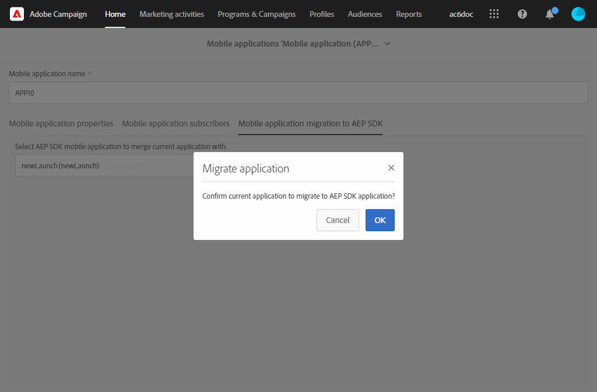

# SDK v4 からAdobe Experience Platform SDK にモバイルアプリケーションを移行する方法 {#sdkv4-migration}

>[!IMPORTANT]
>
> 移行プロセスを元に戻せません。
>
> SDK V4 モバイルアプリケーションのAdobe Experience Platform SDK への移行を開始する前に、ドキュメントをよくお読みください。

## SDK V4 移行について

Adobe Campaign Standardは、SDK V4 を使用してモバイルアプリケーションを、Adobe Experience Platform SDK を使用するアプリケーションとは別のアプリケーションとして処理します。
AdobeSDK のバージョンを v4 からAdobe Experience Platformにアップグレードした後、モバイルアプリケーションは、既存のアプリケーション購読者のデータとキャンペーンを引き続き使用する必要があります。移行が必要です。

>[!NOTE]
>
> このページでは、SDK v4 モバイルアプリケーションを新しく作成したAdobe Experience Platform SDK アプリケーションに移行する方法について説明します。 お使いの SDK v4 モバイルアプリケーションは、Adobe Experience Platform SDK モバイルアプリケーションと **[!UICONTROL Configured]** **[!UICONTROL Property status]**.

| 移行後に変更されないもの |
|:-:|
| 移行された SDK V4 アプリケーションを使用している既存の配信およびキャンペーンには影響しません。 |
| モバイルアプリケーションの名前は変わりません。 |
| iOSおよび Android のプラットフォーム資格情報は保持されます。 |
| アプリケーションのすべての購読者とそのデータは保持されます。 |
| 既存の SDK v4 モバイルアプリケーションは、引き続きAdobe Campaign Standardにデータ（PII データ、購読者およびトークン情報）を送信します。 |
| この **[!UICONTROL Organizational unit]** の両方が同じ状態に保たれます。 |

| 移行後の変更点 |
|:-:|
| モバイルアプリケーションは、 **[!UICONTROL Administration]** > **[!UICONTROL Channels]** > **[!UICONTROL Mobile app (Adobe Experience Platform SDK)]**. 移行前は、で使用できました。 **[!UICONTROL Administration]** > **[!UICONTROL Channels]** > **[!UICONTROL Mobile app (SDK V4)]**. |
| この **[!UICONTROL Collect PII Endpoint]** の値が変更されます。 古い **[!UICONTROL Collect PII Endpoint]** は引き続き機能し、送信されたデータは失われません。 |
| アプリケーションはタグに結び付けられます **[!UICONTROL Mobile Property]**. 新しく作成されたモバイルアプリケーションとして処理されます。 |
| 移行で使用される元のAdobe Experience Platform SDK アプリケーションは、別のアプリケーションとして存在しません。 移行された SDK v4 アプリケーションのみを使用できます。 |

## SDK v4 からAdobe Experience Platform SDK へのモバイルアプリケーションの移行 {#how-to-migrate}

移行する前に、次の推奨事項を考慮する必要があります。

* 移行プロセスを元に戻せません。
* 複数のアプリケーションの移行を同時に実行しないでください。 また、同じアプリケーションの移行が複数のウィンドウで同時にトリガーされないようにする必要があります。
* 移行する前に、必ず **[!UICONTROL Organizational unit]** 移行するモバイルアプリケーションと、移行に使用するAdobe Experience Platformアプリケーションの両方。
* 移行後、アプリケーションはAdobe Experience Platform SDK アプリケーションになります。 変更は、対応するタグにリンクされます **[!UICONTROL Mobile Property]**.

1. 新しい **[!UICONTROL Mobile property]** （データ収集 UI）を参照してください。 詳しくは、 [ドキュメント](https://developer.adobe.com/client-sdks/documentation/getting-started/create-a-mobile-property/).

1. Adobe Campaign Standardの詳細設定メニューで、「 」を選択します。 **[!UICONTROL Administration]** > **[!UICONTROL Application Settings]** > **[!UICONTROL Workflows]** をクリックし、 **[!UICONTROL syncWithLaunch]** ワークフロー。 ワークフローがエラーなく終了したかどうかを確認します。

1. ワークフローの完了後、 **[!UICONTROL Administration]** > **[!UICONTROL Channels]** > **[!UICONTROL Mobile app (Adobe Experience Platform SDK)]** メニューで、モバイルアプリがAdobe Campaign Standardで使用可能かどうか、および **[!UICONTROL Ready to Configure]** 状態。

   

1. In **[!UICONTROL Administration]** > **[!UICONTROL Channels]** > **[!UICONTROL Mobile app (SDK V4)]**、移行する SDK V4 アプリケーションを選択します。

1. 「**[!UICONTROL Mobile application migration to AEP SDK]**」タブを選択します。

   

1. 次の **[!UICONTROL Select AEP SDK mobile application to merge current application with]** ドロップダウンから、以前に作成したAdobe Experience Platform SDK モバイルアプリケーションを選択します。

1. 「**[!UICONTROL Migrate]**」をクリックします。

   

1. 次の **[!UICONTROL Migration application]** ウィンドウ、クリック **[!UICONTROL Ok]**.

   

1. 正常に完了したウィンドウが表示され、「 **[!UICONTROL Go to Adobe Experience Platform SDK Channel list]**.

1. Adobe Experience Platform SDK チャネルリストページで、以前の V4 モバイルアプリケーションがに設定されていることを確認します。 **[!UICONTROL Ready To Configure]**.

1. モバイルアプリケーションを選択し、 **[!UICONTROL Save]** をクリックして、移行を完了します。

この移行後、モバイルアプリケーションの V4 バージョンで収集された購読者と、モバイルアプリケーションの AEP バージョンで収集された新しい購読者を、移行されたアプリケーションで使用できるようになります。

2 つの異なるタイプの購読者を区別するために、 **[!UICONTROL Text]** カスタムリソースを拡張する際のタイプ **[!UICONTROL Subscriptions to an application (appSubscriptionRcp)]** as `sdkversion` または `appVersion` 例： カスタムリソースの拡張方法について詳しくは、 [ページ](../../developing/using/creating-or-extending-the-resource.md).
次に、関連するタグを設定する必要があります **[!UICONTROL Mobile property]** をクリックしてこのカスタムフィールド値を PII 収集呼び出しで送信し、それに応じてモバイルアプリケーションの設定を変更します。

## FAQ {#faq}

### Q:SDK v4 モバイルアプリケーションでは、「 Adobe Experience Platform SDK へのモバイルアプリケーションの移行」タブは表示されません。 {#tab-not-visible}

回答：詳細設定メニューから **[!UICONTROL Administration]** > **[!UICONTROL Application Settings]** > **[!UICONTROL Options]**、 **[!UICONTROL Enable migration of mobile app from SDK v4 to Adobe Experience Platform SDK option]** オプション。 これは 1 に設定し、デフォルトで有効にする必要があります。 管理者が手動で無効にした可能性があります。

### Q:「モバイルアプリケーションからAdobe Experience Platform SDK への移行」タブから、「データがありません」というメッセージが表示されます。 {#no-data}

回答：の適格なアプリケーションのみ **[!UICONTROL Organizational unit]** がリストに表示されます。 移行に適したAdobe Experience Platformアプリケーションがあることを確認してください。 この **[!UICONTROL Property Status]** の値は、Adobe Experience Platformアプリケーションで **[!UICONTROL Ready to Configure]**  そして **[!UICONTROL Mobile app migration status]** に設定 **[!UICONTROL Not Migrated]**.

### Q:設定済みのプロパティステータスを持つAdobe Experience Platform SDK アプリケーションを移行に使用できないのはなぜですか？ {#property-status}

回答：移行プロセスでは、SDK v4 の購読者と属性が保持されます。 Adobe Experience Platform SDK アプリケーションからタグ関連の情報を保持するだけです。 Adobe Experience Platform SDK アプリケーションからの購読者とその他のデータは失われます。 データの損失を避けるために、Adobe Experience Platform SDK アプリケーションのみが **[!UICONTROL Ready to Configure]** **[!UICONTROL Property Status]** は移行の資格を持ちます。

### Q:移行後、以前の SDK v4 モバイルアプリケーションはどこで見つけられましたか？ {#v4-app-not-visible}

回答：移行後のモバイルアプリケーションは、詳細設定メニューから表示されます **[!UICONTROL Administration]** > **[!UICONTROL Channels]** > **[!UICONTROL Mobile app (Adobe Experience Platform SDK)]**.

### Q:移行後、新しく作成したAdobe Experience Platform SDK アプリケーションはどこに見つけられますか。 {#aep-not-visible}

回答：移行に使用する新しく作成したAdobe Experience Platform SDK アプリケーションは、別のアプリケーションとして存在しません。 移行された SDK v4 アプリケーションのみを使用できます。

### Q:SDK v4 モバイルアプリケーションの Organizational unit が A（Organizational unit ALL の子）に、Adobe Experience Platform SDK が ALL に設定されている場合。 モバイルアプリケーションを移行するにはどうすればよいですか？ {#v4-org-unit}

回答：の管理者 **[!UICONTROL Organizational unit]** すべてのユーザーには、両方のモバイルアプリケーションを管理する権限が付与され、移行が担当されます。

### Q:SDK v4 モバイルアプリケーションの Organizational unit が A に、Adobe Experience Platform SDK アプリケーションが B（組織単位 A の兄弟）に設定されている場合。 モバイルアプリケーションを移行するにはどうすればよいですか？ {#aep-org-unit}

回答：兄弟のアセットであるAdobe Experience Platform SDK アプリケーション **[!UICONTROL Organizational unit]**&#x200B;に設定されていない場合、モバイルアプリケーションは **[!UICONTROL Organizational unit]** A.モバイルアプリケーションは、 **[!UICONTROL Organizational unit]** これらの管理者には、モバイルアプリケーションの移行はお勧めしません。
この場合、モバイルアプリを同じ内に移動する必要があります **[!UICONTROL Organizational unit]** または **[!UICONTROL Organizational unit]** を親リンクに置き換えます。
詳しくは、 **[!UICONTROL Organizational unit]**&#x200B;詳しくは、こちらを参照してください。 [セクション](../../administration/using/organizational-units.md).

### Q:Adobe Experience Platform SDK モバイルアプリケーション（v4 モバイルアプリケーションから移行）ページの「プッシュチャネル設定」ドロップダウンに、Android キーまたはiOS証明書用のアップロード日/名前などの情報は表示されません {#no-information-v5}

回答：SDK V4 モバイルアプリケーションを作成する際、システムはこの情報を保存しません。 SDK V4 モバイルアプリケーションをAdobe Experience Platform SDK モバイルアプリケーションに移行する場合、移行したモバイルアプリケーションにもこの種の情報は含まれません。 ユーザーが新しいiOS証明書または Android キーをアップロードすると、すぐにキーまたは証明書の様々な詳細が保存され、 **[!UICONTROL Push channel settings]** 」ドロップダウンリストから選択できます。
