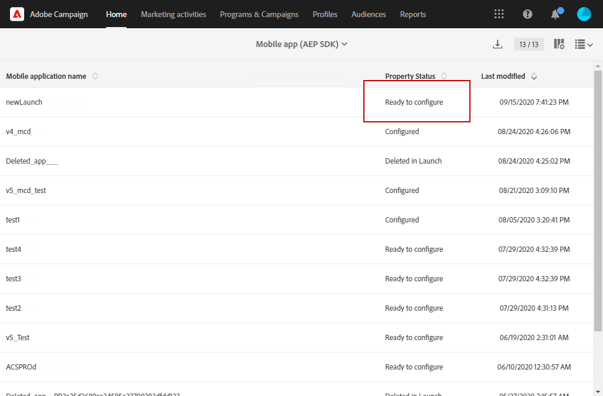
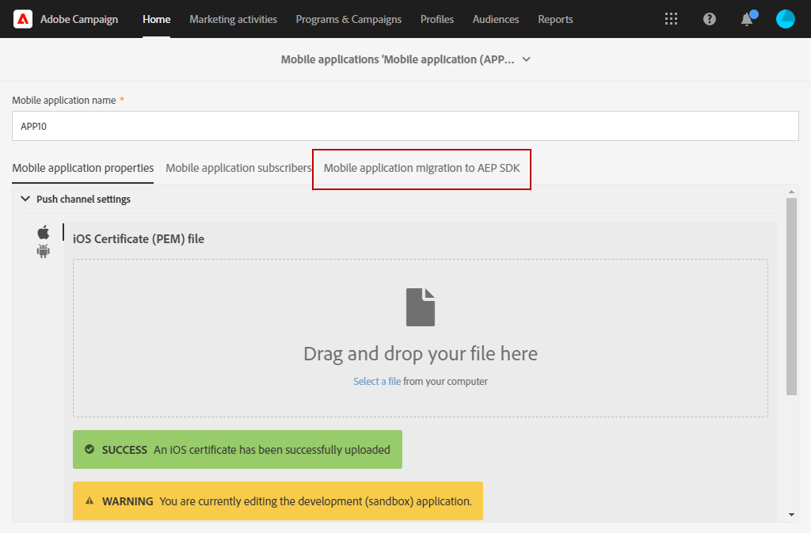
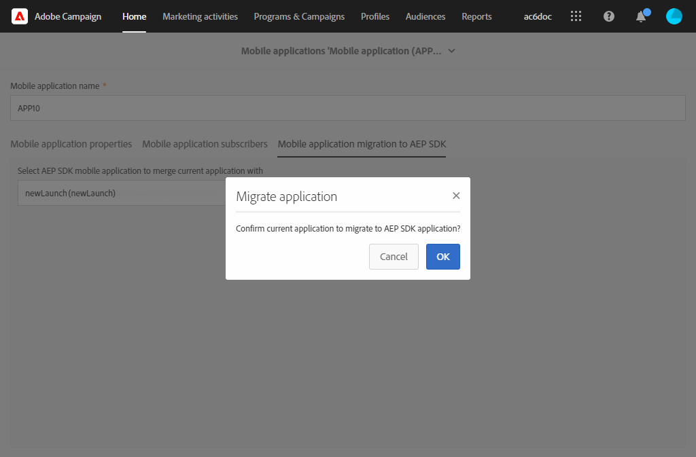
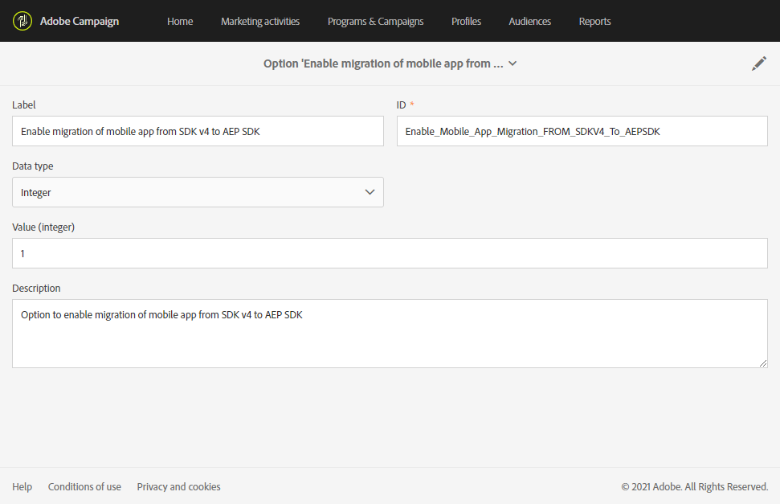

# SDK v4 からAdobe Experience Platform SDK にモバイルアプリケーションを移行する方法 {#sdkv4-migration}

Adobe Experience Platform Mobile バージョン 4 SDKのサポートは、2021年8月31日（PT）をもって終了しました。 このレガシーバージョンのSDKをまだ使用している場合は、2024年6月末&#x200B;**までにAdobe Experience Platform SDK**&#x200B;で実装を更新する必要があります。 Adobe Experience Platform SDKへの移行方法については、この記事を参照してください。

>[!IMPORTANT]
>
> SDK V4 モバイルアプリケーションのAdobe Experience Platform SDKへの移行を開始する前に、ドキュメントを注意深くお読みください。

## SDK V4への移行について

Adobe Campaign Standardは、SDK V4を使用したモバイルアプリケーションを、Adobe Experience Platform SDKを使用したアプリケーションとは別のアプリケーションとして処理します。

Adobe SDK バージョンをv4からAdobe Experience Platformにアップグレードした後、モバイルアプリケーションでは、既存のアプリケーションのサブスクライバーデータとキャンペーンを引き続き使用する必要があります。したがって、移行が必要になります。

>[!NOTE]
>
> このページでは、SDK v4 モバイルアプリケーションを、新しく作成されたAdobe Experience Platform SDK アプリケーションに移行する方法について説明します。 SDK v4 モバイルアプリケーションは、**[!UICONTROL Configured]** **[!UICONTROL Property status]**&#x200B;を持つAdobe Experience Platform SDK モバイルアプリケーションと統合されません。

| 移行後は何が変わらないか |
|:-:|
| 移行されたSDK V4 アプリケーションを使用する既存の配信およびキャンペーンには影響しません。 |
| モバイルアプリケーションの名前は変わりません。 |
| IOSおよびAndroidのプラットフォーム認証情報は保持されます。 |
| アプリケーションのすべてのサブスクライバーとそのデータは保持されます。 |
| 既存のSDK v4 モバイルアプリケーションは、引き続きデータ（PII データ、サブスクライバー、トークン情報）をAdobe Campaign Standardに送信します。 |
| モバイルアプリケーションの&#x200B;**[!UICONTROL Organizational unit]**&#x200B;は引き続き同じです。 |

| 移行後の変更点 |
|:-:|
| モバイルアプリケーションは、**[!UICONTROL Administration]** > **[!UICONTROL Channels]** > **[!UICONTROL Mobile app (Adobe Experience Platform SDK)]**&#x200B;で利用できます。 移行前は、**[!UICONTROL Administration]** > **[!UICONTROL Channels]** > **[!UICONTROL Mobile app (SDK V4)]**&#x200B;で利用できました。 |
| アプリケーションの&#x200B;**[!UICONTROL Collect PII Endpoint]**&#x200B;が変更されます。 古い&#x200B;**[!UICONTROL Collect PII Endpoint]**&#x200B;は引き続き機能します。送信されたデータは失われません。 |
| アプリケーションはタグ **[!UICONTROL Mobile Property]**&#x200B;に関連付けられます。 新しく作成されたモバイルアプリケーションとして処理されます。 |
| 移行で使用される元のAdobe Experience Platform SDK アプリケーションは、別のアプリケーションとして存在しません。 移行されたSDK v4 アプリケーションのみが使用できます。 |

## モバイルアプリケーションをSDK v4からAdobe Experience Platform SDKに移行する {#how-to-migrate}

移行する前に、次の推奨事項を考慮する必要があります。

* 移行プロセスは元に戻せません。
* 複数のアプリケーションの移行を同時に実行しないでください。 また、同じアプリケーションの移行が同時に複数のウィンドウによってトリガーされないようにする必要があります。
* 移行前に、移行するモバイルアプリケーションの&#x200B;**[!UICONTROL Organizational unit]**&#x200B;と、移行用に使用しているAdobe Experience Platform アプリケーションのが割り当てられていることを確認してください。
* 移行後、アプリケーションはAdobe Experience Platform SDK アプリケーションになります。 変更内容は、対応するタグ **[!UICONTROL Mobile Property]**&#x200B;にリンクされます。

1. データ収集UIで新しい&#x200B;**[!UICONTROL Mobile property]**&#x200B;を作成します。 詳しくは、[ ドキュメント ](https://developer.adobe.com/client-sdks/documentation/getting-started/create-a-mobile-property/)を参照してください。

1. Adobe Campaign Standardの詳細設定メニューで、**[!UICONTROL Administration]** > **[!UICONTROL Application Settings]** > **[!UICONTROL Workflows]**&#x200B;を選択し、**[!UICONTROL syncWithLaunch]** ワークフローを開きます。 ワークフローがエラーなしで終了したかどうかを確認します。

1. ワークフローが完了したら、**[!UICONTROL Administration]** > **[!UICONTROL Channels]** > **[!UICONTROL Mobile app (Adobe Experience Platform SDK)]** メニューで、モバイルアプリケーションがAdobe Campaign Standardで使用可能であり、**[!UICONTROL Ready to Configure]**&#x200B;状態であるかどうかを確認します。

   

1. **[!UICONTROL Administration]** > **[!UICONTROL Channels]** > **[!UICONTROL Mobile app (SDK V4)]**&#x200B;で、移行するSDK V4 アプリケーションを選択します。

1. 「**[!UICONTROL Mobile application migration to AEP SDK]**」タブを選択します。

   

1. **[!UICONTROL Select AEP SDK mobile application to merge current application with]** ドロップダウンから、以前に作成したAdobe Experience Platform SDK モバイルアプリケーションを選択します。

1. 「**[!UICONTROL Migrate]**」をクリックします。

   

1. **[!UICONTROL Migration application]** ウィンドウで、**[!UICONTROL Ok]**&#x200B;をクリックします。

   

1. 正常に完了したウィンドウが表示されるので、**[!UICONTROL Go to Adobe Experience Platform SDK Channel list]**&#x200B;をクリックします。

1. Adobe Experience Platform SDK チャンネルリストページで、以前のV4 モバイルアプリケーションが&#x200B;**[!UICONTROL Ready To Configure]**&#x200B;に設定されていることを確認します。

1. モバイルアプリケーションを選択し、**[!UICONTROL Save]**&#x200B;をクリックして移行を完了します。

この移行後、V4 バージョンのモバイルアプリケーションによって収集されたサブスクライバーと、AEP バージョンのモバイルアプリケーションによって収集された新しいサブスクライバーが、移行後のアプリケーションで利用できるようになります。

2つの異なるタイプのサブスクライバーを区別するには、カスタムリソース **[!UICONTROL Subscriptions to an application (appSubscriptionRcp)]**&#x200B;を`sdkversion`または`appVersion`として拡張する場合に、**[!UICONTROL Text]** タイプの新しいカスタムフィールドを追加できます（例：）。 カスタムリソースの拡張方法について詳しくは、この[ ページ ](../../developing/using/creating-or-extending-the-resource.md)を参照してください。
次に、関連付けられたタグ **[!UICONTROL Mobile property]**&#x200B;を設定して、PII呼び出しを収集してこのカスタムフィールド値を送信し、それに応じてモバイルアプリケーション設定を変更する必要があります。

## FAQ {#faq}

### Q: SDK v4 モバイルアプリケーションでは、「Adobe Experience Platform SDKへのモバイルアプリケーションの移行」タブは表示されません。 {#tab-not-visible}

A：詳細メニュー&#x200B;**[!UICONTROL Administration]** > **[!UICONTROL Application Settings]** > **[!UICONTROL Options]**&#x200B;で、**[!UICONTROL Enable migration of mobile app from SDK v4 to Adobe Experience Platform SDK option]** オプションの値を確認します。 1に設定し、デフォルトで有効にする必要があります。 管理者が手動で無効化した可能性があります。

### Q: 「Mobile application migration to Adobe Experience Platform SDK」タブで、「No data」というメッセージが表示されます。 {#no-data}

A: リストには、**[!UICONTROL Organizational unit]**&#x200B;の対象アプリケーションのみが表示されます。 移行用の適切なAdobe Experience Platform アプリケーションが用意されていることを確認してください。 Adobe Experience Platform アプリケーションの&#x200B;**[!UICONTROL Property Status]**&#x200B;を&#x200B;**[!UICONTROL Ready to Configure]**&#x200B;に、**[!UICONTROL Mobile app migration status]**&#x200B;を&#x200B;**[!UICONTROL Not Migrated]**&#x200B;に設定する必要があります。

### 質問：設定済みプロパティステータスを持つAdobe Experience Platform SDK アプリケーションを移行に使用できないのはなぜですか？ {#property-status}

A：移行プロセスでは、SDK v4のサブスクライバーと属性が保持されます。 Adobe Experience Platform SDK アプリケーションのタグ関連情報のみが保持されます。 Adobe Experience Platform SDK アプリケーションのサブスクライバーおよびその他のデータは失われます。 データが失われるのを防ぐため、**[!UICONTROL Ready to Configure]** **[!UICONTROL Property Status]**&#x200B;を持つAdobe Experience Platform SDK アプリケーションのみが移行の対象となります。

### Q：移行後、以前のSDK v4 モバイルアプリケーションはどこで見つけることができますか？ {#v4-app-not-visible}

A：移行後のモバイルアプリケーションは、詳細メニュー&#x200B;**[!UICONTROL Administration]** > **[!UICONTROL Channels]** > **[!UICONTROL Mobile app (Adobe Experience Platform SDK)]**&#x200B;から表示されます。

### Q：移行後、新しく作成したAdobe Experience Platform SDK アプリケーションはどこで見つけることができますか？ {#aep-not-visible}

A：新しく作成されたAdobe Experience Platform SDK アプリケーションは、別のアプリケーションとして存在しません。 移行されたSDK v4 アプリケーションのみが使用できます。

### Q: SDK v4 mobile application Organizational unitがA （Organizational unit ALLの子）に設定され、Adobe Experience Platform SDKがALLに設定されている場合。 モバイルアプリケーションを移行するにはどうすればよいですか？ {#v4-org-unit}

回答：**[!UICONTROL Organizational unit]** ALLの管理者は、両方のモバイルアプリケーションを管理する権限を持ち、移行を担当します。

### Q: SDK v4 mobile application Organizational unitがAに設定され、Adobe Experience Platform SDK applicationがB （Organizational unit Aの兄弟）に設定されている場合。 モバイルアプリケーションを移行するにはどうすればよいですか？ {#aep-org-unit}

A：兄弟&#x200B;**[!UICONTROL Organizational unit]**&#x200B;のアセットであるAdobe Experience Platform SDK アプリケーションは、**[!UICONTROL Organizational unit]** Aのユーザーには表示されません。モバイルアプリケーションは&#x200B;**[!UICONTROL Organizational unit]** ALLの管理者が利用できますが、これらの管理者がモバイルアプリケーションを移行することはお勧めしません。
この場合、モバイルアプリケーションを同じ**[!UICONTROL Organizational unit]**&#x200B;または親リンクを持つ&#x200B;**[!UICONTROL Organizational unit]**に移動する必要があります。
**[!UICONTROL Organizational unit]**&#x200B;の詳細については、この[ セクション ](../../administration/using/organizational-units.md)を参照してください。

### Q: Adobe Experience Platform SDK モバイルアプリケーション（v4 モバイルアプリケーションから移行）ページの「プッシュチャネル設定」ドロップダウンで、Android キーまたはiOS証明書にアップロードされた日付/名前などの情報が表示されません {#no-information-v5}

A: SDK V4 モバイルアプリケーションの作成時に、この情報は保存されません。 SDK V4 モバイルアプリケーションをAdobe Experience Platform SDK モバイルアプリケーションに移行する場合、移行したモバイルアプリケーションにもこのような情報は含まれません。 ユーザーが新しいiOS証明書またはAndroid キーをアップロードするとすぐに、キーまたは証明書の異なる詳細が保存され、**[!UICONTROL Push channel settings]** ドロップダウンの下に正しく表示されます。
