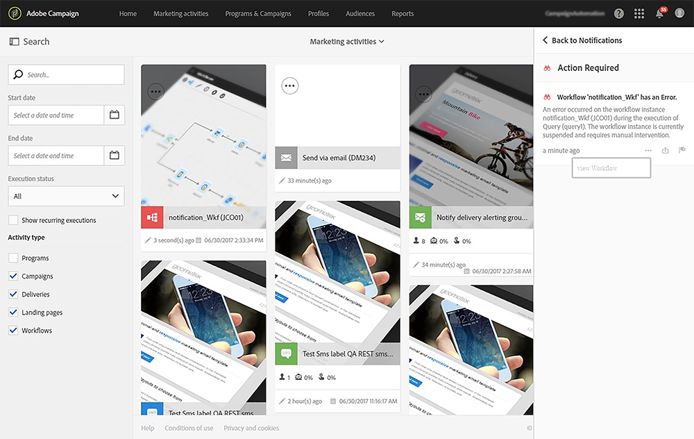

# 内部通知の送信{#sending-internal-notifications}

Adobe Campaignでは、アプリケーション内で重要なシステムアクティビティに関する通知を直接受け取ることができます。 リアルタイムの通知により、関係者に必要な情報を継続的に提供できます。また、アプリケーション内から送信されたアクティビティ通知にもとづいて、顧客が即座に対応できるようになります。 チームにとっての結果は、高度な俊敏性、効率性、キャンペーンのよりスムーズな実行です。

次のオブジェクトの通知を設定できます。

* **[!UICONTROL A/B Test emails]**: バリエーションが選択されたこと（自動モード）またはバリエーションを選択する必要があること（手動モード）が、メール作成者および修飾子に通知されます。 通知をクリックすると、対応する電子メールが表示されます。 通知は、デフォルトで標準のA/B テストテンプレートでアクティブ化されます。 無効にする場合は、電子メールまたは電子メールテンプレートのプロパティを編集し、**一般/通知**&#x200B;の下にあるボックスのチェックを外します。 A/B テスト電子メールについて詳しくは、[AB テストの作成](../../channels/using/designing-an-a-b-test-email.md)を参照してください。 電子メールのプロパティについて詳しくは、[電子メールのプロパティのリスト ](../../administration/using/configuring-email-channel.md#list-of-email-properties)を参照してください。

  

* **[!UICONTROL Workflows]**：選択したセキュリティ グループの各メンバーには、ワークフローでエラーが発生するたびに通知（メールおよびアプリ内通知）が送信されます。 通知または電子メールリンクをクリックすると、対応するワークフローが表示されます。 通知は、デフォルトでは、すぐに使えるワークフローテンプレートでディアクティベートされます。 アクティブ化する場合は、ワークフローまたはワークフローテンプレートのプロパティを編集し、**一般/実行/エラー管理/スーパーバイザー**&#x200B;の下にセキュリティグループを追加します。 セキュリティグループについて詳しくは、[ グループとユーザーの管理](../../administration/using/managing-groups-and-users.md)を参照してください。 ワークフローのプロパティについて詳しくは、[ ワークフローのプロパティ ](../../automating/using/managing-execution-options.md)を参照してください。

  
