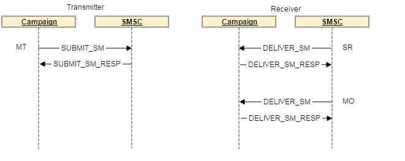

# SMSコネクタのプロトコルと設定{#sms-connector-protocol}

>[!NOTE]
>
>このドキュメントを通じて、プロトコル、フィールド名、値の詳細への参照はすべて[SMPP 3.4仕様](https://smpp.org/SMPP_v3_4_Issue1_2.pdf)を参照します。

## 概要 {#overview}

SMSは、書式を設定せずに短いテキストメッセージを送信するだけで済む場合がありますが、簡単に送信できるので、貴重なコミュニケーションチャネルとなります。

SMSを送信する主な方法は2つあります。

* 通常は人と人との間で直接通信する方法で、電話から手で送ります。

* Adobe Campaignがメッセージを送信する方法で、インターネットから送信します。 そのためには、インターネットをモバイルネットワークに接続するSMSサービスプロバイダーが必要です。
Adobe Campaignは、SMPPプロトコルを使用してSMSをサービスプロバイダーに送信します。

このドキュメントでは、Adobe CampaignとSMPPプロバイダの間の接続設定を順を追って説明します。

SMPPプロバイダは公式仕様から外れる場合がありますが、Adobe CampaignのSMSコネクタは、ほとんどのプロバイダと互換性を持つように動作を適応させるための多くのオプションを提供します。

>[!IMPORTANT]
>
>新しいプロバイダーへの接続の設定には、技術的なスキル、TCPに関する知識、バイナリ、16進表現、およびテキストエンコーディングが必要になる場合があります。 プロバイダーとの積極的な協力も必要となる。

### SMSの種類{#sms-types}

SMSプロバイダ経由で大量のSMSを送信する場合、次の3種類のSMSが発生します。

* **SMS MT （モバイル終了）**:adobe campaignがSMPPプロバイダを通じて携帯電話に向けて発信するSMS。

* **SMS MO （モバイル発信）**:モバイルからSMPPプロバイダ経由でAdobe Campaignに送信されるSMS。

* **SMS SR （ステータスレポート）、DRまたはDLR (配信受信)**:SMSが正常に受信されたことを示す、SMPPプロバイダを通じてAdobe Campaignにモバイルから送信される返信確認メッセージ。Adobe Campaignは、メッセージが配信できなかったことを示すSRを受け取る場合もあります。多くの場合、エラーの説明が記載されています。

謝辞（RESP PDU、SMPPプロトコルの一部）とSRを区別する必要があります。SRは、ネットワークのエンド・ツー・エンドを通じて送信されるSMSの一種です。SRは、1回の転送が成功したことを確認するだけのものです。

2つの謝辞とSRの両方がエラーをトリガーし、2つを区別するとトラブルシューティングに役立ちます。

### SMS {#information-sms}によって送信される情報

SMSは、テキストよりも多くの情報を持っています。 SMSで見つけられる情報のリストを以下に示します。

* テキスト。140バイトに制限されます。つまり、エンコーディングに応じて70 ～ 160文字の範囲です。 詳細と制限については、[SMS text encoding](../../administration/using/sms-protocol.md#sms-text-encoding)を参照してください。

* 受信者アドレス（`ADC`または`MSISDN`とも呼ばれます）。 SMSを受信するモバイルの番号です。

* 送信者のアドレス。`oADC`または`sender id`と呼ばれる場合もあります。 日々の使用で使用される電話番号、プロバイダーや名前を通じて送信される短いコードを指定できます。 Nameはオプションの機能です。この場合、SMSに返信できません。

* メッセージがFlashメッセージであるかどうかを示すフラグ。 フラッシュメッセージは、メモリに保存されていないポップアップです。

* SRが予想されるかどうかを示すフラグ。

* 有効日。この日を過ぎると、ネットワーク機器は再試行できません。

* `data_coding`フィールド。テキストのエンコーディングを示します。

## SMPPプロトコル{#smpp-protocol}

Adobe Campaign Standardは、SMPPプロトコルバージョン3.4をサポートしています。これは、SMSをプロバイダ(SMSC)に送信し、SMSを受信し、領収書も受信できる広範なプロトコルです。 詳しくは、[SMPPドキュメント](https://smpp.org/SMPP_v3_4_Issue1_2.pdf)を参照してください。

SMSサービスプロバイダー側のネットワーク機器は、SMSCと呼ばれることがよくあります。

### SMPP接続{#smpp-connections}

Adobe Campaignは、TCPを介してSMSサービスプロバイダーのネットワーク機器に接続します。 SMPPプロトコルは、Adobe Campaignからプロバイダーへの永続的なTCP接続を設定します。 TCP接続は、Adobe Campaignが常に開始し、メッセージを受信する場合も含めます。
SMPPは、モードに応じて1または2つのTCP接続を開きます。 すべての接続は、常にAdobe Campaignによって開始されます。

SMPPプロトコルは次の2つのモードで動作します。

* **Transmitter+Receiver（またはTX+RX）**:メッセージの送受信には、2つの異なるTCP接続が使用されます。
* **トランシーバ(TRX)**:メッセージの送受信には、単一のTCP接続が使用されます。

>[!NOTE]
>
>TRXは、接続数を削減し、障害が発生した場合の接続回復を簡素化するため、Adobe Campaign Standardにとって推奨されます。

### SMPP PDU {#smpp-pdu}

SMPP伝送ユニット（「パケット」）はPDUと呼ばれます。 **PDU**&#x200B;には、コマンド、ステータス、シーケンス番号、データが含まれます。

各PDUは、`SMPP RESP PDU`（同期応答）によって確認される必要があります。 リクエストはパイプラインで記述できます。送信者は、`RESP`を待たずに多数のコマンドを送信できます。いつでもパイプライン化できる要求の数はウィンドウと呼ばれます。 `RESP PDU` は、対応するイニシエータPDUの順序とは関係なく、どの順序でも到着する可能性があります。

分離された&#x200B;**Transmitter+receiver**&#x200B;モードでは、使用する接続は、送信されるメッセージの種類に応じて異なります。 送信器接続はMTに、受信器接続はMOとSRに使用される。 各種のメッセージに対する要求と応答は、同じTCP接続を介して送信されます。

例えば、MTを送信する際には、送信側の接続が使用され、MTを確認する`RESP`も送信側のチャネルを介して送信されます。 MO（またはSR）を受け取ると、受信側の接続はMOを受け取り、MOを確認する`RESP`を送信するために使用されます。



Adobe Campaign Standardでは、MTとSRの調整はMTAにネイティブなので、専用のSMSプロセスはありません。

成功`SUBMIT_SM_RESP PDU`は送信ログで「送信済み」メッセージのステータスをトリガーし、成功`DELIVER_SM (SR) PDU`は「受信済み」メッセージのステータスをトリガーします。

### セキュリティ面{#security-aspects}

プロトコル自体は暗号化されません。 ほとんどのプロバイダは、許可リスト上にIPのバリアントを実装しているので、Adobe CampaignサーバのIPアドレスをプロバイダに宣言する必要があります。

Adobe Campaignは、バインド段階でのログインとパスワードの受け渡しをサポートしています。 また、SMPP over TLSもサポートします。 適切なセキュリティを確保するためには、証明書が必要であることに注意してください。 SMPPコネクタは証明書チェックのバイパスを許可しますが、証明書を持たないTLSはセキュリティのレベルを大幅に低くするので、テストにのみ使用する必要があります。

コネクタは、システム`openssl`ライブラリが提供するデフォルトの証明書を使用します。 通常はDebianの`/etc/ssl/certs`ディレクトリで提供されます。 このディレクトリは、デフォルトで「ca-certificates」パッケージによって提供されていますが、カスタマイズ可能です。

### 各種PDUの情報{#information-pdu}

各種のPDUには、異なる情報を伝達する異なるフィールドがあります。 これらのPDUの詳細は[SMPP 3.4仕様](https://smpp.org/SMPP_v3_4_Issue1_2.pdf)に記載されています。

以下の各セクションでは、PDUと同期応答(`*_RESP PDU`)の両方について説明します。 すべてのPDUは対応する`RESP`によって認識される必要があります。これは仕様の必須部分です。

PDUにはオプションのフィールドを指定できます。 ここでは、最も一般的なフィールドについて説明します。 詳細は、[SMPP 3.4仕様](https://smpp.org/SMPP_v3_4_Issue1_2.pdf)を参照してください。

#### BIND_TRANSMITTER / BIND_RECEIVER / BIND_TRANSCEIVER {#bind-transmitter}

このPDUは、SMSCへの接続を開始するために使用されます。 **Transmitter**、 **** Receiver、および **** Transcermodesは、この接続を介して転送できるSMSの種類のみを変更します。具体的には、次のようになります。

| モード | 許可されているSMSの種類 |
|:-:|:-:|
| 送信機 | MT |
| 受信者 | MO + SR |
| 送受信機 | MT + MO + SR |

`BIND_* PDU`の主なフィールド：

* **system_id**:認証に使用するログイン。外部アカウントに設定されます。

* **password**:認証に使用するパスワード。外部アカウントに設定されます。

* **system_type**:一部のプロバイダーでは、特定の値に設定する必要があります。外部アカウントで設定され、すべてのバージョンで利用可能。 多くの場合、様々な種類の契約、チャネル、国などを区別します。

* **addr_** tonand  **addr_npi**:一部のプロバイダーで必須です。外部アカウントの`Bind TON`設定と`Bind NPI`設定で設定します。

* **address_range**:一部のプロバイダーで必須です。ほとんどの場合、これはこの接続で使用できるショートコードのリストです。 外部アカウントに設定されます。

`BIND_*_RESP` に特定のフィールドがない場合は、接続が成功したかどうかを確認します。

#### UNBIND {#unbind}

このPDUは、切断前にシステムから送信する必要があります。 一致する`UNBIND_RESP PDU`を待ってから接続を閉じる必要があります。

適合SMSCは接続を閉じてはいけません。TCP接続はAdobe Campaignコネクタによって制御されます。

#### SUBMIT_SM {#submit-sm}

このPDUはMTをSMSCに送信します。 応答PDUはMTのIDを提供します。

`SUBMIT_SM PDU`の主なフィールド：

* **service_type**:一部のプロバイダーで必要。配信のプロパティで設定します。

* **source_addr_** tonand  **source_addr_npi**:送信される送信元アドレスの種類を示します。これらのフィールドの意味は標準化されていますが、一部のプロバイダーでは使い方が異なるので、プロバイダーに正しい値を尋ねる必要があります。 外部アカウントに設定されます。

* **source_addr**:マウントのソースアドレス/oADC携帯電話に表示されます。 外部アカウントと配信で設定すると、配信内の値が外部アカウントの値よりも優先されます。

* **dest_addr_** tonand  **dest_addr_npi**:送信される宛先アドレスの種類（ローカルや国際形式など）を示します。これらのフィールドの意味は標準化されていますが、一部のプロバイダーでは使い方が異なるので、プロバイダーに正しい値を尋ねる必要があります。 外部アカウントに設定されます。

* **destination_addr**:受信者アドレス、電話番号、またはMSISDN。

* **esm_class**:UDHがテキストフィールドで使用されているかどうかを示すために使用します。`message_payload`モードが使用されない場合、分割SMSのコネクタによって自動的に有効になります。

* **priority_flag**:このメッセージの優先度を他のユーザーよりも優先します。これは、配信自体の優先順位に結び付けられます。

* **validity_period**:タイムスタンプ。このタイムスタンプを超えると、再試行は行われません。配信自体に設定されます。

* **registered_配信**:SRが要求されているかどうかを示します。Adobe Campaignは、自動返信を除き、常にこのフラグを設定します。 マルチパートメッセージの場合、フラグは最初のパーツに対してのみ設定されます。 すべてのバージョンで同じ動作が行われます。

* **data_coding**:は、テキストフィールドで使用されるエンコーディングを示します。詳細については、[SMS text encoding](../../administration/using/sms-protocol.md#sms-text-encoding)の節を参照してください。

* **short_message**:メッセージのテキスト。UDHを使用する場合は、UHDヘッダーも含まれます。

Adobe Campaignでは、次のオプションフィールドがサポートされています。

* **dest_addr_subunit**:SMSのターゲットを指定するために使用します。フラッシュ、モバイル、またはSIMカード。配信のプロパティで設定します。

* **message_payload**:外部アカウントで有効にすると、長いメッセージは1つのPDUに送信され、テキストは `short_message` フィールドではなくこのフィールドに送信されます。

#### SUBMIT_SM_RESP {#submit-sm-resp}

このPDUにはMTのIDが含まれます。 これは、着信SRと一致させるのに役立ちます。

>[!IMPORTANT]
>
>多くのプロバイダーは、MT IDを16進数で送信します。 外部アカウントで、**ID形式がMT acknowledgement**&#x200B;設定で正しく設定されていることを確認してください。

一部のプロバイダは、SRを送信した後に`SUBMIT_SM_RESP`を送信します。 この動作を考慮するには、Adobe Campaignは30秒待ってから、不明なIDを持つSRに&#x200B;**無効なメッセージID**&#x200B;を返します。

#### DELIVER_SM {#delivery-sm}

このPDUはSMSCからAdobe Campaignに送信されます。 MOまたはSRが含まれます。

ほとんどのフィールドは、対応する`SUBMIT_SM`と同じ意味を持ちます。 次に、役立つフィールドのリストを示します。

* **source_addr**:MO/SRのソース・アドレス。通常は電話番号です。

* **destination_addr**:MOまたはSRを受け取った短いコード。

* **esm_class**:PDUがMOかSRかを識別するために使用します。

* **short_message**:メッセージのテキスト。SRの場合、SMPPプロトコル仕様の付録Bに記載されているデータが含まれます。 詳しくは、[SRエラー管理](../../administration/using/sms-protocol.md#sr-error-management)を参照してください。

Adobe Campaignは、設定を調整しながら、`receipted_message_id`オプションのフィールドのメッセージIDを読み取ることができます。

#### DELIVER_SM_RESP {#deliver-sm-resp}

このPDUは、SRとMOを確認するためにAdobe Campaignから送信されます。

Adobe Campaign Standardは、すべての処理ステップが成功した場合にのみ`DELIVER_SM_RESP`を送信します。 これにより、処理エラーのリスクがある間は、SRやMOが認識されないことが保証されます。

#### INQUIRE_LINK {#enquire-links}

このPDUは、接続が有効であるかどうかを確認する目的でのみ使用します。 頻度は、プロバイダーのニーズに応じて設定する必要があります。

デフォルトの60秒は、外部アカウントで設定されているほとんどの設定と一致する必要があります。

#### INQUIRE_LINK_RESP {#enquire-links-resp}

このPDUは、接続が有効であることを確認します。

### マルチパートSMS （ロングSMS） {#multipart}

マルチパートSMS（ロングSMS）は、複数のパーツで送信されるSMSです。 モバイルネットワークプロトコルの技術的な制限により、SMSは140バイト以下にする必要があります。そうしないと、分割する必要があります。 SMSに収まる文字数の詳細については、[SMSテキストエンコーディング](../../administration/using/sms-protocol.md#sms-text-encoding)のセクションを参照してください。

長いメッセージの各部分は、個々のSMSです。 これらの部品は、ネットワーク上を単独で移動し、受信側携帯電話によって組み立てられます。 再試行と接続性の問題を処理するために、Adobe Campaignはこれらのパーツを逆順に送信し、メッセージの最初の部分（最後の送信）でのみSRを要求します。 携帯電話は最初の部分を受け取った時にのみメッセージを表示するので、他の部分の再試行は携帯電話で重複を生成しません。

配信ごとのSMSの最大数は、**配信テンプレート**&#x200B;の&#x200B;**メッセージごとのSMSの最大数**&#x200B;設定を使用して、メッセージごとに設定できます。 この制限を超えるメッセージは、SMSの送信中に失敗し、長すぎる失敗の理由が発生します。

長いSMSを送信する方法は2つあります。

* **UDH**:長いメッセージを送信するデフォルトおよび推奨される方法です。このモードでは、コネクタはUDH情報を含む複数の`SUBMIT_SM PDU`にメッセージを分割します。 このプロトコルは、携帯電話が使用するプロトコルです。 つまり、Adobe Campaignはメッセージの生成を最も制御でき、送信された部品の数と分割方法を正確に計算できます。

* **message_payload**:長いメッセージを一つにまとめて送る方法 `SUBMIT_SM PDU`。プロバイダは分割する必要があります。つまり、Adobe Campaignが送信されたパーツの数を正確に把握することは不可能です。 一部のプロバイダはこのモードを必要としますが、UDHをサポートしていない場合にのみ使用することをお勧めします。

プロトコルとフォーマットの詳細については、[SUBMIT_SM PDU](../../administration/using/sms-protocol.md#information-pdu)の`esm_class`、`short_message`、`message_payload`の各フィールドの説明を参照してください。

### スループットの上限とウィンドウ{#throughput-capping}

ほとんどのプロバイダーでは、各SMPP接続にスループットの制限が必要です。 これは、外部アカウント内に多数のSMSを設定することで達成できます。 スループットのスロットリングは接続ごとに発生します。有効なスループットの合計は、接続ごとの制限値に接続の合計数を乗じた値です。 これについては、[同時接続](../../administration/using/sms-protocol.md#connection-settings)の節で詳しく説明します。

最大スループットに達するには、最大送信時間を微調整する必要があります。 送信ウィンドウは、`SUBMIT_SM_RESP`を待たずに送信できる`SUBMIT_SM PDU`の数です。 詳しくは、[ウィンドウ設定](../../administration/using/sms-protocol.md#throughput-timeouts)を送信するのを参照してください。

### SRおよびエラー管理（「付録B」） {#sr-error-management}

SMPPプロトコルは、`RESP PDU`に標準の同期エラーを定義しますが、SRのエラーコードは定義しません。 各プロバイダーは、独自のエラーコードと意味を使用します。

[SMPPプロトコル仕様](https://smpp.org/SMPP_v3_4_Issue1_2.pdf)（167ページ）の付録Bのセクションで推奨が行われますが、実際のエラーコードとその意味はリストされません。

エラー管理に対応するために、Adobe Campaignのブロードログ・メッセージ・システムを活用して、エラーとその重大度（ハード、ソフトなど）を適切にプロビジョニングできます。

上記のように、2種類のエラーがあります。

* メッセージがSMSCに送信された直後に発生する`SUBMIT_SM_RESP`内の同期応答
* 受信メッセージは、モバイルがメッセージを受信したとき、またはメッセージがタイムアウトしたときに、ずっと後に発生する可能性があります。 この場合、SRにエラーが見つかります。

SRを受け取ると、`short_message`フィールドにステータスとエラーが表示されます（付録B準拠の実装例）。 PDUの`short_message`フィールドは、MTにテキストが含まれるので、**テキストフィールド**&#x200B;と呼ばれることがよくあります。 SRの場合は、技術情報に加えて&#x200B;**Text**&#x200B;という名前のサブフィールドが含まれます。 これらの2つのフィールドは異なり、`short_message`には実際に&#x200B;**テキスト**&#x200B;フィールドと他の情報が含まれます。

#### SRテキストフィールドの形式{#sr-text-field-format}

この仕様では、SRテキスト・フィールドに対して次の形式を使用することを推奨します。 これはサブフィールドのリストで、フィールド名と値を区切るコロンで区切られます。 フィールド名では大文字と小文字が区別されません。

付録Bの推奨と一致するSRテキストフィールドの例：

```
id:1234567890 sub:001 dlvrd:001 submit date:1608011415 done date:1608011417 stat:DELIVRD err:000 Text:Hello Adobe world
```

idフィールドは、`SUBMIT_SM_RESP PDU`で受け取ったIDで、MTの認識です。

`sub` 配信され `dlvrd` る部分と配信されるメッセージの量を数えると考えられますが、ブロードログシステムはより優れた統合された情報を提供するので、Adobe Campaignはこの値を使用しません。

`submit date` および `done date` フィールドは、MTがいつ送信され、SRがいつモバイルから送信されたかのタイムスタンプを示します。タイムゾーンに関する問題や、日付が正しく設定されていない携帯電話からのタイムスタンプが正しくない場合は、

statフィールドは、メッセージの状態を示すので重要です。 重要なステータスは`DELIVRD`、`UNDELIV`、`REJECTD`のみです。 `DELIVRD`ステータスは成功を示し、残りの2つはエラーを示します。 その他の値も可能ですが、通常は中間通知です（例えば、MTが携帯電話会社に到達したが、携帯電話に到達した場合など）。 これらの中間通知は、Adobe Campaignでは無視されます。

errフィールドには、プロバイダ固有のエラーコードが含まれます。 プロバイダーは、この値を解釈できるように、考えられるエラーコードの表とその意味を提供する必要があります。

最後に、テキストフィールドには通常、MTのテキストの先頭が含まれます。 これはAdobe Campaignでは無視され、一部のプロバイダーはPIIの漏洩やネットワーク帯域幅の消費を防ぐために送信しません。 このフィールドを読むと、テストMTに一致するSRをより簡単に見つけるために、トラブルシューティングの際に使用できます。

### Adobe Campaign Standard拡張汎用SMPP {#sr-processing}でのSR処理の例

次の例では、付録Bのレコメンデーションに続く実装、外部アカウントのデフォルト値、成功したSMS MTを表示します。

```
id:1234567890 sub:001 dlvrd:001 submit date:1608011415 done date:1608011417 stat:DELIVRD err:000 Text:Hello Adobe world
```

まず、`id extraction` regexを適用してIDを抽出し、対応するMTと調整します。

次に、`status extraction` regexと`error code extraction` regexを適用してこれらのフィールドを抽出し、文字列に追加します。

ブロードログメッセージは次の情報を使用して構築され、元の変更されていない文字列が参照用に追加されます。

```
SR ExampleProvider DELIVRD 000|MESSAGE=id:1234567890 sub:001 dlvrd:001 submit date:1608011415 done date:1608011417 stat:DELIVRD err:000 Text:Hello Adobe world
```

次に、メッセージが正規化され、MESSAGE部分が削除され、同じstatおよびerrコードを持つ複数のメッセージを一致させることができます。

```
SR ExampleProvider DELIVRD 000|#MESSAGE#
```

メッセージがブロードログメッセージテーブルにまだプロビジョニングされていない場合は、メッセージ全体を&#x200B;**firstText**&#x200B;とし、正規化されたメッセージを使用して新しいエントリが作成されます。 次に、コネクタは成功と`error` regexを使用して、成功か失敗かを判断します。

* `success` regexと一致する場合は、成功と見なされます。

* `error` regexと一致する場合は、メッセージはエラーとして認定されます。

* この2つのregexに一致するものがない場合、SRは無視されます。 中間の通知で、Adobe Campaignで処理されない可能性があります。

デフォルトでは、すべてのエラーはソフトエラーとしてプロビジョニングされます。 つまり、ハードエラーは手動でプロビジョニングする必要があります。

### SMSテキストエンコード{#sms-text-encoding}

**エンコードの問題が発生した場合は、常に** SMSCプロバイダに連絡する必要があります。 サポートするエンコーディングと、SMSCプロバイダーの技術プラットフォームの制限によって適用される可能性のある特別な規則に関する正確な知識を持つのは、SMSCプロバイダーだけです。

SMSメッセージは、特殊な7ビットエンコーディングを使用します。通常、GSM7エンコーディングと呼ばれます。

SMPPプロトコルでは、トラブルシューティングを容易にするために、GSM7のテキストが1文字あたり8ビットに拡張されます。 SMSCは、モバイルに送信される前に、1文字あたり7ビットにパックします。 つまり、SMSの`short_message`フィールドの長さはSMPPフレームで最大160バイトになりますが、モバイルネットワークで送信される場合は140バイトに制限されます。

エンコードの問題が発生した場合は、次の点を確認してください。

* どの文字がどのエンコーディングに属するかを知っていることを確認します。 GSM7は、読み分け符号（アクセント記号）を完全にはサポートしていません。 特にフランス語ではéとèがGSM7の一部ですが、é、â、ï¿は含まれません。 スペイン語も同じ。

* Cとcedilla (c)はGSM7アルファベットでは大文字のみで表示されますが、一部の電話では小文字または「スマート」の文字で表示されます。 一般的な推奨事項は、完全に回避し、セディーユを削除するか、UCS-2に切り替えることです。

* **SMSCプロバイダから明示的に要求されない限り、SMSでは** ASCIIを使用しないでください。このエンコーディングは、8ビット文字でGSM7よりも有効範囲が少ないため、領域を浪費します。 このエンコーディングは、北米で使用されるCDMAネットワークに必要な場合があります。

* Latin-1は必ずしもサポートされているわけではありません。 Latin-1を使用する前に、SMSCプロバイダーとの互換性を確認してください。

* 各国語シフトテーブルは、Adobe Campaignコネクタではサポートされていません。 代わりに、UCS-2または他の`data_coding`を使用する必要があります。

* UCS-2とUTF-16は、多くの場合、電話で混在します。 これは、UCS-2に存在しない絵文字やその他の文字を使用する場合に問題となります。

* ほとんどの携帯電話には、すべてのUCS-2文字のフォントグリフはありません。 スマートフォンは珍しい文字を簡単に表示できる傾向がありますが、通常、機能付き携帯電話は、買われた国の母語で役立つものに対しては、あまりサポートされていません。 絵文字やアスキーアートを使用したい場合は、送信前に様々な電話でテストしてください。 Adobe Campaignプレビューは、見つからないグリフをシミュレートせず、Webブラウザーで使用できる記号を表示します。

`data_coding`フィールドは、使用されるエンコーディングを示します。 大きな問題は、値0が仕様のデフォルトのSMSCエンコーディングを意味し、通常はGSM7を参照する点です。 エンコーディングが`data_coding` = 0(Adobe Campaignのみがサポート)に関連付けられているSMSCパートナーに問い合わせてください。 他の`data_coding`値は仕様に従う傾向がありますが、確実に行う唯一の方法はSMSCプロバイダーとの確認です。

メッセージの最大サイズは、エンコーディングによって異なります。 次の表に、すべての関連情報をまとめます。

| エンコード | 通常のdata_coding | メッセージサイズ（文字） | マルチパートSMSのパーツサイズ | 使用可能な文字 |
|:-:|:-:|:-:|:-:|:-:|
| GSM 7 | 0 | 160 | 152 | GSM7基本文字セット+拡張文字（拡張文字は2文字） |
| Latin-1 | 3 | 140 | 134 | ISO-8859-1 |
| UCS-2 <br>UTF-16 | 8 | 70 | 67 | Unicode（電話によって異なります） |

## SMPP外部アカウントパラメータ{#SMPP-parameters-external}

SMPPプロトコルの実装は、それぞれ多くのバリエーションを持ちます。 互換性と適応性を向上させるために、SMPPコネクタの動作を変更するための多くの設定を使用できます。 このセクションでは、コネクタに対するすべてのパラメータとその影響について説明します。

### 一般的なパラメーターとルーティング{#general-parameters-routing}

**このアカウントのMTAインスタンスの制限**

SMPPプロバイダーへの接続を許可するMTAインスタンスの数に制限を設定できます。 オンの場合、最大で使用できるMTAの数を指定できます。

このオプションを使用すると、接続数をより細かく制御できます。[同時接続](../../administration/using/sms-protocol.md#connection-settings)を参照してください。

実行中のMTAの数より大きい値を設定すると、すべてのMTAは通常どおりに実行されます。このオプションは制限に過ぎず、追加のMTAを生成できません。

接続数（プロバイダー要件など）を正確に制御する必要がある場合は、現在のデプロイメントで適切な数のMTAが実行されていても、常にこのオプションを設定することをお勧めします。 その後MTAを追加した場合でも、接続制限は考慮されます。

### 接続設定 {#connection-settings}

#### SMPP接続モード{#smpp-connection-mode}

接続を&#x200B;**トランシーバ**&#x200B;モード、または&#x200B;**トランスミッタ+レシーバ**&#x200B;モードに設定します。 別の&#x200B;**トランスミッタ+レシーバ**&#x200B;モードに切り替えると、**SMPP接続モード**&#x200B;セクションの設定が送信側に適用され、**レシーバ接続設定**&#x200B;セクションの設定が受信側の接続に適用されます。****

#### SMSC 実装名 {#smsc-implementation-name}

SMSC実装の名前を設定します。 プロバイダーの名前に設定する必要があります。 このフィールドに追加する内容については、管理者または配信品質チームに問い合わせてください。 このフィールドの役割は、[SRエラー管理](../../administration/using/sms-protocol.md#sr-error-management)の節で説明しています。

#### サーバー {#server}

接続先のサーバーのDNS名またはIPアドレス。

#### ポート {#port}

接続先のTCPポート。

#### アカウント {#account}

接続のログイン。 BIND PDUの`system_id`フィールドに渡されます。

#### パスワード {#password}

SMPP接続のパスワード。 BIND PDUのパスワードフィールドに渡されます。

#### システムタイプ {#system-type}

BIND PDUの`system_id`フィールドに渡された値。 一部のプロバイダーは、ここで特定の値を必要とします。

#### 同時接続{#simultaneous-connections}

Adobe Campaign Standardでは、SMSスレッドおよびMTAプロセスごとの接続数を定義します。
MTAプロセスの数は、デプロイメントによって決まります。通常、2つのMTAと1つのスレッドがあります。 スレッドの数は、config-instance.xmlファイルでsmppConnectorThreads設定を使用して変更できます。 通常、コンテナあたり1つのMTAプロセスと、MTAプロセスあたり1つのスレッドがあります。

Adobe Campaign Standardの総接続数式：

* **合計接続数=同時接続数*スレッド数* MTA数**

同時接続は外部アカウントで設定され、config-instance.xmlファイル(smppConnectorThreads)ではスレッド数が設定され、外部アカウントではMTAの数を制限できます。

**送信機/受信機**&#x200B;モードが分離されている場合、上記の接続数は&#x200B;**送信機/受信機**&#x200B;のペアの数を表し、合計接続数は2倍になります。

#### TLS over SMPP を有効にする {#enable-TLS}

TLSを使用してプロバイダーに接続します。 接続が暗号化されます。 TLS接続はOpenSSLライブラリによって管理され、この接続でOpenSSLに適用できるものは何でも実行されます。

#### ログファイルの詳細 SMPP トレースを有効にする {#enable-verbose-log-file}

この設定は、すべてのSMPPトラフィックをログファイルにダンプします。 初期設定時にパラメータを調整する必要が生じる場合が多くあります。 コネクタのトラブルシューティングを行う場合は、この機能を有効にし、プロバイダが見るトラフィックと比較する必要があります。

### 受信者の接続設定{#receiver-connection}

このセクションは、分離された&#x200B;**トランスミッター+レシーバー**&#x200B;モードでのみ表示されます。

#### 受信者に別のパラメーターを使用 {#receiver-parameters}

チェックボックスがオフの場合は、送信機と受信機に同じ設定が使用されます。

このチェックボックスをオンにすると、**Connection settings**&#x200B;セクションの設定が送信機に適用され、**Receiver connection**&#x200B;設定の設定が受信機に適用されます。

**受信者サーバー，ポート，アカウント，パスワード，システムタイプ**

これらの設定は、**送信機+受信機**&#x200B;モードの場合に受信機に適用されます。 送信部と同様に機能します。詳細は上記を参照してください。

### SMPP チャネル設定 {#smpp-channel-settings}

#### 文字変換を許可{#allow-character-transliteration}

翻訳とは、見つからない文字と同等の文字を探すプロセスです。 例えば、フランス語の「é」（サーカムフレックスアクセント付き）文字はGSMエンコーディングでは見つかりませんが、読みやすさを損なうことなく「e」に置き換えることができます。

このチェックボックスをオフにすると、文字列をそのままエンコードできない場合、テキストエンコードは失敗します。

このチェックボックスをオンにすると、文字列のエンコーディングは、失敗せずに、おおよそのバージョンに変換しようとします。 一部の文字がターゲットエンコーディングで等価でない場合、テキストエンコーディングは失敗します。

エンコーディング処理の一般的な説明については、[エンコーディングの具体的なマッピングの定義設定](../../administration/using/sms-protocol.md#SMSC-specifics)を参照してください。

#### 受信MOをデータベース{#incoming-mo-storing}に格納

有効な場合、着信MOはデータベースのinSMSテーブルに格納されます。 このテーブルは、任意のワークフローのクエリアクティビティを使用して照会できます。

#### SR処理中にKPIのリアルタイム更新を有効にする{#real-time-kpi}

有効にすると、KPIは、エラーSRを受け取ったときに、メイン配信ページでリアルタイムに更新されます。

この欠点は、生成されるデータベースの競合が原因で、パフォーマンスが低くなる場合があります。 無効にすると、統計は&#x200B;**syncfromexec**&#x200B;ワークフローによって更新され、20分ごとに実行されます。

#### ソース番号 {#source-number}

メッセージの既定の送信元アドレスを定義します。 この設定は、ソース番号が配信内で空のままの場合にのみ適用されます。

デフォルトでは、ソース番号フィールドは渡されないので、プロバイダーは短縮コードの代わりにソース番号フィールドを使用します。

これにより、送信者アドレス/oADC上書き機能が有効になります。

#### ショートコード {#short-code}

アカウントのメインの短縮コードを示します。 このアカウントで複数の短縮コードが使用されている場合、または短縮コードが不明な場合は、このフィールドを空欄にしてください。

短いコードを指定すると、次の2つの機能が役に立ちます。

* ソース番号が指定されていない場合、プレビューに短縮コードが表示されます。 携帯電話の本当の動きを反映します。

* 自動応答機能のブロックリスト設定では、特定の短いコードに対してのみ、強制隔離に送信されます。

#### ソースTON/NPI、ターゲットTON/NPI {#ton-npi}

TON（数値のタイプ）とNPI（数値計画インジケータ）は、[SMPP 3.4仕様](https://smpp.org/SMPP_v3_4_Issue1_2.pdf)の5.2.5節（117ページ）で説明されています。 これらの値は、プロバイダーのニーズに合わせて設定する必要があります。

これらは、`SUBMIT_SM PDU`の`source_addr_ton`、`source_addr_npi`、`dest_addr_ton`、`dest_addr_npi`フィールドにそのまま送信されます。

#### サービスタイプ {#service-type}

このフィールドは、`SUBMIT_SM PDU`の`service_type`フィールドにそのまま送信されます。 プロバイダーのニーズに合わせて設定します。

### スループットとタイムアウト{#throughput-timeouts}

これらの設定は、SMPPチャネルのすべてのタイミングを制御します。 一部のプロバイダーでは、メッセージレート、ウィンドウ、再試行タイミングを非常に正確に制御する必要があります。 これらの設定は、プロバイダーの容量と契約で示される条件に一致する値に設定する必要があります。

#### 送信ウィンドウ {#sending-window}

ウィンドウは、`SUBMIT_SM_RESP`との一致を待たずに送信できる`SUBMIT_SM PDU`の数です。

最大窓数が4の送信例：


このウィンドウは、ネットワークリンクの待ち時間が長い場合のスループットを向上させるのに役立ちます。  ウィンドウの値は、少なくともSMS/sの数にリンクの待ち時間を秒数で乗算した値である必要があります。これにより、コネクタは次のメッセージを送信する前に`SUBMIT_SM_RESP`を待つことがなくなります。
ウィンドウが大きすぎる場合は、接続に問題が発生した場合に、より多くの重複メッセージを送信できます。 また、ほとんどのプロバイダーはウィンドウに対して非常に厳しい制限を持っており、この制限を超えるメッセージは拒否します。

最適な送信ウィンドウ式の計算方法：

* `SUBMIT_SM`と`SUBMIT_SM_RESP`の間の最大待ち時間を測定します。

* この値に秒数を掛けて、MTの最大スループットを求めます。 これにより、最適な送信ウィンドウの値が得られます。

例：最大MTスループットに300個のSMS/sが設定されていて、`SUBMIT_SM`と`SUBMIT_SM_RESP`の間の平均待ち時間が100ミリ秒の場合、最適な値は`300×0.1 = 30`となります。

#### MT の最大スループット {#max-mt-throughput}

1秒あたりの最大MT数および1回の接続あたりの最大数 この設定は厳密に適用されるので、MTAはこの制限を超える速さでメッセージをプッシュすることはありません。 この機能は、プロバイダーが精密なスロットリングを必要とする場合に役立ちます。

総スループット制限を知るには、この数値に上の式で説明した接続の総数を掛けます。

0は制限なしを意味し、MTAはできるだけ早くMTを送信します。

最終的なアーキテクチャで適切にベンチマークが付けられ、特に要求されたSMPPプロバイダがない限り、正確なスループットをこの数を超えることは不可能なので、通常、この設定を1000未満に保つことをお勧めします。 接続数を増やして1000 MT/sを超える方が良い場合があります。

#### 再接続までの時間 {#time-reconnection}

TCP接続が失われた場合、コネクタは接続を試行する前にこの秒数を待ちます。

#### MT の有効期間 {#expiration-period}

`SUBMIT_SM`と`SUBMIT_SM_RESP`との間のタイムアウト。 `RESP`を期限通りに受信しない場合、メッセージは失敗と見なされ、MTAのグローバル再試行ポリシーが適用されます。

#### バインドのタイムアウト {#bind-timeout}

TCP接続試行と`BIND_*_RESP`応答の間のタイムアウト。 タイムアウトした場合、接続はAdobe Campaignコネクタによって閉じられ、再接続を再試行する前に[時間]を待ちます。

#### enquire_link 期間 {#enquire-link-period}

`enquire_link` は、接続を有効に保つために送信される特別な種類のPDUです。この期間は秒単位です。 キャンペーンコネクタは、帯域幅を節約するために接続がアイドル状態の場合にのみ`enquire_link`を送信します。 この期間の2回後にRESPを受信しなかった場合、接続が切断されたと見なされ、再接続プロセスがトリガされます。

### SMSC の詳細 {#SMSC-specifics}

これらの設定は、Adobe CampaignコネクタをSMPP実装の特殊性のほとんどに適応させる詳細設定です。

#### エンコーディングの特定のマッピングを定義{#encoding-specific-mapping}

テキストエンコーディングの詳細については、[SMS text encoding](../../administration/using/sms-protocol.md#sms-text-encoding)の節を参照してください。

この設定を使用すると、仕様とは異なるカスタムエンコーディングマッピングを定義できます。 エンコーディングのリストと`data_coding`値を宣言できます。

MTAは、リスト内の最初のエンコードを使用してエンコードを試みます。 失敗した場合は、リスト上で次のエンコーディングを使用しようとします。 メッセージのエンコードにエンコードを使用できない場合は、エラーが発生します。 エンコーディングが見つかると、MTAはエンコードされたテキストと`SUBMIT_SM PDU`フィールドを作成し、テーブルで指定された値を使用して`data_coding`フィールドを設定します。

テーブル内の項目の順序は重要です。エンコーディングは上から下へ試行します。 最も費用のかかるエンコーディングか、最も推奨されるエンコーディングをリストの上部に置き、その後さらに高価なエンコーディングを続ける必要があります。

UCS-2は、Adobe Campaignでサポートされるすべての文字をエンコードでき、UCS-2 SMSの最大長は非常に短いため、UCS-2は失敗しません。70文字のみ。

また、この設定を使用すると、マッピングテーブルで1行だけ宣言することで、特定のエンコーディングを常に使用するように強制できます。

チェックボックスがオフの場合に使用されるデフォルトのマッピングは、次の表と同じです。

| data_coding | エンコード |
|---|---|
| 0 | GSM |
| 9 | UCS-2 |

これは、MTAがGSMでメッセージをエンコードしようとすることを意味します。 成功した場合は、`data_coding`を0に設定して送信します。

メッセージをGSMでエンコードできない場合、UCS-2でエンコードされ、`data_coding`が8に設定されます。

#### message_payload {#enable-message-payload}を有効にします

チェックを外すと、長いSMSはMTAによって分割され、UDHと共に複数の`SUBMIT_SM PDU`に送信されます。 メッセージは、UDHデータに従って携帯電話によって再構成されます。

オンにすると、長いSMSが1つのSUBMIT_SM PDUに送信され、message_payloadオプションフィールドにテキストが入力されます。 詳しくは、[SMPP仕様](../../administration/using/sms-protocol.md#ACS-SMPP-connector)を参照してください。

この機能が有効になっている場合、Adobe CampaignはSMSパーツを個別にカウントできません。すべてのメッセージは、1つの部分で送信済みとしてカウントされます。

#### 電話番号全文を送信{#send-full-phone-number}

このチェックボックスがオフの場合、電話番号の数字のみがプロバイダーに送信されます（`SUBMIT_SM`フィールドの`destination_addr`フィールド）。 これは、国際番号インジケータ（通常は+プレフィックス）がSMPPのTONフィールドとNPIフィールドに置き換えられるので、デフォルトの動作です。

このチェックボックスをオンにすると、電話番号はそのまま送信され、前処理および潜在的なスペースは含まれず、+プレフィックスまたはシャープ/ハッシュ/スター記号も含まれます。

この機能は、自動返信ブロックリスト機能の動作にも影響します。チェックボックスがオフの場合、SMPPプロトコル自体によって電話番号から+プレフィックスが削除されるのを補正するために、強制隔離テーブルに挿入される電話番号に+プレフィックスが追加されます。

#### TLS証明書チェックをスキップ{#skip-tls}

TLSが有効な場合は、すべての証明書の確認をスキップします。

オンにすると、接続はセキュリティで保護されなくなり、実稼働環境では有効になりません。

これは、デバッグやテストの目的に役立ちます。

#### バインドTON/NPI {#bind-ton-npi}

[SMPP 3.4仕様](https://smpp.org/SMPP_v3_4_Issue1_2.pdf)の第5.2.5節（ページ117）で説明されているTON（番号のタイプ）とNPI（採番計画インジケータ）。 これらの値は、プロバイダーが必要とするものに設定する必要があります。

BIND PDUの`addr_ton`フィールドと`addr_npi`フィールドには、そのまま送信されます。

#### アドレス範囲{#address-range}

BIND PDUのaddress_rangeフィールドにそのまま送信されます。 この値は、プロバイダーが必要とするものに設定する必要があります。

#### ID 確認数が無効です {#invalid-id}

1つのSRに対して送信できる&#x200B;**無効な** `DELIVER_SM_RESP`メッセージIDの数を制限します。

**これは、トラブルシューティングの目的で、** ワークアラウンドとして使用し、通常の状態では0に設定する必要があります。

Foxの例、2に設定する場合：

* プロバイダはIDが「1234」のSR(`DELIVER_SM`)を送信します。

* ID &quot;1234&quot;がデータベースに見つかりませんでした。

* コネクタは、そのIDに対して1 **無効なID**&#x200B;エラーをカウントするので、`DELIVER_SM_RESP`に「メッセージIDが無効です」エラーコード（通常の動作）を送信します。

* プロバイダは、IDが「1234」の同じSRを再試行します。

* ID &quot;1234&quot;がデータベースに見つかりませんでした。

* コネクタは、そのIDに対して2 **無効なID**&#x200B;エラーをカウントするので、正しく処理されなかった場合でも`DELIVER_SM_RESP` &quot;OK&quot;を送信します。

* この機能は、無効なSRブロックが正当でない場合に、プロバイダ側のSRバッファをフラッシュするために使用されます。この場合、メッセージを処理できません。

このフィールドを0に設定すると、**Message ID invalid**&#x200B;が常に返されるメカニズムが無効になります。これは通常の動作です。

このフィールドを1に設定すると、IDが無効であってもコネクタは常に「OK」を返します。 トラブルシューティングを行うため、また、プロバイダ側の問題からの回復など、最小限の時間は、監視下で1に設定する必要があります。

#### SR に含まれている ID の抽出用正規表現 {#regex-extraction}

SR形式は、SMPPプロトコル仕様に厳密には適用されません。 これは、仕様書の[付録B](../../administration/using/sms-protocol.md#sr-error-management)（167ページ）で説明されている推奨事項にすぎません。 一部のSMPP実装者は、このフィールドの形式を変更するので、Adobe Campaignは正しいフィールドを抽出する方法が必要です。

デフォルトでは、`id:`の後に最大10文字の英数字を取り込みます。

regexには、括弧内に部分を含むキャプチャグループが1つだけ必要です。 ID部分は括弧で囲む必要があります。 regex形式はPCREです。

この設定を調整する場合は、誤ったトリガーを避けるために、できる限り多くのコンテキストを含めてください。 標準に`id:`のような特定のプリフィックスがある場合は、regexに含めます。 また、単語の途中でテキストが取り込まれないように、できるだけ単語区切り文字(\b)を使用します。

regexに十分なコンテキストを含めないと、小さなセキュリティ上の欠陥が生じる可能性があります。メッセージの実際の内容は、SRに含めることができます。 UUIDなど、コンテキストのない特定のID形式のみが一致する場合、実際のテキストコンテンツ（IDの代わりにテキストフィールドに埋め込まれたUUIDなど）が解析される可能性があります。

#### Regexが適用され、成功/エラーの状態を判断{#regex-applied}

フィールドの組み合わせが不明な状態/エラーのメッセージが見つかると、これらのregexがstatフィールドに適用され、SRが成功したかエラーかが判別されます。 これらのどの範囲とも一致しないstat値を持つSRは無視されます。

デフォルトでは、`DELIV`で始まるstat値(例：[付録B](../../administration/using/sms-protocol.md#sr-error-management)内の`DELIVRD`は、正常に配信されたと見なされ、エラーに一致するすべてのstat値(例：`REJECTED`、`UNDELIV`はエラーと見なされます。

#### MT確認のID形式{#id-format-mt}

これは、`SUBMIT_SM_RESP PDU`の`message_id`フィールドに返されるIDの形式を示します。

* **変更しない**:IDは、ASCIIエンコードされたテキストとして、そのままデータベースに保存されます。前処理やフィルタリングは行われません。

* **10進数**:IDは、ASCII形式の10進数である必要があります。この設定を使用すると、先頭と末尾の空白文字と先頭のゼロが削除されます。

* **16進数**:IDはASCII形式の16進数で、先頭に0 x、末尾にhは付けません。その後、IDを10進数に変換してから、データベースに保存します。

* **16進文字列**:IDは、ASCIIエンコードされたテキストで、16進数でエンコードされたバイト数の文字列である必要があります。例えば、PDUには`0x34 0x31 0x34 0x32 0x34 0x33`があり、これはASCII &quot;414243&quot;に変換されます。 次に、この文字列が16進数のバイト文字列としてデコードされ、「ABC」が返されます。ID「ABC」をデータベースに格納します。

#### SR {#id-format-sr}のID形式

これは、SR内のIDの`Extraction` regexによって取り込まれるIDの形式を示します。 値は同じ意味を持ち、上記のMTの形式と同じ動作をします。

**オプションフィールドの SR ID またはエラーコード**

このオプションを選択すると、上記の正規表現で処理されるテキストにオプションフィールドのコンテンツが追加されます。 テキストは`0xTAG:VALUE`の形式を持ち、`0xTAG`は大文字のタグの4桁の16進値です。`0x002E`。

例えば、`receipted_message_id`フィールドにIDを取り込むとします。 この場合、このチェックボックスを有効にすると、次のテキストがステータスに追加されます。

```
0x001E:05e3299e-8d37-49d0-97c6-8e4fe60c7739
```

この例では、0x001Eがオプションのフィールドのタグで、UUIDがフィールドの値です。

この値を取り込むために、SRフィールドのIDの抽出regexに次のregexを設定できます。

```
\b0x001E:([0-9a-f]{8}-[0-9a-f]{4}-[0-9a-f]{4}-[0-9a-f]{4}-[0-9a-f]{12})\b
```

>[!IMPORTANT]
>
>テキスト(ASCII/UTF-8)値を持つオプションのフィールドのみを取得できます。 特に、現在のregexシステムでは、バイナリフィールドを確実に取り込むことはできません。

**テキストフィールドの SR ID またはエラーコード**

オンの場合、**Text**&#x200B;フィールドは、SRのステータス・テキストの処理中に保持されます。

これは、プロバイダーがIDやステータスなど、重要なデータをこのフィールドに配置する場合に役立ちます。 通常、このフィールドはASCII以外のエンコードのテキストが含まれている場合があり、regexの処理に支障が生じる場合があるので、安全に破棄できます。

SRフィールド内のIDの`Extraction`regexが十分に特殊でない場合、このオプションを有効にすると、非常に小さなセキュリティ上の欠陥が発生する可能性があります。 **Text**&#x200B;フィールドの内容はIDとして解析され、攻撃者が偽造IDの挿入に使用する場合があります。これにより、部分的なサービス拒否状況が発生する可能性があります。

**サービスIDタグ**

カスタムTLVを追加できます。 このフィールドは、タグの部分を設定します。 この値は、配信ーの高度なパラメーターにある&#x200B;**ServiceまたはプログラムID**&#x200B;値の配信ごとにカスタマイズできます。

この設定では、メッセージごとに1つのTLVオプションのみを追加できます。

### MO に送信された自動返信 {#automatic-reply}

この機能を使用すると、MOにすばやくテキストを返信し、短いコードをブロックリストに送信する処理を行うことができます。

**キーワード**&#x200B;列と&#x200B;**短いコード**&#x200B;列は、自動応答をトリガーする条件を定義します。 両方のフィールドが一致する場合、MOが送信され、追加のアクションがトリガされます。 ワイルドカードを指定するには、フィールドを空のままにする必要があります。 キーワードは、MOテキストの最初の英数字の単語に対して一致します。句読点や先頭のスペースは無視します。 つまり、**キーワード**&#x200B;フィールドにスペースを含めることはできません。また、1つの単語である必要があります。

**キーワード**&#x200B;設定はプレフィックスです。 例えば、「AD」を指定した場合、「AD」、「ADAPT」および「ADOBE」と一致します。 共通のプレフィックスを持つ複数のキーワードがある場合は、キーワードは上から下に順に処理されるので、順序に注意する必要があります。

**返信**&#x200B;列は返信するテキストです。 このフィールドでは個人設定を使用できません。 このフィールドを空のままにすると、メッセージは返信されませんが、追加のアクションはトリガーされます。

**追加のアクション**&#x200B;列は、**キーワード**&#x200B;と&#x200B;**短いコード**&#x200B;の両方が一致した場合に、追加のアクションを提供します。空の短いコードはすべての短いコードと一致します。 強制隔離に送信したり、強制隔離から削除したりできます。値なしでテキストに返信する場合は、 「**追加のアクション**」を指定し、「**返信**」フィールドを空のままにした場合、アクションは実行されますが、返信は送信されません。 強制隔離は、指定した短いコードに対してのみ適用されます。フィールドが空の場合は、すべての短いコードが適用されます。

>[!IMPORTANT]
>
>[完全に電話番号を送信]の設定は、自動返信強制隔離メカニズムの動作に影響します。[完全に電話番号を送信]がオフの場合、強制隔離に入力した電話番号には、国際電話番号の形式と互換性を持たせるために、プラス記号(+)が付きます。

テーブル内のすべてのエントリは、1つのルールが一致するまで、指定された順序で処理されます。 複数のルールが1つのMOに一致する場合、最上位のルールのみが適用されます。

## SMS配信テンプレートパラメータ{#sms-delivery-template-parameters}

一部のパラメーターは、配信テンプレートごとに設定できます。

### 開始フィールド{#from-field}

このフィールドはオプションです。送信者アドレス(oADC)を上書きできます。 このフィールドの内容は、`SUBMIT_SM PDU`の`source_addr`フィールドに配置されます。

SMPP仕様では、このフィールドの文字数が21文字に制限されていますが、プロバイダーによっては、これより長い値を使用できる場合があります。 また、長さ、コンテンツ、許容文字など、一部の国では非常に厳密な制限が適用される場合があります。

### 配信パラメーター {#delivery-parameters}

#### メッセージごとのSMSの最大数{#maximum-sms}

この設定は、**Message payload**&#x200B;設定が無効な場合にのみ機能します。 これについて詳しくは、この[ページ](../../administration/using/configuring-sms-channel.md)を参照してください。メッセージにこの値より多くのSMSが必要な場合は、エラーがトリガされます。

SMSプロトコルではSMSが255個に制限されていますが、携帯電話では10個を超える長いメッセージを組み合わせるのに問題が生じる場合があります。この制限は、正確なモデルによって異なります。 1通のメッセージにつき5つ以上の部分を超えないようにお勧めします。

Adobe Campaignでのパーソナライズされたメッセージの動作によって、メッセージのサイズが異なる場合があります。 長いメッセージが大量に存在すると、送信コストが増加する可能性があります。

#### 送信モード {#transmission-mode}

このフィールドは、転送するSMSの種類を示します。通常またはフラッシュメッセージ。モバイルまたはSIMカードに保存。

この設定は、`SUBMIT_SM PDU`の`dest_addr_subunit`オプションフィールドに送信されます。

* **指定され** ていない場合、PDUにオプションのフィールドは送信されません。

* **値を1に** フラッシュセットします。モバイル上でポップアップ表示され、メモリには保存されていないフラッシュメッセージを送信します。

* **** Normalは値を0に設定します。通常のメッセージを送信します。

* **値を2に** 保存します。SMSを内部メモリに保存するよう電話に指示します。

* **「** 用語に保存」は値を3に設定します。SIMカードにSMSを格納するよう電話に指示します。

#### 有効期間 {#validity-period}

有効期間は`SUBMIT_SM PDU`の`validity_period`フィールドに送信されます。 日付は常に絶対UTC時刻形式で設定され、日付フィールドは「00+」で終わります。

## SMPPコネクタ{#ACS-SMPP-connector}


矢印は、データフローを表します。

ここで最も重要な点は、複数のSMPPコネクタスレッドが存在することです。 これらのスレッドはすべて同じで、同じ設定を共有します。 そのため、接続数に常にスレッド数を掛けます。

構成ファイルの変更が必要なため、お客様はスレッド数を変更できません。

### SMPPコネクタ{#behavior-smpp-connector}の動作の説明

#### MT、SR、ブロードログエントリの一致{#matching-mt-sr}

Adobe Campaignでは、メッセージはブロードログエントリです。 Adobe Campaign Standardでは、外部コネクタは作業中のブロードローグテーブルについてのみ知る必要があります。`nmsBroadLogExec`. ブロードローグエントリを特定のターゲティングディメンション(nmsBroadLogXXX)にコピーし直す作業を担当しています。

残念ながら、SMPPは次のメッセージと共にIDを送信することを許可していません。プロバイダは各MTにMT IDを与え、1つ以上のSRに同じIDを与える。

プロバイダーが指定したIDは、`nmsBroadLogExec`テーブルの`sProviderId`列に格納されます。 SRは、MTが正常に送信および確認された後に常に到着しますが、Adobe Campaign上、未処理のSRとして知られている、故障した状態に到達する場合もあります。 処理スレッドは、完全な情報が到達するまで、これらのSRを一時的にRAMに格納します。

MTが認識されると(`SUBMIT_SM_RESP`)、データベース内の`sProviderId`は直ちに更新される。

各SRは、SMPP処理スレッドによって個別に処理される。 このプロセスは擬似同期です。外部からは同期と見なされますが、イベント主導の実装を使用して内部的に実装されます。 SRは、ブロードローグが正常に更新された場合にのみ認識され、エラーが発生した場合にSRが拒否されます。

各SRに適用されるプロセスは次のとおりです。

* SRのIDはregexを用いて抽出する。
* IDは`nmsBroadLogExec:sProviderId`で検索されます。
* ステータス+エラーコードは、SRからレージクスを用いて抽出される。
* ブロードローグメッセージメカニズムは、エラーの資格を特定し、ブロードローグメッセージIDを見つけるために使用されます。
* ブロードローグは、上記のすべての情報で更新されます。
* SRが確認されます。

上記の手順をチェックするには、**詳細SMPPトレースを有効にする**&#x200B;が必要です。これにより、すべての手順が正しく適用されているかどうかを手動で確認する必要があります。 これは、Adobe Campaignが新しいSMPPプロバイダーに接続されるたびに必要です。

## 本番運用開始前{#checklist}

このチェックリストは、公開前に確認する必要がある事項のリストを示しています。 セットアップが不完全な場合、多くの問題が発生する可能性があります。

### 外部アカウントの競合を確認{#external-account-conflict}

古いSMS外部アカウントがないことを確認します。 テストアカウントを無効にしておくと、実稼働システムで再有効化し、競合が発生する可能性があるので、リスクを実行します。

同じプロバイダーに接続する同じAdobe Campaignインスタンスに複数のアカウントがある場合は、プロバイダーに問い合わせて、これらのアカウント間の接続が実際に区別されることを確認してください。 複数のアカウントに同じログインを割り当てる場合は、追加の設定が必要です。

### チェック中に冗長SMPPトレースを有効にする{#enable-verbose}

チェック中は、必ず詳細なSMPPトレースを有効にする必要があります。
ログを自分で確認できない場合でも、サポートが簡単に役立ちます。

### SMS {#test}をテストする

* **SMSにさまざまな**
文字を送信GSM以外の文字やASCII以外の文字でSMSを送信する必要がある場合は、できるだけ多様な文字でメッセージを送信してみてください。カスタム文字マッピングテーブルを設定する場合は、少なくとも1つのSMSを送信し、可能な限り 
`data_coding` の値。

* **SRが正しく**
処理されているか確認SMSが配信ログに受信済みとマークされる。配信ログは正常に作成され、次のようになります。

配信プロバイダー名を変更したことを確認してください。 配信ログに    `SR yourProvider stat=DELIVRD err=000|#MESSAGE`
配信プロバイダー名を変更したことを確認してください。実稼働環境では、配信ログに**SR Generic**&#x200B;を含めないでください。

* **MOが**
処理されているかを確認します。MO（自動応答、MOのデータベースへの格納など）を処理する必要がある場合テストを試してみて。 すべての自動返信キーワードに対してSMSを送信し、返信が十分に速く、数秒以内であるかどうかを確認します。
Adobe Campaignが正常に完了したと返すログをチェックインします 
`DELIVER_SM_RESP` (command_status=0)。

### PDUのチェック{#check-pdus}

メッセージが正常に表示された場合でも、PDUが正しくフォーマットされているかどうかを確認することが重要です。

この手順は、以前Adobe Campaignに接続されていないプロバイダーに接続する場合に必要です。

#### バインド{#bind}

`BIND_* PDUs`が正しく送信されていることを確認します。 最も重要な点は、プロバイダが常に成功した`BIND_*_RESP PDUs`を返すことです(command_status = 0)。

`BIND_* PDU`の数が多すぎないか確認します。存在する数が多すぎる場合は、接続が不安定であることを示している可能性があります。 詳しくは、[不安定な接続の問題](../../administration/using/sms-protocol.md#issues-unstable-connection)の節を参照してください。

#### INQUIRE_LINK {#enquire-link-pdus}

接続がアイドル状態のときに`ENQUIRE_LINK PDU`が定期的に交換されていることを確認します。

#### SUBMIT_SM / DELIVER_SM {#submit-sm-deliver-sm}

メッセージを送信し、ログで対応する`SUBMIT_SM`、`SUBMIT_SM_RESP`、`DELIVER_SM`、`DELIVER_SM_RESP PDU`を探します。

`SUBMIT_SM PDU`:

* `data_coding`が正しいことを確認し、デフォルトでは0になっていることを確認します。
* `short_message`が正しくエンコードされていることを確認します。 複数のエンコーディングをサポートする16進数コンバーターを使用してデコードしてみてください。

`SUBMIT_SM_RESP PDU`:

* 成功したことを確認します。command_status = 0。
* 本文に、適切にフォーマットされたIDの後に「0」バイトが続くことを確認します。

`DELIVER_SM PDU`:

* 16進数`short_message`フィールドをデコードします。
* SR内のIDの`Extraction` regexに定義されたregexが1つの取得グループを返し、メッセージ内のID全体を取り込むことをregexチェックツールで確認します。
* 抽出したIDが`SUBMIT_SM_RESP`のIDと一致することを確認します。
* SR内のステータスの`Extraction` regexに定義されているregexが、statフィールドの内容を返すことを確認します。
* SR内のエラーの`Extraction` regexに定義されているregexがerrフィールドの内容を返すことを確認します。

`DELIVER_SM_RESP PDU`:

* `DELIVER_SM PDU`を受信した後、速く送信されたか、通常は1秒未満であるかを確認します。
* 成功したことを確認します。command_status = 0。

### プロバイダに問い合わせて、問題ないかを確認する{#provider}

SMSが正常に終了した場合でも、プロバイダに問い合わせて、問題が解決したかどうかを確認してください。

### 冗長SMPPトレースを無効にする{#disable-verbose}

すべてのチェックが完了したら、最後に&#x200B;**詳細なSMPPトレース**&#x200B;を無効にして、多くのログを生成しないようにします。 実稼働システムでも、トラブルシューティング用にこれらを再度有効にできます。
