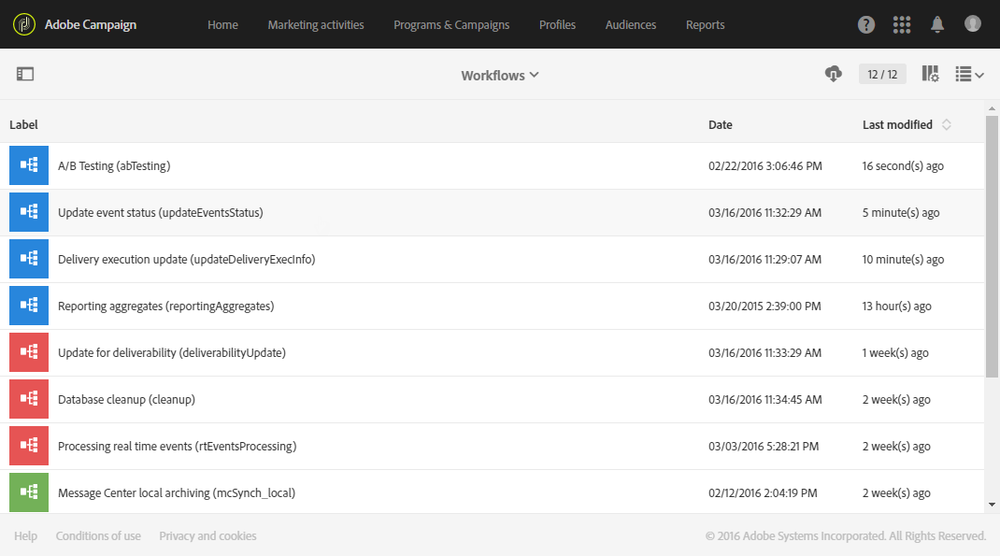

# テクニカルワークフロー{#technical-workflows}

テクニカルワークフローは、Adobe Campaign に標準搭載されています。 テクニカルワークフローは、サーバー上で定期的に実行されるようにスケジュールされた処理またはジョブです。

データベースの保守作業を実行し、配信の追跡情報を利用して、配信上の仮ジョブを更新できます。

機能管理者は、**[!UICONTROL Administration > Application settings > Workflows]** メニューからテクニカルワークフローにアクセスできます。

>[!NOTE]
>
>機能管理者は、テクニカルワークフローを再起動または一時停止したり、プロパティと構造を変更することができます。

## テクニカルワークフローのリスト {#list-of-technical-workflows}

テクニカルワークフローは、Adobe Campaign でセルフトリガーのバックグラウンドプロセスと技術的プロセスの処理に使用されます。

<table> 
 <tbody> 
  <tr> 
   <td> <strong>ラベル</strong>  </td> 
   <td> <strong>ID</strong>  </td> 
   <td> <strong>説明</strong>  </td> 
  </tr> 
  <tr> 
   <td> A/B テスト   </td> 
   <td> abTesting   </td> 
   <td> このワークフローは、各バリアントのトラッキングログを分析します。 A/B テスト期間の終了時に、最も効果が高いバリアントを自動的に計算します。 デフォルトでは、毎日実行されます。  </td> 
  </tr> 
  <tr> 
   <td> 請求   </td> 
   <td> billing   </td> 
   <td> システムアクティビティレポートを「請求」ユーザーにメールで送信します。 デフォルトでは、毎日午前 1 時に自動的に実行されます。  </td> 
  </tr> 
  <tr> 
   <td> 配信テンプレートからヘッダーをコピー   </td> 
   <td> smtpHeaderupdate   </td> 
   <td> このワークフローでは、メール配信テンプレート用に設定されたSMTP ヘッダーを、対応する子テンプレート以外の配信にコピーします。 このワークフローでは、メールマーケティング配信のみがピックアップされます。 SMTP ヘッダーは、トランザクション配信とプルーフ配信にコピーされません。  このワークフローは定期的には実行されません。 ユーザーが使用ごとに開始する必要があります。<!--So it'not really a technical workflow like all workflows on this page, because it's not run automatically - TBC-->   インスタンスに大量の配信がある場合は、<strong> アプリケーション設定</strong>でNmsCleanup_DeliveryPurgeDelay オプションを更新できます。 任意のテンプレートのSMTP ヘッダーを変更した場合は、変更後にワークフローを再度実行して、修正されたヘッダーがテンプレート以外の配信にコピーされるようにします。<a href="data-retention.md#deliveries">詳細情報</a>
     </td> 
  </tr> 
  <tr> 
   <td> データベースのクリーンアップ   </td> 
   <td> cleanup   </td> 
   <td> このワークフローは、データベースのメンテナンスワークフローです。各種の統計とプロセスを実行し、定義された設定に従って、古いデータをデータベースから削除します。 デフォルトでは、毎日午前 4 時に自動的に実行されます。  </td> 
  </tr>
  <tr> 
   <td> 共有オーディエンスのインポート   </td> 
   <td> importSharedAudience：   </td> 
   <td> このワークフローは、Adobe Campaign にインポートされた Adobe Experience Cloud オーディエンスデータを同期します。 デフォルトでは、1 時間ごとに実行されます。  </td> 
  </tr> 
  <tr> 
   <td> 即時レポート共有   </td> 
   <td> reportSendingNow   </td> 
   <td> このワークフローは、レポートの送信がスケジュールされるとすぐに実行されます。 レポートは PDF ファイルに変換され、ターゲットの受信者にメールで送信されます。  </td> 
  </tr> 
  <tr> 
   <td> KPI と Adobe Analytics との紐付け   </td> 
   <td> kpiReconciliation   </td> 
   <td> このワークフローは、レポートサービスから KPI を 1 日 1 回取得し、Adobe Analytics のデータと紐付けます。 必要に応じて差異がプッシュされます。 デフォルトでは、毎週月曜日の午前 4 時にトリガーされます。  </td> 
  </tr> 
  <tr> 
   <td> Message Center のローカルアーカイブ   </td> 
   <td> mcSynch_local   </td> 
   <td> このワークフローは、リアルタイムイベントを履歴テーブルにアーカイブします。 デフォルトでは、1 時間ごとに実行されます。  </td> 
  </tr> 
  <tr> 
   <td> レポート集計   </td> 
   <td> reportingAggregates   </td> 
   <td> レポートで使用される集計を更新します。 デフォルトでは、午前 2 時に自動的に実行されます。  </td> 
  </tr> 
  <tr> 
   <td> KPI を Adobe Analytics と共有   </td> 
   <td> kpiSharing   </td> 
   <td> このワークフローは、KPI データを Adobe Campaign Standard から Adobe Analytics に 15 分ごとにプッシュします。  </td> 
  </tr> 
    </tr> 
   <tr> 
   <td> Launch と同期   </td> 
   <td> SyncWithLaunch   </td> 
   <td> このワークフローは、Adobe Campaign Standardで読み込まれたタグモバイルプロパティを同期します。 これは 15 分ごとに実行されます。  </td> 
  </tr>
  <tr> 
   <td>  トラッキングログの回復   </td> 
   <td> SyncWithLaunch   </td> 
   <td> このワークフローは、Adobe Campaign Standardで読み込まれたタグモバイルプロパティを同期します。 これは 15 分ごとに実行されます。  </td> 
  </tr>
  <tr> 
   <td>  トラッキングログの復元   </td> 
   <td> trackingLogRecovery   </td> 
   <td> このワークフローは、失われたトラッキングログを復元します。 このテクニカルワークフローは、特定のコンテキストで使用され、Adobeの内部使用のみに制限されていることに注意してください。  デフォルトでは、10 分ごとに実行されます。  </td> 
  </tr>
  <tr> 
   <td> 配信実行情報の更新   </td> 
   <td> updateDeliveryExecInfo   </td> 
   <td> このワークフローは、ブロードログとトラッキングログをローカルデータベースにコピーします。 デフォルトでは、10 分ごとに実行されます。  </td> 
  </tr>
  <tr> 
   <td> 配信インジケーターの更新   </td> 
   <td> updateDeliveryIndicators   </td> 
   <td> このワークフローは、配信の KPI（主要業績評価指標）を更新します。 デフォルトでは、1 時間ごとに実行されます。  </td> 
  </tr> 
  <tr> 
   <td> イベントステータスを更新   </td> 
   <td> updateEventsStatus   </td> 
   <td> このワークフローでは、ステータスをイベントに関連付けることができます。 次のイベントステータスを使用できます。  <strong>保留</strong>：イベントはキューに入っています。 メッセージ テンプレートはまだ割り当てられていません。  配信を保留中：イベントはキュー内にあり、メッセージテンプレートが割り当てられ、配信によって処理されています。  <strong>送信済み</strong>：このステータスは、配信ログからコピーされます。 配信が送信されたことを意味します。  <strong>配信によって無視</strong>：このステータスは配信ログからコピーされます。 配信が無視されたことを意味します。  <strong>配信に失敗しました</strong>：このステータスは配信ログからコピーされます。 配信が失敗したことを意味します。   イベントが考慮されていません：イベントをメッセージテンプレートにリンクできませんでした。 イベントの処理はおこなわれません。  </td> 
  </tr> 
  <tr> 
   <td> 配信品質の更新   </td> 
   <td> deliverabilityUpdate   </td> 
   <td> バウンスルールの選定ルールのリスト、ドメインのリスト、プラットフォームの MX のリストを作成できます。 このワークフローは、HTTPS が開かれている場合にのみ機能します。 デフォルトでは、午前 2 時に自動的に実行されます。  </td> 
  </tr> 
 </tbody> 
</table>
