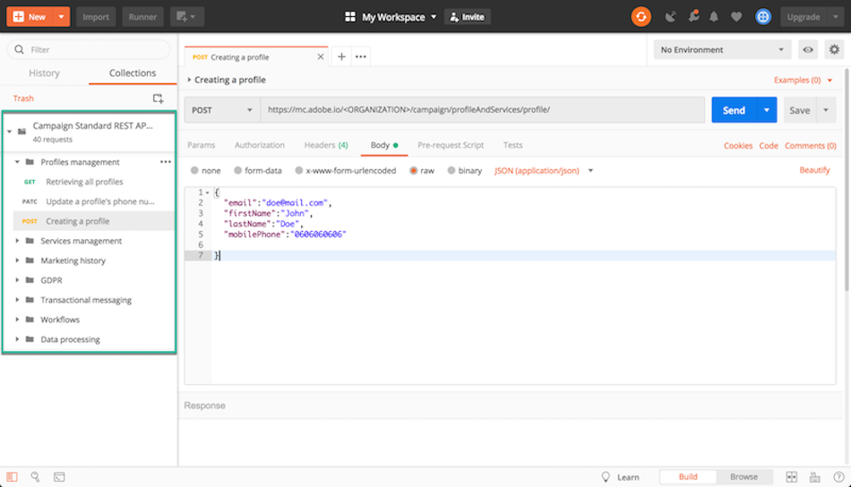

# Campaign Standard API を使用する理由 {#why-using-campaign-standard-apis}

Adobe Campaign Standardは、既存のシステムを Campaign プラットフォームと統合して、リアルタイムで実際の問題を解決できる API を提供します。

サインアップページやオプトアウトページなどの公開 Web サイトは、プロファイル情報を保存するためにバックエンドシステムに接続する必要があります。 Adobe Campaignなどのバックエンドシステムは、プロファイルデータをに取り込み、それに対してカスタム操作を実行する柔軟性と能力を備えています。

次に例を示します。

* 見込み客のオンライン登録。
* 既存の顧客プロファイルとマーケティングコミュニケーションの環境設定の管理。
* イベントベースのトランザクション通信トリガー — 注文の確認、旅程の予約、パスワードのリセットなど。
* 買い物かごが放棄された場合でも、E メール通信。

新規登録ランディングページを使用すると、顧客や見込み客が自分の名前と電子メールアドレスを登録できます。 Campaign Standardは、プロファイル情報と環境設定をキャプチャすると、その人の興味に基づいてパーソナライズされたメッセージを送信できます。

これらは、次の要素を使用して構築されます。

1. Campaign API リスナーを含む登録フォーム。

   

1. チェックボックスに基づいて実行するカスタムアクション。 「E メールスペシャルオファー」を選択したお客様には、通常の登録プロセスとは異なり、ギフトクーポン付きの異なるカスタムメールが送信されます。

   

1. メール内の「詳細を更新」リンクをクリックすると、プロファイルの詳細が変更される場合があります。 これにより、「プロファイルと環境設定の詳細を更新」ページにプロファイルが表示されます。 操作を実行するには、プロファイルの詳細 (Pkey) が Campaign サーバーに渡され、プロファイルが取得されて表示されます。 プロファイルが「更新」ボタンをクリックすると、情報が (「PATCH」コマンドを使用して ) システムに更新されます。

   

Campaign StandardAPI リクエストについて理解するのに役立つリクエストのコレクションを利用できます。 この JSON 形式のコレクションは、一般的な使用例を表す事前に設計された API リクエストを提供します。

次の手順では、コレクションを読み込んで使用し、コレクションデータベース内にプロファイルを作成する手順を順を追って説明します。Campaign Standard

>[!NOTE]
>
>この例ではPostmanを使用しています。 ただし、お気に入りの REST クライアントを自由に使用できます。

1. 「 」をクリックして JSON コレクションをダウンロードします [ここ](https://helpx.adobe.com/content/dam/help/en/campaign/kb/working-with-acs-api/_jcr_content/main-pars/download_section/download-1/KB_postman_collection.json.zip).

1. Postmanを開き、 **ファイル** / **インポート** メニュー。

1. ダウンロードしたファイルをウィンドウにドラッグ&amp;ドロップします。 事前に設計された API リクエストが表示され、使用可能な状態になります。

   

1. を選択します。 **プロファイルの作成** リクエストを実行してから、POSTリクエストと **ヘッダー** 」タブに独自の情報 (&lt;organization>, &lt;api_key>, &lt;access_token>) をクリックします。 詳しくは、[この節](../../api/using/setting-up-api-access.md)を参照してください。

   

1. 次の項目に入力： **本文** タブを開き、新しいプロファイルに追加する情報を入力し、 **送信** ボタンをクリックしてリクエストを実行します。

   

1. オブジェクトが作成されると、そのオブジェクトにプライマリキー (PKey) が関連付けられます。 リクエストの応答や他の属性に表示されます。

   

1. Campaign Standardインスタンスを開き、ペイロードのすべての情報を使用して、プロファイルが作成されたことを確認します。

   
