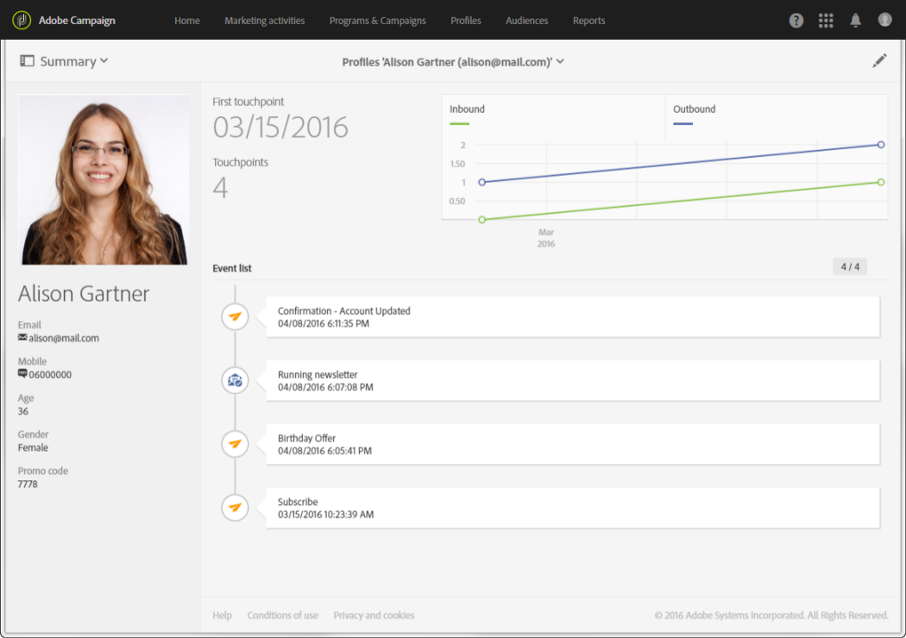

# プロファイルについて{#about-profiles}

Adobe Campaignでは、作成、読み込み、ターゲティング、アクショントラッキング、更新など、ライフサイクル全体を通じて連絡先を管理できます。連絡先は、姓、名、住所、サブスクリプション、配信など、連絡先にリンクされた情報を含むプロファイルとしてデータベースに保存されます。

>[!NOTE]
>
>プロファイルは、Adobe Campaign Standard の API を使用しても利用できます。 詳しくは、[該当するドキュメント](../../api/using/retrieving-profiles.md)を参照してください。

キャンペーンを作成する際に、単純な条件または詳細な条件に従ってプロファイルを選択することで、配信のターゲットを定義できます。 専門的に言えば、プロファイルとは、行動のターゲティング、選定、トラッキングに必要なあらゆる情報を含んだ、データベース内のエントリのことです。

例えば、クライアント、見込み客、ニュースレターの購読者、受信者、ユーザー、その他組織応じた単位などがプロファイルになります。 各種のプロファイルを定義するには、[ターゲティングディメンション](../../automating/using/query.md#targeting-dimensions-and-resources)を使用します。
