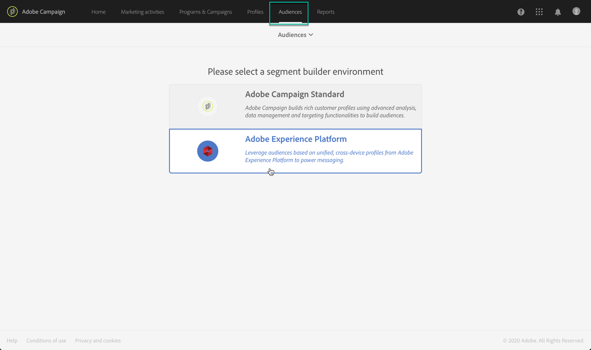
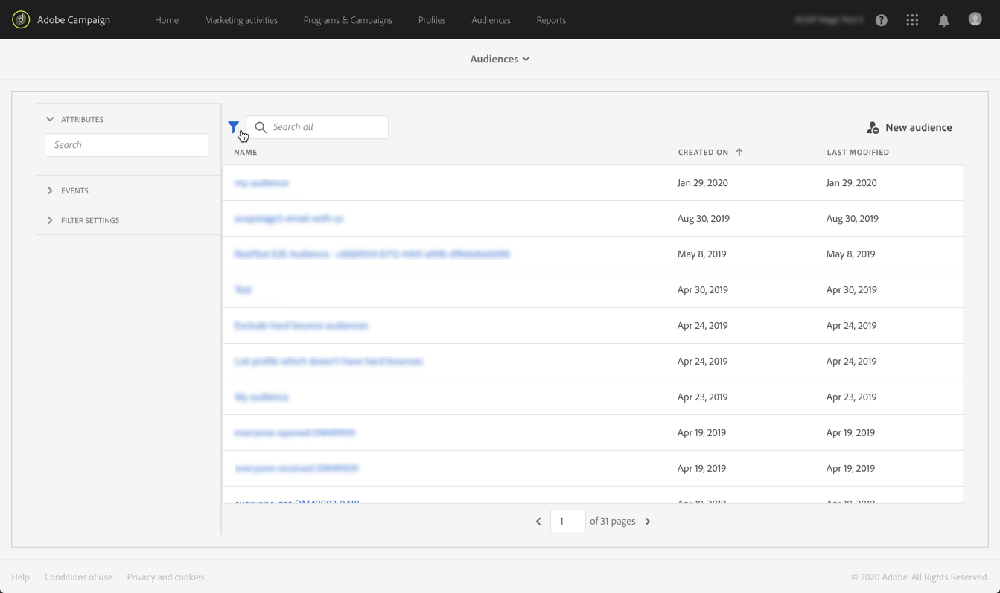

# Adobe Experience Platformオーディエンスの管理 {#about-audiences}

>[!IMPORTANT]
>
>Audience Destinations Serviceは現在ベータ版で、予告なく頻繁に更新される場合があります。 これらの機能にアクセスするには、Azureでホストする必要があります（現在、北米向けベータ版のみ）。 ご希望の場合は、アドビカスタマーケアにお問い合わせください。

## Adobe Experience Platformオーディエンスへのアクセス

Adobe Experience Platformのセグメントビルダーにアクセスするには、Campaign Standardのホームページ（またはヘッダーのリンク）のカ **[!UICONTROL Audiences]**ードに移動し、環境を選択し**[!UICONTROL Audiences]****[!UICONTROL Adobe Experience Platform]**ます。

最初に、Adobe Experience Platformのセグメントリストページが表示されます。このページで、既存のAdobe Experience Platformセグメントにアクセスして、さらに編集できます。

目的のAdobe Experience Platformセグメントを見つけるのに役立つ検索バーとフィルターが用意されています。

## Adobe Experience Platformオーディエンスの作成

Campaign StandardでAdobe Experience Platformオーディエンスを直接作成するには、次の手順に従います。

1. Adobe Experience Platformのセグメントリストページで、右隅にあ **[!UICONTROL New audience]**るボタンをクリックします。

   

1. これで、統合セグメントビルダーがワークスペースに表示されます。 これにより、最終的にオーディエンスの作成に使用されるAdobe Experience Platformのデータを使用してセグメントを作成できます。

1. 右側のパネルでセグメントに名前を付け、説明を入力します（オプション）。

   

1. セグメントを正しく作成するには、このセグメントのマーケティング **目的に一致する** 、マージポリシーを選択する必要があります。

   設定ウィンドウで、「プラットフォームのデフォルトの結合ポリシー」が選択されます。 結合ポリシーの詳細については、『セグメントビルダーユーザーガイド』の専用 [の節を参照してください](https://www.adobe.io/apis/experienceplatform/home/profile-identity-segmentation/profile-identity-segmentation-services.html#!api-specification/markdown/narrative/technical_overview/segmentation/segment-builder-guide.md)。

   

1. オーディエンスで取得するプロファイルを識別するルールを定義します。

   これを行うには、左側のパネルから目的の属性やイベントをワークスペースにドラッグし、対応するルールを定義し、ボタンをクリックしてセグメントを保存します(「Unified Segment Builderの使用 **[!UICONTROL Create segment]**」を参照)。

   

これでオーディエンスをアクティブ化する準備が整い、キャンペーンのターゲットとして使用できます(「Adobe Experience Platformオーディエ [ンスのターゲット設定](../../automating/using/aep-targeting-audiences.md)」を参照)。

## オーディエンスの編集

オーディエンスを編集するには、オーディエンスを開き、必要に応じて統合セグメントビルダーインターフェイス内でル [ールを変更します(「統合セグメントビルダーの使用](../../audiences/using/aep-using-segment-builder.md)」を参照)。

変更が完了したら、ボタンをクリックしてオ **[!UICONTROL Save segment]**ーディエンスを更新します。

