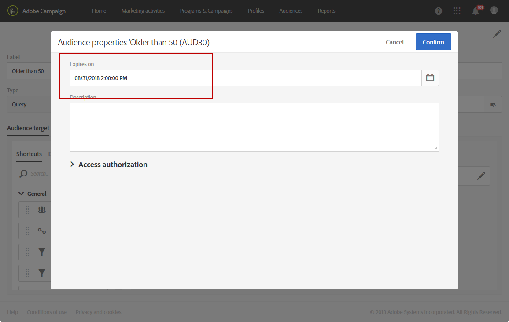

# オーディエンスの作成{#creating-audiences}

## クエリオーディエンスの作成 {#creating-query-audiences}

ここでは、 **クエリ** オーディエンスを作成する方法について説明します。 ファイルの読み込みまたは [ワークフローでのターゲット設定からオーディエンスを作成することもできます](../../automating/using/get-started-workflows.md)。

オーディエンスリストからオーディエンスを作成するには、Adobe Campaignプロファイルでクエリを実行するか、Adobe Experience Cloudオーディエンスを読み込みます。

1. タブまたはカードからオーディエンスリストに移動 **[!UICONTROL Audiences]** します。

   

1. 新しいオーディエンス **[!UICONTROL Create]** を作成する画面にアクセスする場合に選択します。

   

1. オーディエンスに名前を付けます。 オーディエンスラベルは、オーディエンスのリストとクエリツールのパレットで使用されます。
1. 次の **[!UICONTROL Query]** オーディエンスタイプを選択します。 クエリが定義するオーディエンスは、それ以降の使用のたびに再計算されます。

   

1. 次に、顧客のフィルタ **[!UICONTROL Targeting dimension]** ーに使用するデータを選択します。 各オーディエンスは単一のターゲティングディメンションで構成されます。 例えば、プロファイル、テストプロファイル、サブスクライバの両方で構成されるオーディエンスを作成することはできません。 For more on targeting dimensions, refer to [this page](../../automating/using/query.md#targeting-dimensions-and-resources).
1. オーディエンス母集団を定義するクエリを作成します。 クエリの [編集の節を参照](../../automating/using/editing-queries.md)。
1. オーディエンスを保存するには、 **[!UICONTROL Create]** ボタンをクリックします。

>[!NOTE]
>
>このオーディエンスに説明を追加し、 **[!UICONTROL Edit properties]** アイコンを使用してアクセス承認を定義できます。

## リストオーディエンスの作成 {#creating-list-audiences}

ここでは、ワークフロー内でターゲット化した後に **リスト** オーディエンスを作成する方法について説明します。 ファイルを [ワークフローに読み込むか](../../automating/using/get-started-workflows.md) 、メニューのクエリを使用して、オーディエンスを作成することもで **[!UICONTROL Audiences]** きます。

**リスト** オーディエンスを作成する手順は次のとおりです。

1. 「 **マーケティングアクティビティ** 」タブで、「 **作成** 」をクリックし、「 **ワークフロー**」を選択します。

   

1. ドラッグ&amp;ドロップして、 **既知のディメンションを持つ訪問者を選択できるターゲットアクティビティを設定します** 。 使用可能なアクティビティのリストとその設定について詳しくは、「ター [ゲットアクティビティ](../../automating/using/about-targeting-activities.md) 」の節を参照してください。

   アクティビティを使用する前に、 **[!UICONTROL Query]** アクティビティを使用するか、 **[!UICONTROL Load file]** アクティビティを使用してデータをインポートしてから、インポートするデータのディメンションを **[!UICONTROL Reconciliation]** で識別できます。 ここでは、スポーツニュースレターを購読した受信者を **[!UICONTROL Query]** アクティビティでターゲットします。

   

1. ターゲット設定が終わったら、ワークフローに **[!UICONTROL Save audience]** アクティビティをドラッグ&amp;ドロップします。 例えば、新しいデータを使用してオーディエンスを作成し **[!UICONTROL Create or update an audience]**、その後自動的に更新することができます。 この場合、ワークフローの先頭に **[!UICONTROL Scheduler]** アクティビティを追加します。

   このアクティビティの設定について詳しくは、「オーディエンスを [保存](../../automating/using/save-audience.md) 」を参照してください。

   

1. ワークフローを保存して開始します。

   は既知のディメンションを持つターゲット設定の後に配置され **[!UICONTROL Save audience]** るので、このアクティビティを介して作成されるオーディエンスは **リスト** オーディエンスです。

   保存されたオーディエンスのコンテンツは、オーディエンスの詳細表示で利用でき、オーディエンスのリストを介してアクセスできます。 この表示で使用できる列は、ワークフローの保存アクティビティの受信トランジションの列に対応します。 次に例を示します。 読み込んだファイルの列、クエリから追加された追加データ。

   

## ファイルオーディエンスの作成 {#creating-file-audiences}

この節では、ファイルをワークフローにインポートして **File** オーディエンスを作成する方法について詳しく説明します。 ワークフロー内のターゲットアクティビティからオーディエンスを作成することも [できますが](../../automating/using/get-started-workflows.md) 、クエリを使用してワークフローを作成することもでき **[!UICONTROL Audiences]** ます。

To create a **File** audience, the steps are as follows:

1. 「 **マーケティングアクティビティ** 」タブで、「 **作成** 」をクリックし、「 **ワークフロー**」を選択します。
1. ワークフローの実行時に、 **[!UICONTROL Load file]** 不明なディメンションを持つ母集団をインポートできるように、ドラッグ&amp;ドロップして **** アクティビティを設定します。 このアクティビティの設定について詳しくは、「 [ファイルの読み込み](../../automating/using/load-file.md) 」の節を参照してください。

   

1. **[!UICONTROL Save audience]** アクティビティの後に **[!UICONTROL Load file]** アクティビティをドラッグ&amp;ドロップします。 このアクティビティの設定について詳しくは、「オーディエンスを [保存](../../automating/using/save-audience.md) 」を参照してください。
1. ワークフローを保存して開始します。

   

   が読み込みの後に配置され **[!UICONTROL Save audience]** るので、データディメンションは不明で、このアクティビティを介して作成されるオーディエンスは **ファイル** オーディエンスです。

   保存されたオーディエンスのコンテンツは、オーディエンスの詳細表示で利用でき、オーディエンスのリストを介してアクセスできます。 この表示で使用できる列は、ワークフローの保存アクティビティの受信トランジションの列に対応します。 次に例を示します。 読み込んだファイルの列、クエリから追加された追加データ。

   

## Experience Cloudオーディエンスの作成 {#creating-experience-cloud-audiences}

Adobe Campaignを使用すると、Adobe Experience Cloudとオーディエンスを共有し、交換できます。 Experience Cloud **Typeオーディエンスは、Peopleコアサービスから****[!UICONTROL Import shared audience]** 技術ワークフローのあるAdobe Campaignに直接読み込まれます。

Adobe Campaignからのクエリ **プロファイルを行う** クエリタイプオーディエンスとは異なり、 **Experience Cloud** オーディエンスは、訪問者IDのリストで構成されます。

この統合を機能させるには、まず統合を設定する必要があります。 設定の詳細およびPeopleコアサービスを使用したオーディエンスの読み込みまたは書き出し方法については、次の [節を参照してください](../../integrating/using/sharing-audiences-with-audience-manager-or-people-core-service.md)。

## オーディエンスの編集 {#editing-audiences}

オーディエンスのタイプに応じて、オーディエンスを編集する方法は異なります。

* クエリ **オーディエンスを編集するには、メニューからオーディエンスのリストに移動するか、** Adobe Campaignホームページから **[!UICONTROL Audiences]****[!UICONTROL Audiences]** カードに移動します。

   関連オーディエンスを開きます。 以前に作成したオーディエンスのすべての要素を編集できます。

   >[!CAUTION]
   >
   >クエリ **[!UICONTROL Filtering dimension]** 内のを変更すると、以前に定義されたルールは失われます。

* **リスト** または **ファイル****[!UICONTROL Save audience]** オーディエンスを編集するには、作成元のワークフローを編集し、アクティビティを変更します。 オーディエンスが変更されるように開始します。
* Experience Cloud **オーディエンスを編集するには、「Peopleコアサービスを使用したオーディエンスの** 読み込み/書き出し  」の節を参照してください。

## オーディエンスの削除 {#deleting-audiences}

1つまたは複数のオーディエンスを削除する方法は2つあります。 まず、オーディエンスに有効期限を追加します

これをおこなうには：

1. オーディエンスの1つにアクセスします。
1. オーディエンスの設定にアクセスするには、  ボタンをクリックします。

   

1. この **[!UICONTROL Expires on]** フィールドで、オーディエンスに有効期限を追加します。

   

1. 「 **[!UICONTROL Confirm]** >」をクリックし **[!UICONTROL Save]**&#x200B;ます。

有効期限が設定されました。 この日付に達すると、オーディエンスは自動的に削除されます。

または、オーディエンスを削除する必要がある場合は、1つまたは複数のオーディエンスを選択して **[!UICONTROL Delete element]** ボタンをクリックします。

