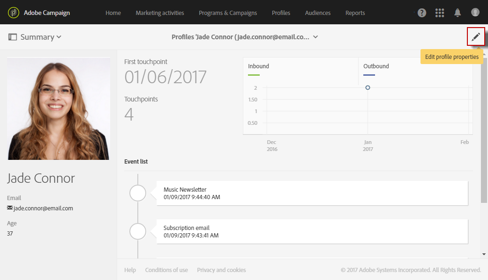

# プロファイルの編集{#editing-profiles}

## プロファイルプロパティへのアクセス {#accessing-profile-properties}

既存のプロファイルを編集し、そのプロファイルに関連付けられているデータを参照または変更する手順は、次のとおりです。

1. Adobe Campaign ホームページで、**[!UICONTROL Customer profiles]**&#x200B;カードまたは「**[!UICONTROL Profiles]**」タブをクリックします。
1. 連絡先を選択します。
1. 次をクリック： **[!UICONTROL Edit profile properties]** アイコンをクリックして、プロファイルの詳細情報にアクセスします。

   

   プロファイルのプロパティウィンドウには、すべてのプロファイル情報にアクセスするためのタブがいくつか用意されています。

   また、Adobe Campaignで作成または拡張したカスタムリソースに応じて、他のタブも表示される場合があります。 カスタムリソースの詳細については、 [カスタムリソースについて](../../developing/using/data-model-concepts.md).

   >[!NOTE]
   >
   >変更できるのは、 **[!UICONTROL General]** タブ — 例外 **[!UICONTROL Traceability]** 」セクションに入力します。

プロファイルの編集は、Adobe Campaign Standard API を使用しておこなうこともできます。 詳しくは、[該当するドキュメント](../../api/using/updating-profiles.md)を参照してください。

関連トピック:

* [Integrated Customer Profile](../../audiences/using/integrated-customer-profile.md)
* [受信者のタイムゾーンでの送信](../../sending/using/sending-messages-at-the-recipient-s-time-zone.md)

## 一般的なプロファイルデータ {#general-profile-data}

この **[!UICONTROL General]** 「 」タブには、プロファイルに関する次の情報が表示されます。

* 連絡先情報。受信者の名、姓、生年月日、写真、優先言語 ( [多言語の E メール](../../channels/using/creating-a-multilingual-email.md)) など
* プロファイルに連絡できるチャネル。受信者の E メールアドレス、携帯電話番号、オプトアウト情報が含まれます。
* 郵送先住所 ( [ダイレクトメール](../../channels/using/about-direct-mail.md))、連絡先のタイムゾーン ( [タイムゾーンでメッセージをスケジュール](../../sending/using/sending-messages-at-the-recipient-s-time-zone.md)) をクリックします。
* アクセス認証。受信者の組織単位 ( [権限の管理](../../administration/using/about-access-management.md)) をクリックします。 [プロファイルの分割](../../administration/using/organizational-units.md#partitioning-profiles)も参照してください。

## ログの送信とトラッキング {#sending-and-tracking-logs}

この **[!UICONTROL Sending logs]** および **[!UICONTROL Tracking logs]** タブには、プロファイルに送信された配信のリストと、関連するすべてのトラッキングデータがグループ化されます。

送信ログとトラッキングログについて詳しくは、 [配信ログ](../../sending/using/monitoring-a-delivery.md#delivery-logs) そして [メッセージのトラッキング](../../sending/using/tracking-messages.md) セクション。

## 購読 {#subscriptions}

連絡先の購読が対応するタブに表示されます。 サービスの購読について詳しくは、 [この節](../../audiences/using/about-subscriptions.md).

この **[!UICONTROL Mobile App Subscriptions]** 「 」タブは、プッシュ通知を参照します。 詳しくは、 [プッシュ通知](../../channels/using/about-push-notifications.md) チャネル。
