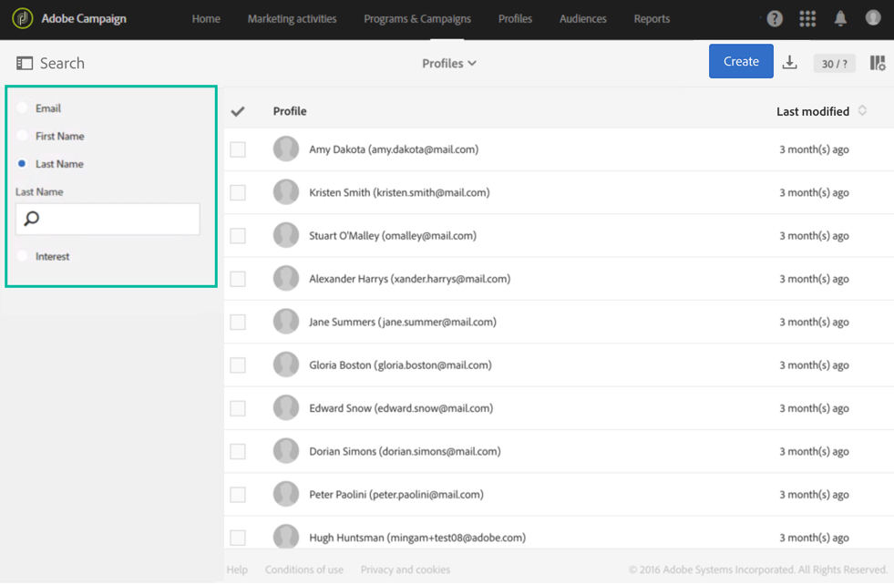

# Integrated Customer Profile{#integrated-customer-profile}

統合顧客プロファイルは、データベースの連絡先ごとに使用できます。このマーケティング履歴では、顧客との連絡に関するあらゆる関連マーケティング情報が 1 つのビューにまとめられます。その結果、連絡先情報、受信したメール、トラッキングログ、購読、購読解除など、すべてのデジタル動作、オンラインおよびオフラインのトランザクションに一元的にアクセスできます。

統合顧客プロファイルにアクセスする手順は次のとおりです。

1. Adobe Campaignのホームページで、**[!UICONTROL Customer profiles]** カードまたは **プロファイル** タブをクリックして、プロファイルリストを表示します。

1. 特定のフィールドに基づいてプロファイルを検索するには、検索ペインを開き、検索を実行するフィールドを選択します。

   

1. 検索する値を指定し、Enter キーを押します。

   >[!NOTE]
   >
   >検索は、メール、名、姓のフィールドと、リソースを拡張する際に追加したカスタムフィールドに基づいて実行できます。
   >
   >検索では大文字と小文字が区別され、プレフィックスに対してのみ実行されます。 例えば、姓の最後の文字を使用してプロファイルを検索することはできません。

1. 連絡先を選択してプロファイルを開きます。

   

その結果、この連絡先の&#x200B;**マーケティング履歴**&#x200B;にアクセスできます。

プロファイルに関する主要な情報は、イベントのリストと共に、このページで収集されます。

リストのイベントをクリックして開きます。送信されたメッセージや、プロファイルが購読しているサービスにアクセスできます。

>[!NOTE]
>
>マーケティング履歴は、Adobe Campaign Standard API を使用してアクセスすることもできます。詳しくは、[該当するドキュメント](../../api/using/interacting-with-marketing-history.md)を参照してください。
