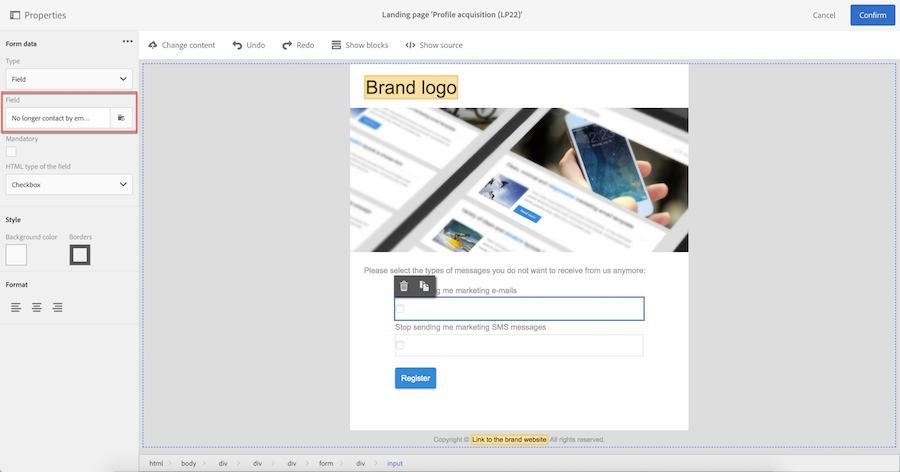

# Campaign のオプトインとオプトアウトの管理{#managing-opt-in-and-opt-out-in-campaign}

## プロファイルからのオプトインとオプトアウトの管理 {#managing-opt-in-and-opt-out-from-a-profile}

ユーザーは、プロファイル **[!UICONTROL General]** タブから直接、オペレーターによってオプトインまたはオプトアウトできます。

**[!UICONTROL No longer contact (on denylist)]** セクションでは、選択したチェックボックスは、ユーザーがオプトアウトを選択したチャネルに対応します。 ユーザーのニーズに応じてチャネルを選択します。

## オプトインおよびオプトアウトのランディングページを設定する {#setting-up-opt-in-and-opt-out-landing-pages}

ユーザーがオプトインまたはオプトアウトできるようにするには、**[!UICONTROL Profile acquisition]** ランディングページを作成して公開する必要があります。 その後、ニーズに応じてチャネルを選択することができます。 それには、次の手順に従います。

また、ユーザーがすべての配信からオプトアウトできるようにする&#x200B;**[!UICONTROL Denylist]** ランディングページを設定することもできます。 詳しくは、[すべての配信からオプトアウトするためのランディングページの設定](#setting-up-a-landing-page-to-opt-out-from-all-deliveries)を参照してください。

>[!NOTE]
>
>ランディングページは、サービスのサブスクリプションを有効にするためにも使用できます。 詳しくは、[このページ](../../channels/using/configuring-landing-page.md#linking-a-landing-page-to-a-service)を参照してください。

1. **[!UICONTROL Profile acquisition]** ランディングページを作成します（[このセクション ](../../channels/using/getting-started-with-landing-pages.md)を参照）。
1. 目的の各チャネルのランディングページコンテンツにチェックボックスを追加し、Campaign データベースの対応するフィールドにリンクします。

   

1. ランディングページを保存して公開します。
1. ランディングページでは、プロファイル **[!UICONTROL General]** タブに従ってチェックボックスが既に選択されています。 利用者は、ニーズに応じてチャネルを選択または選択解除し、フォームを送信できます。

   

1. フォームが送信されると、ユーザーの選択に従ってプロファイル **[!UICONTROL General]** タブが更新されます。

   

### すべての配信からオプトアウトするためのランディングページの設定 {#setting-up-a-landing-page-to-opt-out-from-all-deliveries}

ユーザーがすべての配信からオプトアウトできるようにするには、**[!UICONTROL Denylist]** ランディングページを作成して公開する必要があります。 ランディングページの作成について詳しくは、[このページ ](../../channels/using/getting-started-with-landing-pages.md)を参照してください。

ユーザーがランディングページのリンクをクリックすると、プロファイルの&#x200B;**[!UICONTROL No longer contact (by any channel)]** オプションが自動的に選択されます。

