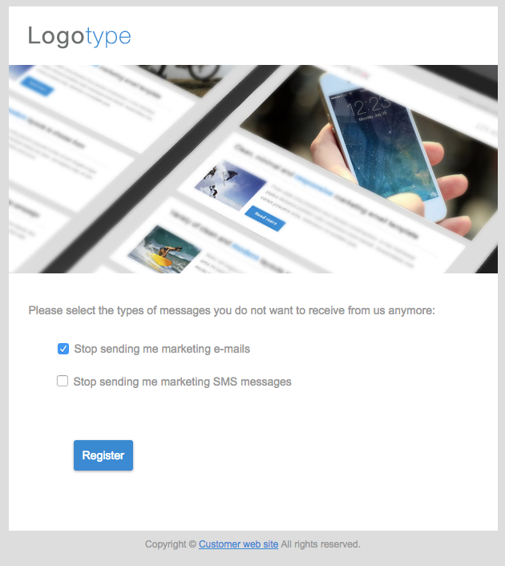

# Campaign のオプトインとオプトアウトの管理{#managing-opt-in-and-opt-out-in-campaign}

## プロファイルからのオプトインとオプトアウトの管理 {#managing-opt-in-and-opt-out-from-a-profile}

ユーザーは、オペレーターが「プロファイルのオプトイン」タブから直接オプトインまたはオプトア **[!UICONTROL General]** トできます。

「**[!UICONTROL No longer contact (on denylist)]**」セクションでは、選択したチェックボックスが、ユーザーがオプトアウトを選択したチャネルに対応しています。 ユーザーのニーズに応じてチャネルを選択します。

## オプトインおよびオプトアウトランディングページの設定 {#setting-up-opt-in-and-opt-out-landing-pages}

ユーザーがオプトインまたはオプトアウトできるようにするには、**[!UICONTROL Profile acquisition]** ランディングページを作成して公開する必要があります。 その後、必要に応じてチャネルを選択できます。 それには、次の手順に従います。

また、ユーザーがすべての配信をオプトアウトできる **[!UICONTROL Denylist]** しいランディングページを設定することもできます。 詳しくは、[&#x200B; すべての配信をオプトアウトするためのランディングページの設定 &#x200B;](#setting-up-a-landing-page-to-opt-out-from-all-deliveries) を参照してください。

>[!NOTE]
>
>ランディングページを使用してサービス購読を有効にすることもできます。 詳しくは、[このページ](../../channels/using/configuring-landing-page.md#linking-a-landing-page-to-a-service)を参照してください。

1. **[!UICONTROL Profile acquisition]** ランディングページを作成します（[&#x200B; この節 &#x200B;](../../channels/using/getting-started-with-landing-pages.md) を参照）。
1. 目的の各チャネルのランディングページコンテンツにチェックボックスを追加し、Campaign データベースから対応するフィールドにリンクします。

   

1. ランディングページを保存して公開します。
1. ランディングページでは、「プロファイルの選 **[!UICONTROL General]**」タブに従って、チェックボックスが既に選択されています。 ユーザーは、必要に応じてチャネルを選択または選択解除し、フォームを送信することができます。

   

1. フォームが送信されると、ユーザーの選択に従って「プロファイル **[!UICONTROL General]** 定」タブが更新されます。

   

### すべての配信をオプトアウトするためのランディングページの設定 {#setting-up-a-landing-page-to-opt-out-from-all-deliveries}

ユーザーがすべての配信をオプトアウトできるようにするには、**[!UICONTROL Denylist]** しいランディングページを作成して公開する必要があります。 ランディングページの作成について詳しくは、[&#x200B; このページ &#x200B;](../../channels/using/getting-started-with-landing-pages.md) を参照してください。

ユーザーがランディングページのリンクをクリックすると、プロファイルの「**[!UICONTROL No longer contact (by any channel)]**」オプションが自動的に選択されます。

