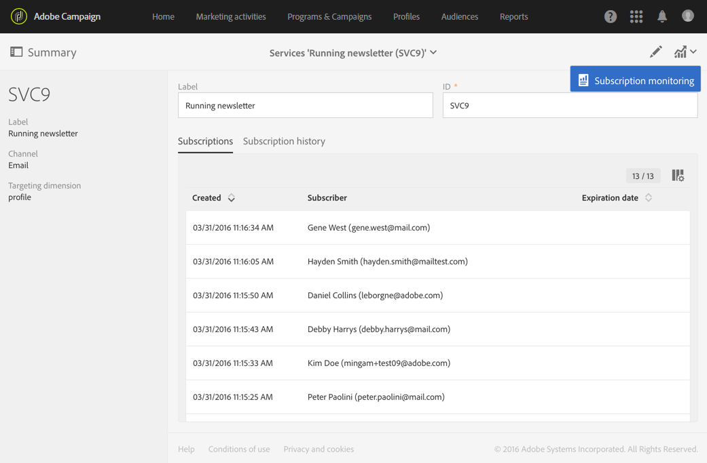
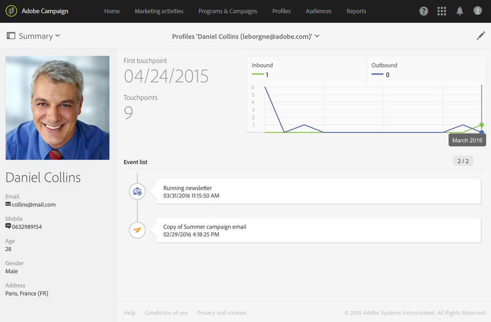

# 購読の監視{#monitoring-subscriptions}

Adobe Campaignインターフェイスを使用して、購読者を追跡し、サービスの成功を測定します。

購読と購読解除の監視には、いくつかのオプションがあります。

* サービスダッシュボードに、現在サービスを購読しているユーザーのリストが表示されます。 [サービスダッシュボード](#service-dashboard)を参照してください。
* サービスダッシュボードの「**購読履歴**」タブで、購読と購読解除の履歴を確認します。 [購読履歴](#subscription-history)を参照してください。
* サービス&#x200B;**レポート**&#x200B;での購読と購読解除の推移を示すレポートを表示します。 [サービスレポート](#service-reports)を参照してください。
* 個人が購読したサービスのリストを&#x200B;**Profile**&#x200B;から探します。 [プロファイルにリンクされたイベントの履歴](#history-of-events-linked-to-a-profile)を参照してください。

## サービスダッシュボード {#service-dashboard}

サービスを購読しているユーザーのリストを表示するには：

1. Adobe Campaignのロゴからアクセスできる詳細メニュー&#x200B;**Profiles &amp; audiences** / **Services**&#x200B;から、サービスのリストに移動します。
1. 目的のサービスを選択して、対応するダッシュボードを表示します。
1. このサービスを購読しているユーザーのリストは、「**購読**」タブに表示されます。

## 購読履歴 {#subscription-history}

購読と購読解除の履歴を確認するには：

1. Adobe Campaignのロゴからアクセスできる詳細メニュー&#x200B;**Profiles &amp; audiences** / **Services**&#x200B;から、サービスのリストに移動します。
1. 目的のサービスを選択して、対応するダッシュボードを表示します。
1. 「**購読履歴**」タブを選択して、各ユーザーが購読および購読解除した日付を表示します。

## サービスレポート {#service-reports}

購読と購読解除の推移を詳しく説明するレポートを表示するには：

1. Adobe Campaignのロゴからアクセスできる詳細メニュー&#x200B;**Profiles &amp; audiences** / **Services**&#x200B;から、サービスのリストに移動します。
1. 目的のサービスを選択して、対応するダッシュボードを表示します。
1. アクションバーの「**レポート**」ボタンをクリックし、選択画面の「**購読の監視**」をクリックします。

   

1. **サービス概要**&#x200B;レポートには、購読数、購読の全体的な変化、経時的な進行状況を示す曲線が表示されます。

## プロファイルにリンクされたイベントの履歴 {#history-of-events-linked-to-a-profile}

連絡先が購読したサービスのリストを確認するには、そのマーケティング履歴を確認します。 詳しくは、[統合顧客プロファイル](../../audiences/using/integrated-customer-profile.md)の節を参照してください。

