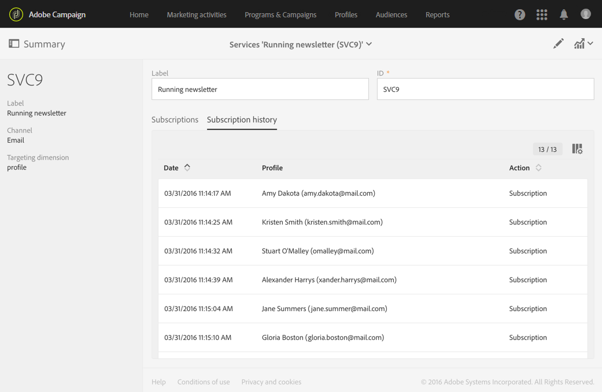
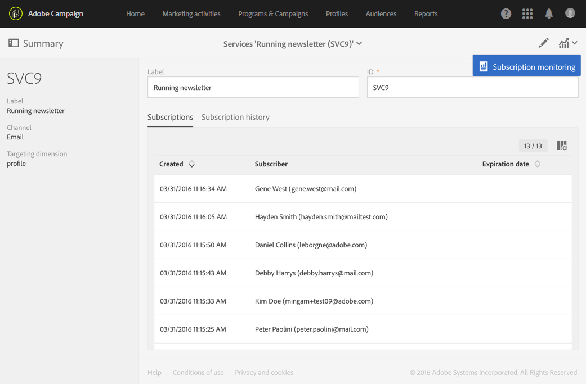

# 購読の監視{#monitoring-subscriptions}

Adobe Campaignのインターフェイスを使用して、購読者を追跡し、サービスの成果を測定します。

サブスクリプションとサブスクリプション解除を監視するには、いくつかのオプションがあります。

* サービス ダッシュボードから、現在サービスを購読しているユーザーのリストを表示します。 [ サービスダッシュボード ](#service-dashboard)を参照してください。
* サービスダッシュボードの「**サブスクリプション履歴**」タブで、サブスクリプションと登録解除の履歴を確認します。 [ サブスクリプション履歴](#subscription-history)を参照してください。
* サービス **Reports**&#x200B;の購読と購読解除の進化を詳細に説明するレポートを表示します。 [ サービスレポート ](#service-reports)を参照してください。
* ユーザーが&#x200B;**プロファイル**&#x200B;から購読したサービスのリストを検索します。 プロファイルにリンクされたイベントの[履歴](#history-of-events-linked-to-a-profile)を参照してください。

## サービスダッシュボード {#service-dashboard}

サービスを購読しているユーザーのリストを表示するには、次の手順を実行します。

1. Adobe Campaign ロゴからアクセスできる高度なメニュー&#x200B;**プロファイルとオーディエンス**/**サービス**&#x200B;を使用して、サービスのリストに移動します。
1. 選択したサービスを選択して、対応するダッシュボードを表示します。
1. サービスを購読しているユーザーのリストは、**購読** タブにあります。

## 購読履歴 {#subscription-history}

購読と購読解除の履歴を参照するには：

1. Adobe Campaign ロゴからアクセスできる高度なメニュー&#x200B;**プロファイルとオーディエンス**/**サービス**&#x200B;を使用して、サービスのリストに移動します。
1. 選択したサービスを選択して、対応するダッシュボードを表示します。
1. 「**購読履歴**」タブを選択して、各人物が購読および購読解除した日付を表示します。

## サービスレポート {#service-reports}

購読と購読解除の進化を詳細に示すレポートを表示するには、次の手順に従います。

1. Adobe Campaign ロゴからアクセスできる高度なメニュー&#x200B;**プロファイルとオーディエンス**/**サービス**&#x200B;を使用して、サービスのリストに移動します。
1. 選択したサービスを選択して、対応するダッシュボードを表示します。
1. アクションバーの「**レポート**」ボタンをクリックし、選択画面の「**サブスクリプション監視**」をクリックします。

   

1. **サービス概要** レポートには、サブスクリプション数、サブスクリプションの全体的な進化、および時間の経過に伴う進行状況を示す曲線が表示されます。

## プロファイルにリンクされたイベントの履歴 {#history-of-events-linked-to-a-profile}

連絡先が購読しているサービスのリストを参照するには、そのマーケティング履歴を参照できます。 詳しくは、「[統合されたお客様プロファイル ](../../audiences/using/integrated-customer-profile.md)」の節を参照してください。

