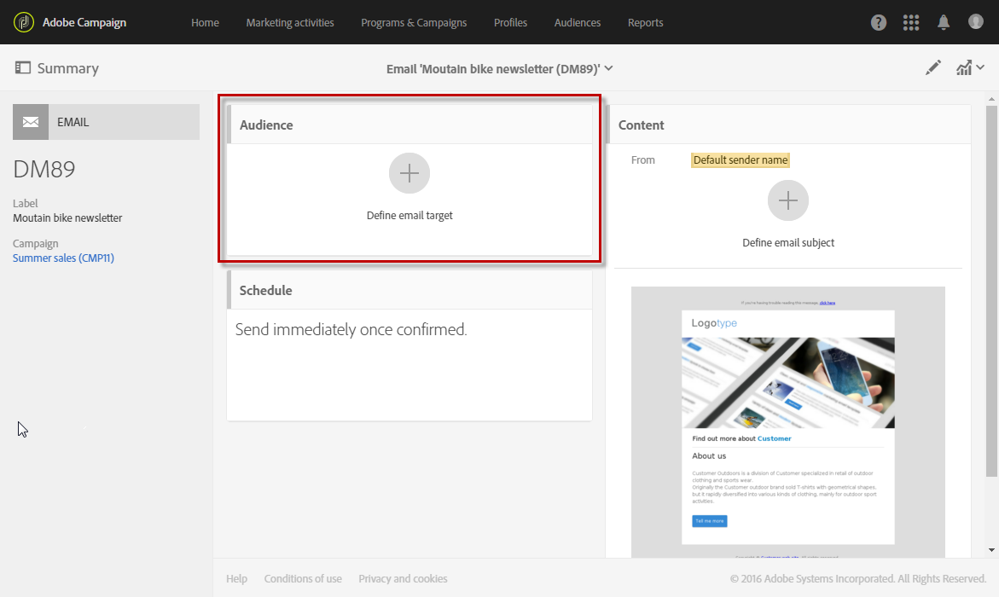
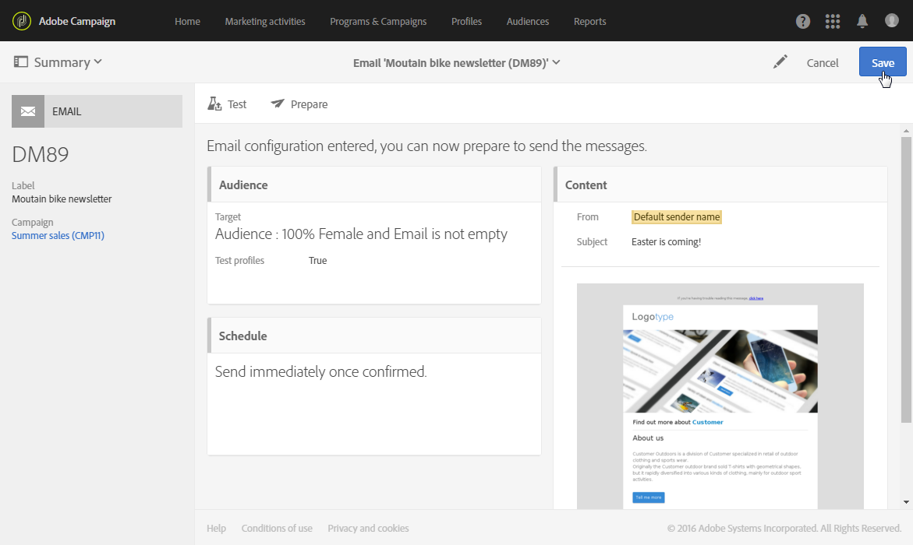

# メッセージ内のオーディエンスの選択{#selecting-an-audience-in-a-message}

Adobe Campaign を使用すると、メッセージのオーディエンス内で複数のプロファイルタイプを設定できます。

オーディエンスは、作成ウィザードを使用してメッセージを作成するときに定義できます。メッセージが作成済みの場合は、メッセージダッシュボードから定義することもできます。

>[!NOTE]
>
>ワークフロー内で作成されたオーディエンスが追加データで強化された場合、これらのデータを使用してスタンドアロン配信をパーソナライズすることはできません。 ワークフローで実行される配信からのみ使用できます。

1. ダッシュボードから、開始するオーディエンスブロックに移動します。

   

   オーディエンスを定義する画面が開きます。 ここには 2 つのタブがあり、メッセージを受け取るオーディエンスのタイプをそれぞれ別々に定義できます。

   * ターゲット
   * テストプロファイル

   

1. 電子メールのメイン **[!UICONTROL Target]** を定義します。 これは、電子メールの通常のターゲットオーディエンスです。

   ターゲットは&#x200B;**[!UICONTROL Target]** タブで定義され、データベースから識別されたプロファイルで構成されます。 メインターゲットは、[クエリエディター](../../automating/using/editing-queries.md#creating-queries)機能を使用して確定できます。

   このタブの「**[!UICONTROL Shortcuts]**」パレットには、識別されたプロファイルで定義された定義済みフィルターとオーディエンスのみが含まれます。 「**[!UICONTROL Explorer]**」タブを使用すると、追加の設定にアクセスできます。

   したがって、既存のオーディエンスの再利用や組み合わせができ、また既存のオーディエンスにフィルターを追加することもできます。

   >[!NOTE]
   >
   >オーディエンスをターゲットにする場合、オーディエンスの定義は参照されませんが、**クエリに** コピーされたことに注意してください。 クエリでターゲティングされた後にオーディエンスに変更を加えた場合は、新しい定義を考慮に入れるようにクエリを再度設定してください。

1. メールに使用する **[!UICONTROL Test profiles]** を定義します。 テストプロファイルは、メインターゲットにメールを送信する前にメールのテスト用にあらかじめ送信される配達確認を受信します。

   テストプロファイルの設定の詳細については、[テストプロファイル](../../audiences/using/managing-test-profiles.md)の節を参照してください。

1. 必要に応じて、対応するタブを使用してコントロールグループを定義できます。 これにより、ターゲットから一部のプロファイルを取り消して、メッセージを受信しないようにすることができます。 詳しくは、[ コントロール グループの追加](../../sending/using/control-group.md)を参照してください。

1. 代替アドレスを使用して、プロファイルが受信するメッセージの正確な表現を取得することもできます。  詳しくは、[ターゲットプロファイルを使用した電子メールメッセージのテスト](../../sending/using/testing-messages-using-target.md)を参照してください。

その後、オーディエンスブロックが更新され、該当するメールに対してターゲットプロファイルとテストプロファイルが選択されたことが示されます。

