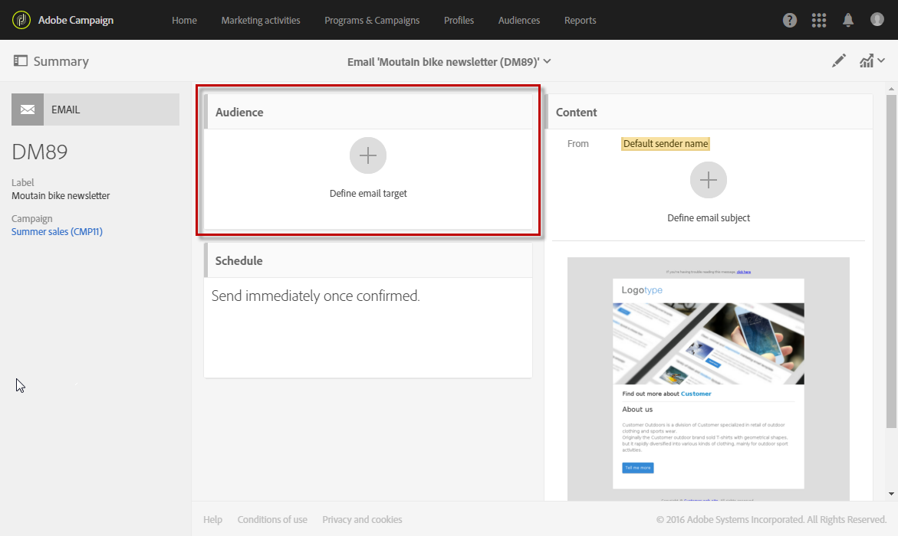

# メッセージ内のオーディエンスの選択{#selecting-an-audience-in-a-message}

Adobe Campaignでは、メッセージのオーディエンス内に複数のプロファイルタイプを設定できます。

オーディエンスは、作成ウィザードを使用してメッセージを作成する際に、または既に作成済みの場合はメッセージダッシュボードから定義できます。

>[!NOTE]
>
>オーディエンスがワークフロー内に構築され、追加データを使用して強化された場合、これらのデータを使用してスタンドアロンの配信をパーソナライズすることはできません。 ワークフローで実行された配信からのみ使用できます。

1. ダッシュボードから、開始するオーディエンスブロックに移動します。

   

   オーディエンスを定義する画面が開きます。 このタブには2つのタブがあり、メッセージを受け取るオーディエンスのタイプごとに別々に定義できます。

   * ターゲット
   * テストプロファイル
   

1. 電子メールのメイ **[!UICONTROL Target]** ンを定義します。 これは、電子メールの通常のターゲットオーディエンスです。

   ターゲットはタブで定義され、デ **[!UICONTROL Target]** ータベースから識別されたプロファイルで構成されます。

   クエリーエディター機能を使用して、メインターゲ [ットを設定](../../automating/using/editing-queries.md#creating-queries) 。

   このタブでは、パレットには事 **[!UICONTROL Shortcuts]** 前定義済みのフィルターと、識別されたプロファイルで定義されたオーディエンスのみが含まれます。 このタ **[!UICONTROL Explorer]** ブからは、追加の設定にアクセスできます。

   したがって、既存のオーディエンスを再利用したり結合したり、追加のフィルターを適用したりすることができます。

1. 電子メ **[!UICONTROL Test profiles]** ールに使用するを定義します。 テストプロファイルには、メインターゲットに電子メールを送信する前に、電子メールをテストする前に送信できる校正が含まれます。

   テストプロファイルの設定の詳細については、「テストプロファイル」の節を参 [照してくださ](../../sending/using/managing-test-profiles-and-sending-proofs.md) い。

次に、オーディエンスブロックが更新され、対象の電子メールに対してターゲットプロファイルとテストプロファイルが選択されていることを示します。

