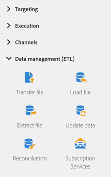

# データ管理アクティビティについて{#about-data-management-activities}

パレットの画面左側で、「**[!UICONTROL Data management (ETL)]**」セクションを展開します。

これらのアクティビティにより、データを操作できます。 たとえば、データの読み込み、データベースフィールドの一括更新の実行、ファイルの受信または送信、未識別データの既存のリソースへのリンクなどを実行できます。

「**[!UICONTROL Data management (ETL)]**」セクションでは、次のアクティビティオプションを提供しています。

* [データを更新](../../automating/using/update-data.md)
* [ファイルを読み込み](../../automating/using/load-file.md)
* [ファイルを転送](../../automating/using/transfer-file.md)
* [紐付け](../../automating/using/reconciliation.md)
* [ファイルを抽出](../../automating/using/extract-file.md)
* [購読サービス](../../automating/using/subscription-services.md)

**[!UICONTROL Data management (ETL)]** アクティビティを使用すると、アウトバウンドトランジション用に&#x200B;**セグメントコード**&#x200B;を定義できます。 その結果、これらのセグメントコードに基づいてレポートを作成して、マーケティングキャンペーンの効率を測定できます。 詳しくは、[この節](../../reporting/using/creating-a-report-workflow-segment.md)を参照してください。
