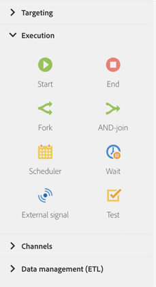

# 実行アクティビティについて{#about-execution-activities}

パレットの画面左側で、「**[!UICONTROL Execution]**」セクションを展開します。

次のアクティビティは、ワークフローの整理と実行に固有です。 主なタスクは、ほかのアクティビティの調整です。

「**[!UICONTROL Execution]**」セクションでは、次のアクティビティオプションを提供しています。

* [開始および終了](../../automating/using/start-and-end.md)
* [分岐](../../automating/using/fork.md)
* [AND 結合](../../automating/using/and-join.md)
* [スケジューラー](../../automating/using/scheduler.md)
* [待機](../../automating/using/wait.md)
* [外部シグナル](../../automating/using/external-signal.md)
* [テスト](../../automating/using/test.md)
