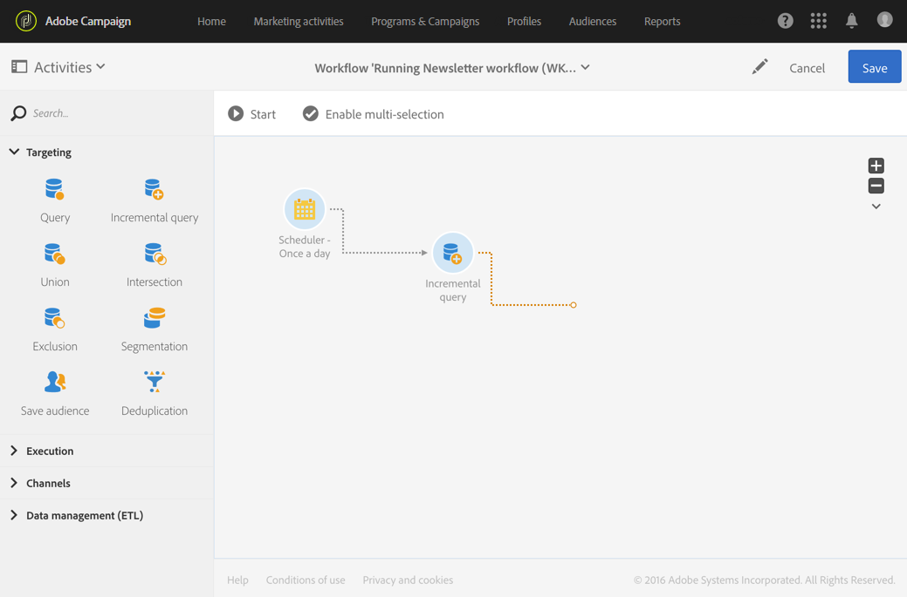
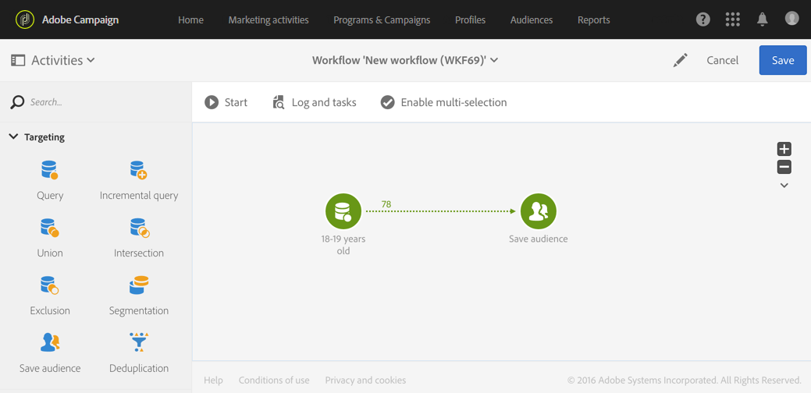

# ワークフローの実行について {#about-workflow-execution}

ワークフローは、必ず手動で開始します。 ただし、開始した後は、[&#x200B; スケジューラー](../../automating/using/scheduler.md) アクティビティで指定された情報に応じて、非アクティブのままにすることができます。

>[!IMPORTANT]
>
> Adobeでは、20個を超えるアクティブなワークフローを同時に実行しないようにし、ワークフローの実行を時間の経過に沿って優先順位付けして広げることをお勧めします。 詳しくは、[このページ &#x200B;](../../automating/using/best-practices-workflows.md)で提供されているベストプラクティスを参照してください。

実行に関連するアクション（開始、停止、一時停止など） は&#x200B;**非同期** プロセスです。コマンドは保存され、サーバーが適用できるようになると有効になります。

ワークフローでは、通常、各アクティビティの結果は、矢印で表される遷移を介して次のアクティビティに送信されます。

トランジションが宛先アクティビティにリンクされていない場合、トランジションは終了しません。

>[!NOTE]
>
>終了していないトランジションを含むワークフローは引き続き実行できます。警告メッセージが生成され、ワークフローがトランジションに達すると一時停止しますが、エラーは生成されません。 デザインを完全に完了せずにワークフローを開始することも、作業を進めながらワークフローを完了することもできます。

アクティビティが実行されると、トランジションで送信されたレコードの数がその上に表示されます。

ワークフローの実行中または実行後にトランジションを開いて、送信されたデータが正しいかどうかを確認できます。 データとデータ構造を表示できます。

デフォルトでは、ワークフローの最後のトランジションの詳細のみにアクセスできます。 前のアクティビティの結果にアクセスするには、ワークフローを開始する前に、ワークフロープロパティの&#x200B;**[!UICONTROL Execution]** セクションの&#x200B;**[!UICONTROL Keep interim results]** オプションを確認する必要があります。

>[!NOTE]
>
>このオプションは、大量のメモリを消費し、ワークフローの作成と、ワークフローが正しく設定および動作することを確認するのに役立つように設計されています。 実稼働インスタンスでは、このチェックボックスをオフのままにします。

トランジションが開いている場合は、その&#x200B;**[!UICONTROL Label]**&#x200B;を編集するか、**[!UICONTROL Segment code]**&#x200B;をリンクできます。 これには、対応するフィールドを編集し、変更を確認します。

Campaign Standard REST APIを使用すると、ワークフローを&#x200B;**開始**、**一時停止**、**再開**&#x200B;および&#x200B;**停止**&#x200B;できます。 REST呼び出しの詳細と例については、[API ドキュメント &#x200B;](../../api/using/controlling-a-workflow.md)を参照してください。
