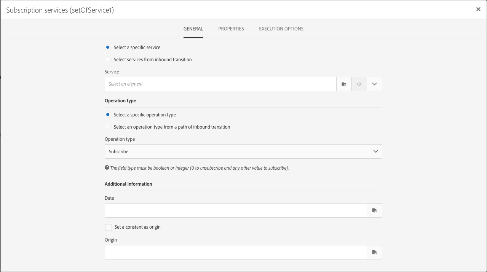
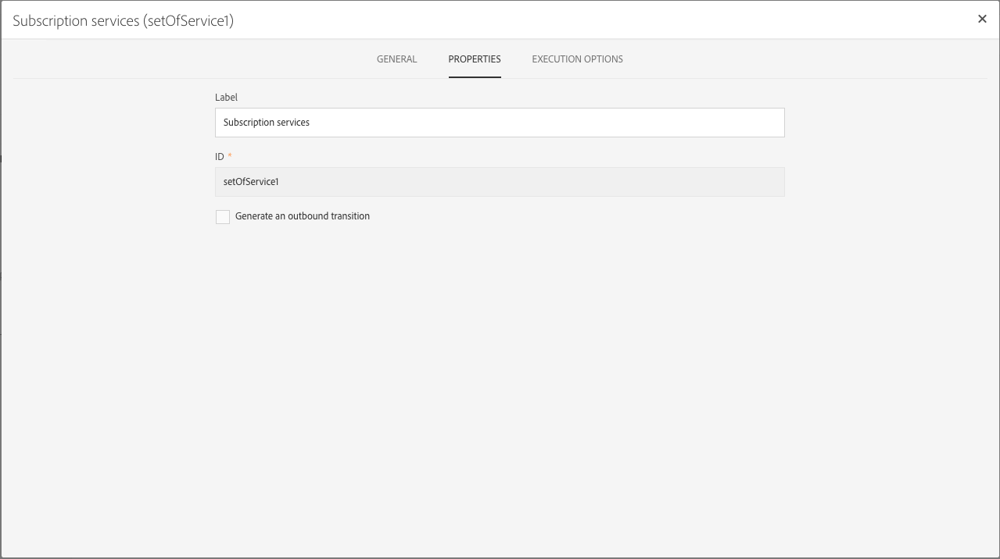
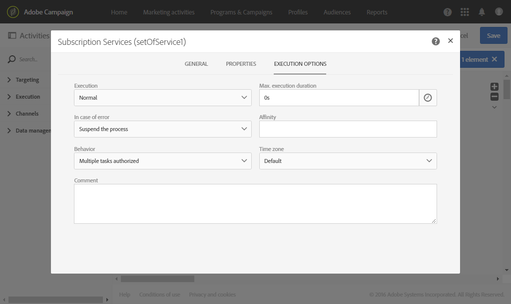

# アクティビティのプロパティの管理 {#activity-properties}

## アクティビティのグローバルプロパティ {#global-properties-of-an-activity}

各アクティビティには&#x200B;**[!UICONTROL General]** タブがあり、アクティビティに固有の一般的なパラメーターを変更できます。

「**[!UICONTROL Properties]**」タブでは、アクティビティのグローバルパラメーター、特にラベルとIDを変更できます。 このタブの設定はオプションです。

## アクティビティのアウトバウンドトランジションの管理 {#managing-an-activity-s-outbound-transitions}

デフォルトでは、特定のアクティビティにはアウトバウンドトランジションがありません。 **[!UICONTROL Transitions]** タブまたはアクティビティの&#x200B;**[!UICONTROL Properties]** タブから1つ追加して、同じワークフローの母集団に他のプロセスを適用できます。

アクティビティに応じて、いくつかの種類のアウトバウンドトランジションを追加できます。

* **標準トランジション**: アクティビティによって計算された母集団
* **母集団を含まない移行**：このタイプのアウトバウンド移行は、ワークフローを続行するために追加でき、システム上の不要なスペースを消費しない母集団は含まれません。
* **拒否**：母集団が拒否されました。 例えば、アクティビティのインバウンドデータが正しくないか、不完全であったために処理できなかった場合などです。
* **補集合**: アクティビティの実行後に残っている母集団。 例えば、セグメント化アクティビティがインバウンド母集団の割合のみを保存するように設定されている場合です。

該当する場合は、アクティビティのアウトバウンドトランジションに&#x200B;**[!UICONTROL Segment code]**&#x200B;を指定します。 このセグメントコードを使用すると、ターゲット母集団のサブセットがどこから来て、後でメッセージのパーソナライゼーション目的に役立つかを特定できます。

## アクティビティ実行オプション {#activity-execution-options}

アクティビティのプロパティ画面には、**[!UICONTROL Advanced options]** タブがあり、エラーが発生した場合のアクティビティの実行モードと動作を定義できます。

これらのオプションにアクセスするには、ワークフロー内のアクティビティを選択し、アクションバーの ボタンを使用して開きます。

**[!UICONTROL Execution]** フィールドでは、タスクの開始時に実行するアクションを定義できます。 これには3つのオプションがあります。

* **通常**: アクティビティは正常に実行されます。
* **有効にするが実行しない**: アクティビティは一時停止され、その結果、後に続くプロセスも一時停止されます。 これは、タスクの開始時に参加したい場合に役立ちます。
* **有効にしないでください**: アクティビティは実行されません。そのため、後に（同じブランチ内で）続くアクティビティもすべて実行されません。

**[!UICONTROL In case of error]** フィールドでは、アクティビティでエラーが発生した場合に実行するアクションを指定できます。 これには2つのオプションがあります。

* **プロセスを中断**：ワークフローは自動的に中断されます。 ワークフローのステータスは&#x200B;**エラー**&#x200B;になり、関連付けられている色が赤になります。 問題が解決したら、ワークフローを再起動します。
* **無視**: アクティビティは実行されないため、そのアクティビティに続くアクティビティも（同じブランチ内に）実行されません。 これは、繰り返し作業に役立つ場合があります。 ブランチにスケジューラーがアップストリームに配置されている場合、これは次の実行日にトリガーされます。

**[!UICONTROL Behavior]** フィールドでは、非同期タスクを使用する場合に従う手順を定義できます。 これには2つのオプションがあります。

* **複数のタスクが許可されました**：最初のタスクが完了しなかった場合でも、複数のタスクを同時に実行できます。
* **現在のタスクに優先度**&#x200B;があります。タスクが進行中になると、優先度が設定されます。 1つのタスクがまだ進行中である限り、他のタスクは実行されません。

**[!UICONTROL Max. execution duration]** フィールドでは、「30秒」や「1時間」などの期間を指定できます。 指定した期間が経過してもアクティビティが完了しない場合は、アラートがトリガーされます。 このアラートは、ワークフローの機能には影響しません。

**[!UICONTROL Affinity]** フィールドを使用すると、ワークフローまたはワークフローアクティビティを特定のコンピューターで強制的に実行できます。 これを行うには、対象のワークフローまたはアクティビティに対して 1 つまたは複数のアフィニティを指定する必要があります。

**[!UICONTROL Time zone]** フィールドでは、アクティビティのタイムゾーンを選択できます。 Adobe Campaign では、同じインスタンス上で複数の国の時差を管理できます。 適用される設定は、インスタンスの作成時に設定されます。

>[!NOTE]
>
>デフォルトでは、タイムゾーンが選択されていない場合、アクティビティはワークフロープロパティで定義されたタイムゾーンを使用します。

**コメント** フィールドは、メモを追加できる空きフィールドです。
